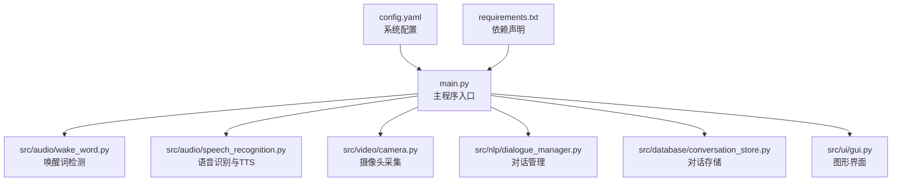
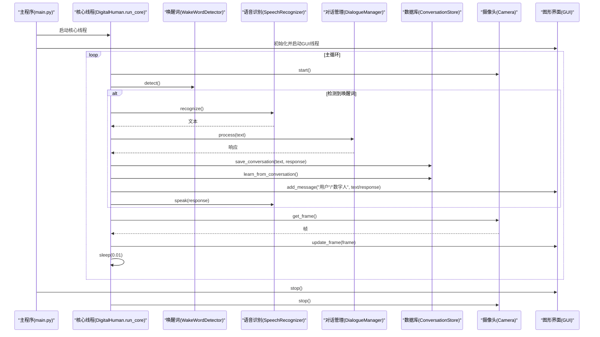
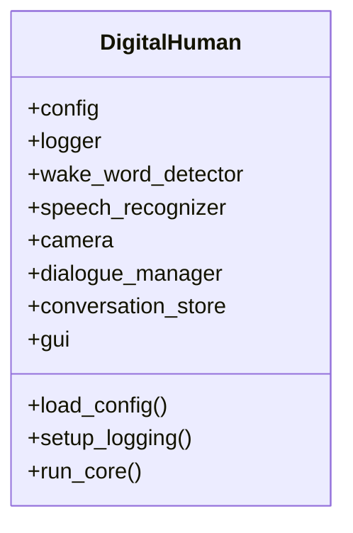
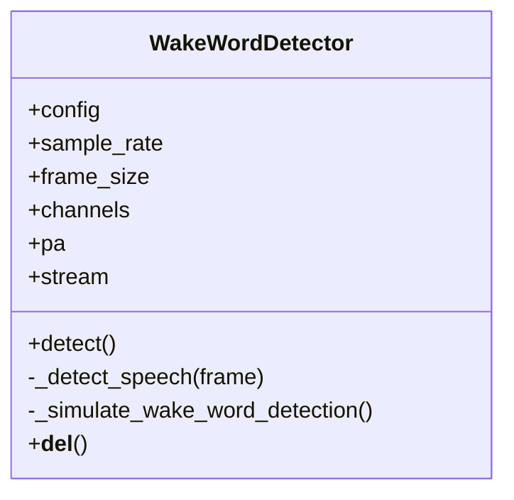
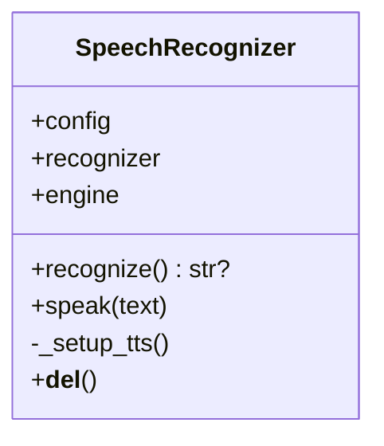
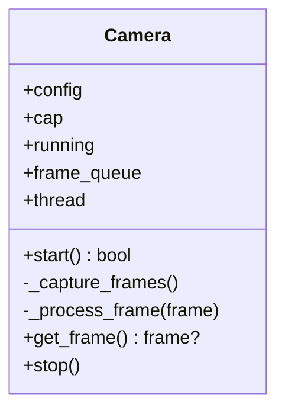
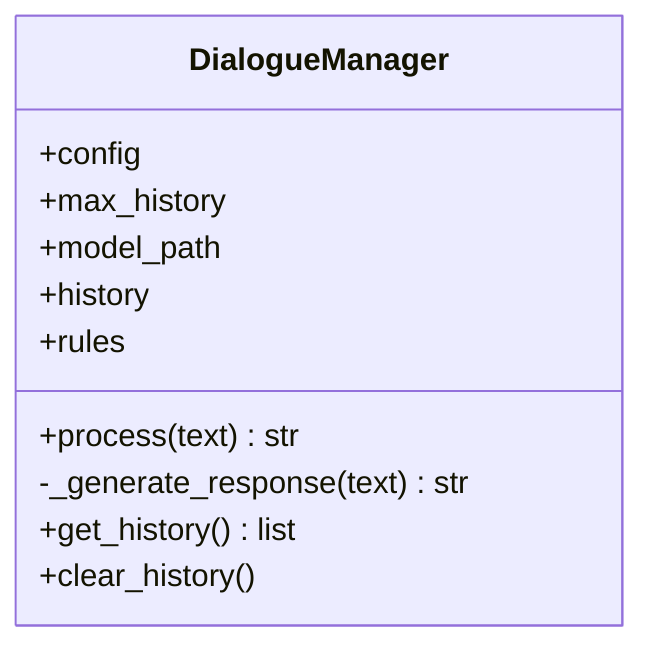
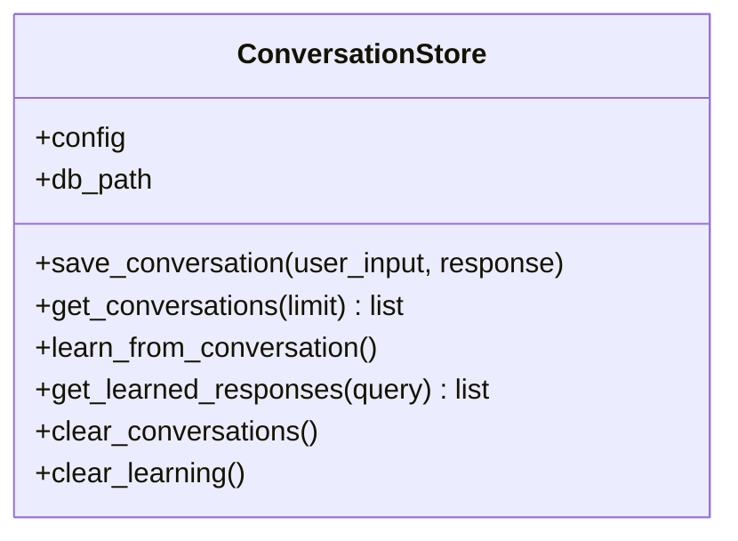
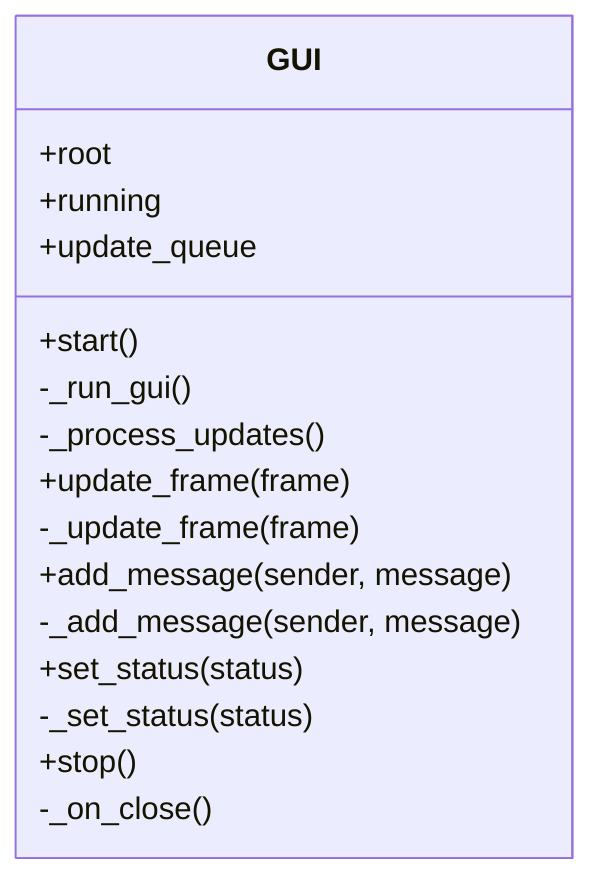
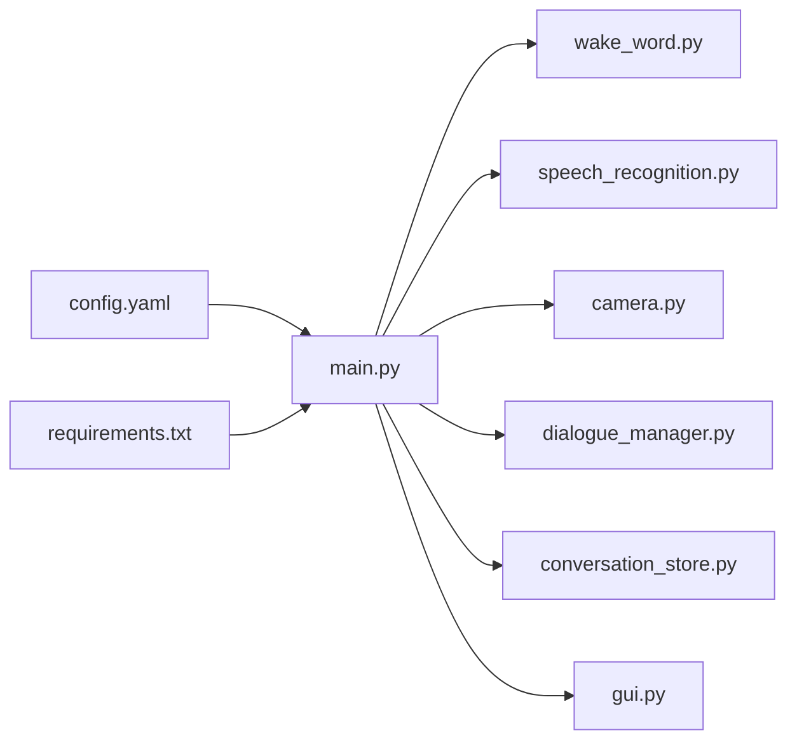

# 代码规范与最佳实践

<cite>
**本文档引用的文件**
- [main.py](file://main.py)
- [config.yaml](file://config.yaml)
- [requirements.txt](file://requirements.txt)
- [src/audio/speech_recognition.py](file://src/audio/speech_recognition.py)
- [src/audio/wake_word.py](file://src/audio/wake_word.py)
- [src/video/camera.py](file://src/video/camera.py)
- [src/nlp/dialogue_manager.py](file://src/nlp/dialogue_manager.py)
- [src/database/conversation_store.py](file://src/database/conversation_store.py)
- [src/ui/gui.py](file://src/ui/gui.py)
</cite>

## 目录
1. [简介](#简介)
2. [项目结构](#项目结构)
3. [核心组件](#核心组件)
4. [架构总览](#架构总览)
5. [详细组件分析](#详细组件分析)
6. [依赖分析](#依赖分析)
7. [性能考虑](#性能考虑)
8. [故障排查指南](#故障排查指南)
9. [结论](#结论)
10. [附录](#附录)

## 简介
本指南面向数字人系统的开发团队，提供一套完整的 Python 编码规范与最佳实践，覆盖命名约定、注释规范、模块化设计、类设计模式、接口定义、多线程编程、异常处理与资源管理，并结合项目中的实际模块给出可操作的改进建议与常见反模式规避方法。目标是提升代码一致性、可维护性与可扩展性，降低技术债务，提高系统稳定性与性能表现。

## 项目结构
项目采用按功能域划分的模块化组织方式：
- 主入口负责系统初始化、模块装配与线程协调
- 功能模块分别位于 audio、video、nlp、database、ui 等子目录
- 配置集中于 config.yaml，依赖声明于 requirements.txt

图表来源
- [main.py:118-138](file://main.py#L118-L138)
- [config.yaml:1-35](file://config.yaml#L1-L35)
- [requirements.txt:1-27](file://requirements.txt#L1-L27)

章节来源
- [main.py:1-138](file://main.py#L1-L138)
- [config.yaml:1-35](file://config.yaml#L1-L35)
- [requirements.txt:1-27](file://requirements.txt#L1-L27)

## 核心组件
- 数字人系统主类负责模块装配、日志初始化、核心流程调度与资源清理
- 各功能模块职责清晰：唤醒词检测、语音识别与TTS、视频采集、对话管理、数据库存储、图形界面
- 配置驱动：所有模块均通过配置对象注入参数，便于测试与部署切换

章节来源
- [main.py:21-117](file://main.py#L21-L117)
- [src/audio/wake_word.py:13-98](file://src/audio/wake_word.py#L13-L98)
- [src/audio/speech_recognition.py:12-89](file://src/audio/speech_recognition.py#L12-L89)
- [src/video/camera.py:12-106](file://src/video/camera.py#L12-L106)
- [src/nlp/dialogue_manager.py:12-102](file://src/nlp/dialogue_manager.py#L12-L102)
- [src/database/conversation_store.py:12-158](file://src/database/conversation_store.py#L12-L158)
- [src/ui/gui.py:16-170](file://src/ui/gui.py#L16-L170)

## 架构总览
系统采用“主控线程 + 多工作线程”的并发模型：
- 主线程负责 GUI 初始化与事件循环
- 核心控制线程执行唤醒词检测、语音识别、对话处理、数据库写入与 TTS 合成
- 摄像头与 GUI 通过独立线程与队列解耦，避免阻塞主循环

图表来源
- [main.py:118-138](file://main.py#L118-L138)
- [src/audio/wake_word.py:42-98](file://src/audio/wake_word.py#L42-L98)
- [src/audio/speech_recognition.py:46-85](file://src/audio/speech_recognition.py#L46-L85)
- [src/nlp/dialogue_manager.py:62-73](file://src/nlp/dialogue_manager.py#L62-L73)
- [src/database/conversation_store.py:53-125](file://src/database/conversation_store.py#L53-L125)
- [src/video/camera.py:27-95](file://src/video/camera.py#L27-L95)
- [src/ui/gui.py:62-98](file://src/ui/gui.py#L62-L98)

## 详细组件分析

### 数字人主类（DigitalHuman）
- 职责：加载配置、初始化日志、装配各模块、协调核心流程、资源清理
- 并发：核心流程在独立线程中运行，GUI 在主线程运行
- 异常：捕获键盘中断，finally 中统一释放摄像头资源

图表来源
- [main.py:21-117](file://main.py#L21-L117)

章节来源
- [main.py:21-117](file://main.py#L21-L117)

### 唤醒词检测模块（WakeWordDetector）
- 职责：基于能量阈值检测语音活动，模拟唤醒词触发
- 并发：音频采集在独立线程中进行，避免阻塞主流程
- 资源管理：使用 PyAudio 流，finally 中确保关闭与终止
- 可改进：使用真实唤醒词模型替代随机模拟；增加配置项与日志输出

图表来源
- [src/audio/wake_word.py:13-109](file://src/audio/wake_word.py#L13-L109)

章节来源
- [src/audio/wake_word.py:13-109](file://src/audio/wake_word.py#L13-L109)

### 语音识别与TTS（SpeechRecognizer）
- 职责：语音转文本（识别）、文本转语音（TTS）
- 安全：识别过程捕获超时、未知值、请求错误等异常
- 资源管理：TTS 引擎在析构函数中停止
- 可改进：将 Google Web Speech API 的密钥与网络错误处理抽象为配置；增加日志记录

图表来源
- [src/audio/speech_recognition.py:12-89](file://src/audio/speech_recognition.py#L12-L89)

章节来源
- [src/audio/speech_recognition.py:12-89](file://src/audio/speech_recognition.py#L12-L89)

### 摄像头模块（Camera）
- 职责：采集视频帧，异步处理并放入队列
- 并发：独立线程持续读取帧，队列容量上限避免内存膨胀
- 资源管理：stop() 中 join 线程、释放摄像头
- 可改进：队列满时丢弃策略可配置；增加帧处理插件化扩展点

图表来源
- [src/video/camera.py:12-106](file://src/video/camera.py#L12-L106)

章节来源
- [src/video/camera.py:12-106](file://src/video/camera.py#L12-L106)

### 对话管理模块（DialogueManager）
- 职责：基于规则的意图匹配与响应生成，维护对话历史
- 数据结构：使用双端队列维护固定长度的历史
- 可改进：将规则加载与响应生成逻辑拆分为独立策略类；支持外部模型集成

图表来源
- [src/nlp/dialogue_manager.py:12-102](file://src/nlp/dialogue_manager.py#L12-L102)

章节来源
- [src/nlp/dialogue_manager.py:12-102](file://src/nlp/dialogue_manager.py#L12-L102)

### 对话存储模块（ConversationStore）
- 职责：SQLite 对话与学习数据持久化，提供查询与清理能力
- 可改进：将 SQL 抽象为 DAO 层；增加事务封装与连接池；对学习逻辑进行分层

图表来源
- [src/database/conversation_store.py:12-158](file://src/database/conversation_store.py#L12-L158)

章节来源
- [src/database/conversation_store.py:12-158](file://src/database/conversation_store.py#L12-L158)

### 图形界面模块（GUI）
- 职责：Tkinter 界面、摄像头画面显示、对话消息展示、状态提示
- 并发：更新队列 + 独立线程处理 UI 更新，避免主线程阻塞
- 可改进：将 UI 更新抽象为观察者/订阅模式；增加主题与布局配置

图表来源
- [src/ui/gui.py:16-170](file://src/ui/gui.py#L16-L170)

章节来源
- [src/ui/gui.py:16-170](file://src/ui/gui.py#L16-L170)

## 依赖分析
- 依赖声明集中在 requirements.txt，涵盖音频、视频、NLP、机器学习、数据库与系统工具
- 配置集中于 config.yaml，主程序按模块注入配置对象
- 模块间通过配置与接口松耦合，便于替换与扩展

图表来源
- [main.py:14-19](file://main.py#L14-L19)
- [config.yaml:1-35](file://config.yaml#L1-L35)
- [requirements.txt:1-27](file://requirements.txt#L1-L27)

章节来源
- [requirements.txt:1-27](file://requirements.txt#L1-L27)
- [config.yaml:1-35](file://config.yaml#L1-L35)

## 性能考虑
- CPU 占用控制：主循环中使用小延迟，避免忙等
- 队列容量与丢帧策略：摄像头队列限制帧数量，避免内存暴涨
- I/O 与阻塞：识别与 TTS 为阻塞操作，建议在独立线程中执行
- 资源释放：finally 与析构函数确保音频流、摄像头、TTS 引擎正确关闭
- 可选优化：引入连接池、批处理、缓存与异步 I/O；对图像处理进行 GPU 加速

章节来源
- [main.py:108-116](file://main.py#L108-L116)
- [src/video/camera.py:64-72](file://src/video/camera.py#L64-L72)
- [src/audio/speech_recognition.py:77-85](file://src/audio/speech_recognition.py#L77-L85)
- [src/audio/wake_word.py:93-97](file://src/audio/wake_word.py#L93-L97)

## 故障排查指南
- 唤醒词检测失败
  - 检查麦克风权限与设备索引
  - 调整音频阈值与采样率配置
  - 查看音频流关闭逻辑是否正常
- 语音识别超时或失败
  - 检查网络与 API 密钥配置
  - 增加超时与重试机制
- 摄像头无法打开
  - 检查摄像头索引与分辨率设置
  - 确认 OpenCV 依赖安装
- GUI 卡顿或崩溃
  - 确认 UI 更新队列与线程同步
  - 检查图像尺寸与缩放逻辑
- 数据库写入异常
  - 检查数据库路径与权限
  - 确认事务提交与连接关闭

章节来源
- [src/audio/wake_word.py:42-98](file://src/audio/wake_word.py#L42-L98)
- [src/audio/speech_recognition.py:46-85](file://src/audio/speech_recognition.py#L46-L85)
- [src/video/camera.py:27-53](file://src/video/camera.py#L27-L53)
- [src/ui/gui.py:62-98](file://src/ui/gui.py#L62-L98)
- [src/database/conversation_store.py:24-51](file://src/database/conversation_store.py#L24-L51)

## 结论
本项目在模块化与并发设计上具备良好基础，建议后续重点加强以下方面：
- 统一编码规范与注释模板
- 接口契约与抽象基类定义
- 异常分类与统一错误处理
- 资源生命周期管理与上下文管理器
- 单元测试与集成测试覆盖
- 性能监控与可观测性增强

## 附录

### Python 编码标准与命名约定
- 文件与模块
  - 文件名使用小写下划线风格，模块名与包名一致
  - 模块顶部包含文件级 docstring，简述职责
- 类与方法
  - 类名使用 PascalCase，方法与属性使用 snake_case
  - 私有成员以单下划线前缀标识，避免在公共 API 中暴露
- 常量与全局变量
  - 常量使用大写下划线风格，置于模块级
- 注释与文档
  - 函数/方法使用 docstring 描述用途、参数、返回值与异常
  - 关键逻辑处添加行内注释，解释设计决策与边界条件

章节来源
- [main.py:4-6](file://main.py#L4-L6)
- [src/audio/speech_recognition.py:4-6](file://src/audio/speech_recognition.py#L4-L6)
- [src/audio/wake_word.py:4-6](file://src/audio/wake_word.py#L4-L6)
- [src/video/camera.py:4-6](file://src/video/camera.py#L4-L6)
- [src/nlp/dialogue_manager.py:4-6](file://src/nlp/dialogue_manager.py#L4-L6)
- [src/database/conversation_store.py:4-6](file://src/database/conversation_store.py#L4-L6)
- [src/ui/gui.py:4-6](file://src/ui/gui.py#L4-L6)

### 模块化设计原则
- 单一职责：每个模块聚焦一个领域功能
- 依赖倒置：模块通过配置对象注入依赖，减少硬编码
- 接口抽象：对外暴露稳定接口，内部实现可替换
- 配置驱动：将可变因素集中于配置文件，便于测试与部署

章节来源
- [main.py:21-39](file://main.py#L21-L39)
- [config.yaml:1-35](file://config.yaml#L1-L35)

### 类设计模式与接口定义
- 工厂模式：通过配置对象创建模块实例
- 观察者/发布订阅：GUI 更新队列实现跨线程通信
- 资源管理：使用上下文管理器或析构函数确保资源释放
- 策略模式：对话管理可拆分为规则与模型策略

章节来源
- [main.py:30-34](file://main.py#L30-L34)
- [src/ui/gui.py:34](file://src/ui/gui.py#L34)
- [src/audio/speech_recognition.py:86-89](file://src/audio/speech_recognition.py#L86-L89)
- [src/audio/wake_word.py:106-109](file://src/audio/wake_word.py#L106-L109)

### 多线程编程最佳实践
- 线程隔离：I/O 与计算密集型任务分离至不同线程
- 队列通信：使用线程安全队列传递数据，避免共享可变状态
- 超时与优雅退出：线程 join 设置超时，finally 中清理资源
- 避免死锁：严格控制锁粒度与持有时间

章节来源
- [main.py:125-128](file://main.py#L125-L128)
- [src/video/camera.py:44-46](file://src/video/camera.py#L44-L46)
- [src/ui/gui.py:66-68](file://src/ui/gui.py#L66-L68)

### 异常处理标准
- 明确异常类型：区分超时、未知值、请求错误等
- 降级策略：识别失败时返回 None 或默认值，保证流程继续
- 日志记录：捕获异常并记录上下文信息
- 资源清理：finally 或上下文管理器确保资源释放

章节来源
- [src/audio/speech_recognition.py:67-75](file://src/audio/speech_recognition.py#L67-L75)
- [src/audio/wake_word.py:91-97](file://src/audio/wake_word.py#L91-L97)
- [src/video/camera.py:51-53](file://src/video/camera.py#L51-L53)

### 资源管理规范
- 音频与摄像头：打开后必须在 finally 中关闭流与释放设备
- TTS 引擎：析构函数中停止引擎
- 数据库：每次操作后关闭连接，必要时使用上下文管理器

章节来源
- [src/audio/wake_word.py:93-97](file://src/audio/wake_word.py#L93-L97)
- [src/audio/speech_recognition.py:86-89](file://src/audio/speech_recognition.py#L86-L89)
- [src/database/conversation_store.py:26-51](file://src/database/conversation_store.py#L26-L51)

### 代码审查检查清单
- 是否遵循命名约定与注释规范
- 是否存在硬编码配置，是否通过配置对象注入
- 是否有完善的异常处理与日志记录
- 是否正确管理资源生命周期
- 是否使用线程安全的数据结构与通信机制
- 是否有必要的单元测试与集成测试覆盖
- 是否存在重复代码与过长函数，是否可重构

章节来源
- [config.yaml:1-35](file://config.yaml#L1-L35)
- [requirements.txt:1-27](file://requirements.txt#L1-L27)

### 重构指导原则
- 提取公共逻辑为工具函数或类
- 将配置与实现分离，便于替换与测试
- 将阻塞 I/O 封装为异步接口
- 引入策略与工厂模式，提升扩展性
- 增加类型注解与静态检查

章节来源
- [src/nlp/dialogue_manager.py:25-60](file://src/nlp/dialogue_manager.py#L25-L60)
- [src/database/conversation_store.py:82-125](file://src/database/conversation_store.py#L82-L125)

### 性能优化建议
- 使用队列限流与丢帧策略
- 将图像处理与识别任务异步化
- 合理设置摄像头分辨率与帧率
- 对频繁查询建立索引，批量写入数据库
- 使用连接池与缓存减少 I/O 开销

章节来源
- [src/video/camera.py:64-72](file://src/video/camera.py#L64-L72)
- [src/database/conversation_store.py:92-125](file://src/database/conversation_store.py#L92-L125)