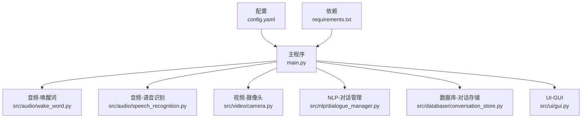
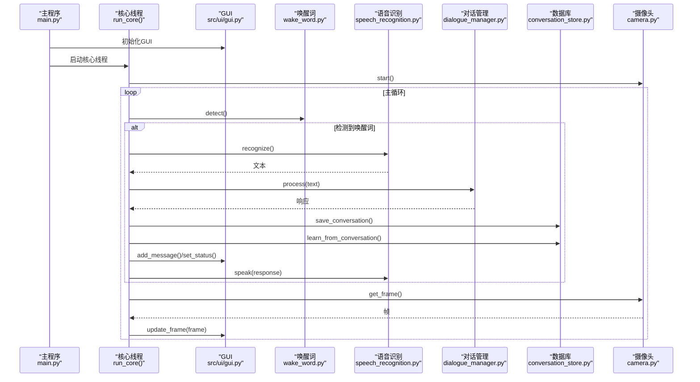

# 开发指南

<cite>
**本文档引用的文件**
- [main.py](file://main.py)
- [config.yaml](file://config.yaml)
- [requirements.txt](file://requirements.txt)
- [src/audio/speech_recognition.py](file://src/audio/speech_recognition.py)
- [src/audio/wake_word.py](file://src/audio/wake_word.py)
- [src/video/camera.py](file://src/video/camera.py)
- [src/nlp/dialogue_manager.py](file://src/nlp/dialogue_manager.py)
- [src/database/conversation_store.py](file://src/database/conversation_store.py)
- [src/ui/gui.py](file://src/ui/gui.py)
</cite>

## 目录
1. [简介](#简介)
2. [项目结构](#项目结构)
3. [核心组件](#核心组件)
4. [架构总览](#架构总览)
5. [详细组件分析](#详细组件分析)
6. [依赖分析](#依赖分析)
7. [性能考虑](#性能考虑)
8. [调试与故障排除](#调试与故障排除)
9. [开发规范与最佳实践](#开发规范与最佳实践)
10. [单元测试指南](#单元测试指南)
11. [多线程与异步处理](#多线程与异步处理)
12. [新功能开发流程](#新功能开发流程)
13. [代码审查标准](#代码审查标准)
14. [版本管理策略](#版本管理策略)
15. [结论](#结论)

## 简介
本指南面向数字人系统的开发者，提供从架构设计、模块实现到开发流程、测试与调试的完整说明。系统采用模块化设计，包含语音唤醒、语音识别与合成、视频采集与显示、自然语言对话管理、对话历史存储与学习、以及基于 Tkinter 的图形界面。系统通过多线程协调各模块，主线程负责 GUI，后台线程负责核心业务逻辑，确保交互流畅与资源高效利用。

## 项目结构
项目采用按功能域分层的模块组织：
- 主入口：负责系统初始化、模块装配与线程调度
- 配置：集中管理各模块参数
- 依赖：通过 requirements.txt 统一声明
- 功能模块：音频（唤醒词、语音识别）、视频（摄像头）、NLP（对话管理）、数据库（对话存储与学习）、UI（GUI）

图表来源
- [main.py:118-138](file://main.py#L118-L138)
- [config.yaml:1-35](file://config.yaml#L1-L35)
- [requirements.txt:1-27](file://requirements.txt#L1-L27)

章节来源
- [main.py:118-138](file://main.py#L118-L138)
- [config.yaml:1-35](file://config.yaml#L1-L35)
- [requirements.txt:1-27](file://requirements.txt#L1-L27)

## 核心组件
- 数字人系统类：负责加载配置、初始化各子模块、协调核心循环与资源清理
- 语音唤醒：基于 PyAudio 的音频流监听与能量阈值检测，模拟唤醒词触发
- 语音识别与合成：使用 speech_recognition 与 pyttsx3 实现语音转文本与文本转语音
- 摄像头：使用 OpenCV 异步采集帧，配合队列避免阻塞
- 对话管理：基于规则的意图匹配与响应生成，并维护对话历史
- 数据库存储：SQLite 表结构支持对话记录与学习模式，提供增删查改操作
- GUI：基于 Tkinter 的图形界面，使用队列与后台线程安全更新 UI

章节来源
- [main.py:21-117](file://main.py#L21-L117)
- [src/audio/wake_word.py:13-109](file://src/audio/wake_word.py#L13-L109)
- [src/audio/speech_recognition.py:12-89](file://src/audio/speech_recognition.py#L12-L89)
- [src/video/camera.py:12-106](file://src/video/camera.py#L12-L106)
- [src/nlp/dialogue_manager.py:12-102](file://src/nlp/dialogue_manager.py#L12-L102)
- [src/database/conversation_store.py:12-158](file://src/database/conversation_store.py#L12-L158)
- [src/ui/gui.py:16-170](file://src/ui/gui.py#L16-L170)

## 架构总览
系统采用“主线程 GUI + 后台线程核心”的双线程架构。GUI 独立运行，通过队列接收来自核心线程的消息更新；核心线程负责唤醒词检测、语音识别、对话处理、数据库写入与学习、视频帧获取与显示。

图表来源
- [main.py:60-117](file://main.py#L60-L117)
- [src/audio/wake_word.py:42-98](file://src/audio/wake_word.py#L42-L98)
- [src/audio/speech_recognition.py:46-85](file://src/audio/speech_recognition.py#L46-L85)
- [src/nlp/dialogue_manager.py:62-94](file://src/nlp/dialogue_manager.py#L62-L94)
- [src/database/conversation_store.py:53-125](file://src/database/conversation_store.py#L53-L125)
- [src/video/camera.py:89-94](file://src/video/camera.py#L89-L94)
- [src/ui/gui.py:122-155](file://src/ui/gui.py#L122-L155)

## 详细组件分析

### 数字人系统类（DigitalHuman）
职责与流程
- 初始化：加载配置、设置日志、实例化各子模块
- 核心循环：持续检测唤醒词、执行语音识别、对话处理、数据库写入与学习、更新 GUI、播放语音
- 资源清理：停止摄像头、记录停止日志

关键点
- 日志级别由配置控制，输出到文件与控制台
- 核心循环内含小延迟，避免 CPU 占用过高
- GUI 在主线程初始化，核心逻辑在后台线程执行

章节来源
- [main.py:21-117](file://main.py#L21-L117)

### 语音唤醒模块（WakeWordDetector）
职责与流程
- 初始化音频流与参数（采样率、帧大小、通道数）
- 循环读取音频帧，基于能量阈值判断语音活动
- 模拟唤醒词检测（示例中使用概率触发）

关键点
- 使用 PyAudio 与 numpy 进行音频处理
- 通过队列限制缓存长度，避免内存增长
- 异常处理与资源释放（关闭流、终止 PyAudio）

章节来源
- [src/audio/wake_word.py:13-109](file://src/audio/wake_word.py#L13-L109)

### 语音识别与合成（SpeechRecognizer）
职责与流程
- 初始化识别器与 TTS 引擎，设置语言、语速、音量
- 识别：调整环境噪声后监听，使用 Google Web Speech API 转文本
- 合成：将文本转语音并播放

关键点
- 错误处理覆盖超时、未知值、网络请求异常
- TTS 语音选择中文语音（若可用），并设置语速与音量
- 资源清理：析构时停止引擎

章节来源
- [src/audio/speech_recognition.py:12-89](file://src/audio/speech_recognition.py#L12-L89)

### 摄像头模块（Camera）
职责与流程
- 初始化摄像头、设置分辨率与帧率
- 后台线程持续读取帧，进行简单处理（示例：加绿色边框）
- 使用队列缓存帧，满时丢弃旧帧

关键点
- 使用 OpenCV 与 Python 线程队列
- 提供 get_frame 非阻塞获取
- 停止时释放资源与等待线程退出

章节来源
- [src/video/camera.py:12-106](file://src/video/camera.py#L12-L106)

### 对话管理（DialogueManager）
职责与流程
- 加载规则：问候、自我介绍、天气、时间、帮助、告别等
- 处理：将用户输入加入历史，匹配规则生成响应，更新历史
- 历史：维护固定长度的对话历史，支持查询与清空

关键点
- 基于关键字匹配的简单规则引擎
- 默认响应池用于兜底
- 历史长度受配置限制

章节来源
- [src/nlp/dialogue_manager.py:12-102](file://src/nlp/dialogue_manager.py#L12-L102)

### 数据库存储（ConversationStore）
职责与流程
- 初始化数据库：创建对话表与学习表
- 保存对话：插入用户输入、响应与时间戳
- 查询历史：按时间倒序获取最近记录
- 学习：基于最近对话提取模式，更新置信度与使用次数
- 清理：支持清空对话与学习数据

关键点
- SQLite 事务与连接管理
- 学习机制基于简单频率与置信度更新
- 文件路径自动创建目录

章节来源
- [src/database/conversation_store.py:12-158](file://src/database/conversation_store.py#L12-L158)

### 图形界面（GUI）
职责与流程
- 初始化窗口、布局与组件（摄像头画布、对话文本框、状态标签）
- 启动 GUI 主循环与后台更新线程
- 安全更新：通过队列接收 frame/message/status，内部线程统一更新 UI
- 资源清理：窗口关闭时停止运行并销毁

关键点
- 队列与后台线程保证 UI 线程安全
- 图像缩放适配控件尺寸
- 状态提示颜色变化

章节来源
- [src/ui/gui.py:16-170](file://src/ui/gui.py#L16-L170)

## 依赖分析
外部依赖与用途
- NumPy/SciPy：数值计算与信号处理
- SpeechRecognition/PyAudio：语音识别与音频输入
- Pyttsx3：文本转语音
- OpenCV：视频采集与图像处理
- NLTK/SpaCy：自然语言处理（可选）
- TensorFlow/Torch：机器学习推理（可选）
- PsUtil：系统监控（可选）
- PyYAML：配置解析

章节来源
- [requirements.txt:1-27](file://requirements.txt#L1-L27)

## 性能考虑
- CPU 占用控制：核心循环中使用短延迟，避免忙轮询
- 队列缓冲：摄像头帧队列限制大小，满时丢弃旧帧，平衡延迟与资源
- I/O 并发：GUI 更新通过队列异步处理，避免阻塞主线程
- 日志级别：根据部署环境调整日志级别，减少磁盘写入
- 语音处理：识别前进行环境噪声自适应，提高识别稳定性
- 数据库：批量学习与查询限制条数，避免大事务

## 调试与故障排除
常见问题与解决
- 唤醒词检测无效
  - 检查麦克风权限与设备索引
  - 调整音频阈值与敏感度配置
  - 查看音频流是否正常打开
- 语音识别失败
  - 确认网络连通性
  - 检查语言设置与超时配置
  - 降低环境噪声或延长自适应时间
- 摄像头无法打开
  - 确认摄像头索引与权限
  - 检查分辨率与帧率设置
  - 关闭其他占用摄像头的应用
- GUI 卡顿
  - 检查队列是否积压
  - 减少图像缩放与刷新频率
- 数据库写入慢
  - 控制学习频率与批量大小
  - 确保数据库文件所在目录有写权限

章节来源
- [src/audio/wake_word.py:42-98](file://src/audio/wake_word.py#L42-L98)
- [src/audio/speech_recognition.py:46-85](file://src/audio/speech_recognition.py#L46-L85)
- [src/video/camera.py:27-53](file://src/video/camera.py#L27-L53)
- [src/ui/gui.py:62-82](file://src/ui/gui.py#L62-L82)
- [src/database/conversation_store.py:24-51](file://src/database/conversation_store.py#L24-L51)

## 开发规范与最佳实践
- 代码风格
  - 使用 PEP 8 风格，命名清晰，函数与类职责单一
  - 模块内聚高、耦合低，遵循“接口稳定、实现可替换”
- 配置管理
  - 所有外部参数集中于 config.yaml，便于部署与热切换
- 错误处理
  - 对外暴露明确的异常类型与错误码
  - 记录关键错误日志，包含上下文信息
- 资源管理
  - 所有外部资源（音频流、摄像头、数据库连接）均需显式释放
- 可测试性
  - 将业务逻辑与 I/O 解耦，便于注入测试替身
- 文档与注释
  - 模块与公共接口提供清晰文档字符串
  - 关键算法与流程提供注释说明

## 单元测试指南
建议的测试策略
- 模块级测试
  - 对话管理：构造多种输入，断言规则匹配与响应一致性
  - 数据库：插入/查询/学习流程，断言数据完整性与一致性
  - GUI：队列更新与 UI 状态变更，断言线程安全
- 集成测试
  - 核心循环：模拟唤醒词触发、语音识别与合成、数据库写入
  - 摄像头：帧队列容量与丢帧行为
- 性能测试
  - 帧率与延迟：测量从采集到显示的端到端耗时
  - 并发：多线程并发更新 UI 与数据库
- 回归测试
  - 配置变更对系统行为的影响
  - 不同平台（Windows/macOS/Linux）的兼容性

## 多线程与异步处理
线程分工
- 主线程：GUI 初始化与主循环
- 核心线程：唤醒词检测、语音识别、对话处理、数据库写入、视频帧获取
- 摄像头线程：持续采集帧并入队
- GUI 更新线程：从队列取出任务，统一更新 UI

同步与通信
- 队列：作为线程间通信的唯一通道，避免共享可变状态
- 信号与标志：如 running 标志控制线程生命周期
- 资源锁：仅在必要时使用，优先采用队列与不可变对象

章节来源
- [main.py:126-128](file://main.py#L126-L128)
- [src/video/camera.py:44-46](file://src/video/camera.py#L44-L46)
- [src/ui/gui.py:66-68](file://src/ui/gui.py#L66-L68)

## 新功能开发流程
- 需求分析：明确功能目标、输入输出、性能指标
- 设计评审：绘制模块交互图与数据流图，评估影响范围
- 接口定义：确定对外 API、配置项、异常约定
- 实现步骤
  - 新建模块文件，遵循现有命名与目录规范
  - 编写最小可用实现，确保日志与异常处理完备
  - 单元测试先行，覆盖正常与异常分支
  - 集成测试：与现有模块对接，验证端到端流程
- 文档更新：补充配置说明、接口文档与使用示例
- 代码审查：提交 PR，至少一名 reviewer 通过
- 发布与回滚：灰度发布，准备回滚方案

## 代码审查标准
- 正确性
  - 逻辑正确、边界条件处理完善
  - 异常路径覆盖，日志清晰
- 可维护性
  - 函数与类职责单一，命名与注释清晰
  - 配置集中管理，避免魔法数字
- 性能
  - 避免不必要的阻塞与重复计算
  - 合理使用缓存与队列
- 安全
  - 输入校验与输出编码
  - 资源及时释放，避免泄漏
- 测试
  - 单测覆盖率达标，集成测试完备

## 版本管理策略
- 分支策略
  - develop：日常开发分支
  - main：稳定发布分支
  - feature/*：功能开发分支
  - hotfix/*：紧急修复分支
- 提交规范
  - 类型：feat/fix/docs/style/refactor/test/chore
  - 格式：type(scope): subject
- 发布流程
  - 版本号：语义化版本（主.次.修订）
  - 变更日志：记录重大改动与迁移指南
  - 标签与发布包：自动化构建与测试通过后发布

## 结论
本指南提供了数字人系统的架构视图、模块实现细节、开发与测试流程、多线程与性能优化建议，以及版本管理与代码审查标准。建议在新功能开发中严格遵循上述规范，确保系统稳定性、可维护性与可扩展性。