# 性能优化

<cite>
**本文档引用的文件**
- [main.py](file://main.py)
- [config.yaml](file://config.yaml)
- [requirements.txt](file://requirements.txt)
- [src/audio/wake_word.py](file://src/audio/wake_word.py)
- [src/audio/speech_recognition.py](file://src/audio/speech_recognition.py)
- [src/video/camera.py](file://src/video/camera.py)
- [src/database/conversation_store.py](file://src/database/conversation_store.py)
- [src/nlp/dialogue_manager.py](file://src/nlp/dialogue_manager.py)
- [src/ui/gui.py](file://src/ui/gui.py)
</cite>

## 目录
1. [简介](#简介)
2. [项目结构](#项目结构)
3. [核心组件](#核心组件)
4. [架构概览](#架构概览)
5. [详细组件分析](#详细组件分析)
6. [多线程架构优化](#多线程架构优化)
7. [内存管理优化](#内存管理优化)
8. [CPU使用率优化](#cpu使用率优化)
9. [音频处理性能优化](#音频处理性能优化)
10. [视频流处理优化](#视频流处理优化)
11. [数据库查询优化](#数据库查询优化)
12. [缓存策略](#缓存策略)
13. [异步处理优化](#异步处理优化)
14. [资源池管理](#资源池管理)
15. [实时性要求下的性能调优](#实时性要求下的性能调优)
16. [系统监控指标](#系统监控指标)
17. [性能瓶颈识别](#性能瓶颈识别)
18. [性能测试工具使用指南](#性能测试工具使用指南)
19. [基准测试方法](#基准测试方法)
20. [故障排除指南](#故障排除指南)
21. [结论](#结论)

## 简介

本指南针对数字人系统的性能优化进行全面分析，涵盖多线程架构优化、内存管理、CPU使用率优化、音频处理、视频流处理、数据库查询优化等多个方面。该系统采用模块化设计，包含音频唤醒检测、语音识别、视频采集、自然语言处理、对话存储和图形用户界面等核心组件。

## 项目结构

数字人系统采用分层架构设计，各模块职责明确，便于性能优化和维护：

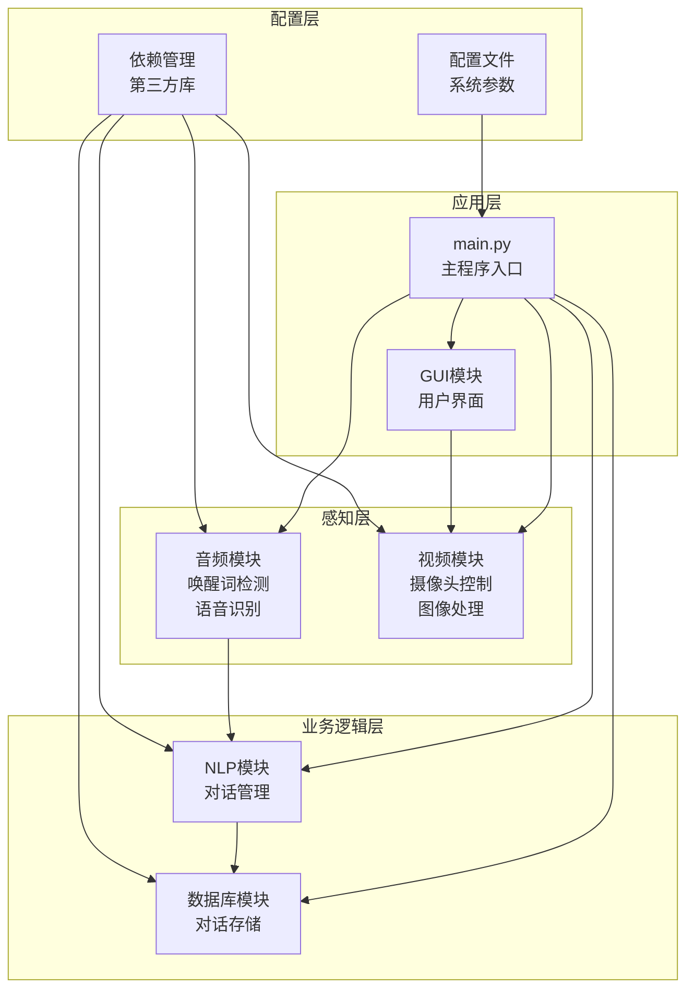

**图表来源**
- [main.py:1-138](file://main.py#L1-L138)
- [config.yaml:1-35](file://config.yaml#L1-L35)

**章节来源**
- [main.py:1-138](file://main.py#L1-L138)
- [config.yaml:1-35](file://config.yaml#L1-L35)

## 核心组件

系统包含以下核心组件，每个组件都有特定的性能特征和优化需求：

### 主控制器组件
- **DigitalHuman类**: 系统的核心协调器，负责模块初始化和流程控制
- **线程管理**: 使用守护线程确保优雅退出

### 音频处理组件
- **WakeWordDetector**: 唤醒词检测，基于能量阈值的简单检测算法
- **SpeechRecognizer**: 语音识别和语音合成，使用Google Web Speech API

### 视频处理组件
- **Camera**: 摄像头管理，使用队列实现生产者-消费者模式

### 业务逻辑组件
- **DialogueManager**: 对话管理，基于规则的简单对话引擎
- **ConversationStore**: 对话存储，SQLite数据库操作

### 用户界面组件
- **GUI**: Tkinter图形界面，支持异步更新队列

**章节来源**
- [main.py:21-138](file://main.py#L21-L138)
- [src/audio/wake_word.py:13-109](file://src/audio/wake_word.py#L13-L109)
- [src/audio/speech_recognition.py:12-89](file://src/audio/speech_recognition.py#L12-L89)
- [src/video/camera.py:12-106](file://src/video/camera.py#L12-L106)
- [src/database/conversation_store.py:12-158](file://src/database/conversation_store.py#L12-L158)
- [src/nlp/dialogue_manager.py:12-102](file://src/nlp/dialogue_manager.py#L12-L102)
- [src/ui/gui.py:16-170](file://src/ui/gui.py#L16-L170)

## 架构概览

系统采用事件驱动的多线程架构，确保实时性和响应性：

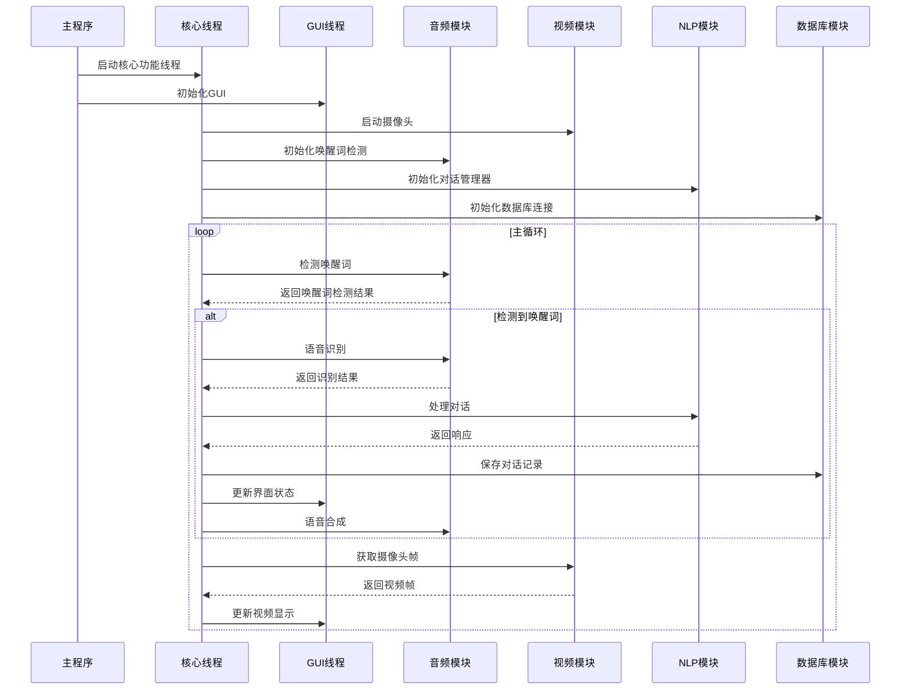

**图表来源**
- [main.py:60-116](file://main.py#L60-L116)
- [src/audio/wake_word.py:42-98](file://src/audio/wake_word.py#L42-L98)
- [src/audio/speech_recognition.py:46-85](file://src/audio/speech_recognition.py#L46-L85)
- [src/video/camera.py:27-95](file://src/video/camera.py#L27-L95)
- [src/database/conversation_store.py:53-80](file://src/database/conversation_store.py#L53-L80)

## 详细组件分析

### 数字人主控制器分析

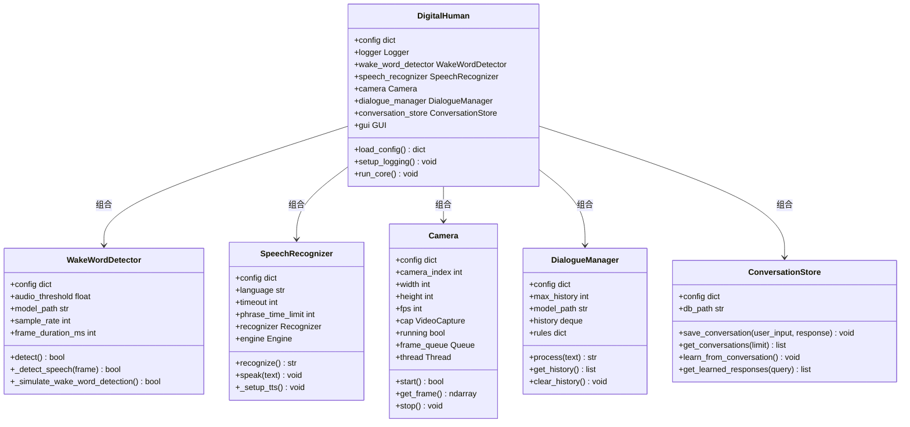

**图表来源**
- [main.py:21-39](file://main.py#L21-L39)
- [src/audio/wake_word.py:13-32](file://src/audio/wake_word.py#L13-L32)
- [src/audio/speech_recognition.py:12-28](file://src/audio/speech_recognition.py#L12-L28)
- [src/video/camera.py:12-26](file://src/video/camera.py#L12-L26)
- [src/nlp/dialogue_manager.py:12-24](file://src/nlp/dialogue_manager.py#L12-L24)
- [src/database/conversation_store.py:12-23](file://src/database/conversation_store.py#L12-L23)

**章节来源**
- [main.py:21-39](file://main.py#L21-L39)
- [src/audio/wake_word.py:13-32](file://src/audio/wake_word.py#L13-L32)
- [src/audio/speech_recognition.py:12-28](file://src/audio/speech_recognition.py#L12-L28)
- [src/video/camera.py:12-26](file://src/video/camera.py#L12-L26)
- [src/nlp/dialogue_manager.py:12-24](file://src/nlp/dialogue_manager.py#L12-L24)
- [src/database/conversation_store.py:12-23](file://src/database/conversation_store.py#L12-L23)

### GUI组件分析

GUI模块采用异步更新机制，通过队列实现线程安全的UI更新：

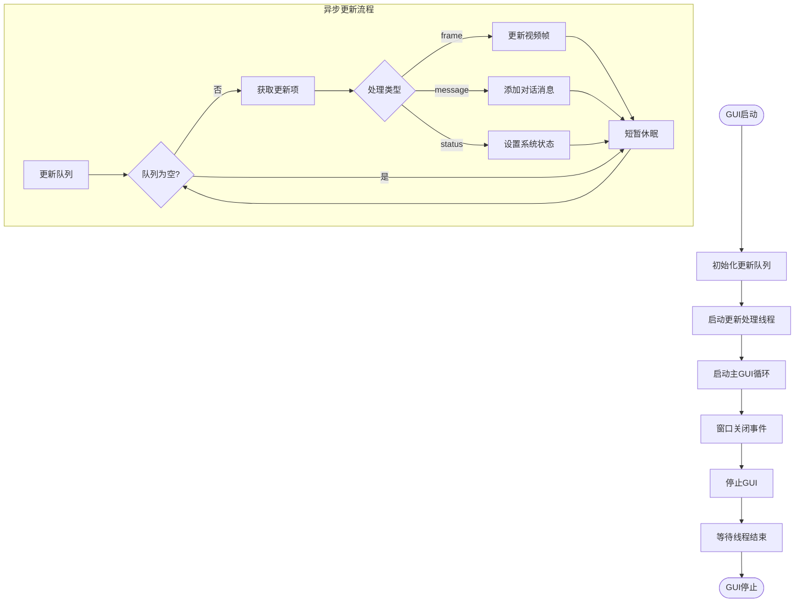

**图表来源**
- [src/ui/gui.py:62-98](file://src/ui/gui.py#L62-L98)
- [src/ui/gui.py:122-155](file://src/ui/gui.py#L122-L155)

**章节来源**
- [src/ui/gui.py:62-98](file://src/ui/gui.py#L62-L98)
- [src/ui/gui.py:122-155](file://src/ui/gui.py#L122-L155)

## 多线程架构优化

### 现状分析

系统采用多线程架构，但存在一些优化空间：

1. **线程管理**: 使用守护线程，但缺乏线程池管理
2. **同步机制**: 缺乏适当的锁机制，可能导致竞态条件
3. **资源管理**: 线程生命周期管理不够完善

### 优化策略

#### 线程池管理
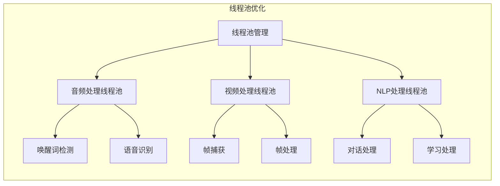

**图表来源**
- [main.py:125-128](file://main.py#L125-L128)
- [src/video/camera.py:44-46](file://src/video/camera.py#L44-L46)

#### 同步机制改进
- 使用`threading.Lock`保护共享资源
- 实现条件变量进行线程间通信
- 采用`queue.JoinableQueue`实现任务完成通知

**章节来源**
- [main.py:125-128](file://main.py#L125-L128)
- [src/video/camera.py:44-46](file://src/video/camera.py#L44-L46)

## 内存管理优化

### 当前内存使用情况

系统内存使用主要集中在：
- **视频帧缓冲**: `queue.Queue(maxsize=10)`限制内存占用
- **音频数据**: 唤醒词检测中的音频帧缓存
- **对话历史**: `collections.deque(maxlen=10)`限制历史长度

### 优化建议

#### 内存池管理
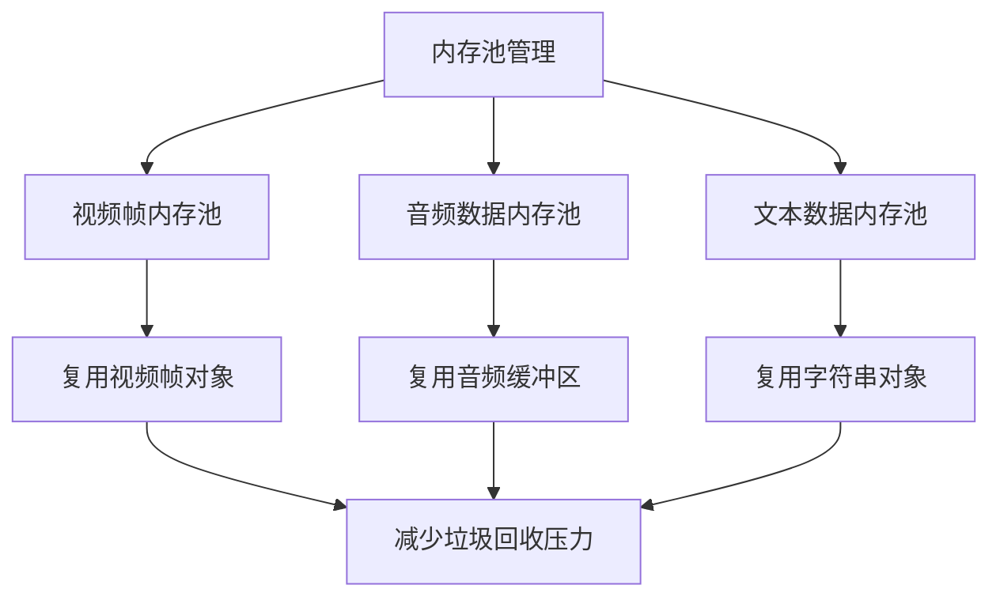

#### 内存监控
- 实现内存使用统计
- 设置内存使用阈值警告
- 定期清理临时对象

**章节来源**
- [src/video/camera.py:24](file://src/video/camera.py#L24)
- [src/nlp/dialogue_manager.py:20](file://src/nlp/dialogue_manager.py#L20)

## CPU使用率优化

### CPU密集型任务识别

系统中的CPU密集型任务包括：
- **音频处理**: FFT变换、音频特征提取
- **视频处理**: 图像变换、格式转换
- **语音识别**: 机器学习模型推理
- **对话处理**: 文本匹配、规则解析

### 优化策略

#### 任务调度优化
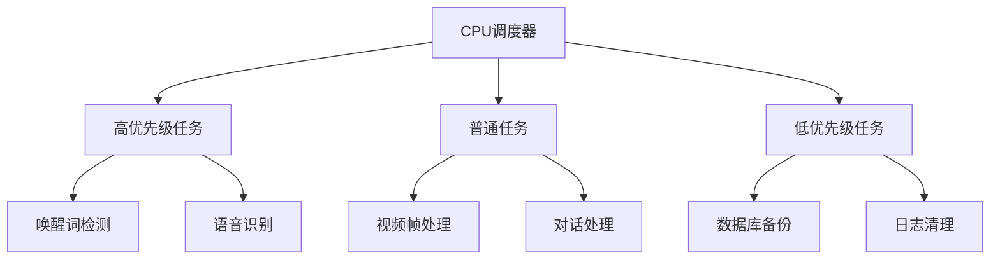

#### CPU亲和性设置
- 将不同类型的处理任务分配到不同的CPU核心
- 使用`psutil.Process().cpu_affinity()`设置CPU亲和性
- 避免CPU缓存失效

**章节来源**
- [src/audio/wake_word.py:33-40](file://src/audio/wake_word.py#L33-L40)
- [src/video/camera.py:74-87](file://src/video/camera.py#L74-L87)

## 音频处理性能优化

### 现状分析

音频处理模块存在以下性能问题：
- **唤醒词检测**: 使用简单的能量阈值，准确率低但性能好
- **语音识别**: 依赖网络API，存在网络延迟
- **语音合成**: 使用TTS引擎，CPU占用较高

### 优化方案

#### 唤醒词检测优化
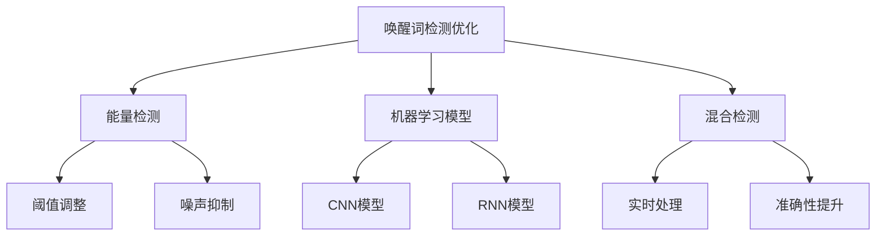

#### 语音识别优化
- **本地模型**: 使用离线语音识别模型
- **批量处理**: 合并多个识别请求
- **缓存机制**: 缓存常用词汇识别结果

**章节来源**
- [src/audio/wake_word.py:42-98](file://src/audio/wake_word.py#L42-L98)
- [src/audio/speech_recognition.py:46-85](file://src/audio/speech_recognition.py#L46-L85)

## 视频流处理优化

### 现状分析

视频处理模块采用生产者-消费者模式，但存在以下问题：
- **帧队列大小**: 固定大小队列可能丢失关键帧
- **图像处理**: 简单的图像处理操作
- **线程同步**: 缺乏精确的同步机制

### 优化策略

#### 视频流优化
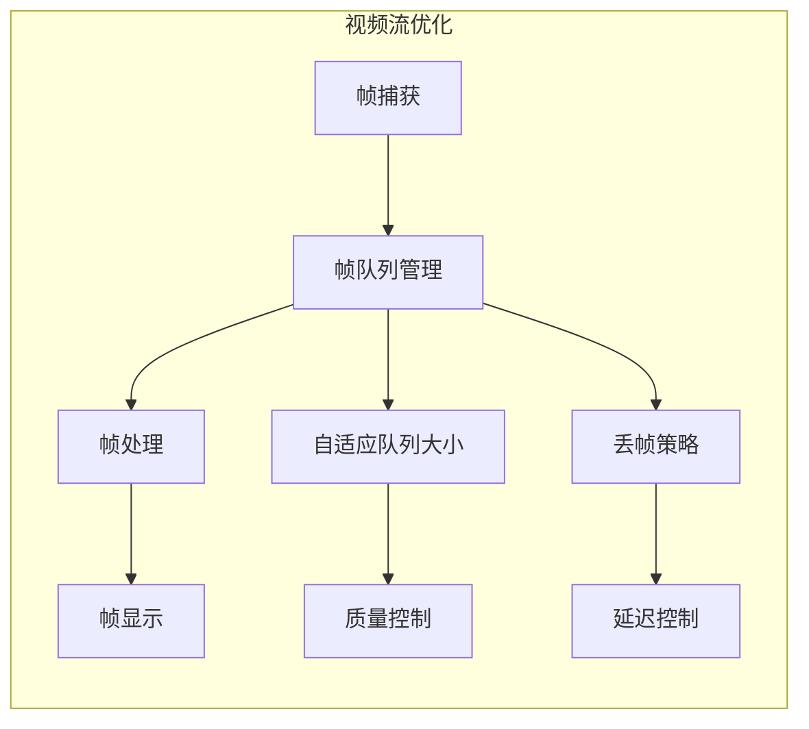

#### 多线程视频处理
- **解码线程**: 专用线程处理视频解码
- **处理线程**: 并行处理多个视频帧
- **显示线程**: 专用线程处理UI更新

**章节来源**
- [src/video/camera.py:27-95](file://src/video/camera.py#L27-L95)

## 数据库查询优化

### 现状分析

数据库模块使用SQLite，查询相对简单但存在优化空间：
- **索引缺失**: 缺少适当的索引
- **查询优化**: 简单的SQL查询
- **事务管理**: 缺乏批量操作优化

### 优化方案

#### 查询优化策略
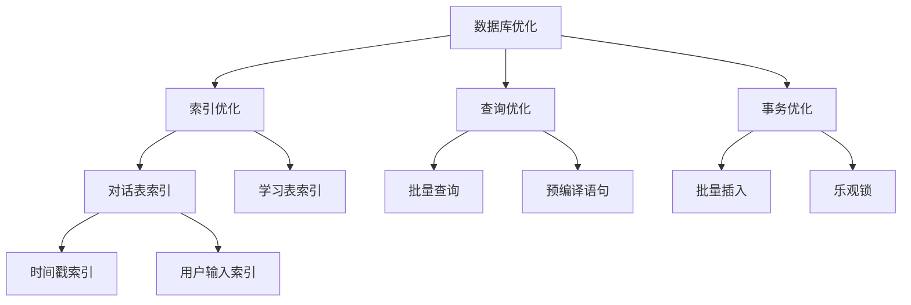

#### 性能监控
- **慢查询日志**: 记录执行时间超过阈值的查询
- **查询统计**: 统计查询执行次数和平均时间
- **索引使用率**: 监控索引使用情况

**章节来源**
- [src/database/conversation_store.py:24-51](file://src/database/conversation_store.py#L24-L51)
- [src/database/conversation_store.py:67-80](file://src/database/conversation_store.py#L67-L80)

## 缓存策略

### 现状分析

系统具备基础的缓存机制：
- **对话历史**: 使用`collections.deque`限制大小
- **学习数据**: SQLite数据库中的学习表
- **图像缓存**: GUI中的图像对象缓存

### 缓存优化策略

#### 多级缓存架构
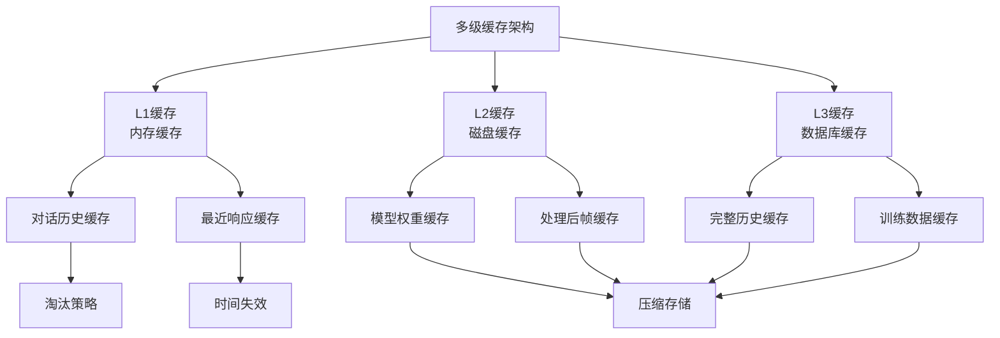

#### 缓存一致性
- **写穿策略**: 写入时同时更新多级缓存
- **失效策略**: LRU/LFU淘汰算法
- **并发控制**: 读写锁保证缓存一致性

**章节来源**
- [src/nlp/dialogue_manager.py:20](file://src/nlp/dialogue_manager.py#L20)
- [src/database/conversation_store.py:82-125](file://src/database/conversation_store.py#L82-L125)

## 异步处理优化

### 现状分析

系统采用异步更新机制，但仍有改进空间：
- **GUI异步**: 使用队列实现线程安全更新
- **音频异步**: 独立的音频处理线程
- **视频异步**: 生产者-消费者模式

### 异步优化策略

#### 异步任务管理
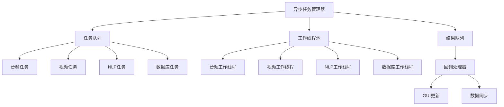

#### 事件驱动架构
- **事件总线**: 统一的事件发布订阅机制
- **回调函数**: 异步操作完成后的回调处理
- **错误传播**: 异常信息的异步传播

**章节来源**
- [src/ui/gui.py:83-98](file://src/ui/gui.py#L83-L98)
- [src/video/camera.py:55-73](file://src/video/camera.py#L55-L73)

## 资源池管理

### 现状分析

系统具备基础的资源池概念：
- **线程池**: 使用Python内置线程
- **帧池**: 有限大小的帧队列
- **连接池**: SQLite连接池

### 资源池优化

#### 资源池架构
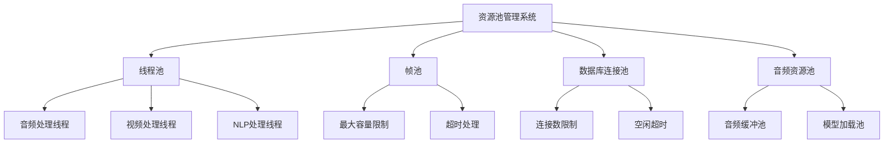

#### 动态资源调整
- **自适应扩容**: 根据负载动态调整资源池大小
- **资源监控**: 实时监控资源使用情况
- **自动回收**: 超时或空闲资源的自动回收

**章节来源**
- [src/video/camera.py:24](file://src/video/camera.py#L24)
- [src/database/conversation_store.py:12-23](file://src/database/conversation_store.py#L12-L23)

## 实时性要求下的性能调优

### 实时性指标

系统实时性要求包括：
- **唤醒延迟**: 唤醒词检测到响应的时间
- **语音识别延迟**: 语音到文本的转换延迟
- **视频延迟**: 摄像头到显示的延迟
- **响应延迟**: 用户输入到系统响应的延迟

### 实时性优化策略

#### 延迟优化
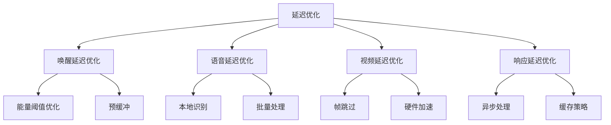

#### 吞吐量提升
- **流水线处理**: 多阶段并行处理
- **批处理优化**: 合并小任务
- **资源复用**: 减少资源创建销毁开销

**章节来源**
- [config.yaml:32-35](file://config.yaml#L32-L35)
- [src/audio/wake_word.py:42-98](file://src/audio/wake_word.py#L42-L98)

## 系统监控指标

### 关键性能指标

#### 系统级指标
- **CPU使用率**: 整体CPU使用百分比
- **内存使用**: 已用内存和峰值内存
- **线程数**: 活跃线程数量
- **磁盘I/O**: 读写速度和队列长度

#### 应用级指标
- **音频处理延迟**: 唤醒词检测和语音识别延迟
- **视频处理FPS**: 实际帧率和目标帧率
- **数据库查询时间**: 平均查询时间和慢查询
- **GUI响应时间**: 界面更新延迟

### 监控实现

#### 性能监控架构
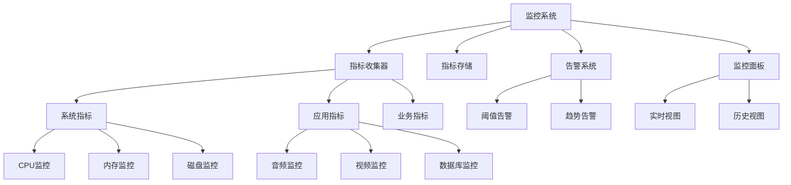

**章节来源**
- [requirements.txt:26](file://requirements.txt#L26)

## 性能瓶颈识别

### 瓶颈识别方法

#### 性能分析工具
- **cProfile**: Python内置性能分析器
- **memory_profiler**: 内存使用分析
- **line_profiler**: 行级性能分析
- **py-spy**: 非侵入式性能分析

#### 瓶颈定位策略
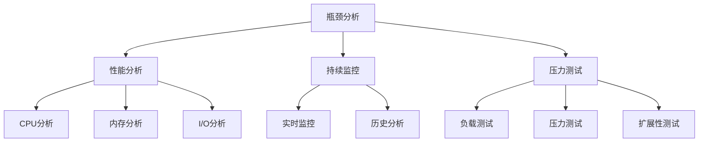

#### 常见瓶颈类型
- **CPU瓶颈**: 计算密集型任务过多
- **内存瓶颈**: 内存泄漏或过度使用
- **I/O瓶颈**: 磁盘或网络访问延迟
- **并发瓶颈**: 线程竞争和死锁

**章节来源**
- [requirements.txt:26](file://requirements.txt#L26)

## 性能测试工具使用指南

### 测试工具推荐

#### Python性能测试工具
- **pytest-benchmark**: 单元测试性能基准
- **asv**: 项目级性能基准测试
- **timeit**: 精确时间测量
- **cProfile**: 性能分析和热点识别

#### 系统监控工具
- **htop**: 实时系统监控
- **iotop**: I/O性能监控
- **netstat**: 网络性能监控
- **sar**: 系统活动报告

### 测试实施步骤

#### 基准测试流程
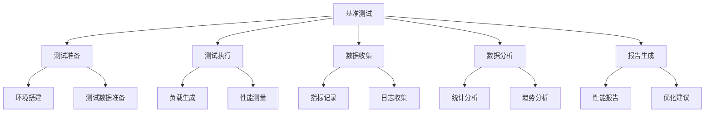

#### 测试场景设计
- **正常负载测试**: 模拟日常使用场景
- **峰值负载测试**: 模拟高并发场景
- **长时间稳定性测试**: 7×24小时连续运行
- **资源枯竭测试**: 内存、CPU、磁盘耗尽场景

**章节来源**
- [requirements.txt:26](file://requirements.txt#L26)

## 基准测试方法

### 测试指标定义

#### 性能基准指标
- **吞吐量**: 单位时间内处理的任务数量
- **延迟**: 请求从发出到响应的时间
- **并发能力**: 同时处理的用户或任务数量
- **资源利用率**: CPU、内存、磁盘、网络的使用效率

#### 测试数据集
- **音频测试数据**: 不同环境下的语音样本
- **视频测试数据**: 不同分辨率和帧率的视频片段
- **文本测试数据**: 不同长度和复杂度的对话文本
- **数据库测试数据**: 不同规模的对话历史数据

### 测试执行规范

#### 测试环境要求
- **硬件环境**: 标准化的测试硬件配置
- **软件环境**: 一致的操作系统和依赖版本
- **网络环境**: 稳定的网络连接和带宽
- **测试数据**: 代表性且可重复的数据集

#### 结果评估标准
- **性能基线**: 建立系统性能的基线值
- **回归测试**: 每次变更后的性能回归测试
- **对比分析**: 新旧版本的性能对比
- **趋势分析**: 长期性能趋势跟踪

**章节来源**
- [config.yaml:1-35](file://config.yaml#L1-L35)

## 故障排除指南

### 常见性能问题

#### 线程相关问题
- **线程阻塞**: 线程等待锁或I/O操作导致的阻塞
- **线程泄漏**: 线程未正确终止导致的资源泄漏
- **死锁**: 多个线程相互等待导致的死锁
- **竞态条件**: 多线程访问共享资源的竞态条件

#### 内存相关问题
- **内存泄漏**: 对象未正确释放导致的内存增长
- **内存碎片**: 频繁分配和释放导致的内存碎片化
- **内存溢出**: 内存使用超出系统限制
- **缓存失效**: 缓存命中率低导致的性能下降

#### 性能退化问题
- **CPU过载**: CPU使用率持续过高
- **I/O瓶颈**: 磁盘或网络访问成为瓶颈
- **数据库性能**: 查询速度慢或连接数不足
- **GUI卡顿**: 界面响应缓慢

### 排查方法

#### 诊断工具使用
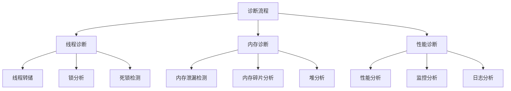

#### 解决方案实施
- **代码重构**: 优化算法和数据结构
- **配置调整**: 调整系统和应用配置
- **资源扩容**: 增加硬件资源或优化资源使用
- **架构调整**: 重新设计系统架构以提高性能

**章节来源**
- [src/ui/gui.py:75-81](file://src/ui/gui.py#L75-L81)
- [src/video/camera.py:98-106](file://src/video/camera.py#L98-L106)

## 结论

数字人系统的性能优化是一个系统性的工程，需要从多个维度综合考虑。通过实施本文提出的优化策略，包括多线程架构优化、内存管理、CPU使用率优化、音频和视频处理优化、数据库查询优化、缓存策略、异步处理优化和资源池管理，可以显著提升系统的整体性能和用户体验。

关键的优化要点包括：
- 建立完善的监控体系，持续跟踪系统性能指标
- 实施多级缓存策略，减少重复计算和I/O操作
- 优化线程池和资源池管理，提高资源利用效率
- 采用异步处理和事件驱动架构，提升系统的响应性
- 建立基准测试和性能回归测试机制，确保性能持续改进

通过持续的性能监控、基准测试和优化迭代，数字人系统可以在保证功能完整性的同时，达到更高的性能水平和更好的用户体验。