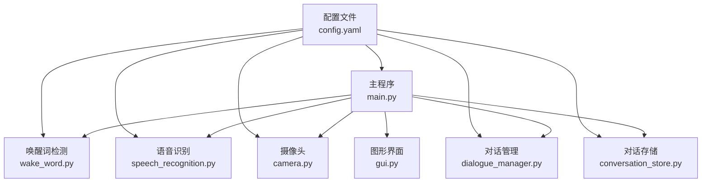
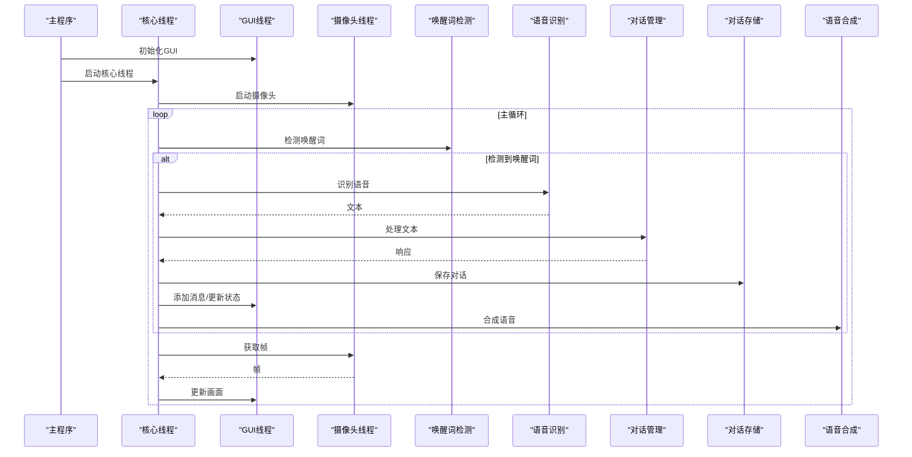
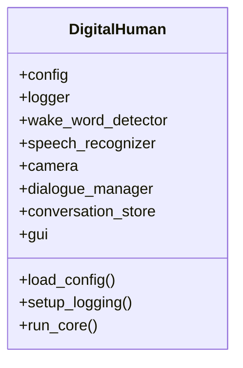
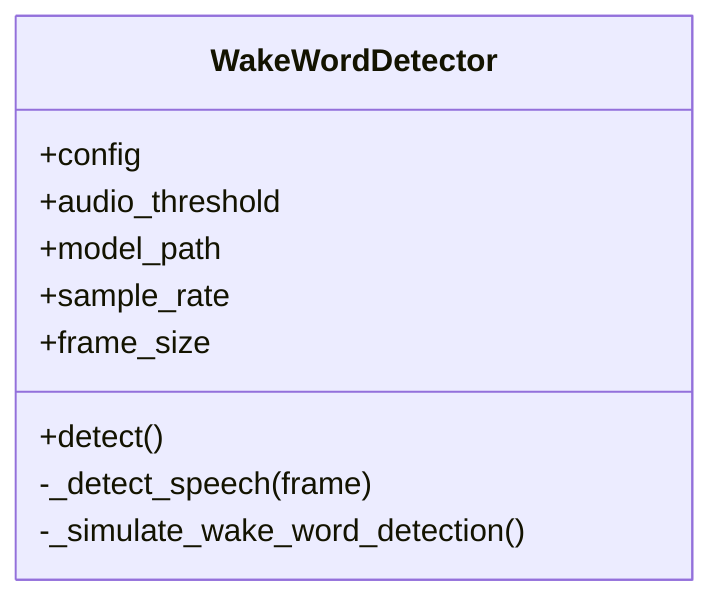
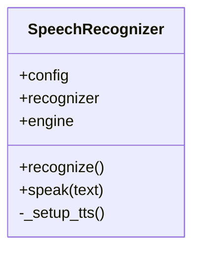
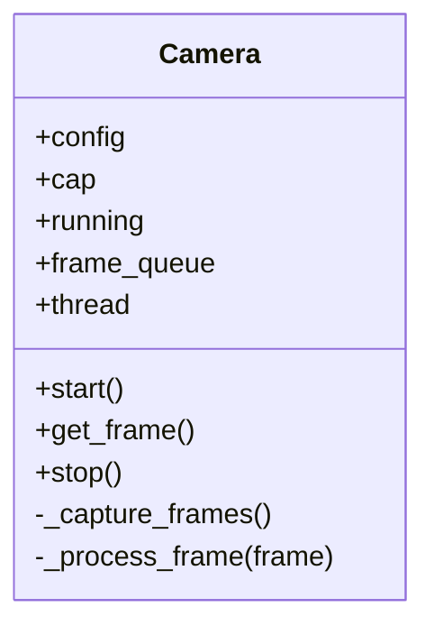
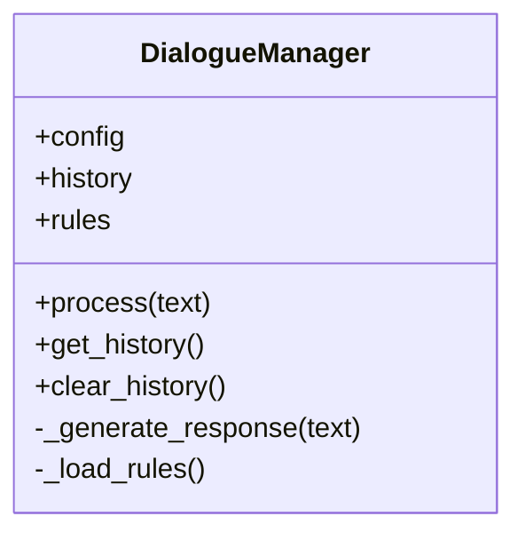
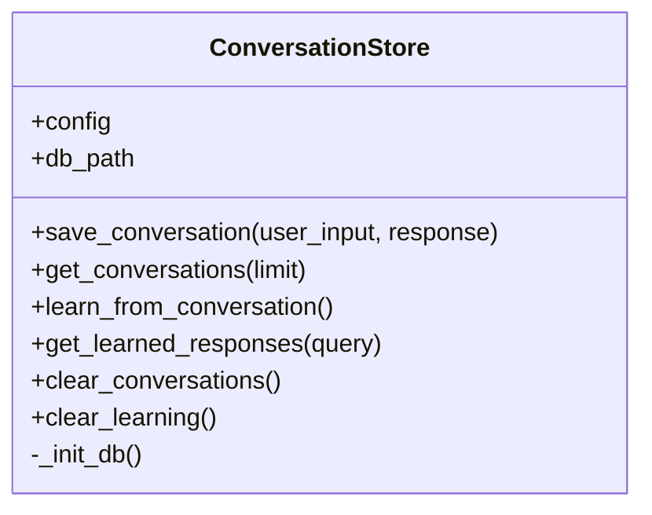
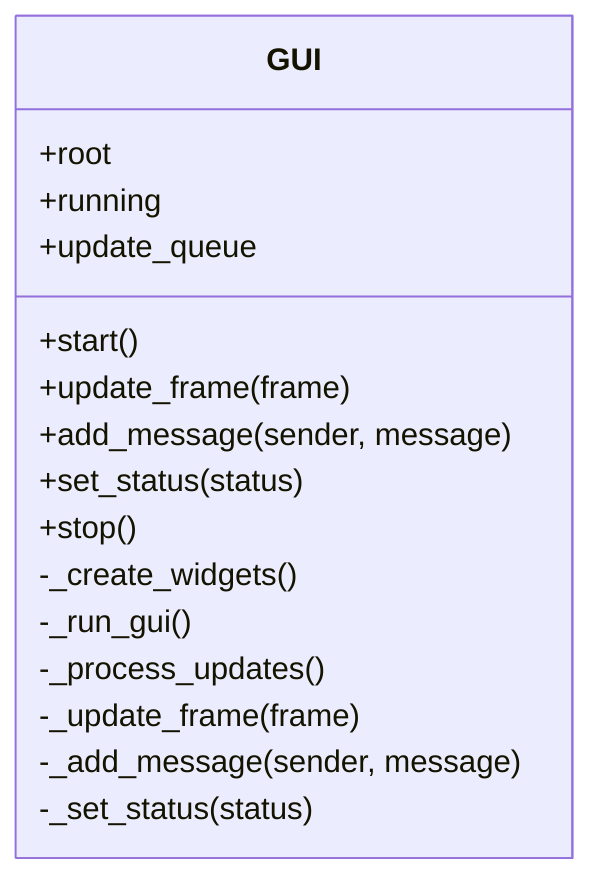
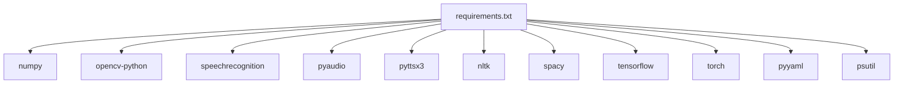

# 扩展开发

<cite>
**本文档引用的文件**
- [main.py](file://main.py)
- [config.yaml](file://config.yaml)
- [requirements.txt](file://requirements.txt)
- [src/audio/wake_word.py](file://src/audio/wake_word.py)
- [src/audio/speech_recognition.py](file://src/audio/speech_recognition.py)
- [src/video/camera.py](file://src/video/camera.py)
- [src/nlp/dialogue_manager.py](file://src/nlp/dialogue_manager.py)
- [src/database/conversation_store.py](file://src/database/conversation_store.py)
- [src/ui/gui.py](file://src/ui/gui.py)
</cite>

## 目录
1. [简介](#简介)
2. [项目结构](#项目结构)
3. [核心组件](#核心组件)
4. [架构总览](#架构总览)
5. [详细组件分析](#详细组件分析)
6. [依赖分析](#依赖分析)
7. [性能考量](#性能考量)
8. [故障排查指南](#故障排查指南)
9. [结论](#结论)
10. [附录](#附录)

## 简介
本指南面向希望为数字人系统进行扩展开发的工程师与技术作者。内容覆盖：
- 插件系统架构与接口设计原则
- 模块间通信机制与扩展点
- 新增音频处理、视觉识别、NLP增强模块的实践步骤
- 配置系统扩展、数据库表结构扩展与GUI组件扩展方法
- API接口文档编写规范、版本兼容性与向后兼容性考虑
- 完整的功能开发流程与集成测试方法

## 项目结构
系统采用分层模块化组织，核心由以下模块构成：
- 主程序入口负责装配与调度各子模块
- 配置文件集中管理各模块参数
- 音频子系统：唤醒词检测、语音识别与语音合成
- 视觉子系统：摄像头采集与帧处理
- NLP子系统：对话管理与规则引擎
- 数据库存储：对话记录与学习模式
- GUI界面：多线程更新队列与可视化展示

图表来源
- [main.py:21-39](file://main.py#L21-L39)
- [config.yaml:1-35](file://config.yaml#L1-L35)

章节来源
- [main.py:118-138](file://main.py#L118-L138)
- [config.yaml:1-35](file://config.yaml#L1-L35)

## 核心组件
- 数字人系统类：负责模块装配、日志初始化、核心控制流与资源清理
- 唤醒词检测器：基于音频能量阈值与简单关键词模拟检测
- 语音识别器：麦克风录音、噪声自适应、Google Web Speech API识别与TTS合成
- 摄像头：多线程采集、帧队列缓冲与基础图像处理
- 对话管理器：基于规则的意图匹配与响应生成，维护对话历史
- 对话存储：SQLite持久化、学习模式表与学习能力
- 图形界面：多线程更新队列、摄像头画面显示、对话消息与状态展示

章节来源
- [main.py:21-117](file://main.py#L21-L117)
- [src/audio/wake_word.py:13-109](file://src/audio/wake_word.py#L13-L109)
- [src/audio/speech_recognition.py:12-89](file://src/audio/speech_recognition.py#L12-L89)
- [src/video/camera.py:12-106](file://src/video/camera.py#L12-L106)
- [src/nlp/dialogue_manager.py:12-102](file://src/nlp/dialogue_manager.py#L12-L102)
- [src/database/conversation_store.py:12-158](file://src/database/conversation_store.py#L12-L158)
- [src/ui/gui.py:16-170](file://src/ui/gui.py#L16-L170)

## 架构总览
系统采用“主程序装配 + 多线程协作”的架构：
- 主线程负责GUI生命周期与事件循环
- 核心线程执行唤醒词检测、语音识别、对话处理与TTS输出
- 摄像头独立线程采集帧并入队，GUI线程消费队列更新画面
- 数据库与日志在各模块内按需访问

图表来源
- [main.py:60-116](file://main.py#L60-L116)
- [src/audio/wake_word.py:42-98](file://src/audio/wake_word.py#L42-L98)
- [src/audio/speech_recognition.py:46-84](file://src/audio/speech_recognition.py#L46-L84)
- [src/nlp/dialogue_manager.py:62-73](file://src/nlp/dialogue_manager.py#L62-L73)
- [src/database/conversation_store.py:53-65](file://src/database/conversation_store.py#L53-L65)
- [src/ui/gui.py:62-98](file://src/ui/gui.py#L62-L98)
- [src/video/camera.py:27-94](file://src/video/camera.py#L27-L94)

## 详细组件分析

### 组件A：数字人系统类（主程序）
- 职责：加载配置、初始化模块、协调核心流程、资源清理
- 关键点：
  - 配置加载与日志初始化
  - 模块装配顺序与依赖关系
  - 多线程启动与GUI生命周期
  - 异常捕获与优雅停机

图表来源
- [main.py:21-117](file://main.py#L21-L117)

章节来源
- [main.py:21-117](file://main.py#L21-L117)

### 组件B：唤醒词检测器
- 设计要点：音频流采集、能量阈值判断、简单关键词模拟
- 扩展建议：替换为轻量模型（如Keyword Spotting）或集成VAD
- 接口扩展：支持多关键词、可配置阈值与采样率

图表来源
- [src/audio/wake_word.py:13-109](file://src/audio/wake_word.py#L13-L109)

章节来源
- [src/audio/wake_word.py:13-109](file://src/audio/wake_word.py#L13-L109)

### 组件C：语音识别器
- 功能：录音、降噪、识别与TTS合成
- 扩展建议：接入本地ASR（如Wav2Vec）、离线识别、多语言切换
- 接口扩展：识别语言、超时与分段参数、TTS声音与语速

图表来源
- [src/audio/speech_recognition.py:12-89](file://src/audio/speech_recognition.py#L12-L89)

章节来源
- [src/audio/speech_recognition.py:12-89](file://src/audio/speech_recognition.py#L12-L89)

### 组件D：摄像头模块
- 设计要点：多线程采集、环形队列、基础图像处理
- 扩展建议：加入人脸检测、表情识别、姿态估计；支持多摄像头
- 接口扩展：分辨率、FPS、处理回调钩子

图表来源
- [src/video/camera.py:12-106](file://src/video/camera.py#L12-L106)

章节来源
- [src/video/camera.py:12-106](file://src/video/camera.py#L12-L106)

### 组件E：对话管理器
- 设计要点：规则引擎、对话历史、默认响应策略
- 扩展建议：引入意图分类器、槽位填充、上下文记忆、外部知识库
- 接口扩展：规则文件、最大历史长度、响应模板

图表来源
- [src/nlp/dialogue_manager.py:12-102](file://src/nlp/dialogue_manager.py#L12-L102)

章节来源
- [src/nlp/dialogue_manager.py:12-102](file://src/nlp/dialogue_manager.py#L12-L102)

### 组件F：对话存储
- 设计要点：SQLite持久化、对话表与学习表、学习能力
- 扩展建议：引入向量检索、相似度匹配、增量学习、迁移学习
- 接口扩展：学习阈值、缓存策略、备份与恢复

图表来源
- [src/database/conversation_store.py:12-158](file://src/database/conversation_store.py#L12-L158)

章节来源
- [src/database/conversation_store.py:12-158](file://src/database/conversation_store.py#L12-L158)

### 组件G：图形界面
- 设计要点：多线程更新队列、帧更新、消息与状态展示
- 扩展建议：支持更多控件、主题切换、日志面板、实时统计
- 接口扩展：消息格式、状态样式、事件回调

图表来源
- [src/ui/gui.py:16-170](file://src/ui/gui.py#L16-L170)

章节来源
- [src/ui/gui.py:16-170](file://src/ui/gui.py#L16-L170)

## 依赖分析
- Python依赖集中在核心库与多媒体处理上，包括NumPy、OpenCV、SpeechRecognition、PyAudio、PyTTSX3、NLTK、spaCy、TensorFlow、PyTorch、PyYAML、psutil等
- 模块间耦合度低，通过主程序装配与配置驱动，便于替换与扩展

图表来源
- [requirements.txt:1-27](file://requirements.txt#L1-L27)

章节来源
- [requirements.txt:1-27](file://requirements.txt#L1-L27)

## 性能考量
- 多线程与队列：摄像头与GUI采用队列解耦，避免阻塞主线程
- 资源释放：模块析构函数确保音频与视频设备正确释放
- CPU占用控制：主循环使用小延迟，避免过度占用
- I/O优化：SQLite写入批量提交，学习逻辑限制最近条目

章节来源
- [main.py:108-109](file://main.py#L108-L109)
- [src/video/camera.py:64-72](file://src/video/camera.py#L64-L72)
- [src/audio/wake_word.py:93-96](file://src/audio/wake_word.py#L93-L96)
- [src/database/conversation_store.py:82-125](file://src/database/conversation_store.py#L82-L125)

## 故障排查指南
- 唤醒词检测异常：检查音频设备权限、采样率与阈值配置
- 语音识别失败：确认网络连接、Google API可用性、语言设置
- 摄像头无画面：验证索引、分辨率与驱动，检查队列满导致丢帧
- GUI卡顿：检查更新队列处理线程是否正常运行
- 数据库写入失败：确认路径权限与SQLite可用性

章节来源
- [src/audio/wake_word.py:42-98](file://src/audio/wake_word.py#L42-L98)
- [src/audio/speech_recognition.py:46-84](file://src/audio/speech_recognition.py#L46-L84)
- [src/video/camera.py:27-53](file://src/video/camera.py#L27-L53)
- [src/ui/gui.py:83-98](file://src/ui/gui.py#L83-L98)
- [src/database/conversation_store.py:24-51](file://src/database/conversation_store.py#L24-L51)

## 结论
该数字人系统具备清晰的模块边界与可扩展的装配结构。通过遵循本文档的扩展原则与流程，开发者可以安全地新增音频处理、视觉识别、NLP增强模块，并在不破坏现有功能的前提下进行配置、数据库与GUI的扩展。

## 附录

### 扩展开发流程（通用）
- 需求分析与模块设计
- 接口定义与配置项扩展
- 实现与单元测试
- 集成测试与回归测试
- 文档与版本发布

章节来源
- [main.py:41-58](file://main.py#L41-L58)
- [config.yaml:1-35](file://config.yaml#L1-L35)

### 新音频处理模块开发示例
- 目标：新增关键词/唤醒词模型、VAD或本地ASR
- 步骤：
  - 在配置中新增节点与参数
  - 编写模块类，实现统一接口（如detect/recognize）
  - 在主程序中装配并注入到核心流程
  - 编写单元测试与集成测试

章节来源
- [config.yaml:4-7](file://config.yaml#L4-L7)
- [src/audio/wake_word.py:13-32](file://src/audio/wake_word.py#L13-L32)
- [main.py:30-31](file://main.py#L30-L31)

### 新视觉识别模块开发示例
- 目标：加入人脸识别、表情识别、姿态估计
- 步骤：
  - 在配置中新增视频相关参数
  - 在Camera模块中扩展_process_frame回调或新增子模块
  - 在GUI中增加显示与交互控件
  - 编写测试与性能评估

章节来源
- [config.yaml:15-20](file://config.yaml#L15-L20)
- [src/video/camera.py:74-87](file://src/video/camera.py#L74-L87)
- [src/ui/gui.py:36-61](file://src/ui/gui.py#L36-L61)

### 新NLP增强模块开发示例
- 目标：引入意图分类、槽位填充、知识图谱
- 步骤：
  - 在配置中新增NLP相关参数
  - 替换或扩展DialogueManager的处理逻辑
  - 增加学习与检索能力
  - 编写测试与A/B评估

章节来源
- [config.yaml:22-26](file://config.yaml#L22-L26)
- [src/nlp/dialogue_manager.py:12-24](file://src/nlp/dialogue_manager.py#L12-L24)
- [src/database/conversation_store.py:82-140](file://src/database/conversation_store.py#L82-L140)

### 配置系统扩展方法
- 在config.yaml中新增节点与默认值
- 在对应模块构造函数中读取配置
- 在主程序中传递配置对象
- 提供类型校验与默认回退

章节来源
- [config.yaml:1-35](file://config.yaml#L1-L35)
- [main.py:41-45](file://main.py#L41-L45)

### 数据库表结构扩展方法
- 在_init_db中新增CREATE TABLE语句
- 保证字段命名与业务含义一致
- 提供迁移脚本与版本号
- 编写查询与学习逻辑

章节来源
- [src/database/conversation_store.py:24-51](file://src/database/conversation_store.py#L24-L51)
- [src/database/conversation_store.py:82-140](file://src/database/conversation_store.py#L82-L140)

### GUI组件扩展方法
- 在GUI类中新增控件与布局
- 使用update_queue异步更新
- 保持主线程安全与线程隔离
- 提供事件回调与状态同步

章节来源
- [src/ui/gui.py:36-61](file://src/ui/gui.py#L36-L61)
- [src/ui/gui.py:83-98](file://src/ui/gui.py#L83-L98)

### API接口文档编写规范
- 接口命名：清晰、幂等、可读性强
- 请求/响应结构：明确字段、类型、约束与默认值
- 错误码与异常：统一错误码、错误信息与HTTP状态映射
- 版本控制：URL或Header携带版本号，向后兼容策略
- 示例：提供典型请求/响应示例与场景说明

（本节为通用规范说明，不直接分析具体文件）

### 版本兼容性与向后兼容性
- 版本策略：语义化版本，主版本变更时允许破坏性改动
- 配置兼容：新增字段提供默认值，旧字段保留兼容期
- 接口兼容：新增字段可选，删除字段提供迁移方案
- 测试保障：回归测试与兼容性测试矩阵

（本节为通用规范说明，不直接分析具体文件）

### 集成测试方法
- 单元测试：针对模块内部逻辑与边界条件
- 集成测试：跨模块协作流程（唤醒词→识别→对话→存储→TTS）
- 回归测试：版本升级前后一致性验证
- 性能测试：吞吐量、延迟、资源占用评估

章节来源
- [main.py:60-116](file://main.py#L60-L116)
- [src/audio/speech_recognition.py:46-84](file://src/audio/speech_recognition.py#L46-L84)
- [src/nlp/dialogue_manager.py:62-73](file://src/nlp/dialogue_manager.py#L62-L73)
- [src/database/conversation_store.py:53-65](file://src/database/conversation_store.py#L53-L65)