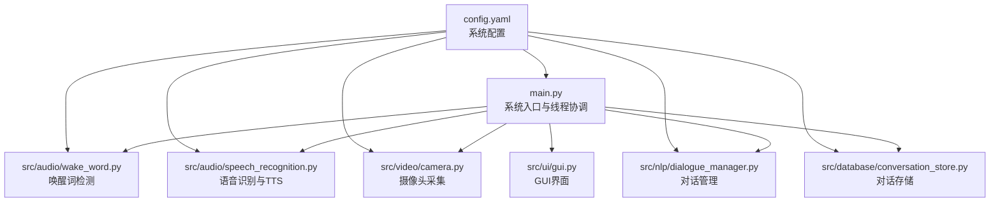
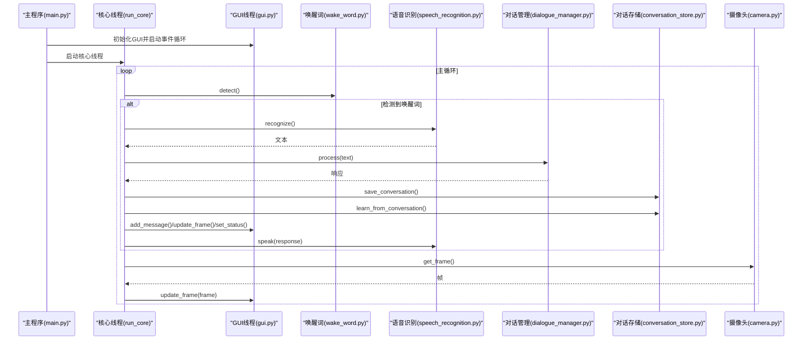
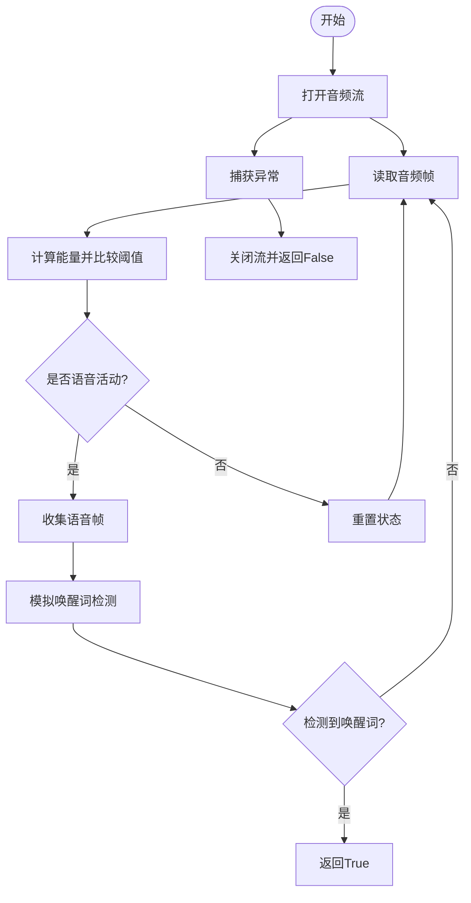
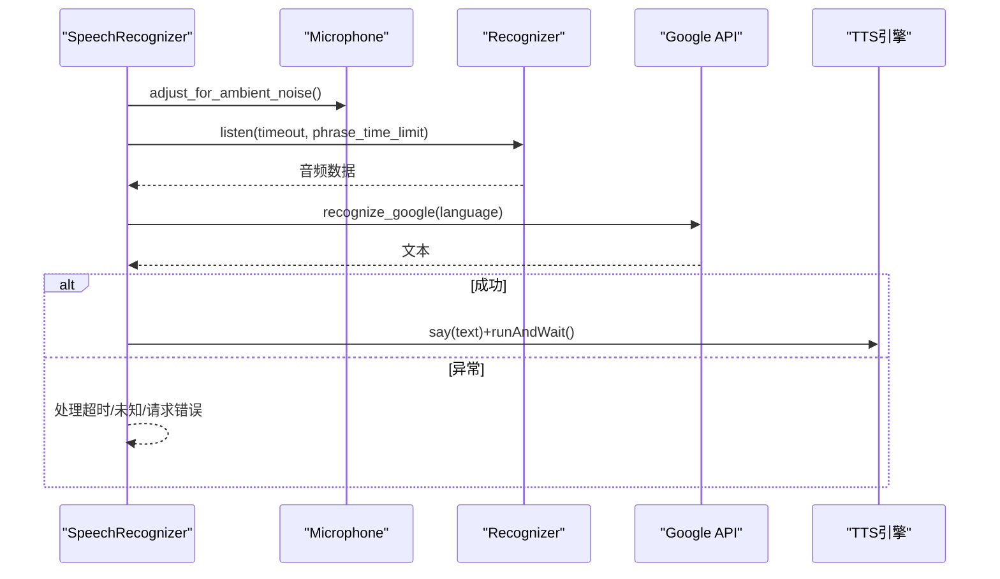
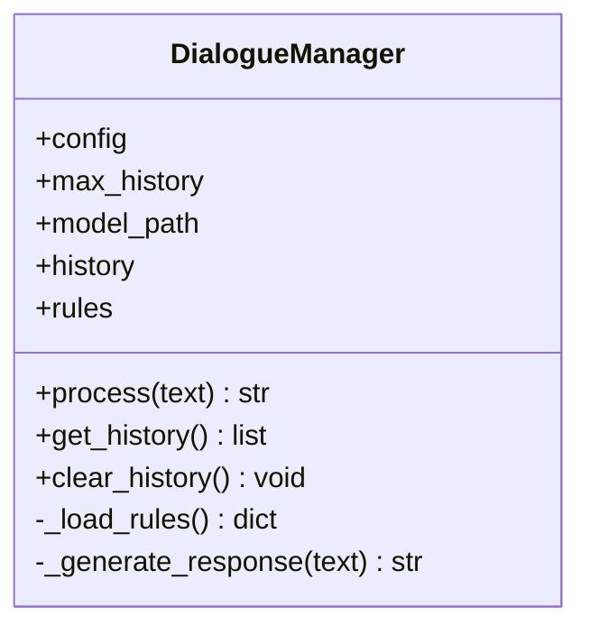
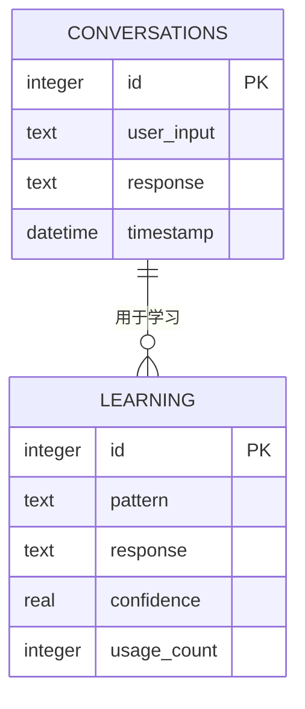
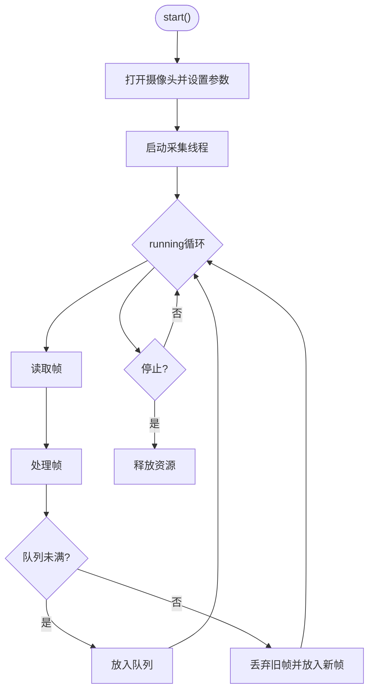
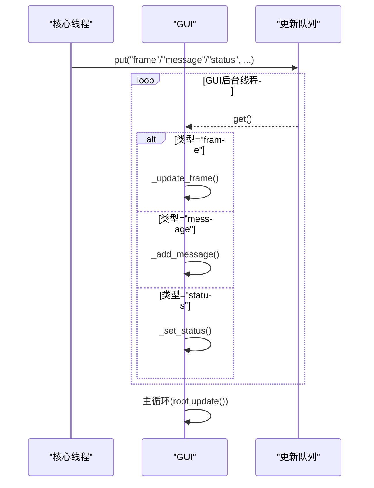
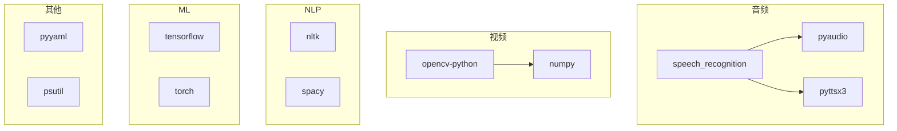

# 测试与调试

<cite>
**本文档引用的文件**
- [main.py](file://main.py)
- [config.yaml](file://config.yaml)
- [src/audio/speech_recognition.py](file://src/audio/speech_recognition.py)
- [src/audio/wake_word.py](file://src/audio/wake_word.py)
- [src/nlp/dialogue_manager.py](file://src/nlp/dialogue_manager.py)
- [src/database/conversation_store.py](file://src/database/conversation_store.py)
- [src/ui/gui.py](file://src/ui/gui.py)
- [src/video/camera.py](file://src/video/camera.py)
- [requirements.txt](file://requirements.txt)
</cite>

## 目录
1. [简介](#简介)
2. [项目结构](#项目结构)
3. [核心组件](#核心组件)
4. [架构总览](#架构总览)
5. [详细组件分析](#详细组件分析)
6. [依赖分析](#依赖分析)
7. [性能考虑](#性能考虑)
8. [故障排除指南](#故障排除指南)
9. [结论](#结论)
10. [附录](#附录)

## 简介
本指南面向数字人系统的测试与调试工作，覆盖单元测试、集成测试、端到端测试与性能测试的方法论与实践要点；提供调试工具使用建议（Python调试器、日志分析、性能分析工具）；总结多线程调试技巧、异步代码测试与GUI测试方法；给出常见问题诊断流程、错误处理与故障排除策略；并提供测试自动化与持续集成的配置思路与最佳实践。

## 项目结构
数字人系统采用模块化分层组织：
- 主入口负责系统生命周期与线程协调
- 功能模块按职责划分：音频（唤醒词、语音识别）、视频（摄像头）、NLP（对话管理）、数据库（对话存储）、UI（GUI）
- 配置集中于YAML文件，便于测试与生产环境切换

图表来源
- [main.py:21-138](file://main.py#L21-L138)
- [config.yaml:1-35](file://config.yaml#L1-L35)

章节来源
- [main.py:118-138](file://main.py#L118-L138)
- [config.yaml:1-35](file://config.yaml#L1-L35)

## 核心组件
- 数字人系统类：负责加载配置、初始化各子模块、启动核心循环与GUI线程、资源清理
- 唤醒词检测器：基于PyAudio采集音频，使用能量阈值检测语音活动，模拟唤醒词触发
- 语音识别器：基于SpeechRecognition与PyAudio采集音频，使用Google Web Speech API识别文本；使用PyTTSX3进行TTS
- 摄像头：基于OpenCV采集视频帧，使用队列缓冲，支持多线程安全访问
- 对话管理器：基于规则的简单对话系统，维护对话历史，生成响应
- 对话存储：基于SQLite的持久化存储，支持对话记录与学习数据管理
- GUI：基于Tkinter的图形界面，使用队列与后台线程更新UI，保证主线程GUI事件循环

章节来源
- [main.py:21-117](file://main.py#L21-L117)
- [src/audio/wake_word.py:13-109](file://src/audio/wake_word.py#L13-L109)
- [src/audio/speech_recognition.py:12-89](file://src/audio/speech_recognition.py#L12-L89)
- [src/video/camera.py:12-106](file://src/video/camera.py#L12-L106)
- [src/nlp/dialogue_manager.py:12-102](file://src/nlp/dialogue_manager.py#L12-L102)
- [src/database/conversation_store.py:12-158](file://src/database/conversation_store.py#L12-L158)
- [src/ui/gui.py:16-170](file://src/ui/gui.py#L16-L170)

## 架构总览
系统采用“主循环+多线程”的架构：
- 主线程负责GUI事件循环
- 核心功能在守护线程中运行，周期性执行唤醒词检测、语音识别、对话处理、存储与TTS
- GUI通过队列与后台线程解耦，确保UI流畅

图表来源
- [main.py:60-117](file://main.py#L60-L117)
- [src/audio/wake_word.py:42-98](file://src/audio/wake_word.py#L42-L98)
- [src/audio/speech_recognition.py:46-85](file://src/audio/speech_recognition.py#L46-L85)
- [src/nlp/dialogue_manager.py:62-94](file://src/nlp/dialogue_manager.py#L62-L94)
- [src/database/conversation_store.py:53-125](file://src/database/conversation_store.py#L53-L125)
- [src/video/camera.py:89-95](file://src/video/camera.py#L89-L95)
- [src/ui/gui.py:122-155](file://src/ui/gui.py#L122-L155)

## 详细组件分析

### 唤醒词检测器测试策略
- 单元测试
  - Mock音频采集与PyAudio流，验证能量阈值检测逻辑与唤醒词模拟触发概率
  - 验证异常路径（音频流打开失败、异常退出）的处理
- 集成测试
  - 与语音识别器联调，验证唤醒后进入识别流程
- 端到端测试
  - 模拟真实音频输入，验证从“检测唤醒词”到“进入对话”的完整链路
- 性能测试
  - 测量不同采样率、帧大小对检测延迟与误检率的影响

图表来源
- [src/audio/wake_word.py:42-98](file://src/audio/wake_word.py#L42-L98)

章节来源
- [src/audio/wake_word.py:13-109](file://src/audio/wake_word.py#L13-L109)

### 语音识别器测试策略
- 单元测试
  - Mock Microphone与Recognizer，验证识别超时、未知值、请求错误分支
  - 验证TTS参数设置与异常处理
- 集成测试
  - 与唤醒词检测器联调，验证识别到文本后进入对话流程
- 端到端测试
  - 完整链路：唤醒词 -> 语音识别 -> NLP -> 存储 -> GUI -> TTS
- 性能测试
  - 测量识别延迟、并发识别场景下的稳定性

图表来源
- [src/audio/speech_recognition.py:46-85](file://src/audio/speech_recognition.py#L46-L85)

章节来源
- [src/audio/speech_recognition.py:12-89](file://src/audio/speech_recognition.py#L12-L89)

### 对话管理器测试策略
- 单元测试
  - 验证规则匹配与默认响应生成
  - 验证对话历史长度控制与清空逻辑
- 集成测试
  - 与语音识别器、数据库模块联调，验证输入输出与历史记录
- 端到端测试
  - 用户输入 -> NLP响应 -> GUI显示 -> 存储记录
- 性能测试
  - 高并发输入下的响应时间与内存占用

图表来源
- [src/nlp/dialogue_manager.py:12-102](file://src/nlp/dialogue_manager.py#L12-L102)

章节来源
- [src/nlp/dialogue_manager.py:12-102](file://src/nlp/dialogue_manager.py#L12-L102)

### 对话存储测试策略
- 单元测试
  - 验证数据库初始化、建表、插入、查询、删除等操作
  - 验证学习数据的增删改查与置信度更新
- 集成测试
  - 与对话管理器联调，验证学习数据的提取与使用
- 端到端测试
  - 完整对话链路：输入 -> 生成响应 -> 存储 -> 学习 -> 查询
- 性能测试
  - 大量写入与查询的吞吐量与索引优化

图表来源
- [src/database/conversation_store.py:24-51](file://src/database/conversation_store.py#L24-L51)
- [src/database/conversation_store.py:82-140](file://src/database/conversation_store.py#L82-L140)

章节来源
- [src/database/conversation_store.py:12-158](file://src/database/conversation_store.py#L12-L158)

### 摄像头测试策略
- 单元测试
  - 验证摄像头初始化、参数设置、帧处理与队列行为
- 集成测试
  - 与GUI联调，验证帧更新与队列满时的丢帧策略
- 端到端测试
  - 摄像头采集 -> 图像处理 -> GUI显示
- 性能测试
  - 不同分辨率、FPS下的帧率与内存占用

图表来源
- [src/video/camera.py:27-106](file://src/video/camera.py#L27-L106)

章节来源
- [src/video/camera.py:12-106](file://src/video/camera.py#L12-L106)

### GUI测试策略
- 单元测试
  - 验证队列更新、消息添加、状态设置的线程安全性
- 集成测试
  - 与各模块联调，验证UI更新与事件循环
- 端到端测试
  - 完整交互：用户输入 -> NLP -> GUI显示 -> 用户反馈
- 性能测试
  - 高频更新下的UI卡顿与内存泄漏

图表来源
- [src/ui/gui.py:62-170](file://src/ui/gui.py#L62-L170)

章节来源
- [src/ui/gui.py:16-170](file://src/ui/gui.py#L16-L170)

## 依赖分析
系统依赖主要集中在音频、视频、NLP与数据库领域，测试时需关注外部依赖的可替代性与隔离性。

图表来源
- [requirements.txt:1-27](file://requirements.txt#L1-L27)

章节来源
- [requirements.txt:1-27](file://requirements.txt#L1-L27)

## 性能考虑
- 线程与锁
  - 核心循环与GUI线程分离，避免阻塞UI事件循环
  - 使用队列进行线程间通信，减少共享状态竞争
- 资源管理
  - 及时释放音频流、摄像头与TTS资源，避免句柄泄露
- 缓冲与背压
  - 摄像头帧队列设置上限，避免内存膨胀
- I/O与数据库
  - SQLite写入批量提交，避免频繁事务
- 日志与监控
  - 使用结构化日志，便于性能分析与问题定位

[本节为通用指导，不直接分析具体文件]

## 故障排除指南
- 唤醒词检测失败
  - 检查音频设备权限与驱动，确认采样率与帧大小配置
  - 降低音频阈值或调整环境噪声补偿
- 语音识别失败
  - 检查网络连接与Google API可用性
  - 调整识别超时与短语时长限制
- GUI卡顿或崩溃
  - 确认UI更新通过队列进行，避免在非UI线程直接操作控件
  - 检查图像尺寸与缩放算法，避免大图导致内存压力
- 摄像头无法打开
  - 检查摄像头索引与权限，确认OpenCV版本兼容性
  - 降低分辨率与帧率以缓解性能压力
- 数据库异常
  - 检查数据库路径与权限，确认SQLite连接池与事务边界
  - 定期清理过期对话与学习数据，避免表膨胀

章节来源
- [src/audio/wake_word.py:42-98](file://src/audio/wake_word.py#L42-L98)
- [src/audio/speech_recognition.py:46-85](file://src/audio/speech_recognition.py#L46-L85)
- [src/ui/gui.py:62-170](file://src/ui/gui.py#L62-L170)
- [src/video/camera.py:27-106](file://src/video/camera.py#L27-L106)
- [src/database/conversation_store.py:24-51](file://src/database/conversation_store.py#L24-L51)

## 结论
本指南提供了数字人系统从单元测试到端到端测试的完整方法论，结合多线程与GUI特性，给出了针对性的调试与性能优化建议。通过合理的Mock策略、测试数据准备与日志分析，能够有效提升系统的稳定性与可维护性。

[本节为总结，不直接分析具体文件]

## 附录

### 单元测试编写方法
- 测试用例设计
  - 覆盖正常路径、边界条件与异常路径
  - 使用参数化测试覆盖多种输入组合
- Mock对象使用
  - 使用unittest.mock或pytest.mock替换外部依赖（如音频流、摄像头、数据库连接）
  - 重点Mock I/O密集型接口，避免真实硬件依赖
- 测试数据准备
  - 准备小规模、可控的测试数据集，便于重复验证
  - 使用临时目录与临时数据库，避免污染测试环境

章节来源
- [src/audio/wake_word.py:13-109](file://src/audio/wake_word.py#L13-L109)
- [src/audio/speech_recognition.py:12-89](file://src/audio/speech_recognition.py#L12-L89)
- [src/video/camera.py:12-106](file://src/video/camera.py#L12-L106)
- [src/database/conversation_store.py:12-158](file://src/database/conversation_store.py#L12-L158)
- [src/nlp/dialogue_manager.py:12-102](file://src/nlp/dialogue_manager.py#L12-L102)

### 集成测试策略
- 组件间接口契约
  - 明确各模块输入输出格式与异常约定
  - 使用最小化依赖的集成测试，逐步扩展
- 端到端测试
  - 模拟真实用户流程，覆盖唤醒词、识别、对话、存储、显示与TTS
  - 使用伪音频与伪视频输入，确保可重复性

章节来源
- [main.py:60-117](file://main.py#L60-L117)
- [src/ui/gui.py:62-170](file://src/ui/gui.py#L62-L170)

### 性能测试方法
- 关键指标
  - 响应延迟、吞吐量、CPU/内存占用、帧率
- 工具建议
  - cProfile/line_profiler进行热点分析
  - psutil监控系统资源
  - pytest-benchmark进行基准对比
- 场景设计
  - 并发输入、高负载下的稳定性
  - 不同分辨率与采样率的性能对比

章节来源
- [requirements.txt:26](file://requirements.txt#L26)
- [src/video/camera.py:27-106](file://src/video/camera.py#L27-L106)
- [src/audio/speech_recognition.py:46-85](file://src/audio/speech_recognition.py#L46-L85)

### 调试工具使用指南
- Python调试器
  - pdb/pudb设置断点，观察多线程状态与共享变量
- 日志分析
  - 使用结构化日志，按模块与级别过滤
  - 结合时间戳定位时序问题
- 性能分析
  - 使用cProfile分析函数调用耗时
  - 使用memory_profiler定位内存泄漏

章节来源
- [main.py:47-58](file://main.py#L47-L58)
- [src/ui/gui.py:62-170](file://src/ui/gui.py#L62-L170)

### 多线程调试技巧
- 线程同步
  - 使用队列与锁，避免竞态条件
  - 在非UI线程中只做数据处理，UI更新通过队列传递
- 死锁与阻塞
  - 使用超时机制避免无限等待
  - 定期打印线程状态，排查阻塞点

章节来源
- [main.py:125-138](file://main.py#L125-L138)
- [src/ui/gui.py:83-98](file://src/ui/gui.py#L83-L98)

### 异步代码测试
- 事件循环
  - 使用unittest.IsolatedAsyncioTestCase或pytest-asyncio
  - 替换事件循环以避免真实I/O阻塞
- 回调与协程
  - 使用Mock回调函数，验证异步流程

[本节为通用指导，不直接分析具体文件]

### GUI测试方法
- 自动化测试
  - 使用pytest与tkinter测试工具，模拟用户交互
- 状态一致性
  - 验证UI状态与业务状态的一致性
- 资源释放
  - 确保测试结束后销毁窗口与线程

章节来源
- [src/ui/gui.py:16-170](file://src/ui/gui.py#L16-L170)

### 常见问题诊断流程
- 启动阶段
  - 检查配置加载与日志初始化
  - 验证各模块初始化顺序与依赖
- 运行阶段
  - 观察核心循环与GUI线程状态
  - 检查队列积压与异常日志
- 停止阶段
  - 确认资源释放与线程退出

章节来源
- [main.py:21-117](file://main.py#L21-L117)
- [src/ui/gui.py:157-170](file://src/ui/gui.py#L157-L170)

### 错误处理与故障排除策略
- 分层处理
  - 在各模块内捕获并记录异常，向上抛出有意义的错误
- 降级策略
  - 当外部依赖不可用时，启用本地回退方案
- 监控与告警
  - 增加健康检查与异常计数，及时发现系统异常

章节来源
- [src/audio/wake_word.py:91-98](file://src/audio/wake_word.py#L91-L98)
- [src/audio/speech_recognition.py:67-75](file://src/audio/speech_recognition.py#L67-L75)
- [src/database/conversation_store.py:82-125](file://src/database/conversation_store.py#L82-L125)

### 测试自动化与持续集成配置示例
- 测试框架
  - 使用pytest作为测试运行器，配合coverage进行覆盖率统计
- CI流水线
  - 安装依赖（含可选音频/视频依赖），运行单元测试与集成测试
  - 使用缓存加速依赖安装
- 报告与质量门禁
  - 上传测试报告与覆盖率，设置最低覆盖率阈值

章节来源
- [requirements.txt:1-27](file://requirements.txt#L1-L27)