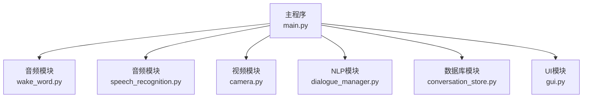
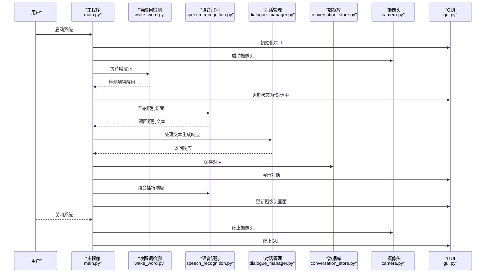
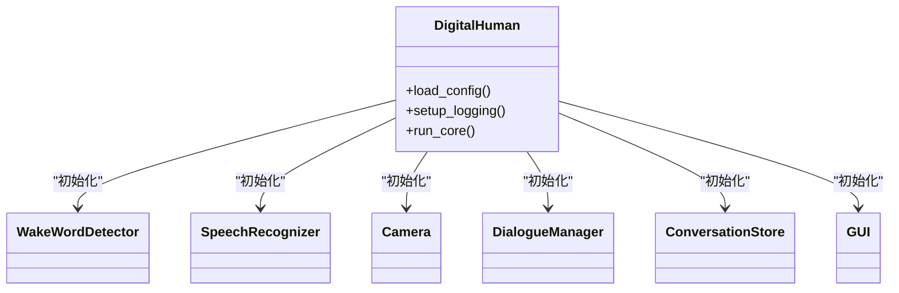
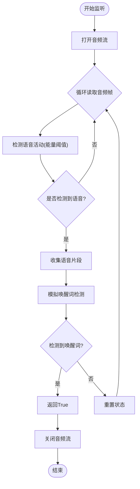
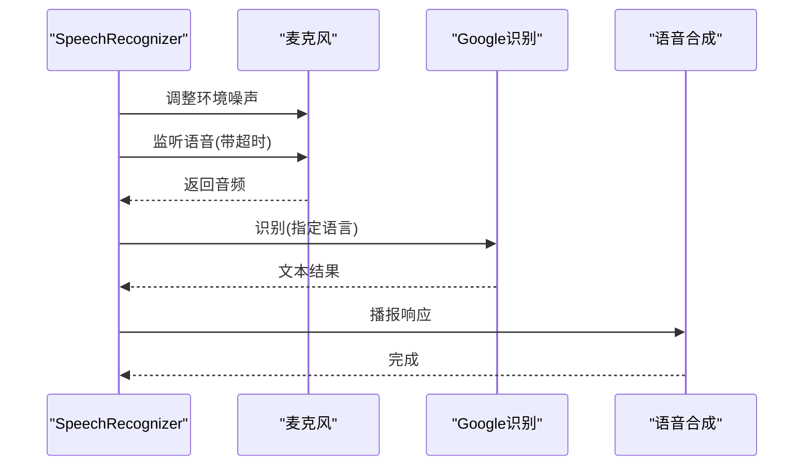
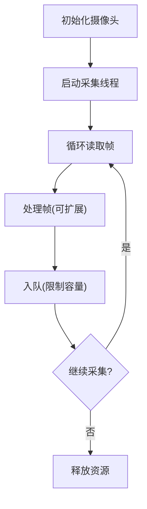
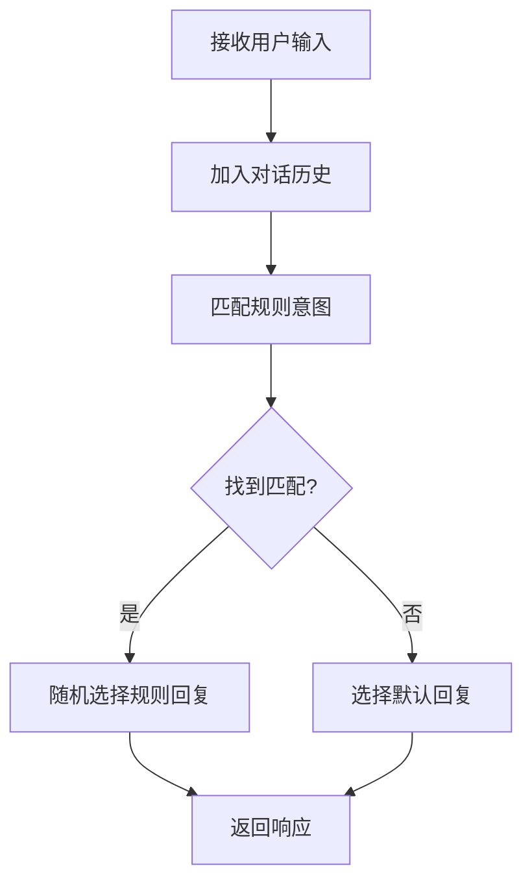
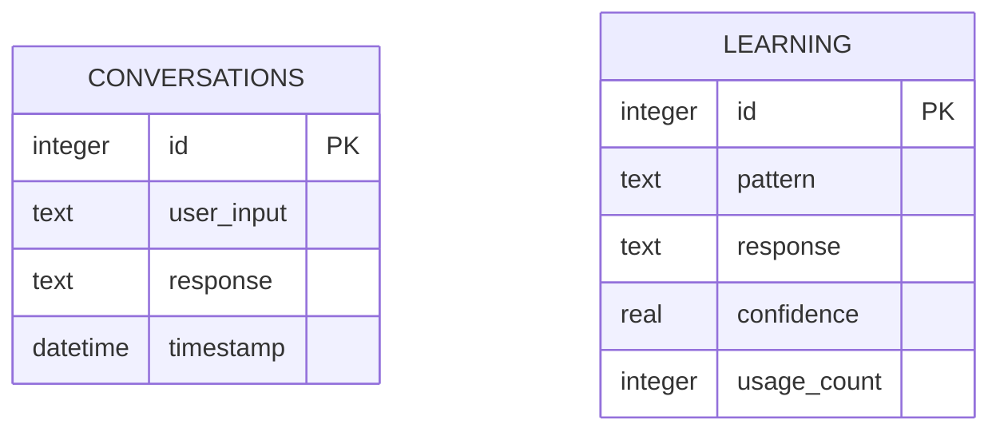
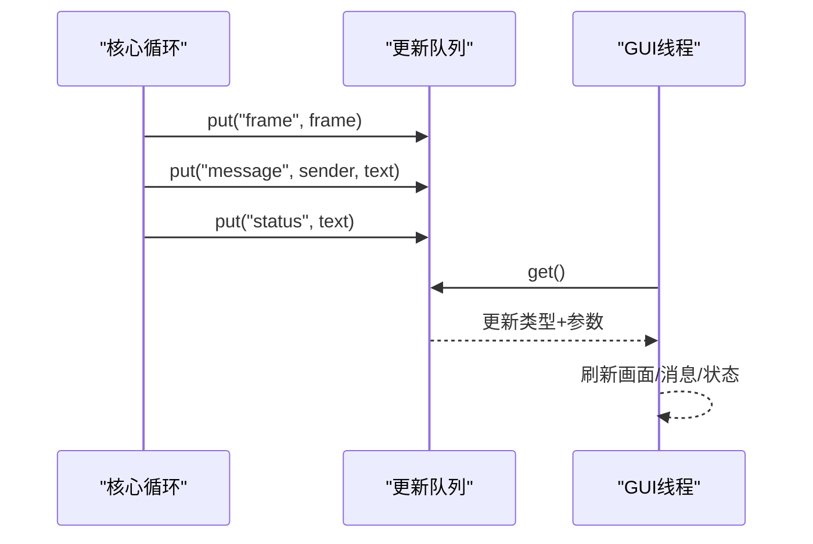

# 快速开始

<cite>
**本文引用的文件列表**
- [requirements.txt](file://requirements.txt)
- [config.yaml](file://config.yaml)
- [main.py](file://main.py)
- [src/audio/speech_recognition.py](file://src/audio/speech_recognition.py)
- [src/audio/wake_word.py](file://src/audio/wake_word.py)
- [src/video/camera.py](file://src/video/camera.py)
- [src/nlp/dialogue_manager.py](file://src/nlp/dialogue_manager.py)
- [src/database/conversation_store.py](file://src/database/conversation_store.py)
- [src/ui/gui.py](file://src/ui/gui.py)
</cite>

## 目录
1. [简介](#简介)
2. [项目结构](#项目结构)
3. [核心组件](#核心组件)
4. [架构总览](#架构总览)
5. [详细组件分析](#详细组件分析)
6. [依赖与安装](#依赖与安装)
7. [配置与首次运行](#配置与首次运行)
8. [系统启动验证](#系统启动验证)
9. [性能与优化建议](#性能与优化建议)
10. [故障排除清单](#故障排除清单)
11. [结论](#结论)

## 简介
本指南面向首次接触 Python 数字人系统的用户，目标是在最短时间内完成环境准备、依赖安装、系统配置与首次运行，体验核心功能（语音唤醒、语音识别、对话生成、视频显示、语音播报与对话持久化）。文档同时提供多操作系统安装方案、常见问题排查与调试技巧，帮助快速定位并解决问题。

## 项目结构
该系统采用模块化设计，核心入口为主程序，围绕“音频（唤醒词/语音识别/语音合成）”、“视频（摄像头采集）”、“自然语言处理（对话管理）”、“数据库（对话存储与学习）”、“图形界面（GUI）”五大模块协同工作。

图表来源
- [main.py:118-138](file://main.py#L118-L138)
- [src/audio/wake_word.py:13-32](file://src/audio/wake_word.py#L13-L32)
- [src/audio/speech_recognition.py:12-28](file://src/audio/speech_recognition.py#L12-L28)
- [src/video/camera.py:12-26](file://src/video/camera.py#L12-L26)
- [src/nlp/dialogue_manager.py:12-24](file://src/nlp/dialogue_manager.py#L12-L24)
- [src/database/conversation_store.py:12-23](file://src/database/conversation_store.py#L12-L23)
- [src/ui/gui.py:16-35](file://src/ui/gui.py#L16-L35)

章节来源
- [main.py:118-138](file://main.py#L118-L138)

## 核心组件
- 数字人系统类负责加载配置、初始化各子模块、协调运行流程与资源清理。
- 音频子系统包括唤醒词检测、语音识别与语音合成。
- 视频子系统负责摄像头采集与帧队列管理。
- NLP 子系统提供基于规则的对话管理与历史维护。
- 数据库存储对话记录与学习模式，支持查询与清理。
- GUI 提供摄像头画面展示、对话历史显示与系统状态提示。

章节来源
- [main.py:21-40](file://main.py#L21-L40)
- [src/audio/wake_word.py:13-32](file://src/audio/wake_word.py#L13-L32)
- [src/audio/speech_recognition.py:12-28](file://src/audio/speech_recognition.py#L12-L28)
- [src/video/camera.py:12-26](file://src/video/camera.py#L12-L26)
- [src/nlp/dialogue_manager.py:12-24](file://src/nlp/dialogue_manager.py#L12-L24)
- [src/database/conversation_store.py:12-23](file://src/database/conversation_store.py#L12-L23)
- [src/ui/gui.py:16-35](file://src/ui/gui.py#L16-L35)

## 架构总览
系统采用“主程序驱动 + 多模块协作”的架构。主程序在主线程初始化 GUI 并在后台线程运行核心循环；各子模块通过配置文件解耦，统一由主程序调度。

图表来源
- [main.py:60-117](file://main.py#L60-L117)
- [src/audio/wake_word.py:42-98](file://src/audio/wake_word.py#L42-L98)
- [src/audio/speech_recognition.py:46-85](file://src/audio/speech_recognition.py#L46-L85)
- [src/nlp/dialogue_manager.py:62-73](file://src/nlp/dialogue_manager.py#L62-L73)
- [src/database/conversation_store.py:53-66](file://src/database/conversation_store.py#L53-L66)
- [src/video/camera.py:27-49](file://src/video/camera.py#L27-L49)
- [src/ui/gui.py:62-82](file://src/ui/gui.py#L62-L82)

## 详细组件分析

### 主程序 DigitalHuman 类
- 负责加载配置、设置日志、初始化各子模块、启动核心循环与资源清理。
- 核心循环持续检测唤醒词、处理语音识别、生成对话响应、更新 GUI、播放语音与刷新摄像头画面。

图表来源
- [main.py:21-40](file://main.py#L21-L40)
- [main.py:60-117](file://main.py#L60-L117)

章节来源
- [main.py:21-40](file://main.py#L21-L40)
- [main.py:60-117](file://main.py#L60-L117)

### 唤醒词检测 WakeWordDetector
- 使用 PyAudio 采集音频流，按能量阈值判断语音活动，模拟唤醒词检测。
- 可扩展为加载 TFLite 模型进行端侧唤醒词识别。

图表来源
- [src/audio/wake_word.py:42-98](file://src/audio/wake_word.py#L42-L98)

章节来源
- [src/audio/wake_word.py:13-32](file://src/audio/wake_word.py#L13-L32)
- [src/audio/wake_word.py:42-98](file://src/audio/wake_word.py#L42-L98)

### 语音识别 SpeechRecognizer
- 使用 SpeechRecognition 的麦克风输入与 Google Web Speech API 进行中文识别。
- 使用 pyttsx3 进行文本转语音播报，自动选择中文语音。

图表来源
- [src/audio/speech_recognition.py:46-85](file://src/audio/speech_recognition.py#L46-L85)

章节来源
- [src/audio/speech_recognition.py:12-28](file://src/audio/speech_recognition.py#L12-L28)
- [src/audio/speech_recognition.py:46-85](file://src/audio/speech_recognition.py#L46-L85)

### 摄像头 Camera
- 使用 OpenCV 启动摄像头，开启独立线程采集帧，使用队列缓存最新帧。
- 提供帧处理接口，便于后续加入人脸识别、表情识别等扩展。

图表来源
- [src/video/camera.py:27-49](file://src/video/camera.py#L27-L49)
- [src/video/camera.py:55-73](file://src/video/camera.py#L55-L73)

章节来源
- [src/video/camera.py:12-26](file://src/video/camera.py#L12-L26)
- [src/video/camera.py:27-49](file://src/video/camera.py#L27-L49)
- [src/video/camera.py:55-73](file://src/video/camera.py#L55-L73)

### 对话管理 DialogueManager
- 基于规则的对话系统，内置问候、自我介绍、天气、时间、帮助、再见等意图。
- 维护对话历史，未匹配时返回默认随机回复。

图表来源
- [src/nlp/dialogue_manager.py:62-73](file://src/nlp/dialogue_manager.py#L62-L73)
- [src/nlp/dialogue_manager.py:75-94](file://src/nlp/dialogue_manager.py#L75-L94)

章节来源
- [src/nlp/dialogue_manager.py:12-24](file://src/nlp/dialogue_manager.py#L12-L24)
- [src/nlp/dialogue_manager.py:62-73](file://src/nlp/dialogue_manager.py#L62-L73)
- [src/nlp/dialogue_manager.py:75-94](file://src/nlp/dialogue_manager.py#L75-L94)

### 数据库存储 ConversationStore
- 使用 SQLite 存储对话记录与学习模式，支持保存、查询、学习与清理。
- 学习机制基于近期对话，统计相似模式与使用次数，提升后续响应质量。

图表来源
- [src/database/conversation_store.py:24-51](file://src/database/conversation_store.py#L24-L51)

章节来源
- [src/database/conversation_store.py:12-23](file://src/database/conversation_store.py#L12-L23)
- [src/database/conversation_store.py:53-66](file://src/database/conversation_store.py#L53-L66)
- [src/database/conversation_store.py:82-125](file://src/database/conversation_store.py#L82-L125)

### 图形界面 GUI
- 使用 Tkinter 构建窗口，左侧显示摄像头画面，右侧显示对话历史与状态。
- 通过队列异步更新画面与消息，保证 UI 流畅。

图表来源
- [src/ui/gui.py:83-98](file://src/ui/gui.py#L83-L98)
- [src/ui/gui.py:122-127](file://src/ui/gui.py#L122-L127)
- [src/ui/gui.py:138-142](file://src/ui/gui.py#L138-L142)
- [src/ui/gui.py:151-155](file://src/ui/gui.py#L151-L155)

章节来源
- [src/ui/gui.py:16-35](file://src/ui/gui.py#L16-L35)
- [src/ui/gui.py:83-98](file://src/ui/gui.py#L83-L98)
- [src/ui/gui.py:122-127](file://src/ui/gui.py#L122-L127)
- [src/ui/gui.py:138-142](file://src/ui/gui.py#L138-L142)
- [src/ui/gui.py:151-155](file://src/ui/gui.py#L151-L155)

## 依赖与安装

### 环境要求
- Python 版本：建议使用 Python 3.8 及以上版本。
- 操作系统：Windows、macOS、Linux 均可运行。
- 音频设备：麦克风与扬声器正常工作。
- 摄像头：可访问的 USB 摄像头或内置摄像头。

### 依赖安装
- 推荐使用虚拟环境隔离依赖：
  - Windows: python -m venv venv && venv\Scripts\activate
  - macOS/Linux: python3 -m venv venv && source venv/bin/activate
- 安装依赖：
  - pip install -r requirements.txt
- 如需升级 pip：
  - python -m pip install --upgrade pip

章节来源
- [requirements.txt:1-27](file://requirements.txt#L1-L27)

### 依赖说明
- 核心库：NumPy、SciPy
- 语音处理：SpeechRecognition、PyAudio、pyttsx3
- 视频处理：OpenCV-Python
- 自然语言处理：NLTK、spaCy
- 机器学习：TensorFlow、PyTorch（按需）
- 其他：psutil、PyYAML

章节来源
- [requirements.txt:1-27](file://requirements.txt#L1-L27)

### 多操作系统安装要点
- Windows
  - 若安装 PyAudio 或 TensorFlow 出现编译问题，可先安装 Microsoft C++ Build Tools 或使用预编译 wheel。
  - 语音识别依赖 Google Web Speech API，需网络连接。
- macOS
  - 若遇到音频相关问题，确认系统权限中允许应用访问麦克风。
  - 安装 OpenCV 时如遇问题，可使用 Homebrew 安装依赖后再 pip 安装。
- Linux
  - Ubuntu/Debian：sudo apt-get install portaudio19-dev python3-pyaudio
  - CentOS/RHEL/Fedora：sudo dnf install alsa-lib-devel python3-pyaudio
  - 安装 OpenCV：pip install opencv-python

## 配置与首次运行

### 配置文件 config.yaml
- 语音唤醒：模型路径、敏感度、音频阈值
- 语音识别：语言、超时、短语时长限制
- 视频：摄像头索引、分辨率、帧率
- NLP：模型路径、历史长度
- 数据库：SQLite 文件路径
- 系统：日志级别、最大响应数、响应延迟

章节来源
- [config.yaml:1-35](file://config.yaml#L1-L35)

### 首次运行步骤
- 确认配置文件路径正确且可读写。
- 启动系统：python main.py
- 等待 GUI 初始化完成，观察摄像头画面与状态栏提示。
- 说出唤醒词（如“你好”），等待系统进入对话状态。
- 对系统说话，体验语音识别与响应播报。
- 在右侧对话区查看历史记录。
- 退出时按关闭按钮，系统会自动清理资源。

章节来源
- [main.py:118-138](file://main.py#L118-L138)
- [src/ui/gui.py:62-82](file://src/ui/gui.py#L62-L82)

## 系统启动验证

### 启动流程验证
- GUI 正常弹窗，标题为“数字人系统”，尺寸适配。
- 摄像头画面正常显示，状态栏显示“等待唤醒…”。
- 唤醒词检测线程启动，日志输出“正在监听唤醒词…”。
- 语音识别线程启动，日志输出“请说话…”。
- 对话管理器初始化完成，历史为空。
- 数据库文件创建成功，表结构初始化。

章节来源
- [src/ui/gui.py:62-82](file://src/ui/gui.py#L62-L82)
- [src/video/camera.py:27-49](file://src/video/camera.py#L27-L49)
- [src/audio/wake_word.py:42-98](file://src/audio/wake_word.py#L42-L98)
- [src/audio/speech_recognition.py:46-85](file://src/audio/speech_recognition.py#L46-L85)
- [src/database/conversation_store.py:24-51](file://src/database/conversation_store.py#L24-L51)

### 基本功能测试
- 唤醒词测试：说出“你好”等唤醒词，观察状态切换为“对话中”。
- 语音识别测试：对麦克风说话，确认识别文本出现在对话区。
- 对话响应测试：系统应返回规则或默认回复。
- 语音播报测试：系统应播报响应内容。
- 摄像头测试：画面应实时更新，无卡顿或黑屏。
- 数据持久化测试：关闭系统后重启，对话历史仍可查询。

章节来源
- [main.py:74-101](file://main.py#L74-L101)
- [src/database/conversation_store.py:67-80](file://src/database/conversation_store.py#L67-L80)

## 性能与优化建议
- CPU 占用控制：主循环使用小延迟，避免过度占用。
- 队列容量：摄像头帧队列限制为固定容量，避免内存膨胀。
- 日志级别：生产环境可调整为更高日志级别减少 IO。
- 语音识别：合理设置超时与短语时长，平衡准确度与响应速度。
- 摄像头参数：根据硬件能力调整分辨率与帧率，避免过高的计算压力。

章节来源
- [main.py:108-109](file://main.py#L108-L109)
- [src/video/camera.py:24](file://src/video/camera.py#L24)
- [config.yaml:32-35](file://config.yaml#L32-L35)
- [config.yaml:10-14](file://config.yaml#L10-L14)
- [config.yaml:15-21](file://config.yaml#L15-L21)

## 故障排除清单

### 常见问题与解决
- 无法打开摄像头
  - 检查摄像头索引与权限，尝试更换索引或关闭占用摄像头的应用。
  - 章节来源: [src/video/camera.py:38-41](file://src/video/camera.py#L38-L41)
- 语音识别失败
  - 确认麦克风权限与静音状态，网络连通性良好。
  - 调整识别语言与超时参数。
  - 章节来源: [src/audio/speech_recognition.py:54-76](file://src/audio/speech_recognition.py#L54-L76)
- 唤醒词检测不稳定
  - 调整音频阈值与敏感度，或替换为更稳定的唤醒词模型。
  - 章节来源: [src/audio/wake_word.py:17-18](file://src/audio/wake_word.py#L17-L18)
- GUI 画面不更新
  - 检查更新队列是否阻塞，确认 GUI 线程正常运行。
  - 章节来源: [src/ui/gui.py:83-98](file://src/ui/gui.py#L83-L98)
- 数据库写入失败
  - 检查数据库路径权限，确认 SQLite 文件可写。
  - 章节来源: [src/database/conversation_store.py:16](file://src/database/conversation_store.py#L16)

### 调试技巧
- 查看日志文件 digital_human.log，定位异常发生点。
- 临时提高日志级别，获取更多上下文信息。
- 分模块单独运行，验证各组件独立工作能力。
- 使用最小化配置启动，逐步增加功能以定位问题。

章节来源
- [main.py:47-58](file://main.py#L47-L58)
- [config.yaml:32-35](file://config.yaml#L32-L35)

## 结论
通过本快速开始指南，您可以在本地完成环境准备、依赖安装与系统配置，并在几分钟内体验数字人的核心功能。若遇到问题，请参考故障排除清单与调试技巧，结合日志与最小化验证逐步定位。随着对系统理解加深，可进一步扩展唤醒词模型、引入更丰富的 NLP 能力与图像处理功能。