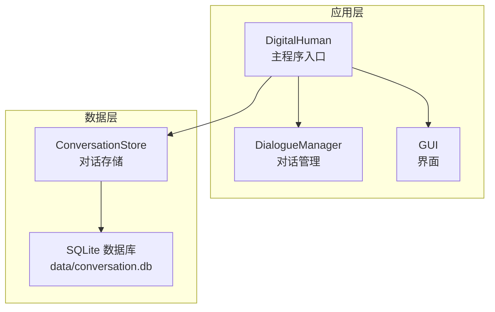
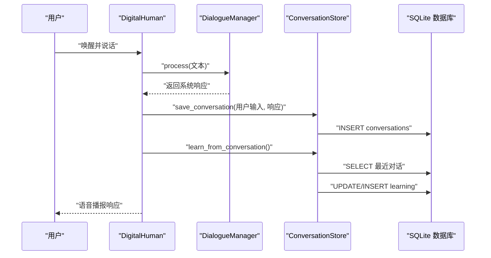
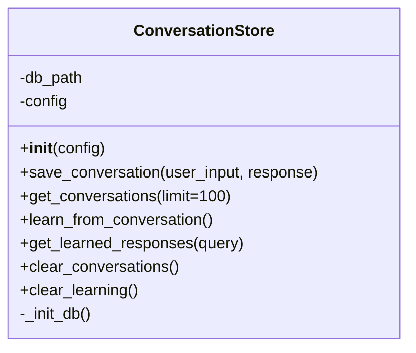
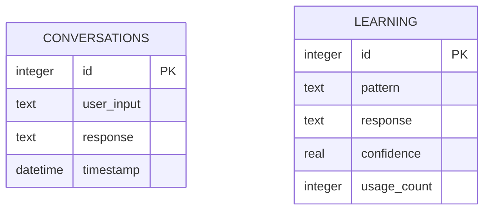
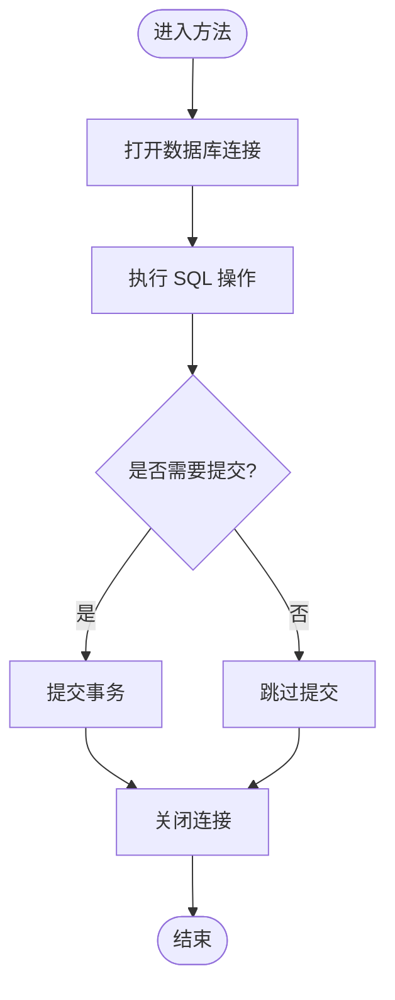
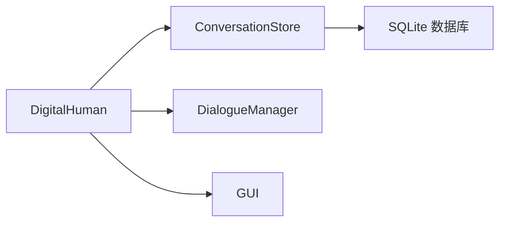
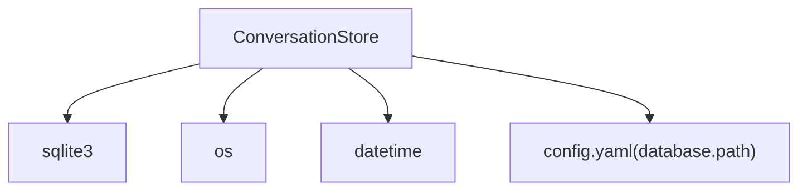

# 数据存储模块

<cite>
**本文引用的文件列表**
- [conversation_store.py](file://src/database/conversation_store.py)
- [config.yaml](file://config.yaml)
- [main.py](file://main.py)
- [dialogue_manager.py](file://src/nlp/dialogue_manager.py)
- [requirements.txt](file://requirements.txt)
</cite>

## 目录
1. [简介](#简介)
2. [项目结构](#项目结构)
3. [核心组件](#核心组件)
4. [架构总览](#架构总览)
5. [详细组件分析](#详细组件分析)
6. [依赖关系分析](#依赖关系分析)
7. [性能考量](#性能考量)
8. [故障排查指南](#故障排查指南)
9. [结论](#结论)
10. [附录](#附录)

## 简介
本文件聚焦于数据存储模块中的 ConversationStore 对话存储系统，系统性阐述其设计思路、SQLite 数据库架构与数据持久化策略，并结合实际代码路径给出可操作的使用说明、参数与返回值定义、与其他组件的集成关系、常见问题与优化建议。目标是让初学者能够快速上手，同时为有经验的开发者提供足够的技术深度。

## 项目结构
数据存储模块位于 src/database 目录，核心文件为 conversation_store.py；数据库路径由 config.yaml 中的 database 配置项提供；在主程序 main.py 中，DigitalHuman 类在初始化时注入数据库配置并创建 ConversationStore 实例，随后在对话流程中调用其持久化与学习能力。

图表来源
- [main.py:34](file://main.py#L34)
- [conversation_store.py:12-22](file://src/database/conversation_store.py#L12-L22)
- [config.yaml:28-29](file://config.yaml#L28-L29)

章节来源
- [main.py:21-39](file://main.py#L21-L39)
- [config.yaml:27-35](file://config.yaml#L27-L35)

## 核心组件
- ConversationStore：封装 SQLite 数据库的初始化、CRUD 操作、学习机制与清理功能。
- 配置项 database.path：决定 SQLite 文件的绝对或相对路径，默认指向 data/conversation.db。
- 主程序集成：DigitalHuman 在构造阶段读取配置并创建 ConversationStore 实例，随后在每次对话生成响应后进行持久化与学习。

关键职责
- 初始化数据库与表结构（conversations、learning）。
- 提供保存对话、查询历史、学习模式、查询学习结果、清空历史等接口。
- 保证数据库目录存在，避免首次运行时报错。

章节来源
- [conversation_store.py:12-22](file://src/database/conversation_store.py#L12-L22)
- [config.yaml:28-29](file://config.yaml#L28-L29)
- [main.py:34](file://main.py#L34)

## 架构总览
对话存储系统采用“轻量级本地数据库 + 轻量级学习”的架构：
- 使用 Python 标准库 sqlite3，零外部依赖。
- 以 conversations 表记录用户输入与系统响应及时间戳；以 learning 表记录模式与置信度、使用次数。
- 在对话流程中，每轮对话结束后写入 conversations，并触发 learn_from_conversation 进行模式学习。

图表来源
- [main.py:85-92](file://main.py#L85-L92)
- [conversation_store.py:53-66](file://src/database/conversation_store.py#L53-L66)
- [conversation_store.py:82-125](file://src/database/conversation_store.py#L82-L125)

## 详细组件分析

### ConversationStore 类
- 设计要点
  - 单例式数据库连接：每个方法内部打开/关闭连接，避免跨线程共享连接带来的竞态。
  - 表结构清晰：conversations 记录对话明细；learning 记录学习模式与置信度。
  - 学习机制：基于最近对话的模糊匹配，更新已有模式置信度或新增模式。
- 关键方法与行为
  - 初始化：确保数据库目录存在并创建表。
  - 保存对话：插入一条记录，包含用户输入、响应与时间戳。
  - 查询历史：按时间倒序返回指定条数的历史记录。
  - 学习：从最近若干条对话中提取模式，更新置信度与使用次数。
  - 查询学习结果：根据输入模糊匹配返回高置信度响应。
  - 清理：清空对话或学习表。

图表来源
- [conversation_store.py:12-158](file://src/database/conversation_store.py#L12-L158)

章节来源
- [conversation_store.py:12-52](file://src/database/conversation_store.py#L12-L52)
- [conversation_store.py:53-80](file://src/database/conversation_store.py#L53-L80)
- [conversation_store.py:82-125](file://src/database/conversation_store.py#L82-L125)
- [conversation_store.py:127-140](file://src/database/conversation_store.py#L127-L140)
- [conversation_store.py:142-158](file://src/database/conversation_store.py#L142-L158)

### 数据库表结构
- conversations 表
  - 字段：id（自增主键）、user_input（用户输入文本）、response（系统响应文本）、timestamp（时间戳）。
  - 用途：记录完整的对话历史，支持按时间倒序查询。
- learning 表
  - 字段：id（自增主键）、pattern（模式文本，用于模糊匹配）、response（对应响应）、confidence（置信度，0~1）、usage_count（使用次数）。
  - 用途：存储从对话中学习到的模式，便于后续相似输入时优先返回高置信度响应。

图表来源
- [conversation_store.py:29-48](file://src/database/conversation_store.py#L29-L48)

章节来源
- [conversation_store.py:29-48](file://src/database/conversation_store.py#L29-L48)

### CRUD 与查询流程
- 保存对话（save_conversation）
  - 打开连接 -> 插入记录 -> 提交事务 -> 关闭连接。
- 获取历史（get_conversations）
  - 打开连接 -> 查询并限制数量 -> 返回结果集 -> 关闭连接。
- 学习（learn_from_conversation）
  - 打开连接 -> 查询最近对话 -> 遍历并模糊匹配学习表 -> 更新或插入 -> 提交事务 -> 关闭连接。
- 查询学习结果（get_learned_responses）
  - 打开连接 -> 模糊匹配学习表 -> 按置信度排序 -> 返回前 N 条 -> 关闭连接。
- 清理（clear_conversations/clear_learning）
  - 打开连接 -> DELETE -> 提交事务 -> 关闭连接。

图表来源
- [conversation_store.py:53-66](file://src/database/conversation_store.py#L53-L66)
- [conversation_store.py:67-80](file://src/database/conversation_store.py#L67-L80)
- [conversation_store.py:82-125](file://src/database/conversation_store.py#L82-L125)
- [conversation_store.py:127-140](file://src/database/conversation_store.py#L127-L140)
- [conversation_store.py:142-158](file://src/database/conversation_store.py#L142-L158)

章节来源
- [conversation_store.py:53-158](file://src/database/conversation_store.py#L53-L158)

### 与系统其他组件的关系
- DigitalHuman（主程序）
  - 在构造阶段读取 config.yaml 并创建 ConversationStore 实例。
  - 在每次对话循环中，先调用 DialogueManager 生成响应，再调用 ConversationStore 保存与学习。
- DialogueManager（对话管理）
  - 负责规则匹配与响应生成，不直接访问数据库，但其输出作为 ConversationStore 的输入。
- GUI（界面）
  - 展示对话内容，与 ConversationStore 无直接耦合，但受对话流程影响。

图表来源
- [main.py:34](file://main.py#L34)
- [main.py:85-92](file://main.py#L85-L92)
- [dialogue_manager.py:62-73](file://src/nlp/dialogue_manager.py#L62-L73)

章节来源
- [main.py:21-39](file://main.py#L21-L39)
- [main.py:85-92](file://main.py#L85-L92)
- [dialogue_manager.py:12-24](file://src/nlp/dialogue_manager.py#L12-L24)

## 依赖关系分析
- 内部依赖
  - ConversationStore 依赖 Python 标准库 sqlite3、os、datetime。
  - 通过 config.yaml 的 database.path 获取数据库文件路径。
- 外部依赖
  - requirements.txt 中未显式声明 sqlite3，因其为 Python 标准库，无需安装。
- 组件耦合
  - ConversationStore 与 DigitalHuman 强耦合（构造时注入配置），与 DialogueManager 无直接耦合，仅通过数据流耦合。

图表来源
- [conversation_store.py:8-10](file://src/database/conversation_store.py#L8-L10)
- [config.yaml:28-29](file://config.yaml#L28-L29)

章节来源
- [requirements.txt:22-23](file://requirements.txt#L22-L23)
- [conversation_store.py:8-10](file://src/database/conversation_store.py#L8-L10)
- [config.yaml:28-29](file://config.yaml#L28-L29)

## 性能考量
- 连接策略
  - 每个方法内打开/关闭连接，避免跨线程共享连接导致的并发问题，但频繁打开/关闭会带来一定开销。若系统并发较高，可考虑在类级别维护连接池或复用连接。
- 查询限制
  - get_conversations 默认限制 100 条，避免一次性加载过多历史造成内存压力。可根据业务需求调整 limit。
- 学习范围
  - learn_from_conversation 仅分析最近 10 条对话，控制学习成本。若需要更强的学习能力，可扩大分析窗口，但需权衡性能。
- 索引建议
  - conversations.timestamp 已用于排序，建议在高频查询字段上建立索引（如 pattern 或 timestamp），以提升模糊匹配与排序性能。
- I/O 优化
  - 将频繁使用的查询结果缓存至内存（如最近 N 条学习结果），减少数据库访问频率。

## 故障排查指南
- 数据库文件无法创建或权限不足
  - 现象：初始化时报错或无法写入。
  - 排查：确认 database.path 指向的目录存在且具备写权限；确保程序运行目录正确。
  - 参考路径：[conversation_store.py:18-22](file://src/database/conversation_store.py#L18-L22)，[config.yaml:28-29](file://config.yaml#L28-L29)
- 查询结果为空
  - 现象：get_conversations 返回空列表。
  - 排查：确认是否已保存过对话；检查 limit 是否过大；核对数据库文件路径是否正确。
  - 参考路径：[conversation_store.py:67-80](file://src/database/conversation_store.py#L67-L80)
- 学习未生效
  - 现象：get_learned_responses 未返回预期结果。
  - 排查：确认已调用 learn_from_conversation；检查 pattern 是否与输入足够相似；确认最近对话确实被写入。
  - 参考路径：[conversation_store.py:82-125](file://src/database/conversation_store.py#L82-L125)，[conversation_store.py:127-140](file://src/database/conversation_store.py#L127-L140)
- 清理后仍显示旧数据
  - 现象：调用 clear_conversations 或 clear_learning 后，历史或学习数据仍然可见。
  - 排查：确认调用的是正确的清理方法；检查是否在同次会话中再次查询；确认数据库文件未被其他进程占用。
  - 参考路径：[conversation_store.py:142-158](file://src/database/conversation_store.py#L142-L158)

## 结论
ConversationStore 以最小的外部依赖实现了完整的对话存储与基础学习能力，满足数字人系统在本地持久化与轻量学习的需求。通过清晰的表结构与简洁的 API，开发者可以快速扩展功能，如引入索引、连接池、批量写入与更复杂的模式匹配算法。建议在生产环境中结合业务规模评估性能瓶颈，并针对性地进行优化。

## 附录

### 配置项与参数
- database.path
  - 类型：字符串
  - 作用：指定 SQLite 数据库文件路径
  - 默认值：data/conversation.db
  - 示例路径：data/conversation.db
  - 参考路径：[config.yaml:28-29](file://config.yaml#L28-L29)

### 方法与返回值
- save_conversation(user_input, response)
  - 输入：用户输入文本、系统响应文本
  - 返回：无
  - 参考路径：[conversation_store.py:53-66](file://src/database/conversation_store.py#L53-L66)
- get_conversations(limit=100)
  - 输入：limit（历史条数上限，默认 100）
  - 返回：历史记录列表（包含 id、user_input、response、timestamp）
  - 参考路径：[conversation_store.py:67-80](file://src/database/conversation_store.py#L67-L80)
- learn_from_conversation()
  - 输入：无
  - 返回：无
  - 参考路径：[conversation_store.py:82-125](file://src/database/conversation_store.py#L82-L125)
- get_learned_responses(query)
  - 输入：查询文本
  - 返回：高置信度响应列表（包含 response、confidence）
  - 参考路径：[conversation_store.py:127-140](file://src/database/conversation_store.py#L127-L140)
- clear_conversations()
  - 输入：无
  - 返回：无
  - 参考路径：[conversation_store.py:142-149](file://src/database/conversation_store.py#L142-L149)
- clear_learning()
  - 输入：无
  - 返回：无
  - 参考路径：[conversation_store.py:151-158](file://src/database/conversation_store.py#L151-L158)

### 与主程序的集成点
- DigitalHuman 在构造阶段注入数据库配置并创建 ConversationStore 实例。
- 在对话循环中，每轮对话结束后调用 save_conversation 与 learn_from_conversation。
- 参考路径：
  - [main.py:34](file://main.py#L34)
  - [main.py:85-92](file://main.py#L85-L92)