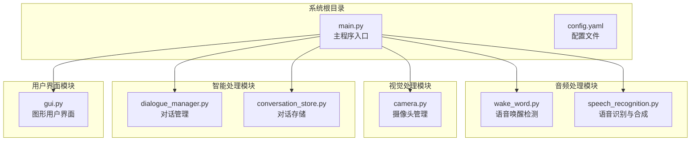
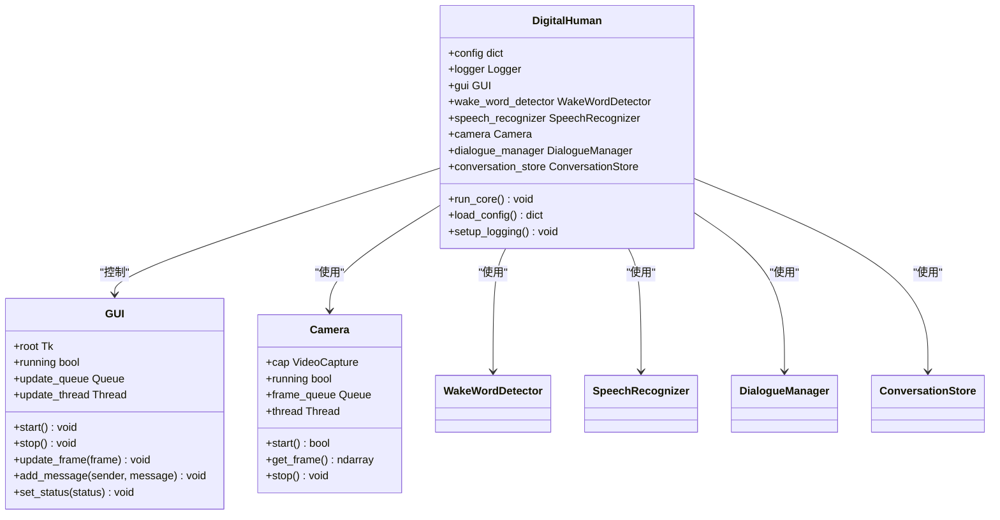
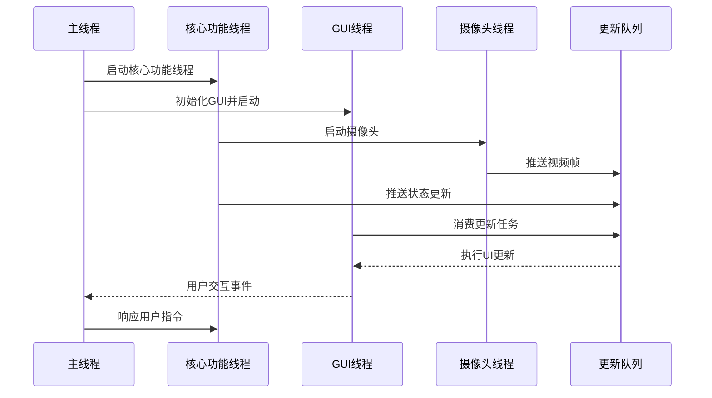
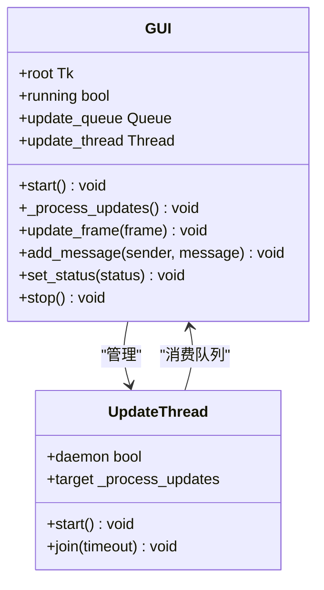
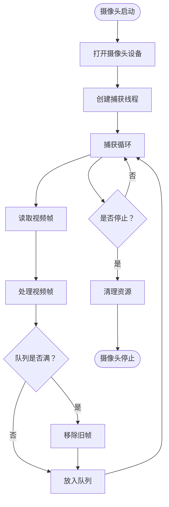
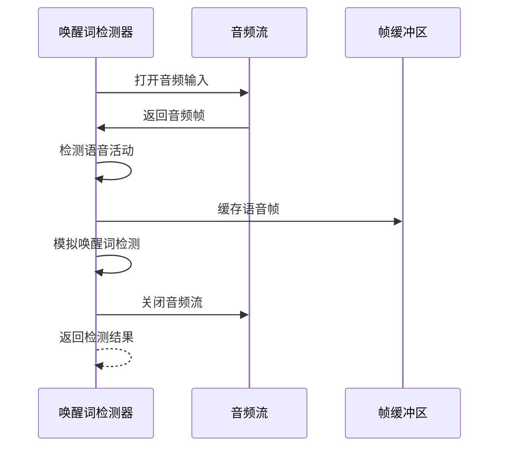
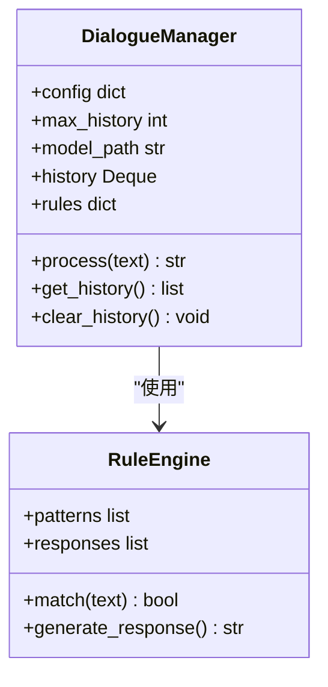
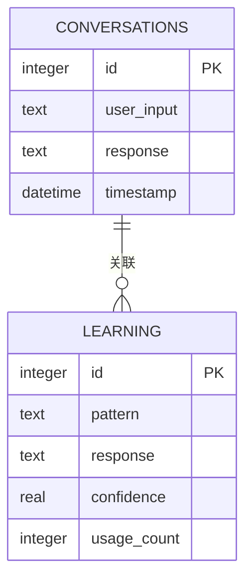
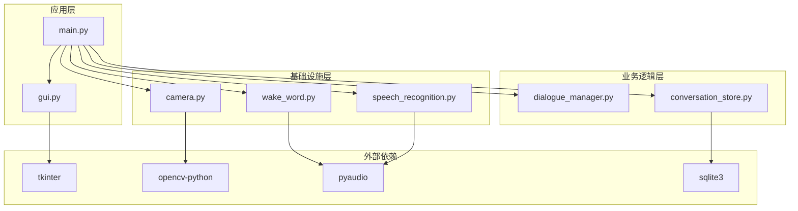

# 多线程架构

<cite>
**本文档引用的文件**
- [main.py](file://main.py)
- [gui.py](file://src/ui/gui.py)
- [speech_recognition.py](file://src/audio/speech_recognition.py)
- [wake_word.py](file://src/audio/wake_word.py)
- [camera.py](file://src/video/camera.py)
- [dialogue_manager.py](file://src/nlp/dialogue_manager.py)
- [conversation_store.py](file://src/database/conversation_store.py)
- [config.yaml](file://config.yaml)
</cite>

## 目录
1. [引言](#引言)
2. [项目结构](#项目结构)
3. [核心组件](#核心组件)
4. [架构概览](#架构概览)
5. [详细组件分析](#详细组件分析)
6. [依赖关系分析](#依赖关系分析)
7. [性能考量](#性能考量)
8. [故障排除指南](#故障排除指南)
9. [结论](#结论)

## 引言

本文件详细阐述数字人系统的多线程架构设计。该系统采用"核心功能线程 + GUI线程"的双线程架构模式，实现了音频处理、视频采集、自然语言处理和用户界面的高效并发执行。系统通过队列通信机制确保线程间的数据传递，通过资源管理策略保证线程安全和系统稳定性。

## 项目结构

数字人系统采用模块化的文件组织结构，每个功能模块都有独立的线程管理策略：

**图表来源**
- [main.py:118-138](file://main.py#L118-L138)
- [config.yaml:1-35](file://config.yaml#L1-35)

**章节来源**
- [main.py:1-138](file://main.py#L1-L138)
- [config.yaml:1-35](file://config.yaml#L1-L35)

## 核心组件

### 主程序架构

数字人系统的核心架构围绕两个主要线程展开：

1. **核心功能线程**：负责音频唤醒检测、语音识别、对话处理和数据库操作
2. **GUI线程**：负责用户界面渲染和用户交互

**图表来源**
- [main.py:21-40](file://main.py#L21-L40)
- [gui.py:16-35](file://src/ui/gui.py#L16-L35)
- [camera.py:12-26](file://src/video/camera.py#L12-L26)

### 线程分工策略

系统采用明确的线程分工原则：

- **GUI线程**：仅负责UI渲染和用户交互，不执行任何耗时操作
- **核心功能线程**：处理所有计算密集型任务，包括音频处理、视频处理和AI推理
- **后台线程**：摄像头捕获线程、GUI更新线程等专用线程

**章节来源**
- [main.py:125-138](file://main.py#L125-L138)
- [gui.py:62-82](file://src/ui/gui.py#L62-L82)
- [camera.py:27-54](file://src/video/camera.py#L27-L54)

## 架构概览

数字人系统的整体架构采用生产者-消费者模式，通过队列实现线程间通信：

**图表来源**
- [main.py:125-138](file://main.py#L125-L138)
- [gui.py:83-98](file://src/ui/gui.py#L83-L98)
- [camera.py:55-73](file://src/video/camera.py#L55-L73)

### 线程间通信机制

系统采用多种通信机制确保线程协作：

1. **队列通信**：GUI更新队列用于跨线程UI更新
2. **共享状态**：通过对象属性共享运行状态
3. **回调机制**：GUI事件回调处理用户输入

**章节来源**
- [gui.py:33-34](file://src/ui/gui.py#L33-L34)
- [gui.py:83-98](file://src/ui/gui.py#L83-L98)
- [camera.py:24](file://src/video/camera.py#L24)

## 详细组件分析

### GUI模块多线程设计

GUI模块采用双线程架构确保界面响应性：

**图表来源**
- [gui.py:16-35](file://src/ui/gui.py#L16-L35)
- [gui.py:62-72](file://src/ui/gui.py#L62-L72)

#### GUI线程生命周期管理

GUI线程采用优雅的生命周期管理模式：

1. **启动阶段**：初始化主窗口和更新队列
2. **运行阶段**：主循环处理用户事件，后台线程处理队列更新
3. **停止阶段**：设置运行标志，等待线程退出，销毁窗口

**章节来源**
- [gui.py:62-82](file://src/ui/gui.py#L62-L82)
- [gui.py:157-170](file://src/ui/gui.py#L157-L170)

### 摄像头模块线程设计

摄像头模块采用生产者-消费者模式：

**图表来源**
- [camera.py:55-73](file://src/video/camera.py#L55-L73)
- [camera.py:89-94](file://src/video/camera.py#L89-L94)

#### 摄像头线程同步机制

摄像头线程通过以下机制确保数据一致性：

1. **队列容量控制**：使用最大容量队列防止内存溢出
2. **先进先出策略**：丢弃最旧帧，保证实时性
3. **线程安全访问**：队列操作天然线程安全

**章节来源**
- [camera.py:24](file://src/video/camera.py#L24)
- [camera.py:64-72](file://src/video/camera.py#L64-L72)

### 语音唤醒模块线程设计

语音唤醒模块采用阻塞式监听模式：

**图表来源**
- [wake_word.py:42-98](file://src/audio/wake_word.py#L42-L98)

#### 唤醒词检测算法

唤醒词检测采用基于能量的简单算法：

1. **语音活动检测**：基于音频能量阈值判断
2. **帧缓冲管理**：维护语音片段的连续帧
3. **唤醒词模拟**：使用概率模型模拟检测结果

**章节来源**
- [wake_word.py:33-41](file://src/audio/wake_word.py#L33-L41)
- [wake_word.py:100-104](file://src/audio/wake_word.py#L100-L104)

### 对话管理系统

对话管理系统采用基于规则的简单AI模型：

**图表来源**
- [dialogue_manager.py:12-24](file://src/nlp/dialogue_manager.py#L12-L24)
- [dialogue_manager.py:75-94](file://src/nlp/dialogue_manager.py#L75-L94)

#### 对话历史管理

对话历史采用双端队列实现：

1. **固定长度限制**：通过maxlen参数限制历史长度
2. **自动清理**：超出长度时自动移除最旧记录
3. **线程安全**：deque操作在单线程环境下安全

**章节来源**
- [dialogue_manager.py:19-21](file://src/nlp/dialogue_manager.py#L19-L21)
- [dialogue_manager.py:96-102](file://src/nlp/dialogue_manager.py#L96-L102)

### 数据库存储模块

数据库模块采用SQLite实现持久化存储：

**图表来源**
- [conversation_store.py:29-48](file://src/database/conversation_store.py#L29-L48)

#### 数据库事务管理

数据库操作采用标准的事务模式：

1. **连接管理**：每次操作建立独立连接
2. **自动提交**：操作完成后立即提交
3. **异常处理**：确保连接正确关闭

**章节来源**
- [conversation_store.py:53-66](file://src/database/conversation_store.py#L53-L66)
- [conversation_store.py:82-125](file://src/database/conversation_store.py#L82-L125)

## 依赖关系分析

系统各模块间的依赖关系呈现清晰的层次结构：

**图表来源**
- [main.py:14-19](file://main.py#L14-L19)
- [gui.py:8-14](file://src/ui/gui.py#L8-L14)
- [camera.py:8-10](file://src/video/camera.py#L8-L10)

### 线程耦合度分析

系统通过以下策略降低模块间耦合：

1. **接口隔离**：每个模块暴露简洁的接口
2. **数据封装**：内部状态通过方法访问
3. **事件驱动**：通过队列实现松耦合通信

**章节来源**
- [main.py:60-117](file://main.py#L60-L117)
- [gui.py:122-155](file://src/ui/gui.py#L122-L155)

## 性能考量

### 线程池使用策略

当前系统未使用线程池，而是采用直接线程创建模式。这种设计的优势在于：

1. **简单性**：每个功能模块独立管理自己的线程
2. **可控性**：可以精确控制线程生命周期
3. **资源效率**：避免不必要的线程复用开销

### 队列管理优化

系统采用多种队列策略：

1. **固定容量队列**：摄像头队列限制为10帧，防止内存溢出
2. **优先级队列**：GUI更新队列按接收顺序处理
3. **非阻塞访问**：使用get_nowait()避免线程阻塞

### 并发控制机制

系统通过以下机制控制并发访问：

1. **队列同步**：Python Queue天然支持线程安全
2. **状态标志**：使用running标志控制线程生命周期
3. **超时机制**：线程join设置超时防止无限等待

**章节来源**
- [camera.py:24](file://src/video/camera.py#L24)
- [gui.py:87-95](file://src/ui/gui.py#L87-L95)
- [main.py:115](file://main.py#L115)

## 故障排除指南

### 常见线程问题及解决方案

#### 线程死锁预防

系统通过以下策略避免死锁：

1. **单一职责**：每个线程只负责特定任务
2. **无锁通信**：使用队列而非共享锁
3. **超时控制**：所有阻塞操作设置超时

#### 资源泄漏防护

系统采用多重资源清理机制：

1. **上下文管理**：音频流使用with语句管理
2. **finally块**：确保清理代码总是执行
3. **析构函数**：Python对象析构函数清理资源

**章节来源**
- [wake_word.py:91-98](file://src/audio/wake_word.py#L91-L98)
- [speech_recognition.py:86-89](file://src/audio/speech_recognition.py#L86-L89)
- [camera.py:96-106](file://src/video/camera.py#L96-L106)

### 异常处理策略

系统采用分层异常处理：

1. **模块内处理**：每个模块处理自身异常
2. **传播策略**：严重错误向上抛出
3. **日志记录**：所有异常都记录到日志文件

**章节来源**
- [main.py:111-116](file://main.py#L111-L116)
- [gui.py:79-98](file://src/ui/gui.py#L79-L98)

## 结论

数字人系统采用的多线程架构设计体现了良好的软件工程实践：

1. **清晰的职责分离**：GUI线程专注于用户交互，核心线程处理计算密集型任务
2. **高效的通信机制**：通过队列实现松耦合的线程间通信
3. **稳健的资源管理**：完善的生命周期管理和异常处理机制
4. **可扩展的设计**：模块化架构便于功能扩展和性能优化

该架构为后续的功能扩展（如深度学习模型集成、更复杂的音频处理算法）提供了良好的基础，同时保持了系统的稳定性和响应性。