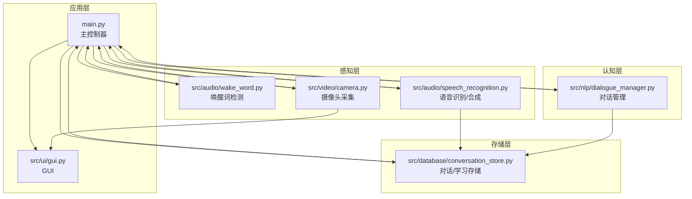
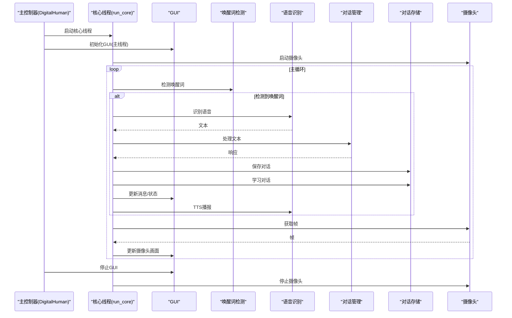
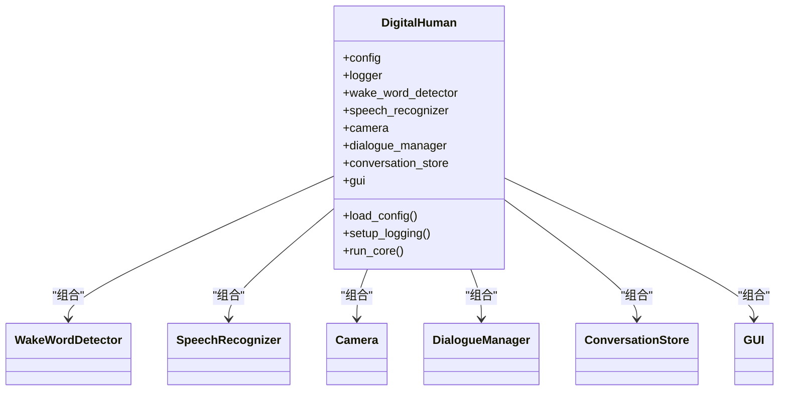
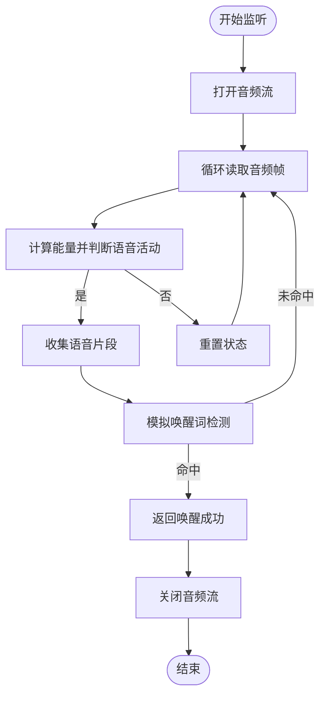
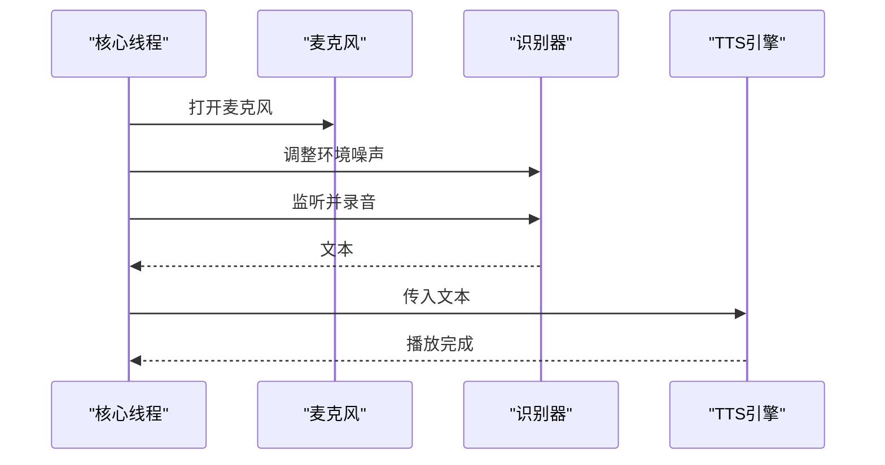
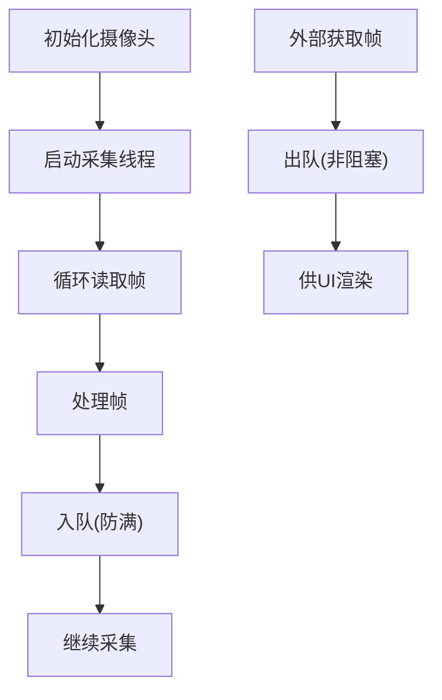
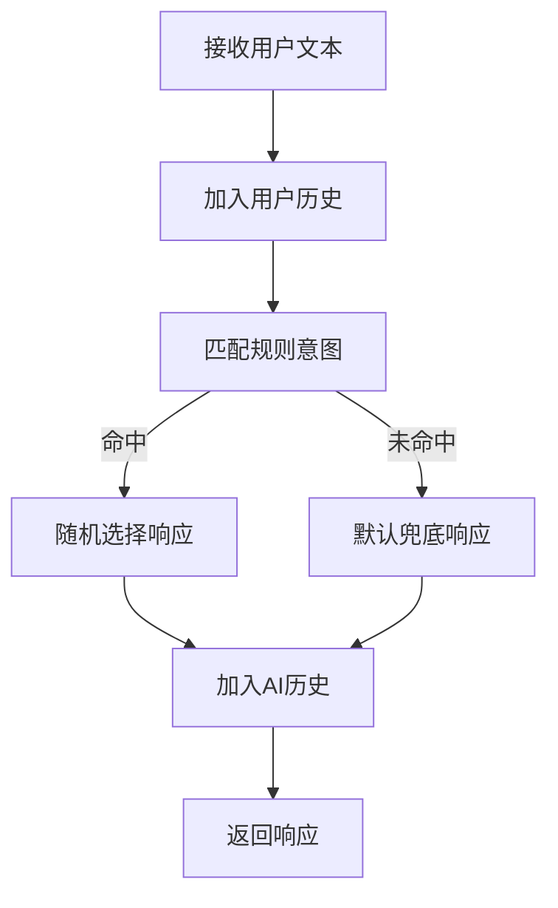
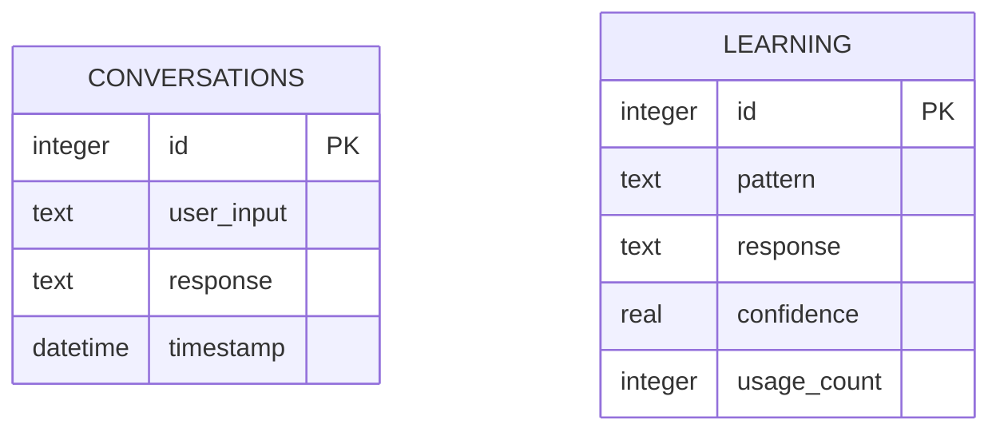
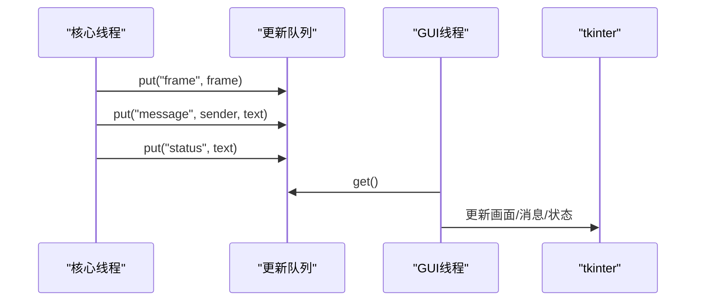
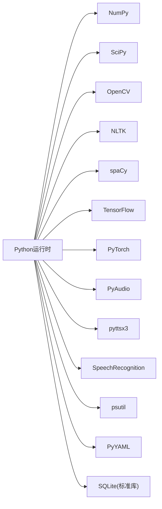

# 核心架构

<cite>
**本文档引用的文件**
- [main.py](file://main.py)
- [config.yaml](file://config.yaml)
- [requirements.txt](file://requirements.txt)
- [src/nlp/dialogue_manager.py](file://src/nlp/dialogue_manager.py)
- [src/audio/speech_recognition.py](file://src/audio/speech_recognition.py)
- [src/video/camera.py](file://src/video/camera.py)
- [src/database/conversation_store.py](file://src/database/conversation_store.py)
- [src/ui/gui.py](file://src/ui/gui.py)
- [src/audio/wake_word.py](file://src/audio/wake_word.py)
</cite>

## 目录
1. [引言](#引言)
2. [项目结构](#项目结构)
3. [核心组件](#核心组件)
4. [架构总览](#架构总览)
5. [详细组件分析](#详细组件分析)
6. [依赖关系分析](#依赖关系分析)
7. [性能考量](#性能考量)
8. [故障排查指南](#故障排查指南)
9. [结论](#结论)
10. [附录](#附录)

## 引言
本文件面向数字人系统的核心架构文档，聚焦于高层设计、架构模式与组件边界，系统性阐述DigitalHuman主控制器的设计理念、模块间通信机制与多线程架构实现；同时覆盖数据流向、集成模式、技术决策与权衡、基础设施需求、可扩展性与部署拓扑，并补充安全性、监控与灾难恢复等横切关注点，以及技术栈、第三方依赖与版本兼容性。

## 项目结构
系统采用按功能域分层的模块化组织方式：
- 主入口负责系统生命周期与线程协调
- 功能模块按职责划分：音频（唤醒词、语音识别/合成）、视频（摄像头采集与处理）、自然语言处理（对话管理）、数据库（对话与学习数据持久化）、UI（GUI与跨线程更新队列）

图表来源
- [main.py:21-138](file://main.py#L21-L138)
- [src/ui/gui.py:16-170](file://src/ui/gui.py#L16-L170)
- [src/audio/wake_word.py:13-109](file://src/audio/wake_word.py#L13-L109)
- [src/audio/speech_recognition.py:12-89](file://src/audio/speech_recognition.py#L12-L89)
- [src/video/camera.py:12-106](file://src/video/camera.py#L12-L106)
- [src/nlp/dialogue_manager.py:12-102](file://src/nlp/dialogue_manager.py#L12-L102)
- [src/database/conversation_store.py:12-158](file://src/database/conversation_store.py#L12-L158)

章节来源
- [main.py:118-138](file://main.py#L118-L138)
- [config.yaml:1-35](file://config.yaml#L1-L35)

## 核心组件
- DigitalHuman主控制器：集中初始化各子模块、协调线程、驱动主循环、统一日志与资源清理
- 唤醒词检测器：基于音频流的简单能量阈值检测，模拟唤醒词触发
- 语音识别器：基于麦克风的语音转文本，支持中文识别与TTS合成
- 摄像头采集器：后台线程采集帧，带环形队列缓冲，供UI渲染
- 对话管理器：基于规则的意图匹配与响应生成，维护对话历史
- 对话存储器：SQLite持久化对话与学习数据，提供查询与学习更新
- GUI：基于tkinter的图形界面，使用更新队列保证线程安全更新

章节来源
- [main.py:21-117](file://main.py#L21-L117)
- [src/audio/wake_word.py:13-109](file://src/audio/wake_word.py#L13-L109)
- [src/audio/speech_recognition.py:12-89](file://src/audio/speech_recognition.py#L12-L89)
- [src/video/camera.py:12-106](file://src/video/camera.py#L12-L106)
- [src/nlp/dialogue_manager.py:12-102](file://src/nlp/dialogue_manager.py#L12-L102)
- [src/database/conversation_store.py:12-158](file://src/database/conversation_store.py#L12-L158)
- [src/ui/gui.py:16-170](file://src/ui/gui.py#L16-L170)

## 架构总览
系统采用“主控制器+多线程并发”的架构模式：
- 主线程负责GUI事件循环
- 核心业务逻辑在独立线程中运行，持续监听唤醒词、处理语音、更新UI与持久化
- 模块间通过同步/异步接口与共享状态（队列/标志）协作
- 日志集中配置，便于运维与排障

图表来源
- [main.py:60-117](file://main.py#L60-L117)
- [src/audio/wake_word.py:42-98](file://src/audio/wake_word.py#L42-L98)
- [src/audio/speech_recognition.py:46-85](file://src/audio/speech_recognition.py#L46-L85)
- [src/nlp/dialogue_manager.py:62-94](file://src/nlp/dialogue_manager.py#L62-L94)
- [src/database/conversation_store.py:53-125](file://src/database/conversation_store.py#L53-L125)
- [src/video/camera.py:27-95](file://src/video/camera.py#L27-L95)
- [src/ui/gui.py:62-98](file://src/ui/gui.py#L62-L98)

## 详细组件分析

### DigitalHuman主控制器
- 设计理念：集中式控制，解耦模块初始化与运行时调度；通过配置驱动模块行为
- 关键职责：
  - 加载配置与日志
  - 初始化各子模块
  - 启动核心线程与GUI线程
  - 统一异常处理与资源清理
- 多线程实现：
  - 核心线程执行主循环，避免阻塞GUI
  - GUI主线程负责事件循环，后台线程处理更新队列
- 数据流与集成：
  - 通过模块接口暴露同步方法与异步更新通道
  - 通过配置文件统一管理参数与路径

图表来源
- [main.py:21-39](file://main.py#L21-L39)
- [main.py:60-117](file://main.py#L60-L117)

章节来源
- [main.py:21-117](file://main.py#L21-L117)

### 唤醒词检测器
- 实现要点：
  - 基于PyAudio采集音频流，按固定帧长读取
  - 使用能量阈值判断语音活动，模拟唤醒词触发
  - 限制缓存长度，避免内存膨胀
- 性能与可靠性：
  - 简化的能量检测，适合演示场景；生产环境建议替换为专用唤醒词模型
  - 流式处理，低延迟唤醒检测

图表来源
- [src/audio/wake_word.py:42-98](file://src/audio/wake_word.py#L42-L98)

章节来源
- [src/audio/wake_word.py:13-109](file://src/audio/wake_word.py#L13-L109)

### 语音识别与合成
- 功能范围：
  - 语音识别：基于麦克风监听，调整环境噪声后进行识别，支持中文
  - 语音合成：TTS引擎输出中文语音
- 错误处理：
  - 超时、未知值、网络请求错误均捕获并返回None
- 性能：
  - 单次识别/合成阻塞操作，适合串行流程控制

图表来源
- [src/audio/speech_recognition.py:46-85](file://src/audio/speech_recognition.py#L46-L85)

章节来源
- [src/audio/speech_recognition.py:12-89](file://src/audio/speech_recognition.py#L12-L89)

### 摄像头采集与处理
- 实现要点：
  - 后台线程采集帧，使用队列缓冲，避免UI卡顿
  - 简单图像处理（示例：加绿色边框），预留扩展空间
  - 提供非阻塞获取帧接口
- 并发与资源：
  - 线程安全的队列，满队列丢弃旧帧策略
  - 正确的停止流程与资源释放

图表来源
- [src/video/camera.py:27-95](file://src/video/camera.py#L27-L95)

章节来源
- [src/video/camera.py:12-106](file://src/video/camera.py#L12-L106)

### 对话管理器
- 实现要点：
  - 基于规则的意图匹配，支持问候、自我介绍、天气、时间、帮助、告别等
  - 维护有限长度的历史队列，支持清空与查询
  - 默认响应兜底，增强鲁棒性
- 可扩展性：
  - 规则结构清晰，易于扩展新意图与响应
  - 可替换为ML/NLU模型，保持对外接口不变

图表来源
- [src/nlp/dialogue_manager.py:62-94](file://src/nlp/dialogue_manager.py#L62-L94)

章节来源
- [src/nlp/dialogue_manager.py:12-102](file://src/nlp/dialogue_manager.py#L12-L102)

### 对话存储器
- 数据模型：
  - conversations：用户输入、AI响应、时间戳
  - learning：模式、响应、置信度、使用次数
- 功能：
  - 保存对话、查询历史、基于近期对话的学习更新、清空数据
- 可扩展性：
  - 支持SQL扩展与索引优化
  - 可接入分布式数据库或向量化检索

图表来源
- [src/database/conversation_store.py:24-51](file://src/database/conversation_store.py#L24-L51)

章节来源
- [src/database/conversation_store.py:12-158](file://src/database/conversation_store.py#L12-L158)

### GUI与跨线程更新
- 实现要点：
  - 主线程运行tkinter事件循环
  - 后台线程处理更新队列，保证UI线程安全更新
  - 支持更新摄像头画面、添加对话消息、设置状态
- 并发与稳定性：
  - 队列非阻塞获取，降低UI卡顿
  - 异常隔离，避免影响主事件循环

图表来源
- [src/ui/gui.py:83-155](file://src/ui/gui.py#L83-L155)

章节来源
- [src/ui/gui.py:16-170](file://src/ui/gui.py#L16-L170)

## 依赖关系分析
- 技术栈与版本：
  - Python生态：NumPy、SciPy、OpenCV、NLTK、spaCy、TensorFlow、PyTorch、PyAudio、pyttsx3、SpeechRecognition、psutil、PyYAML
  - SQLite为Python标准库，无需额外安装
- 模块耦合：
  - 主控制器对各子模块强依赖，但通过接口解耦
  - GUI与核心线程通过队列弱耦合
  - 数据持久化与业务逻辑分离
- 外部依赖风险：
  - PyAudio/TensorFlow/PyTorch等可能需要特定平台编译环境
  - Google Web Speech API依赖网络与认证

图表来源
- [requirements.txt:1-27](file://requirements.txt#L1-L27)

章节来源
- [requirements.txt:1-27](file://requirements.txt#L1-L27)
- [config.yaml:1-35](file://config.yaml#L1-L35)

## 性能考量
- CPU与I/O平衡：
  - 核心循环使用小延迟避免CPU占用过高
  - 摄像头采集与UI更新解耦，减少阻塞
- 缓冲与背压：
  - 摄像头队列上限与丢弃策略，防止内存溢出
  - GUI更新队列非阻塞获取，保障UI流畅
- 模型与算法：
  - 唤醒词检测为简化的能量阈值，适合演示；生产需替换为轻量模型
  - 对话管理器可替换为更强大的NLU/LLM，注意推理延迟与吞吐
- 数据库：
  - SQLite适合本地演示；高并发场景建议迁移到PostgreSQL/MySQL或分布式KV
- 网络与外部API：
  - 语音识别依赖网络，建议增加重试与离线降级策略

## 故障排查指南
- 常见问题定位：
  - 唤醒词检测失败：检查音频设备权限、采样率与阈值配置
  - 语音识别超时/未知：确认麦克风静音、环境噪声、网络连通性
  - GUI卡顿：检查更新队列积压与主线程阻塞
  - 摄像头无法打开：确认设备索引、分辨率与驱动
  - 对话存储异常：检查数据库路径权限与磁盘空间
- 日志与监控：
  - 系统日志集中输出至文件与控制台，便于定位
  - 建议引入结构化日志与指标上报（如Prometheus/OpenTelemetry）
- 安全与合规：
  - 语音与图像数据本地化处理，避免上传敏感信息
  - 对外API调用需配置代理与证书校验
- 灾难恢复：
  - 数据库损坏时可回滚到最近备份
  - GUI崩溃时自动重启核心线程，确保系统可用

章节来源
- [main.py:47-58](file://main.py#L47-L58)
- [src/audio/wake_word.py:91-98](file://src/audio/wake_word.py#L91-L98)
- [src/audio/speech_recognition.py:67-75](file://src/audio/speech_recognition.py#L67-L75)
- [src/video/camera.py:38-53](file://src/video/camera.py#L38-L53)
- [src/database/conversation_store.py:24-51](file://src/database/conversation_store.py#L24-L51)

## 结论
该数字人系统采用“主控制器+多线程并发”的架构，实现了从感知到认知再到呈现的完整闭环。通过模块化设计与配置驱动，系统具备良好的可扩展性与可维护性。建议在生产环境中引入更稳健的唤醒词模型、NLU/LLM与分布式存储，并完善监控、安全与灾备体系，以满足更高可用性与性能要求。

## 附录
- 配置项概览（节选）
  - 唤醒词：模型路径、敏感度、音频阈值
  - 语音识别：语言、超时、短语时长限制
  - 视频：摄像头索引、分辨率、帧率
  - NLP：模型路径、历史长度
  - 数据库：路径
  - 系统：日志级别、最大响应数、响应延迟
- 部署拓扑建议
  - 单机部署：主控制器、GUI、摄像头、麦克风在同一主机
  - 边缘部署：将NLP/ASR迁移至边缘节点，降低网络延迟
  - 容器化：使用Docker封装依赖，Kubernetes编排多副本
- 可扩展方向
  - 增强对话管理：引入Rasa/ChatGLM/通义千问等
  - 图像增强：人脸识别、表情分析、手势识别
  - 多模态融合：结合语音、视觉与文本的统一表示
  - 云原生：可观测性、弹性伸缩、灰度发布

章节来源
- [config.yaml:1-35](file://config.yaml#L1-L35)