# 模块通信机制

<cite>
**本文档引用的文件**
- [main.py](file://main.py)
- [config.yaml](file://config.yaml)
- [src/audio/wake_word.py](file://src/audio/wake_word.py)
- [src/audio/speech_recognition.py](file://src/audio/speech_recognition.py)
- [src/video/camera.py](file://src/video/camera.py)
- [src/nlp/dialogue_manager.py](file://src/nlp/dialogue_manager.py)
- [src/database/conversation_store.py](file://src/database/conversation_store.py)
- [src/ui/gui.py](file://src/ui/gui.py)
</cite>

## 目录
1. [引言](#引言)
2. [项目结构](#项目结构)
3. [核心组件](#核心组件)
4. [架构概览](#架构概览)
5. [详细组件分析](#详细组件分析)
6. [依赖关系分析](#依赖关系分析)
7. [性能考虑](#性能考虑)
8. [故障排除指南](#故障排除指南)
9. [结论](#结论)

## 引言

本文件详细阐述数字人系统的模块通信机制，重点分析主控制器如何协调WakeWordDetector、SpeechRecognizer、Camera、DialogueManager、ConversationStore和GUI模块的工作。该系统采用多线程架构，通过队列和回调机制实现模块间的数据传递和事件处理。

## 项目结构

数字人系统采用分层模块化设计，主要包含以下核心模块：

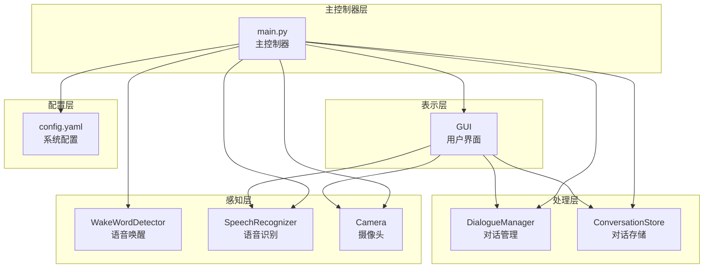

**图表来源**
- [main.py:21-40](file://main.py#L21-L40)
- [config.yaml:1-35](file://config.yaml#L1-L35)

**章节来源**
- [main.py:1-138](file://main.py#L1-L138)
- [config.yaml:1-35](file://config.yaml#L1-L35)

## 核心组件

### 主控制器 DigitalHuman

主控制器是整个系统的协调中心，负责模块初始化、生命周期管理和核心业务流程控制。

**关键职责：**
- 模块初始化和配置加载
- 核心业务流程调度
- 资源清理和异常处理
- 多线程协调管理

**初始化流程：**
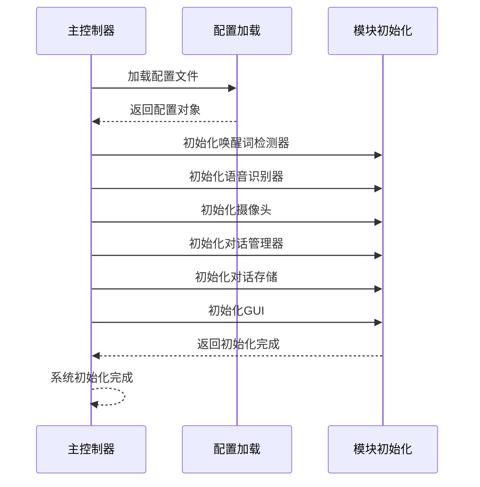

**图表来源**
- [main.py:22-39](file://main.py#L22-L39)

**章节来源**
- [main.py:21-40](file://main.py#L21-L40)

### 配置管理系统

系统配置采用YAML格式，集中管理所有模块的参数设置。

**配置结构：**
- 语音唤醒配置：模型路径、敏感度、音频阈值
- 语音识别配置：语言设置、超时时间、短语限制
- 视频配置：摄像头索引、分辨率、帧率
- NLP配置：模型路径、历史记录长度
- 数据库配置：数据库路径
- 系统配置：日志级别、最大响应数、响应延迟

**章节来源**
- [config.yaml:1-35](file://config.yaml#L1-L35)

## 架构概览

系统采用事件驱动的异步架构，通过多线程实现并发处理：

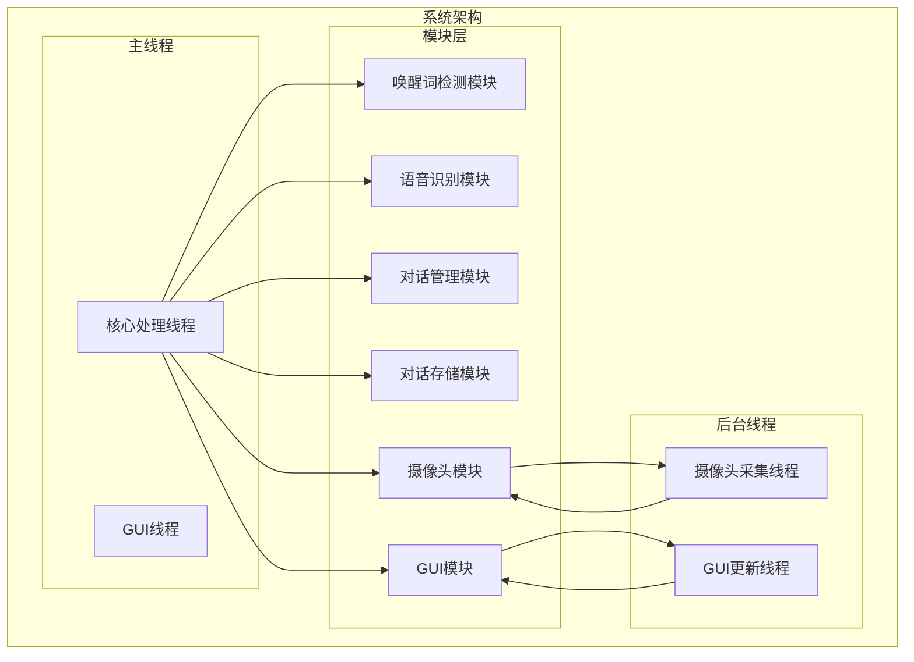

**图表来源**
- [main.py:125-137](file://main.py#L125-L137)
- [src/video/camera.py:44-46](file://src/video/camera.py#L44-L46)
- [src/ui/gui.py:66-68](file://src/ui/gui.py#L66-L68)

## 详细组件分析

### 语音唤醒模块 (WakeWordDetector)

语音唤醒模块负责检测用户的唤醒词，是整个系统交互的触发点。

**核心功能：**
- 音频流采集和预处理
- 语音活动检测 (VAD)
- 唤醒词识别算法
- 资源管理和异常处理

**工作流程：**
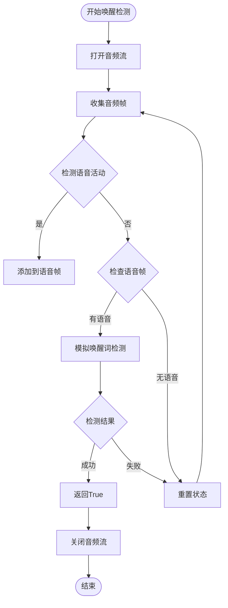

**图表来源**
- [src/audio/wake_word.py:42-98](file://src/audio/wake_word.py#L42-L98)

**线程安全机制：**
- 使用独立的音频流线程
- PyAudio实例的正确初始化和清理
- 异常捕获和资源释放

**章节来源**
- [src/audio/wake_word.py:13-109](file://src/audio/wake_word.py#L13-L109)

### 语音识别模块 (SpeechRecognizer)

语音识别模块负责将用户的语音转换为文本，并将系统响应转换为语音输出。

**核心功能：**
- 麦克风音频采集
- 语音转文本 (STT)
- 文本转语音 (TTS)
- 音频参数配置

**数据流处理：**
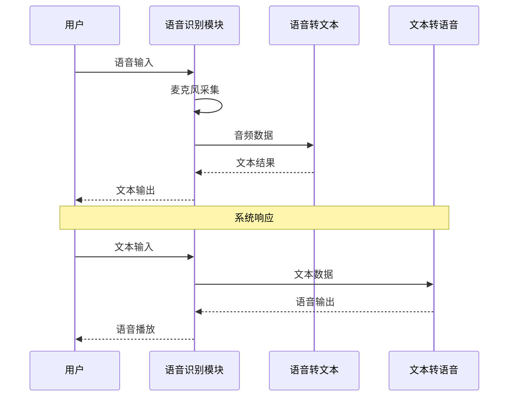

**图表来源**
- [src/audio/speech_recognition.py:46-85](file://src/audio/speech_recognition.py#L46-L85)

**错误处理策略：**
- 超时错误处理 (WaitTimeoutError)
- 未知值错误处理 (UnknownValueError)
- 请求错误处理 (RequestError)
- 异常捕获和日志记录

**章节来源**
- [src/audio/speech_recognition.py:12-89](file://src/audio/speech_recognition.py#L12-L89)

### 摄像头模块 (Camera)

摄像头模块负责视频采集和处理，采用生产者-消费者模式实现高效的数据流管理。

**核心特性：**
- 多线程视频采集
- 环形缓冲区管理
- 实时图像处理
- 资源生命周期管理

**数据结构设计：**
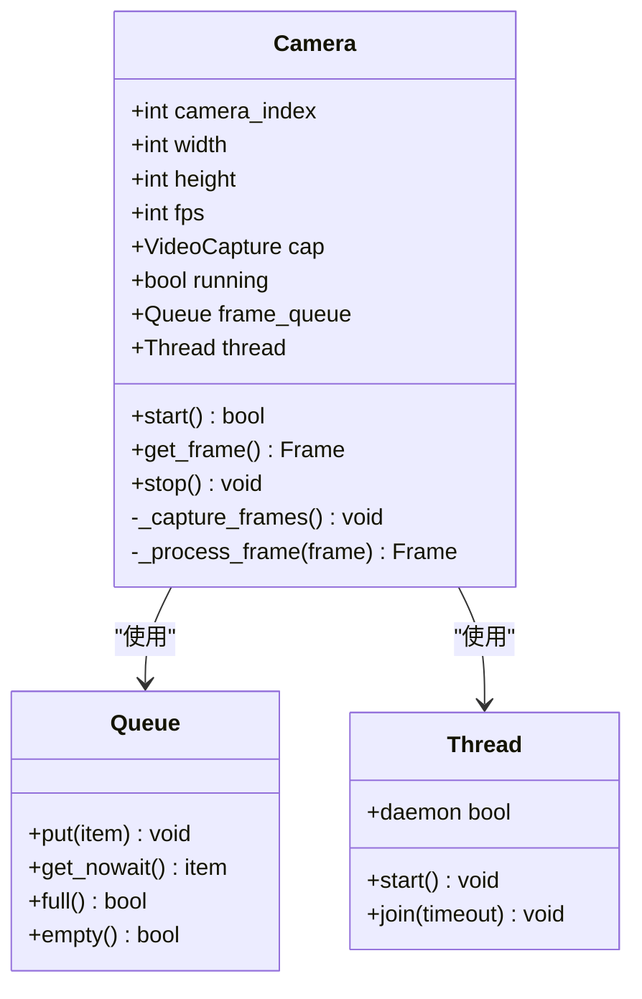

**图表来源**
- [src/video/camera.py:12-106](file://src/video/camera.py#L12-L106)

**线程同步机制：**
- Queue类的内置线程安全保证
- 环形缓冲区的容量控制
- 线程生命周期管理

**章节来源**
- [src/video/camera.py:12-106](file://src/video/camera.py#L12-L106)

### 对话管理模块 (DialogueManager)

对话管理模块实现基于规则的对话处理，支持上下文管理和响应生成。

**核心功能：**
- 对话规则匹配
- 上下文历史管理
- 响应生成算法
- 模式学习能力

**对话处理流程：**
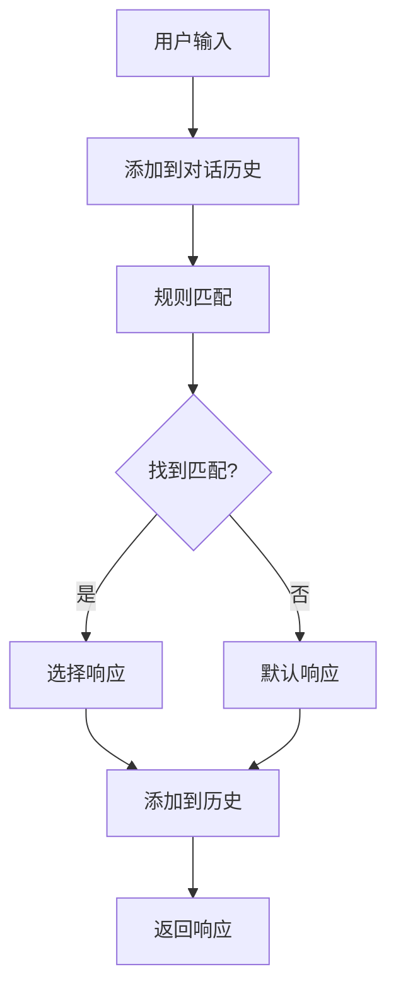

**图表来源**
- [src/nlp/dialogue_manager.py:62-94](file://src/nlp/dialogue_manager.py#L62-L94)

**数据结构优化：**
- 使用deque实现固定长度的历史记录
- 字典结构实现快速规则查找
- 随机选择确保响应多样性

**章节来源**
- [src/nlp/dialogue_manager.py:12-102](file://src/nlp/dialogue_manager.py#L12-L102)

### 对话存储模块 (ConversationStore)

对话存储模块提供持久化存储和机器学习功能，支持对话历史和模式学习。

**数据库设计：**
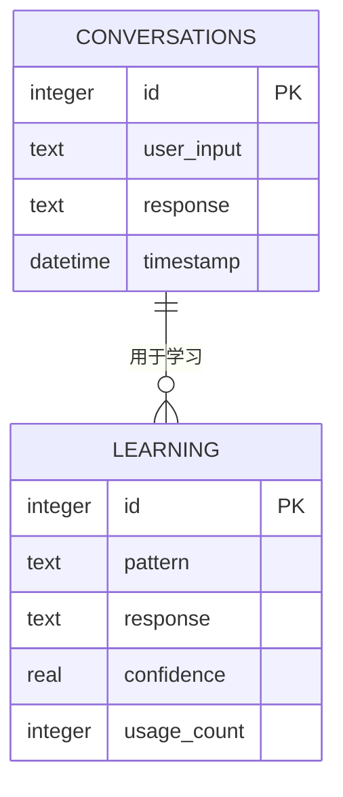

**图表来源**
- [src/database/conversation_store.py:29-48](file://src/database/conversation_store.py#L29-L48)

**学习算法实现：**
- 基于使用频率的学习
- 置信度递增机制
- 模式相似性匹配

**章节来源**
- [src/database/conversation_store.py:12-158](file://src/database/conversation_store.py#L12-L158)

### GUI模块 (GUI)

GUI模块提供用户界面，采用队列驱动的更新机制确保线程安全。

**核心设计：**
- 双线程架构：主线程GUI + 后台更新线程
- 队列驱动的UI更新
- 异步事件处理
- 资源清理和异常处理

**UI更新机制：**
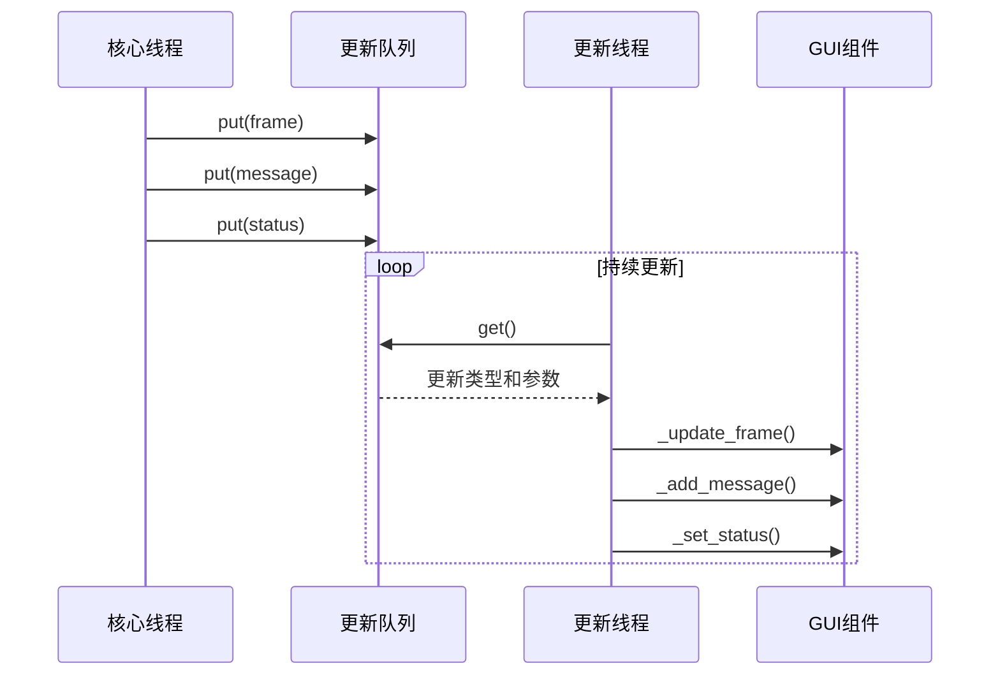

**图表来源**
- [src/ui/gui.py:83-98](file://src/ui/gui.py#L83-L98)

**线程安全保证：**
- Queue类的线程安全特性
- 单一GUI线程更新原则
- 异常隔离和恢复机制

**章节来源**
- [src/ui/gui.py:16-170](file://src/ui/gui.py#L16-L170)

## 依赖关系分析

系统模块间存在清晰的依赖层次和通信模式：

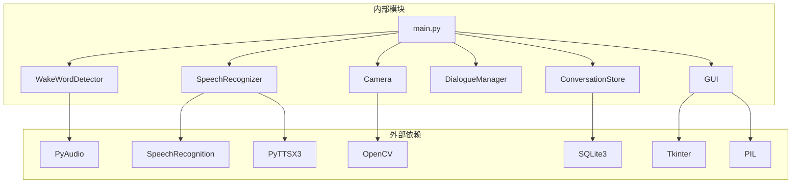

**图表来源**
- [main.py:14-19](file://main.py#L14-L19)
- [src/audio/speech_recognition.py:8-10](file://src/audio/speech_recognition.py#L8-L10)
- [src/video/camera.py:8](file://src/video/camera.py#L8)
- [src/database/conversation_store.py:9](file://src/database/conversation_store.py#L9)
- [src/ui/gui.py:8-12](file://src/ui/gui.py#L8-L12)

**模块耦合度分析：**
- 主控制器与各模块：低耦合，通过接口调用
- 模块间直接通信：最小化，主要通过主控制器协调
- 外部依赖：明确分离，便于替换和升级

**章节来源**
- [main.py:14-19](file://main.py#L14-L19)

## 性能考虑

### 线程池和资源管理

系统采用多线程架构优化性能：

**线程分配策略：**
- 核心处理线程：执行主要业务逻辑
- 摄像头采集线程：独立处理视频流
- GUI更新线程：专门处理UI更新
- 异常处理：每个模块都有独立的异常捕获

**资源优化措施：**
- 队列容量限制防止内存溢出
- 定期清理临时变量和中间结果
- 及时释放音频和视频设备资源
- 日志级别控制减少I/O开销

### 缓冲区管理

**摄像头缓冲区：**
- 最大容量：10帧
- 满时丢弃最旧帧
- 非阻塞获取操作

**对话历史缓冲：**
- 固定长度：10条记录
- 自动清理最旧记录
- 内存友好的双端队列

### 错误传播策略

系统实现了多层次的错误处理机制：

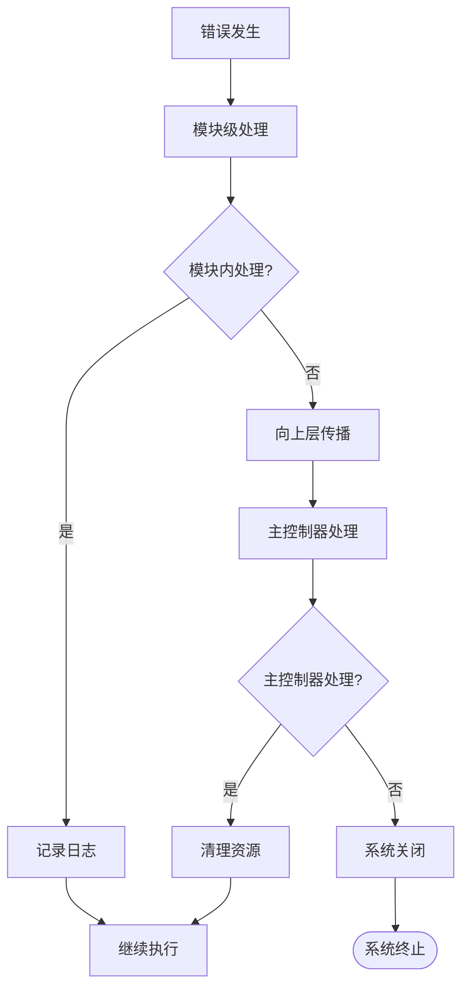

**图表来源**
- [main.py:111-116](file://main.py#L111-L116)

## 故障排除指南

### 常见问题诊断

**音频相关问题：**
- 唤醒词检测失败：检查音频阈值配置和麦克风权限
- 语音识别错误：验证网络连接和Google API访问权限
- 语音合成失败：确认TTS引擎安装和系统音频设置

**视频相关问题：**
- 摄像头无法打开：检查摄像头索引和设备权限
- 图像显示异常：验证OpenCV安装和显示驱动
- 性能问题：调整帧率和分辨率设置

**GUI相关问题：**
- 界面无响应：检查主线程和更新线程的死锁
- 图像显示错误：验证PIL库版本兼容性
- 状态更新失败：检查队列通信机制

### 调试技巧

**日志分析：**
- 启用DEBUG级别日志获取详细信息
- 关注模块初始化顺序和异常堆栈
- 监控资源使用情况和内存泄漏

**性能监控：**
- 使用Python内置性能分析工具
- 监控各模块的处理时间和吞吐量
- 分析线程阻塞和竞争条件

**章节来源**
- [main.py:47-58](file://main.py#L47-L58)
- [src/audio/wake_word.py:91-98](file://src/audio/wake_word.py#L91-L98)
- [src/audio/speech_recognition.py:67-75](file://src/audio/speech_recognition.py#L67-L75)

## 结论

数字人系统的模块通信机制展现了良好的软件工程实践：

**架构优势：**
- 清晰的模块边界和职责分离
- 有效的异步处理和并发控制
- 完善的错误处理和资源管理
- 灵活的配置管理和扩展性

**技术亮点：**
- 多线程架构确保系统响应性
- 队列驱动的通信机制保证线程安全
- 模块化的设计便于维护和测试
- 持久化存储支持智能学习

**改进建议：**
- 引入更高级的唤醒词检测算法
- 实现更复杂的NLP处理能力
- 增加更多的错误恢复机制
- 优化性能监控和调试工具

该系统为构建智能数字人应用提供了坚实的技术基础和清晰的架构指导。