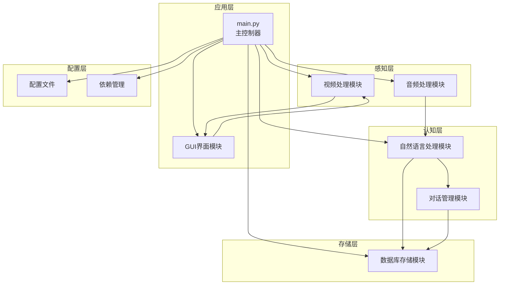
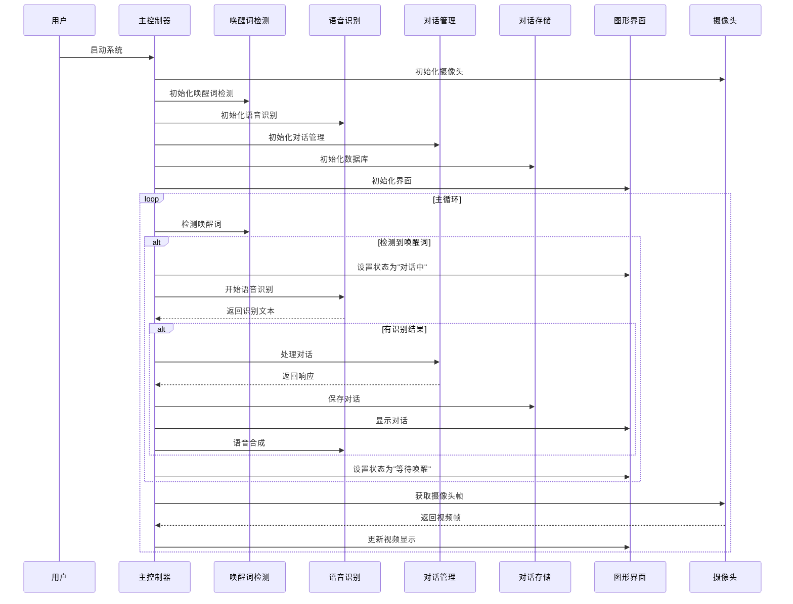
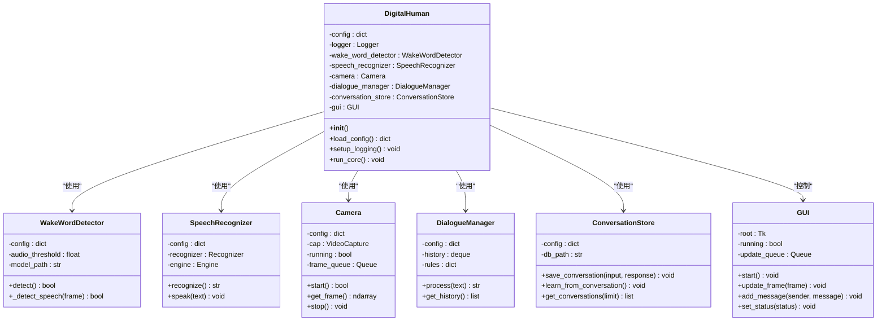
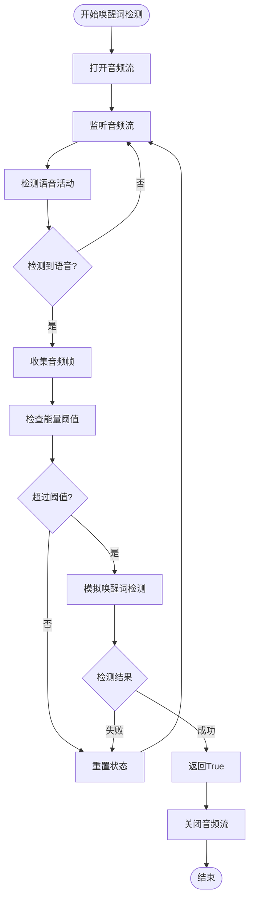
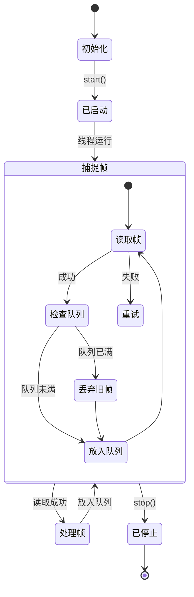
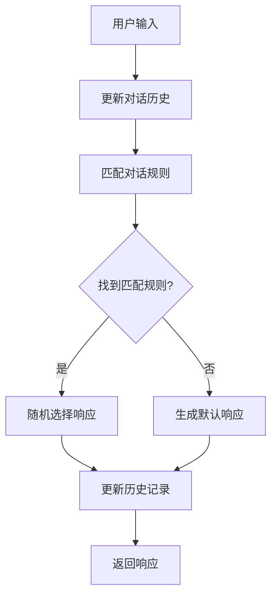
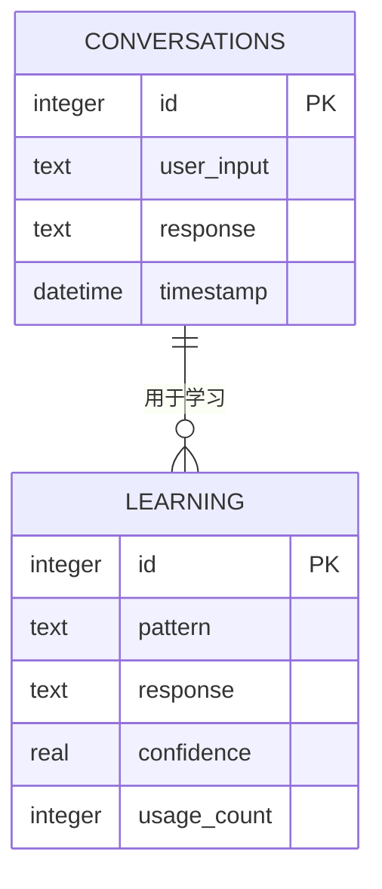
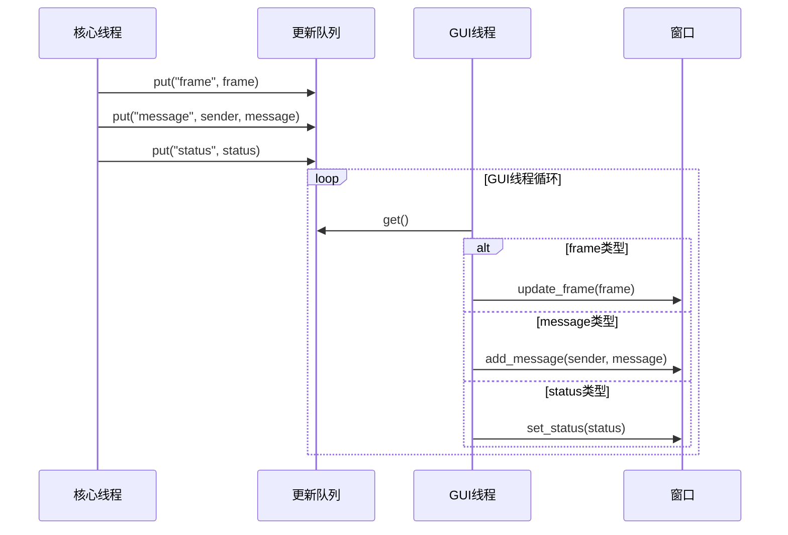
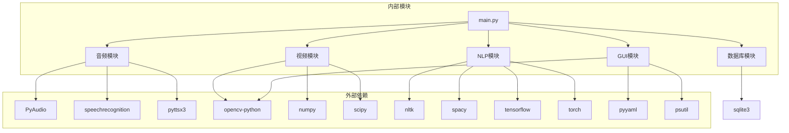

# 系统概览

<cite>
**本文档中引用的文件**
- [main.py](file://main.py)
- [config.yaml](file://config.yaml)
- [requirements.txt](file://requirements.txt)
- [src/audio/speech_recognition.py](file://src/audio/speech_recognition.py)
- [src/audio/wake_word.py](file://src/audio/wake_word.py)
- [src/nlp/dialogue_manager.py](file://src/nlp/dialogue_manager.py)
- [src/database/conversation_store.py](file://src/database/conversation_store.py)
- [src/ui/gui.py](file://src/ui/gui.py)
- [src/video/camera.py](file://src/video/camera.py)
</cite>

## 目录
1. [简介](#简介)
2. [项目结构](#项目结构)
3. [核心组件](#核心组件)
4. [架构总览](#架构总览)
5. [详细组件分析](#详细组件分析)
6. [依赖关系分析](#依赖关系分析)
7. [性能考虑](#性能考虑)
8. [故障排除指南](#故障排除指南)
9. [结论](#结论)

## 简介

数字人系统是一个集成了语音识别、自然语言处理、视频采集和用户界面的综合性人工智能交互系统。该系统旨在为用户提供一个智能化的虚拟助手体验，支持语音唤醒、实时对话、视觉反馈和持续学习能力。

系统采用模块化设计架构，通过清晰的组件分离实现了高度的可维护性和扩展性。每个功能模块都独立封装，通过标准化的接口进行通信，确保了系统的稳定性和可靠性。

## 项目结构

数字人系统采用分层模块化架构，按照功能职责将代码组织为独立的模块：

**图表来源**
- [main.py:21-39](file://main.py#L21-L39)
- [config.yaml:1-35](file://config.yaml#L1-L35)

**章节来源**
- [main.py:118-138](file://main.py#L118-L138)
- [config.yaml:1-35](file://config.yaml#L1-L35)

## 核心组件

数字人系统由以下核心组件构成，每个组件都有明确的职责和接口：

### 主控制器 DigitalHuman
- **职责**: 协调所有子模块的生命周期和工作流程
- **功能**: 初始化各模块、管理主循环、处理异常和资源清理
- **特点**: 单一职责的协调者，不直接执行具体业务逻辑

### 音频处理模块
- **唤醒词检测器**: 实时监听音频流，检测特定唤醒词
- **语音识别器**: 将语音转换为文本，支持中文识别
- **语音合成器**: 将文本转换为语音输出

### 视觉处理模块
- **摄像头管理器**: 管理摄像头设备，提供实时视频流
- **图像处理**: 基础图像处理和预处理功能

### 自然语言处理模块
- **对话管理器**: 基于规则的对话处理和响应生成
- **学习机制**: 从对话历史中提取模式和优化响应

### 数据存储模块
- **对话存储**: 持久化存储对话历史和学习数据
- **SQLite数据库**: 轻量级本地数据库解决方案

**章节来源**
- [main.py:21-39](file://main.py#L21-L39)
- [src/audio/speech_recognition.py:12-28](file://src/audio/speech_recognition.py#L12-L28)
- [src/audio/wake_word.py:13-32](file://src/audio/wake_word.py#L13-L32)
- [src/video/camera.py:12-26](file://src/video/camera.py#L12-L26)
- [src/nlp/dialogue_manager.py:12-24](file://src/nlp/dialogue_manager.py#L12-L24)
- [src/database/conversation_store.py:12-23](file://src/database/conversation_store.py#L12-L23)

## 架构总览

数字人系统采用事件驱动的异步架构，通过线程池和队列机制实现模块间的解耦：

**图表来源**
- [main.py:60-116](file://main.py#L60-L116)
- [src/audio/wake_word.py:42-98](file://src/audio/wake_word.py#L42-L98)
- [src/audio/speech_recognition.py:46-85](file://src/audio/speech_recognition.py#L46-L85)
- [src/nlp/dialogue_manager.py:62-73](file://src/nlp/dialogue_manager.py#L62-L73)
- [src/database/conversation_store.py:53-66](file://src/database/conversation_store.py#L53-L66)
- [src/ui/gui.py:122-155](file://src/ui/gui.py#L122-L155)
- [src/video/camera.py:89-94](file://src/video/camera.py#L89-L94)

## 详细组件分析

### 主控制器 DigitalHuman

主控制器是整个系统的中枢，负责协调各个子模块的工作：

**图表来源**
- [main.py:21-39](file://main.py#L21-L39)
- [src/audio/wake_word.py:13-32](file://src/audio/wake_word.py#L13-L32)
- [src/audio/speech_recognition.py:12-28](file://src/audio/speech_recognition.py#L12-L28)
- [src/video/camera.py:12-26](file://src/video/camera.py#L12-L26)
- [src/nlp/dialogue_manager.py:12-24](file://src/nlp/dialogue_manager.py#L12-L24)
- [src/database/conversation_store.py:12-23](file://src/database/conversation_store.py#L12-L23)
- [src/ui/gui.py:16-35](file://src/ui/gui.py#L16-L35)

#### 核心工作流程

系统的核心工作流程遵循严格的事件驱动模式：

1. **初始化阶段**: 加载配置、设置日志、初始化各模块
2. **运行阶段**: 主循环持续监控各个模块状态
3. **唤醒阶段**: 唤醒词检测器监听音频输入
4. **对话阶段**: 完整的语音识别-对话处理-响应生成流程
5. **清理阶段**: 正确释放所有资源

**章节来源**
- [main.py:21-116](file://main.py#L21-L116)

### 音频处理模块

音频处理模块提供了完整的语音交互能力：

#### 唤醒词检测器
- **实时监听**: 使用PyAudio实时捕获音频流
- **能量检测**: 基于音频能量阈值检测语音活动
- **简单模型**: 当前版本使用关键词匹配，后续可替换为深度学习模型

#### 语音识别器
- **多语言支持**: 支持中文语音识别
- **参数配置**: 可调节超时时间和识别时长
- **语音合成**: 使用pyttsx3进行文本转语音

**图表来源**
- [src/audio/wake_word.py:42-98](file://src/audio/wake_word.py#L42-L98)

**章节来源**
- [src/audio/wake_word.py:13-109](file://src/audio/wake_word.py#L13-L109)
- [src/audio/speech_recognition.py:12-89](file://src/audio/speech_recognition.py#L12-L89)

### 视觉处理模块

摄像头模块提供了实时视频流处理能力：

#### 摄像头管理器
- **线程安全**: 使用队列保证线程间数据安全传递
- **缓冲管理**: 10帧容量的环形缓冲区
- **图像处理**: 提供基础的图像处理接口

**图表来源**
- [src/video/camera.py:55-87](file://src/video/camera.py#L55-L87)

**章节来源**
- [src/video/camera.py:12-106](file://src/video/camera.py#L12-L106)

### 自然语言处理模块

对话管理系统采用基于规则的方法实现智能对话：

#### 对话管理器
- **规则引擎**: 基于关键词匹配的对话规则
- **上下文管理**: 使用双端队列维护对话历史
- **响应生成**: 随机选择合适的响应

**图表来源**
- [src/nlp/dialogue_manager.py:62-94](file://src/nlp/dialogue_manager.py#L62-L94)

**章节来源**
- [src/nlp/dialogue_manager.py:12-102](file://src/nlp/dialogue_manager.py#L12-L102)

### 数据存储模块

对话存储模块提供了完整的数据持久化能力：

#### 数据库设计
- **对话表**: 存储用户输入和系统响应
- **学习表**: 存储学习到的对话模式和置信度
- **自动迁移**: 启动时自动创建缺失的表结构

**图表来源**
- [src/database/conversation_store.py:29-48](file://src/database/conversation_store.py#L29-L48)

**章节来源**
- [src/database/conversation_store.py:12-158](file://src/database/conversation_store.py#L12-L158)

### 用户界面模块

GUI模块提供了直观的用户交互界面：

#### 界面设计
- **双线程架构**: 主线程运行GUI，后台线程处理更新
- **队列通信**: 使用线程安全的队列进行跨线程通信
- **实时更新**: 支持摄像头画面和对话内容的实时显示

**图表来源**
- [src/ui/gui.py:83-98](file://src/ui/gui.py#L83-L98)

**章节来源**
- [src/ui/gui.py:16-170](file://src/ui/gui.py#L16-L170)

## 依赖关系分析

系统采用松耦合的设计，通过明确的接口实现模块间的通信：

**图表来源**
- [requirements.txt:1-27](file://requirements.txt#L1-L27)
- [main.py:14-19](file://main.py#L14-L19)

**章节来源**
- [requirements.txt:1-27](file://requirements.txt#L1-L27)

### 关键技术选型

- **语音处理**: 使用speechrecognition + pyttsx3组合，平衡易用性和功能完整性
- **计算机视觉**: OpenCV提供强大的图像处理能力
- **NLP处理**: 多种NLP库支持不同场景需求
- **数据库**: SQLite轻量级解决方案，无需额外部署
- **GUI框架**: Tkinter内置库，减少外部依赖

## 性能考虑

系统在设计时充分考虑了性能优化：

### 线程和并发
- **异步处理**: 核心业务逻辑在独立线程中运行
- **队列通信**: 避免共享状态，减少锁竞争
- **缓冲管理**: 合理的队列大小避免内存溢出

### 资源管理
- **及时清理**: 所有模块都有完善的资源清理机制
- **异常处理**: 全面的异常捕获和恢复策略
- **优雅退出**: 支持Ctrl+C等中断信号的正确处理

### 性能优化建议
- 实现唤醒词检测的深度学习模型替代
- 优化图像处理算法，减少CPU占用
- 实现对话缓存机制，提高响应速度
- 添加性能监控和日志分析功能

## 故障排除指南

### 常见问题及解决方案

#### 音频相关问题
- **麦克风无声音**: 检查音频设备权限和驱动程序
- **识别准确率低**: 调整唤醒词检测阈值和识别参数
- **语音合成失败**: 确认TTS引擎配置和系统语音设置

#### 视频相关问题
- **摄像头无法打开**: 检查摄像头权限和设备连接
- **画面卡顿**: 调整帧率和分辨率设置
- **图像处理错误**: 检查OpenCV版本兼容性

#### 系统相关问题
- **内存泄漏**: 确认所有模块的资源清理逻辑
- **线程死锁**: 检查队列操作和同步机制
- **配置错误**: 验证config.yaml文件格式和路径

**章节来源**
- [main.py:111-116](file://main.py#L111-L116)
- [src/audio/wake_word.py:91-96](file://src/audio/wake_word.py#L91-L96)
- [src/video/camera.py:51-53](file://src/video/camera.py#L51-L53)

## 结论

数字人系统展现了良好的模块化设计和架构完整性。通过清晰的职责分离、标准化的接口设计和健壮的错误处理机制，系统实现了稳定可靠的智能交互功能。

系统的主要优势包括：
- **模块化设计**: 各功能模块独立且职责明确
- **易于扩展**: 新功能可通过添加新模块轻松集成
- **用户友好**: 提供直观的图形界面和语音交互
- **学习能力**: 具备从对话中学习和优化的能力

未来改进方向：
- 集成更先进的AI模型提升对话质量
- 优化性能指标，支持更高分辨率视频
- 增强安全性，支持用户认证和隐私保护
- 扩展多语言支持和个性化定制功能