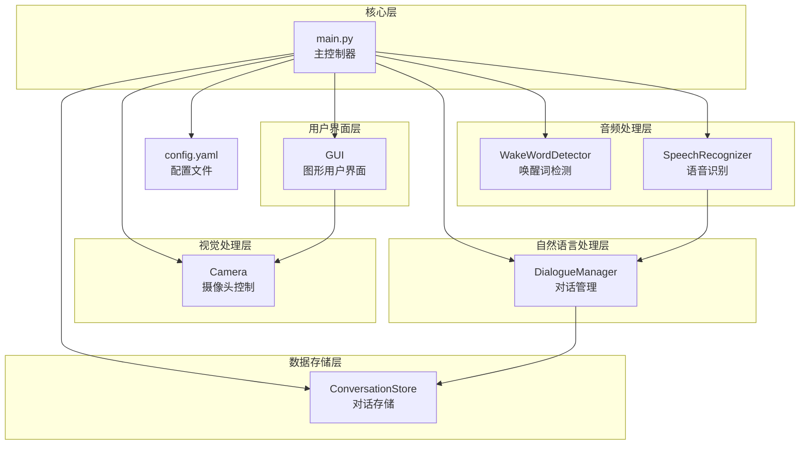
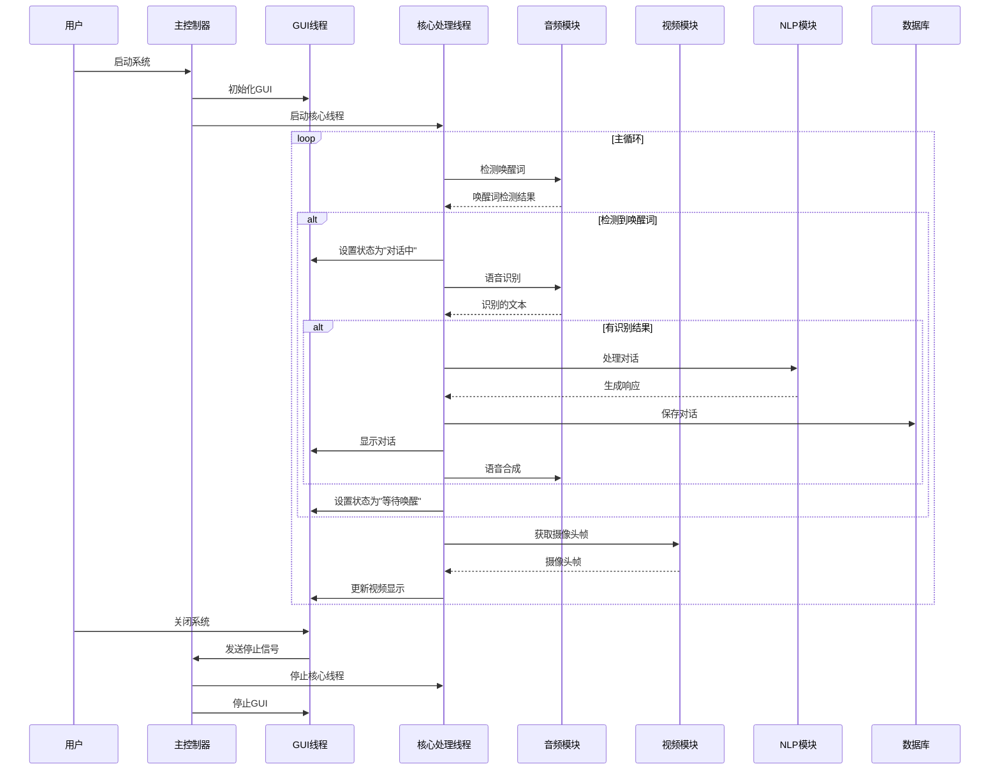
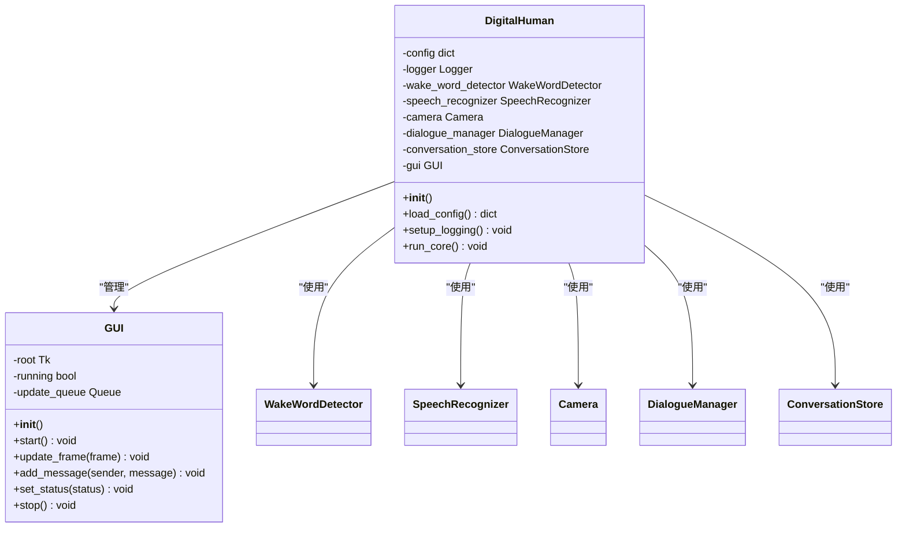
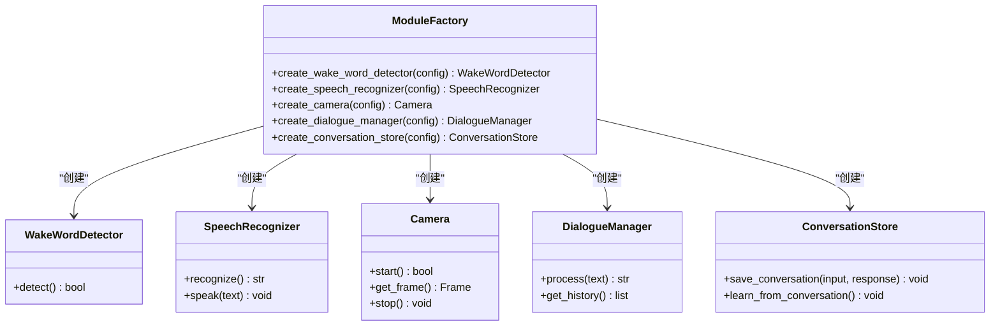
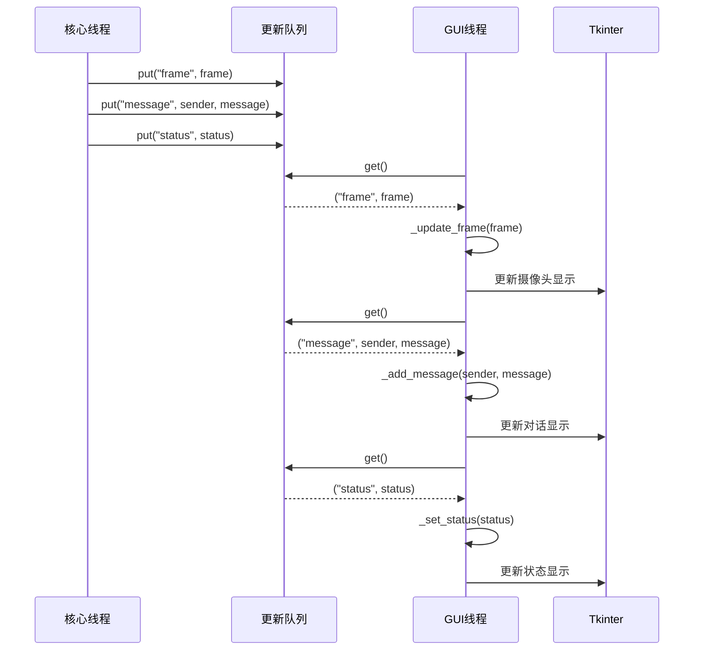
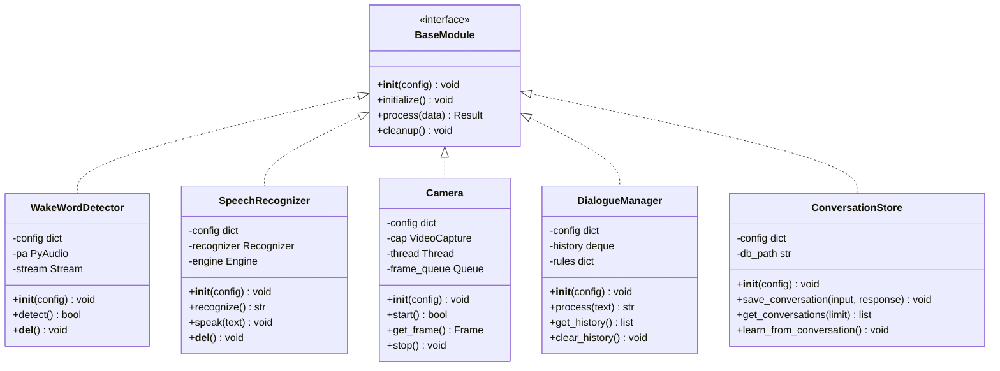
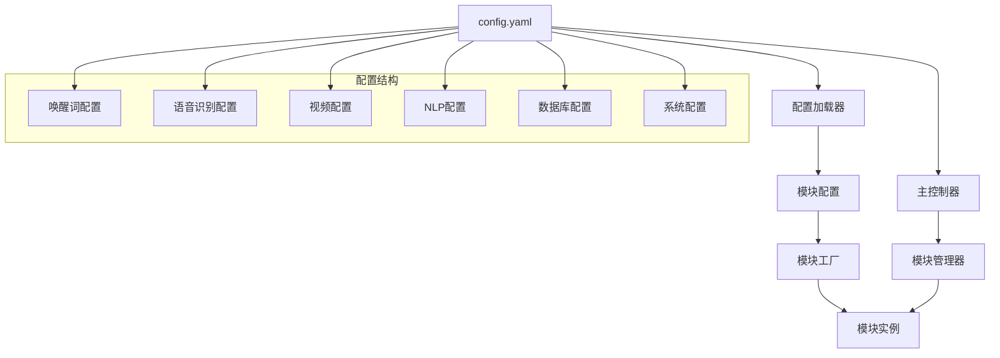
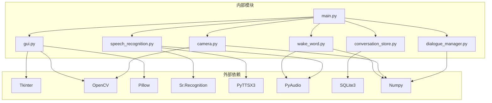
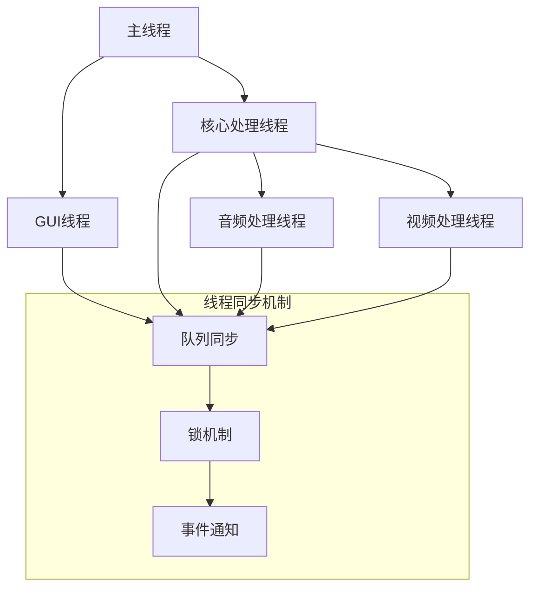

# 组件设计模式

<cite>
**本文档引用的文件**
- [main.py](file://main.py)
- [gui.py](file://src/ui/gui.py)
- [dialogue_manager.py](file://src/nlp/dialogue_manager.py)
- [speech_recognition.py](file://src/audio/speech_recognition.py)
- [camera.py](file://src/video/camera.py)
- [wake_word.py](file://src/audio/wake_word.py)
- [conversation_store.py](file://src/database/conversation_store.py)
- [config.yaml](file://config.yaml)
</cite>

## 目录
1. [引言](#引言)
2. [项目结构](#项目结构)
3. [核心组件](#核心组件)
4. [架构概览](#架构概览)
5. [详细组件分析](#详细组件分析)
6. [依赖分析](#依赖分析)
7. [性能考虑](#性能考虑)
8. [故障排除指南](#故障排除指南)
9. [结论](#结论)

## 引言

本文件深入分析数字人系统的组件设计模式，重点阐述系统中使用的各种设计模式及其应用场景。通过对代码库的全面分析，我们将详细说明单例模式在主控制器中的应用、工厂模式在模块创建中的使用，以及观察者模式在GUI更新中的实现。同时，文档将涵盖模块接口设计原则、依赖注入机制和配置驱动模式，并提供具体的代码示例路径展示这些设计模式的实际应用。

## 项目结构

数字人系统采用模块化的分层架构设计，将不同功能域分离到独立的模块中：

**图表来源**
- [main.py:21-39](file://main.py#L21-L39)
- [config.yaml:1-35](file://config.yaml#L1-L35)

**章节来源**
- [main.py:1-138](file://main.py#L1-L138)
- [config.yaml:1-35](file://config.yaml#L1-L35)

## 核心组件

### 主控制器 DigitalHuman

主控制器是整个系统的协调中心，负责模块初始化、生命周期管理和业务流程控制。该组件体现了良好的依赖注入模式和配置驱动设计。

**章节来源**
- [main.py:21-138](file://main.py#L21-L138)

### 模块接口设计原则

系统中的所有模块都遵循统一的接口设计原则：

1. **构造函数注入**: 所有模块通过构造函数接收配置参数
2. **单一职责**: 每个模块专注于特定的功能领域
3. **清晰的依赖边界**: 模块间通过明确定义的接口交互
4. **资源管理**: 每个模块都有明确的初始化和清理机制

**章节来源**
- [main.py:30-34](file://main.py#L30-L34)
- [speech_recognition.py:12-28](file://src/audio/speech_recognition.py#L12-L28)

## 架构概览

数字人系统采用事件驱动的异步架构，结合多线程处理模式：

**图表来源**
- [main.py:60-116](file://main.py#L60-L116)
- [gui.py:62-81](file://src/ui/gui.py#L62-L81)

## 详细组件分析

### 设计模式应用分析

#### 单例模式的应用

在数字人系统中，单例模式主要体现在主控制器的设计中。虽然Python中没有内置的单例装饰器，但通过应用程序的单一入口点实现了类似的效果：

**图表来源**
- [main.py:21-39](file://main.py#L21-L39)
- [gui.py:16-35](file://src/ui/gui.py#L16-L35)

**章节来源**
- [main.py:118-138](file://main.py#L118-L138)
- [gui.py:16-35](file://src/ui/gui.py#L16-L35)

#### 工厂模式的实现

系统中的模块创建体现了工厂模式的思想，通过统一的创建接口来实例化不同的模块：

**图表来源**
- [main.py:30-34](file://main.py#L30-L34)

**章节来源**
- [main.py:30-34](file://main.py#L30-L34)

#### 观察者模式在GUI更新中的应用

GUI模块实现了观察者模式，通过队列机制实现线程间的解耦：

**图表来源**
- [gui.py:83-98](file://src/ui/gui.py#L83-L98)
- [gui.py:122-155](file://src/ui/gui.py#L122-L155)

**章节来源**
- [gui.py:34-35](file://src/ui/gui.py#L34-L35)
- [gui.py:83-98](file://src/ui/gui.py#L83-L98)

### 模块接口设计原则

#### 统一的模块接口

所有模块都遵循相同的接口设计模式：

**图表来源**
- [wake_word.py:13-32](file://src/audio/wake_word.py#L13-L32)
- [speech_recognition.py:12-28](file://src/audio/speech_recognition.py#L12-L28)
- [camera.py:12-26](file://src/video/camera.py#L12-L26)
- [dialogue_manager.py:12-24](file://src/nlp/dialogue_manager.py#L12-L24)
- [conversation_store.py:12-23](file://src/database/conversation_store.py#L12-L23)

#### 依赖注入机制

系统通过构造函数注入的方式实现依赖注入：

**章节来源**
- [main.py:30-34](file://main.py#L30-L34)
- [speech_recognition.py:13-27](file://src/audio/speech_recognition.py#L13-L27)

### 配置驱动模式

系统采用配置驱动的设计模式，通过外部配置文件控制模块行为：

**图表来源**
- [config.yaml:1-35](file://config.yaml#L1-L35)
- [main.py:41-58](file://main.py#L41-L58)

**章节来源**
- [config.yaml:1-35](file://config.yaml#L1-L35)
- [main.py:41-58](file://main.py#L41-L58)

## 依赖分析

### 模块间依赖关系

**图表来源**
- [main.py:14-19](file://main.py#L14-L19)
- [gui.py:8-14](file://src/ui/gui.py#L8-L14)
- [speech_recognition.py:8-10](file://src/audio/speech_recognition.py#L8-L10)
- [camera.py:8](file://src/video/camera.py#L8)

### 依赖注入实现

系统通过以下方式实现依赖注入：

1. **构造函数注入**: 所有模块通过构造函数接收配置参数
2. **模块注册**: 主控制器负责模块的创建和注册
3. **接口抽象**: 通过统一的接口定义模块能力

**章节来源**
- [main.py:30-39](file://main.py#L30-L39)
- [speech_recognition.py:13-27](file://src/audio/speech_recognition.py#L13-L27)

## 性能考虑

### 线程安全设计

系统采用了多线程架构来提高性能：

**图表来源**
- [main.py:125-128](file://main.py#L125-L128)
- [gui.py:66-68](file://src/ui/gui.py#L66-L68)

### 资源管理策略

系统实现了完善的资源管理机制：

1. **自动资源清理**: 每个模块都有析构函数进行资源清理
2. **异常安全**: 所有资源操作都在try-except块中进行
3. **线程安全**: 使用队列和锁确保多线程环境下的资源安全

**章节来源**
- [speech_recognition.py:86-89](file://src/audio/speech_recognition.py#L86-L89)
- [wake_word.py:106-109](file://src/audio/wake_word.py#L106-L109)
- [camera.py:96-106](file://src/video/camera.py#L96-L106)

## 故障排除指南

### 常见问题及解决方案

#### GUI线程问题

**问题**: GUI线程阻塞导致系统无响应
**解决方案**: 
- 确保GUI线程使用队列机制进行更新
- 避免在GUI线程中执行长时间的操作
- 使用守护线程确保程序退出时资源正确清理

**章节来源**
- [gui.py:83-98](file://src/ui/gui.py#L83-L98)
- [gui.py:157-165](file://src/ui/gui.py#L157-L165)

#### 音频设备问题

**问题**: 麦克风或扬声器无法正常工作
**解决方案**:
- 检查音频设备权限
- 验证音频配置参数
- 确保PyAudio和相关库正确安装

**章节来源**
- [speech_recognition.py:48-75](file://src/audio/speech_recognition.py#L48-L75)
- [wake_word.py:45-52](file://src/audio/wake_word.py#L45-L52)

#### 数据库连接问题

**问题**: 对话数据无法保存或读取
**解决方案**:
- 检查数据库文件路径权限
- 验证SQLite3库的完整性
- 确保数据库表结构正确初始化

**章节来源**
- [conversation_store.py:24-51](file://src/database/conversation_store.py#L24-L51)
- [conversation_store.py:53-80](file://src/database/conversation_store.py#L53-L80)

## 结论

数字人系统通过精心设计的组件架构和多种设计模式的应用，实现了高度模块化、可维护和可扩展的系统结构。系统的主要设计亮点包括：

1. **统一的模块接口**: 所有模块遵循一致的接口设计，便于替换和扩展
2. **灵活的依赖注入**: 通过配置驱动实现模块的动态创建和管理
3. **高效的GUI更新机制**: 基于观察者模式的队列更新系统确保UI响应性
4. **完善的资源管理**: 多线程环境下的资源安全管理和异常处理机制

这些设计模式的应用显著提升了系统的可维护性和可扩展性，为后续的功能扩展和性能优化奠定了坚实的基础。系统架构为类似的人工智能应用提供了优秀的参考模板。