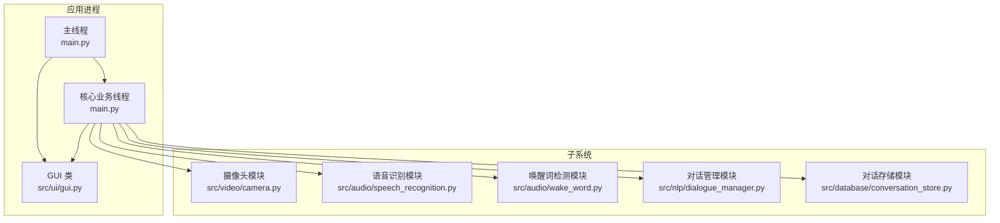
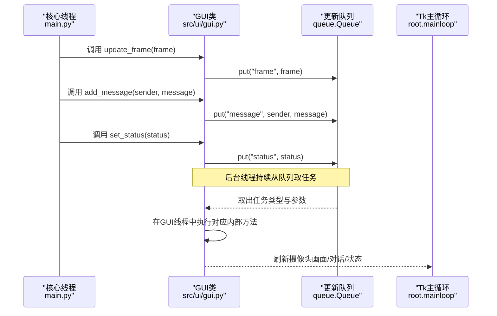
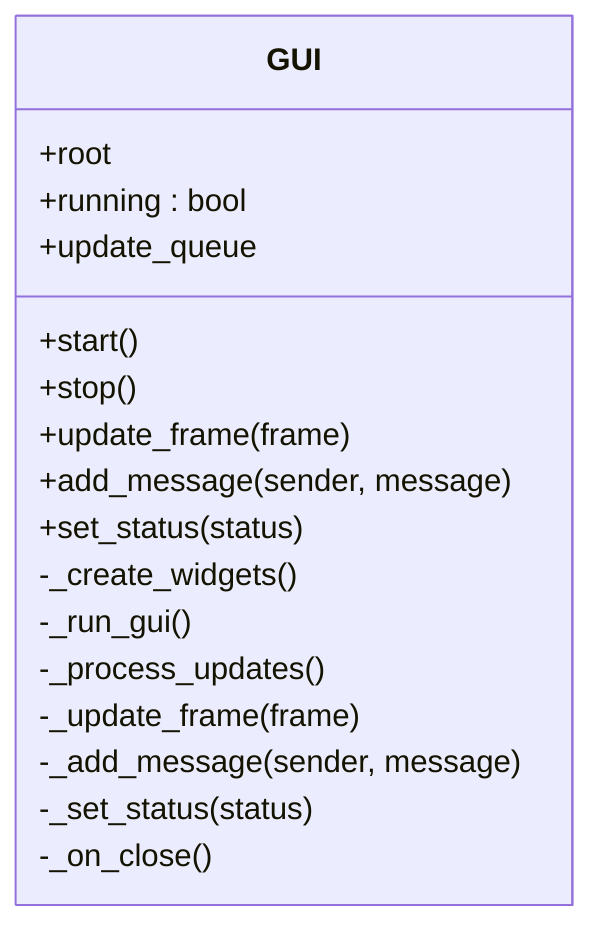
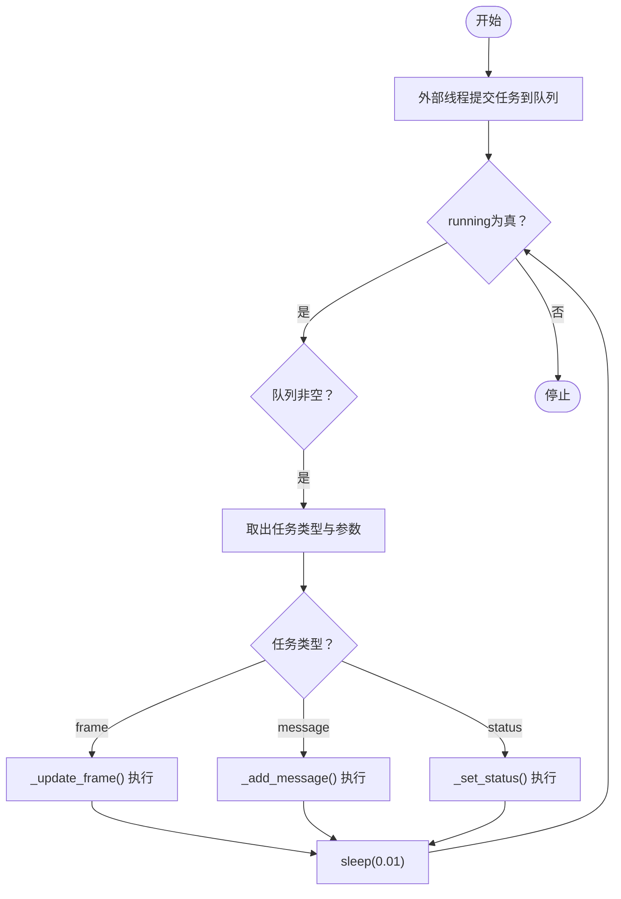
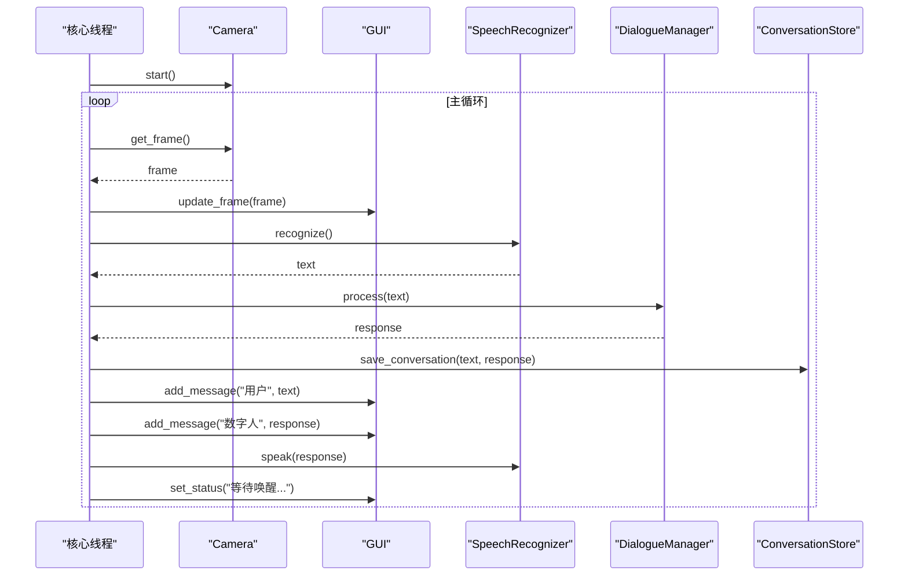
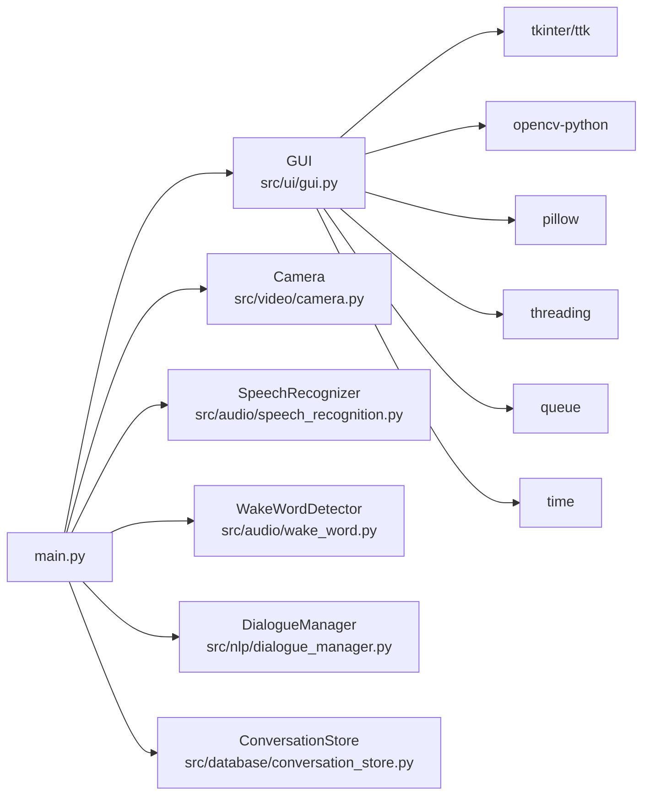

# 用户界面模块

<cite>
**本文档引用的文件**
- [src/ui/gui.py](file://src/ui/gui.py)
- [main.py](file://main.py)
- [config.yaml](file://config.yaml)
- [src/audio/speech_recognition.py](file://src/audio/speech_recognition.py)
- [src/video/camera.py](file://src/video/camera.py)
- [src/audio/wake_word.py](file://src/audio/wake_word.py)
- [src/nlp/dialogue_manager.py](file://src/nlp/dialogue_manager.py)
- [src/database/conversation_store.py](file://src/database/conversation_store.py)
</cite>

## 目录
1. [简介](#简介)
2. [项目结构](#项目结构)
3. [核心组件](#核心组件)
4. [架构总览](#架构总览)
5. [详细组件分析](#详细组件分析)
6. [依赖关系分析](#依赖关系分析)
7. [性能考量](#性能考量)
8. [故障排查指南](#故障排查指南)
9. [结论](#结论)
10. [附录](#附录)

## 简介
本文件面向“用户界面模块”的技术文档，聚焦于GUI类的架构设计、Tkinter框架使用与异步更新机制。文档结合实际代码库中的具体实现，说明配置项、参数与返回值，解释与各子系统的交互关系，并提供窗口管理、事件处理、状态同步与线程安全方面的最佳实践与常见问题解决方案。内容兼顾初学者可读性与资深开发者所需的技术深度，同时给出界面布局设计与用户体验优化建议。

## 项目结构
用户界面模块位于 src/ui/gui.py，负责：
- 主窗口创建与布局（摄像头画面区、对话区）
- 异步更新机制（队列+后台线程）
- 状态标签与对话文本框的更新
- 窗口关闭协议处理

系统入口 main.py 中，GUI实例在主线程中初始化，核心业务逻辑在独立线程中运行，二者通过GUI提供的异步接口进行通信。

图表来源
- [main.py:118-138](file://main.py#L118-L138)
- [src/ui/gui.py:16-170](file://src/ui/gui.py#L16-L170)
- [src/video/camera.py:12-106](file://src/video/camera.py#L12-L106)
- [src/audio/speech_recognition.py:12-89](file://src/audio/speech_recognition.py#L12-L89)
- [src/audio/wake_word.py:13-109](file://src/audio/wake_word.py#L13-L109)
- [src/nlp/dialogue_manager.py:12-102](file://src/nlp/dialogue_manager.py#L12-L102)
- [src/database/conversation_store.py:12-158](file://src/database/conversation_store.py#L12-L158)

章节来源
- [main.py:118-138](file://main.py#L118-L138)
- [src/ui/gui.py:16-170](file://src/ui/gui.py#L16-L170)

## 核心组件
- GUI类：封装Tkinter主窗口、组件布局、异步更新队列与线程、状态同步接口。
- 主程序DigitalHuman：协调各子系统，通过GUI暴露的方法进行状态与消息更新。
- 配置系统：config.yaml集中定义各子系统参数，供各模块按需加载。

关键职责与接口：
- GUI.start()/stop()：启动/停止GUI主循环与后台更新线程。
- update_frame()/add_message()/set_status()：外部线程通过队列提交更新任务。
- _process_updates()：后台线程从队列取出任务并在GUI线程中执行。
- _run_gui()：主线程驱动tk主循环，保证界面响应。

章节来源
- [src/ui/gui.py:16-170](file://src/ui/gui.py#L16-L170)
- [main.py:118-138](file://main.py#L118-L138)
- [config.yaml:1-35](file://config.yaml#L1-L35)

## 架构总览
GUI采用“主线程渲染 + 后台线程更新”的双线程模式：
- 主线程负责 Tk 主循环与界面绘制，确保响应性。
- 后台线程负责处理来自各子系统的更新请求，统一通过队列投递到GUI线程执行，避免跨线程直接操作Tk对象导致的线程安全问题。

图表来源
- [src/ui/gui.py:62-98](file://src/ui/gui.py#L62-L98)
- [src/ui/gui.py:122-155](file://src/ui/gui.py#L122-L155)
- [main.py:60-116](file://main.py#L60-L116)

## 详细组件分析

### GUI类架构与设计
GUI类以职责分离为核心：
- 组件创建：在构造函数中初始化主窗口、协议钩子、组件布局。
- 状态管理：running标志控制生命周期；update_queue承载跨线程更新任务。
- 更新策略：后台线程轮询队列，根据任务类型分派至内部更新方法，内部方法在GUI线程中执行，保证线程安全。

图表来源
- [src/ui/gui.py:16-170](file://src/ui/gui.py#L16-L170)

章节来源
- [src/ui/gui.py:16-170](file://src/ui/gui.py#L16-L170)

### Tkinter框架使用与界面布局
- 主窗口：标题、尺寸、关闭协议绑定。
- 主框架：ttk.Frame作为根容器，padding统一内边距。
- 摄像头区域：ttk.LabelFrame + ttk.Label，用于显示视频帧。
- 对话区域：ttk.LabelFrame + tk.Text（禁用编辑态），滚动到底部自动跟随最新消息。
- 状态标签：ttk.Label，底部展示系统状态文本。

布局要点：
- 左右分区：摄像头在左，对话在右，均填充扩展。
- 摄像头画面自适应：根据标签控件宽高调整图像尺寸，使用高质量重采样算法。
- 文本框禁用态插入新消息，再启用态滚动到末尾，避免用户手动编辑。

章节来源
- [src/ui/gui.py:36-61](file://src/ui/gui.py#L36-L61)
- [src/ui/gui.py:100-121](file://src/ui/gui.py#L100-L121)
- [src/ui/gui.py:128-149](file://src/ui/gui.py#L128-L149)

### 异步更新机制与线程安全
- 队列：queue.Queue承载跨线程任务，避免直接共享可变状态。
- 后台线程：daemon线程持续轮询队列，空闲时短sleep降低CPU占用。
- GUI线程执行：所有界面更新在GUI线程中完成，通过队列投递任务，确保线程安全。
- 生命周期：running标志控制循环退出；窗口关闭时触发running=False并销毁窗口。

图表来源
- [src/ui/gui.py:83-98](file://src/ui/gui.py#L83-L98)
- [src/ui/gui.py:122-155](file://src/ui/gui.py#L122-L155)

章节来源
- [src/ui/gui.py:62-98](file://src/ui/gui.py#L62-L98)
- [src/ui/gui.py:122-155](file://src/ui/gui.py#L122-L155)

### 与子系统的集成点
- 摄像头：Camera模块在独立线程中采集帧，GUI通过update_frame(frame)接收并刷新画面。
- 语音识别与合成：SpeechRecognizer提供识别与TTS能力，GUI通过set_status与add_message展示状态与对话。
- 唤醒词检测：WakeWordDetector在主线程阻塞等待唤醒，唤醒后由GUI切换状态。
- 对话管理：DialogueManager基于规则生成回复，GUI展示对话历史。
- 对话存储：ConversationStore持久化对话与学习数据，支持查询与清理。

图表来源
- [main.py:60-116](file://main.py#L60-L116)
- [src/video/camera.py:27-94](file://src/video/camera.py#L27-L94)
- [src/audio/speech_recognition.py:46-84](file://src/audio/speech_recognition.py#L46-L84)
- [src/nlp/dialogue_manager.py:62-94](file://src/nlp/dialogue_manager.py#L62-L94)
- [src/database/conversation_store.py:53-80](file://src/database/conversation_store.py#L53-L80)
- [src/ui/gui.py:122-155](file://src/ui/gui.py#L122-L155)

章节来源
- [main.py:60-116](file://main.py#L60-L116)
- [src/video/camera.py:27-94](file://src/video/camera.py#L27-L94)
- [src/audio/speech_recognition.py:46-84](file://src/audio/speech_recognition.py#L46-L84)
- [src/nlp/dialogue_manager.py:62-94](file://src/nlp/dialogue_manager.py#L62-L94)
- [src/database/conversation_store.py:53-80](file://src/database/conversation_store.py#L53-L80)
- [src/ui/gui.py:122-155](file://src/ui/gui.py#L122-L155)

### 配置选项与参数
- 唤醒词检测：模型路径、敏感度、音频阈值。
- 语音识别：语言、超时、短语时长限制。
- 视频：摄像头索引、分辨率、帧率。
- NLP：模型路径、最大历史长度。
- 数据库：SQLite路径。
- 系统：日志级别、最大响应数、响应延迟。

章节来源
- [config.yaml:1-35](file://config.yaml#L1-L35)

### 返回值与异常处理
- update_frame/add_message/set_status：无显式返回值，内部通过队列异步处理。
- _update_frame/_add_message/_set_status：内部try/except捕获异常并打印日志，避免影响主线程。
- _process_updates：循环内捕获异常并打印，保证后台线程不崩溃。
- _run_gui：异常时break循环，确保优雅退出。
- GUI.stop：尝试销毁窗口并等待线程结束，异常时打印日志。

章节来源
- [src/ui/gui.py:100-121](file://src/ui/gui.py#L100-L121)
- [src/ui/gui.py:128-149](file://src/ui/gui.py#L128-L149)
- [src/ui/gui.py:83-98](file://src/ui/gui.py#L83-L98)
- [src/ui/gui.py:73-81](file://src/ui/gui.py#L73-L81)
- [src/ui/gui.py:157-165](file://src/ui/gui.py#L157-L165)

## 依赖关系分析
- GUI依赖：tkinter/ttk、cv2、PIL.Image/PIL.ImageTk、threading、queue、time。
- GUI与主程序：主程序在主线程初始化GUI，随后启动核心线程；核心线程通过GUI接口更新界面。
- GUI与子系统：通过update_frame/add_message/set_status与各子系统解耦，避免直接耦合。

图表来源
- [src/ui/gui.py:8-14](file://src/ui/gui.py#L8-L14)
- [main.py:14-19](file://main.py#L14-L19)

章节来源
- [src/ui/gui.py:8-14](file://src/ui/gui.py#L8-L14)
- [main.py:14-19](file://main.py#L14-L19)

## 性能考量
- 队列轮询间隔：后台线程sleep(0.01)，平衡响应性与CPU占用。
- 图像缩放：按标签控件宽高动态调整，避免固定尺寸导致的缩放失真。
- 文本框更新：禁用态插入、启用态滚动，减少不必要的重绘。
- 摄像头帧队列：Camera使用有限容量队列，满时丢弃旧帧，避免积压。
- 线程守护：后台线程设为daemon，确保主线程退出时自动结束。

章节来源
- [src/ui/gui.py:83-98](file://src/ui/gui.py#L83-L98)
- [src/ui/gui.py:108-111](file://src/ui/gui.py#L108-L111)
- [src/video/camera.py:24-25](file://src/video/camera.py#L24-L25)
- [src/video/camera.py:64-72](file://src/video/camera.py#L64-L72)

## 故障排查指南
- 界面无响应或卡顿
  - 检查GUI._run_gui循环是否正常运行，确认running标志未被意外置False。
  - 确认后台线程未因异常退出，查看后台线程日志输出。
- 摄像头画面不更新
  - 确认Camera.start()成功并返回True，线程已启动。
  - 检查update_frame调用是否正确传入frame，且GUI.running为True。
  - 检查标签控件宽高是否大于0，避免图像缩放为0尺寸。
- 对话不显示或状态不更新
  - 确认add_message/set_status调用已进入队列，且后台线程在运行。
  - 检查Text控件状态切换逻辑，确保插入后恢复禁用态。
- 窗口关闭异常
  - 确认WM_DELETE_WINDOW协议已绑定，_on_close会设置running=False并销毁窗口。
- 资源清理
  - stop()会尝试销毁窗口并等待线程结束，若仍存在异常，检查线程join超时与异常日志。

章节来源
- [src/ui/gui.py:73-81](file://src/ui/gui.py#L73-L81)
- [src/ui/gui.py:157-165](file://src/ui/gui.py#L157-L165)
- [src/video/camera.py:27-53](file://src/video/camera.py#L27-L53)

## 结论
GUI模块通过清晰的双线程架构与队列机制，实现了与多子系统的松耦合集成，既满足了界面的实时响应需求，又保证了跨线程操作的线程安全。配合合理的布局设计与异常处理策略，为用户提供稳定、直观的交互体验。对于后续扩展，可在保持现有异步更新模式的基础上，引入更精细的任务优先级与批量更新策略，进一步提升性能与可维护性。

## 附录

### 配置项参考
- 唤醒词检测：模型路径、敏感度、音频阈值
- 语音识别：语言、超时、短语时长限制
- 视频：摄像头索引、宽度、高度、帧率
- NLP：模型路径、最大历史长度
- 数据库：SQLite路径
- 系统：日志级别、最大响应数、响应延迟

章节来源
- [config.yaml:1-35](file://config.yaml#L1-L35)