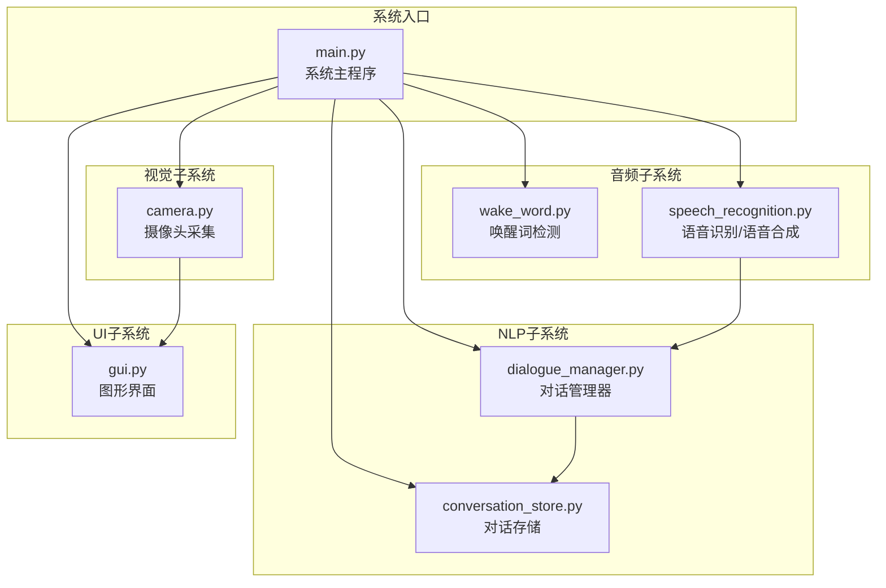
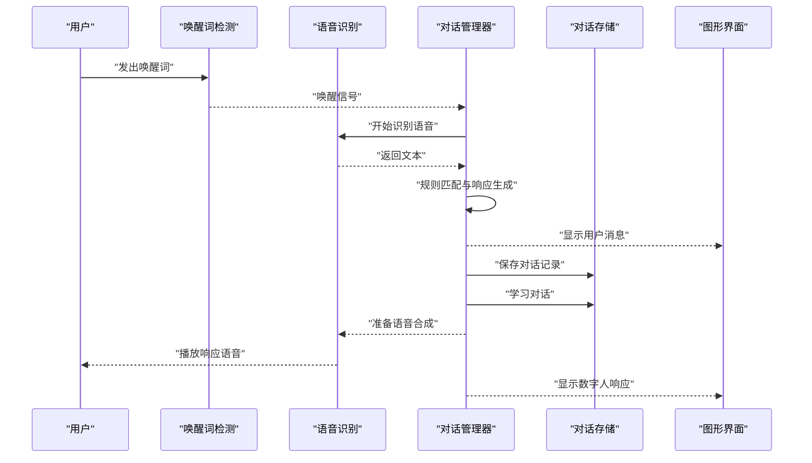
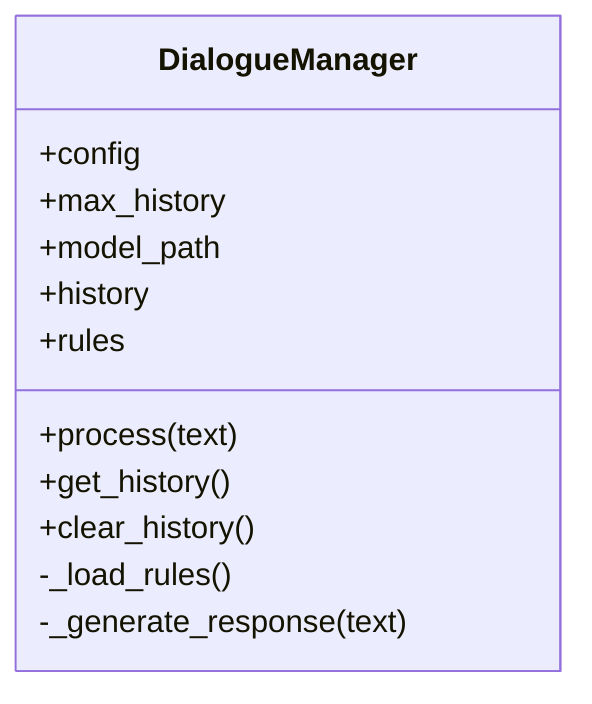
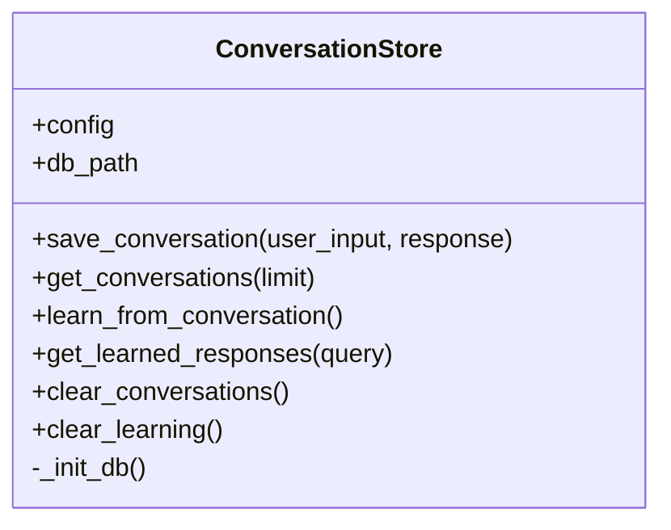
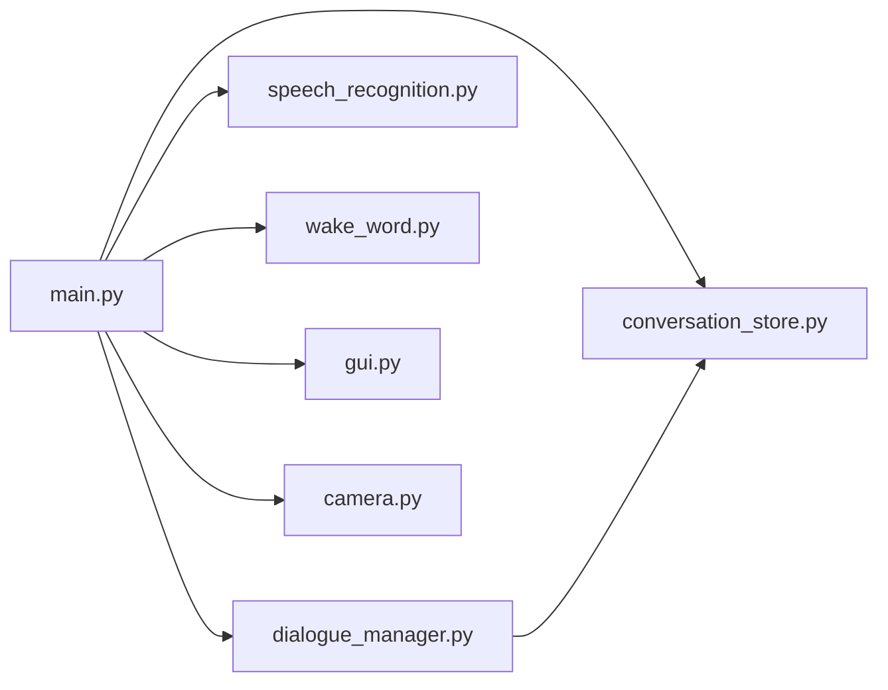

# 自然语言处理模块

<cite>
**本文档引用的文件**
- [dialogue_manager.py](file://src/nlp/dialogue_manager.py)
- [conversation_store.py](file://src/database/conversation_store.py)
- [config.yaml](file://config.yaml)
- [main.py](file://main.py)
- [speech_recognition.py](file://src/audio/speech_recognition.py)
- [wake_word.py](file://src/audio/wake_word.py)
- [gui.py](file://src/ui/gui.py)
- [camera.py](file://src/video/camera.py)
</cite>

## 目录
1. [简介](#简介)
2. [项目结构](#项目结构)
3. [核心组件](#核心组件)
4. [架构总览](#架构总览)
5. [详细组件分析](#详细组件分析)
6. [依赖关系分析](#依赖关系分析)
7. [性能考虑](#性能考虑)
8. [故障排除指南](#故障排除指南)
9. [结论](#结论)
10. [附录](#附录)

## 简介
本文件面向“自然语言处理模块”的技术文档，重点围绕对话管理器（DialogueManager）的设计、规则引擎实现与对话历史管理机制展开。文档结合实际代码库中的具体实现，说明配置项、参数与返回值，解释与系统其他组件的集成关系，并提供常见问题的解决方案、模式匹配算法、响应生成策略以及学习机制的说明。内容兼顾初学者可读性与资深开发者所需的技术深度。

## 项目结构
该系统采用分层模块化设计：
- 主入口负责系统初始化与各子模块编排
- NLP子系统包含对话管理器与对话存储
- 音频子系统包含唤醒词检测与语音识别
- 视频子系统包含摄像头采集
- UI子系统负责图形界面展示

图表来源
- [main.py:60-116](file://main.py#L60-L116)
- [dialogue_manager.py:12-24](file://src/nlp/dialogue_manager.py#L12-L24)
- [conversation_store.py:12-23](file://src/database/conversation_store.py#L12-L23)
- [speech_recognition.py:12-28](file://src/audio/speech_recognition.py#L12-L28)
- [wake_word.py:13-32](file://src/audio/wake_word.py#L13-L32)
- [camera.py:12-26](file://src/video/camera.py#L12-L26)
- [gui.py:16-35](file://src/ui/gui.py#L16-L35)

章节来源
- [main.py:21-39](file://main.py#L21-L39)
- [config.yaml:22-35](file://config.yaml#L22-L35)

## 核心组件
- 对话管理器（DialogueManager）
  - 负责加载规则、匹配用户输入、生成响应、维护对话历史
  - 提供获取与清空历史的方法
- 对话存储（ConversationStore）
  - 负责SQLite数据库初始化、对话记录持久化、学习数据维护与查询
  - 提供学习与查询学习结果的能力
- 配置（config.yaml）
  - 定义NLP模块路径、最大历史长度、数据库路径等关键参数

章节来源
- [dialogue_manager.py:12-24](file://src/nlp/dialogue_manager.py#L12-L24)
- [conversation_store.py:12-23](file://src/database/conversation_store.py#L12-L23)
- [config.yaml:22-35](file://config.yaml#L22-L35)

## 架构总览
系统以主程序为核心，协调音频、视频、UI与NLP模块。流程概览如下：
- 唤醒词检测触发对话
- 语音识别将语音转为文本
- 对话管理器根据规则生成响应
- 对话记录与学习数据写入数据库
- UI显示对话与状态，摄像头画面同步更新

图表来源
- [main.py:68-101](file://main.py#L68-L101)
- [dialogue_manager.py:62-73](file://src/nlp/dialogue_manager.py#L62-L73)
- [conversation_store.py:53-65](file://src/database/conversation_store.py#L53-L65)

## 详细组件分析

### 对话管理器（DialogueManager）
- 设计要点
  - 基于规则的简单对话引擎，通过意图-模式-响应映射实现
  - 使用双端队列维护有限长度的历史，控制内存占用
  - 默认响应兜底，提升用户体验
- 关键接口
  - process(text): 处理用户输入，返回响应
  - get_history(): 返回历史列表
  - clear_history(): 清空历史
- 规则引擎
  - 意图分类：问候、自我介绍、天气、时间、帮助、告别
  - 模式匹配：字符串包含匹配
  - 响应选择：从候选集中随机选择
- 性能与复杂度
  - 匹配复杂度近似O(N×M)，N为意图数，M为每个意图的模式数
  - 历史管理使用固定容量队列，空间复杂度O(H)，H为最大历史长度

图表来源
- [dialogue_manager.py:12-102](file://src/nlp/dialogue_manager.py#L12-L102)

章节来源
- [dialogue_manager.py:12-24](file://src/nlp/dialogue_manager.py#L12-L24)
- [dialogue_manager.py:25-60](file://src/nlp/dialogue_manager.py#L25-L60)
- [dialogue_manager.py:62-94](file://src/nlp/dialogue_manager.py#L62-L94)
- [dialogue_manager.py:96-102](file://src/nlp/dialogue_manager.py#L96-L102)

### 对话存储（ConversationStore）
- 设计要点
  - SQLite数据库，包含对话表与学习表
  - 对话表用于记录用户输入、系统响应与时间戳
  - 学习表用于记录模式、响应、置信度与使用次数
- 关键接口
  - save_conversation(user_input, response): 保存一次对话
  - get_conversations(limit): 查询最近对话
  - learn_from_conversation(): 从最近对话中学习，更新或新增学习条目
  - get_learned_responses(query): 基于相似度查询学习到的响应
  - clear_conversations()/clear_learning(): 清空历史与学习数据
- 学习机制
  - 从最近若干条对话中提取模式-响应对
  - 若模式已存在，则提高置信度并增加使用次数；否则插入新条目
  - 查询时按置信度排序返回

图表来源
- [conversation_store.py:12-158](file://src/database/conversation_store.py#L12-L158)

章节来源
- [conversation_store.py:12-52](file://src/database/conversation_store.py#L12-L52)
- [conversation_store.py:53-80](file://src/database/conversation_store.py#L53-L80)
- [conversation_store.py:82-126](file://src/database/conversation_store.py#L82-L126)
- [conversation_store.py:127-140](file://src/database/conversation_store.py#L127-L140)
- [conversation_store.py:142-158](file://src/database/conversation_store.py#L142-L158)

### 配置（config.yaml）
- NLP相关配置
  - model_path: 模型路径（当前未直接使用）
  - max_history: 最大历史长度
- 数据库配置
  - path: SQLite数据库文件路径
- 其他子系统配置（与NLP交互间接相关）
  - 语音识别语言、超时、短语时长限制
  - 唤醒词模型路径、敏感度、音频阈值
  - 视频参数（摄像头索引、分辨率、帧率）

章节来源
- [config.yaml:22-35](file://config.yaml#L22-L35)

### 与系统其他组件的集成
- 主程序（main.py）
  - 初始化各模块并驱动工作流
  - 在唤醒后调用语音识别，再调用对话管理器生成响应，随后保存对话并学习
- 语音识别（speech_recognition.py）
  - 提供识别与语音合成功能，供对话管理器调用
- 唤醒词检测（wake_word.py）
  - 触发对话流程的入口
- 图形界面（gui.py）
  - 展示对话历史与状态，更新摄像头画面
- 摄像头（camera.py）
  - 提供实时画面供UI显示

章节来源
- [main.py:30-38](file://main.py#L30-L38)
- [main.py:68-101](file://main.py#L68-L101)
- [speech_recognition.py:46-85](file://src/audio/speech_recognition.py#L46-L85)
- [wake_word.py:42-98](file://src/audio/wake_word.py#L42-L98)
- [gui.py:100-155](file://src/ui/gui.py#L100-L155)
- [camera.py:89-94](file://src/video/camera.py#L89-L94)

## 依赖关系分析
- 组件耦合
  - DialogueManager依赖配置与ConversationStore（通过主程序注入）
  - ConversationStore独立管理数据库，不反向依赖其他模块
  - 主程序作为编排者，耦合所有子模块
- 外部依赖
  - Python标准库（collections.deque、os、sqlite3、datetime等）
  - 第三方库（speech_recognition、pyttsx3、pyaudio、opencv-python、pillow、tkinter等）

图表来源
- [main.py:14-19](file://main.py#L14-L19)
- [dialogue_manager.py:12-24](file://src/nlp/dialogue_manager.py#L12-L24)
- [conversation_store.py:12-23](file://src/database/conversation_store.py#L12-L23)

章节来源
- [main.py:14-19](file://main.py#L14-L19)

## 性能考虑
- 规则匹配
  - 当前为线性扫描，复杂度O(N×M)。若意图与模式规模扩大，建议：
    - 引入倒排索引或Trie树优化模式查找
    - 对常用意图优先匹配，减少平均比较次数
- 历史管理
  - 使用固定容量双端队列，避免无限增长；合理设置max_history
- 数据库操作
  - 学习过程对最近对话进行扫描与更新，建议：
    - 批量写入事务，减少提交次数
    - 限制最近对话扫描数量，避免全表扫描
- I/O与线程
  - 主循环中使用小延迟避免CPU占用过高；UI与摄像头使用队列与线程解耦

## 故障排除指南
- 无法识别语音
  - 检查麦克风权限与设备可用性
  - 调整环境噪声补偿与超时参数
  - 参考语音识别模块的异常处理分支
- 唤醒词检测不稳定
  - 调整音频阈值与采样参数
  - 实际项目中替换为真实唤醒词模型
- 对话历史不显示
  - 确认GUI消息队列与线程正常运行
  - 检查消息入队与出队逻辑
- 数据库文件无法创建
  - 确认数据库路径存在且具备写权限
  - 检查SQLite连接与建表语句执行情况

章节来源
- [speech_recognition.py:67-75](file://src/audio/speech_recognition.py#L67-L75)
- [wake_word.py:91-96](file://src/audio/wake_word.py#L91-L96)
- [gui.py:83-98](file://src/ui/gui.py#L83-L98)
- [conversation_store.py:24-51](file://src/database/conversation_store.py#L24-L51)

## 结论
本自然语言处理模块以规则引擎为核心，结合对话历史与数据库学习机制，实现了从唤醒到响应的完整闭环。其模块化设计便于扩展与维护。未来可在以下方面进一步增强：
- 引入更强大的意图识别与槽位填充
- 优化规则匹配算法与响应生成策略
- 增强学习机制，支持上下文感知与个性化
- 提升多轮对话与情感理解能力

## 附录

### 配置项与参数说明
- NLP配置
  - model_path: 模型路径（当前未直接使用）
  - max_history: 最大历史长度
- 数据库配置
  - path: SQLite数据库文件路径
- 语音识别配置
  - language: 识别语言
  - timeout: 监听超时
  - phrase_time_limit: 单次识别最长时长
- 唤醒词配置
  - model_path: 唤醒词模型路径
  - sensitivity: 敏感度
  - audio_threshold: 音频能量阈值

章节来源
- [config.yaml:22-35](file://config.yaml#L22-L35)

### API与返回值摘要
- 对话管理器
  - process(text): 输入文本，返回系统响应
  - get_history(): 返回历史记录列表
  - clear_history(): 清空历史
- 对话存储
  - save_conversation(user_input, response): 保存一次对话
  - get_conversations(limit): 返回最近对话列表
  - learn_from_conversation(): 从最近对话学习
  - get_learned_responses(query): 返回相似度排序的响应
  - clear_conversations()/clear_learning(): 清空历史与学习数据

章节来源
- [dialogue_manager.py:62-73](file://src/nlp/dialogue_manager.py#L62-L73)
- [dialogue_manager.py:96-102](file://src/nlp/dialogue_manager.py#L96-L102)
- [conversation_store.py:53-65](file://src/database/conversation_store.py#L53-L65)
- [conversation_store.py:67-80](file://src/database/conversation_store.py#L67-L80)
- [conversation_store.py:82-126](file://src/database/conversation_store.py#L82-L126)
- [conversation_store.py:127-140](file://src/database/conversation_store.py#L127-L140)
- [conversation_store.py:142-158](file://src/database/conversation_store.py#L142-L158)