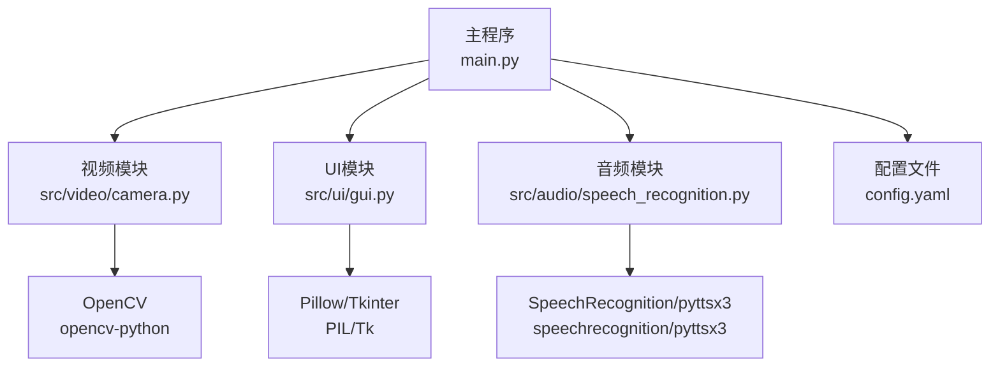
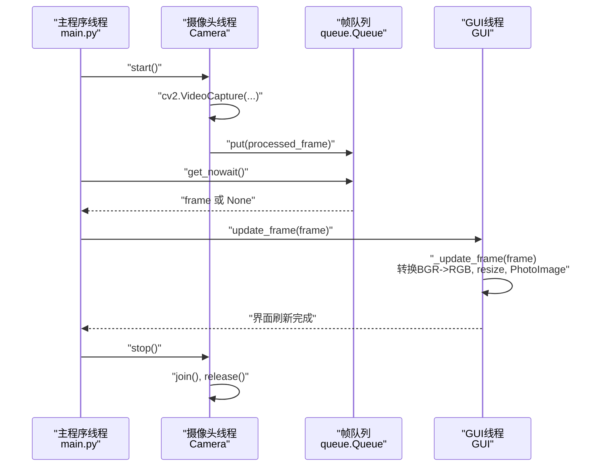
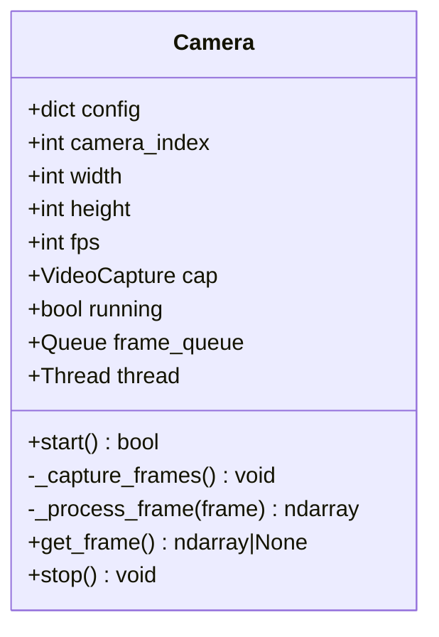
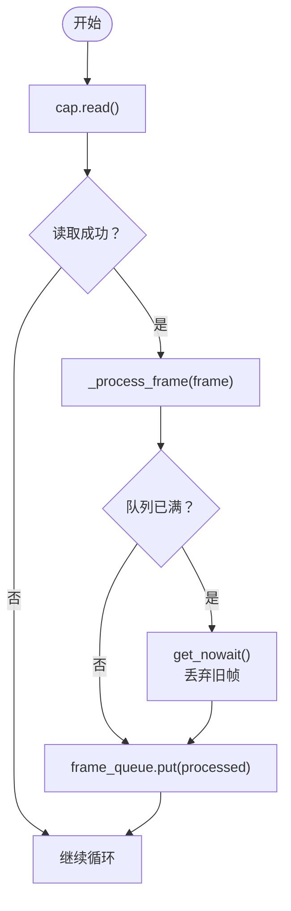
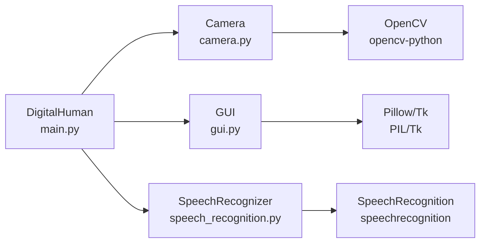
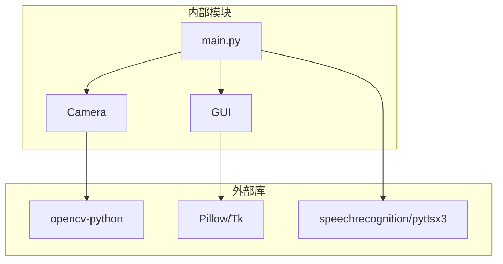

# 视频处理模块

<cite>
**本文档引用的文件**
- [camera.py](file://src/video/camera.py)
- [config.yaml](file://config.yaml)
- [main.py](file://main.py)
- [gui.py](file://src/ui/gui.py)
- [speech_recognition.py](file://src/audio/speech_recognition.py)
- [requirements.txt](file://requirements.txt)
</cite>

## 目录
1. [简介](#简介)
2. [项目结构](#项目结构)
3. [核心组件](#核心组件)
4. [架构总览](#架构总览)
5. [详细组件分析](#详细组件分析)
6. [依赖分析](#依赖分析)
7. [性能考虑](#性能考虑)
8. [故障排除指南](#故障排除指南)
9. [结论](#结论)
10. [附录](#附录)

## 简介
本文件面向“视频处理模块”的技术文档，重点围绕 Camera 类的架构设计、多线程视频捕获机制与图像队列管理实现展开，结合 OpenCV 图像处理、实时视频流管理与线程安全机制，帮助初学者快速理解，同时为有经验的开发者提供足够的技术深度。文档中的所有实现细节均来自仓库中的实际代码，并通过图示与来源标注确保可追溯性。

## 项目结构
该系统采用模块化分层组织：
- 主程序入口负责加载配置、初始化各子模块并协调运行。
- 视频模块提供摄像头驱动、帧捕获与简单图像处理。
- UI 模块负责图形界面展示与线程间通信。
- 音频模块提供语音识别与语音合成功能。
- 配置文件集中定义系统参数。

图表来源
- [main.py:118-138](file://main.py#L118-L138)
- [camera.py:8](file://src/video/camera.py#L8)
- [gui.py:8](file://src/ui/gui.py#L8)
- [speech_recognition.py:8](file://src/audio/speech_recognition.py#L8)

章节来源
- [main.py:21-40](file://main.py#L21-L40)
- [config.yaml:15-21](file://config.yaml#L15-L21)

## 核心组件
- Camera 类：封装摄像头设备访问、帧捕获、图像处理与线程安全的帧队列管理。
- GUI 类：负责界面渲染与线程间异步更新，使用队列将非 GUI 线程的任务调度到 GUI 线程执行。
- 主程序 DigitalHuman：协调各模块初始化与运行，控制摄像头帧的显示与系统状态。

章节来源
- [camera.py:12-106](file://src/video/camera.py#L12-L106)
- [gui.py:16-170](file://src/ui/gui.py#L16-L170)
- [main.py:21-117](file://main.py#L21-L117)

## 架构总览
系统采用“主控线程 + 多工作线程”的模式：
- 主控线程负责 GUI 的主循环与事件处理。
- 摄像头线程持续从摄像头读取帧，进行简单处理后放入环形缓冲队列。
- 主控线程周期性从队列取出帧并交给 GUI 更新显示。
- 音频模块与 NLP 模块在唤醒词触发后参与对话流程。

图表来源
- [camera.py:27-53](file://src/video/camera.py#L27-L53)
- [camera.py:55-87](file://src/video/camera.py#L55-L87)
- [camera.py:89-94](file://src/video/camera.py#L89-L94)
- [gui.py:62-98](file://src/ui/gui.py#L62-L98)
- [main.py:103-109](file://main.py#L103-L109)

## 详细组件分析

### Camera 类：摄像头驱动与帧队列管理
- 设计目标
  - 提供稳定的摄像头访问接口，支持配置分辨率、帧率与索引。
  - 通过独立线程持续捕获帧，避免阻塞主控线程。
  - 使用有界队列实现帧缓冲，保证实时性与内存可控。
- 关键字段
  - config：来自配置文件的摄像头参数集合。
  - cap：OpenCV VideoCapture 实例。
  - running：线程运行标志。
  - frame_queue：最大容量为 10 的有界队列，用于存放处理后的帧。
  - thread：摄像头捕获线程。
- 方法与行为
  - start：打开摄像头、设置属性、启动捕获线程；返回布尔值表示是否成功。
  - _capture_frames：循环读取帧，调用 _process_frame 处理，写入队列；若队列满则丢弃最旧帧再写入。
  - _process_frame：当前实现为在帧周围添加绿色边框，便于演示；可扩展为人脸识别、表情识别等。
  - get_frame：非阻塞地从队列取出一帧，空则返回 None。
  - stop：停止线程、等待退出、释放摄像头资源。
- 线程安全与并发
  - 队列操作基于 Python queue.Queue，默认线程安全。
  - 通过 running 标志控制线程生命周期，避免竞态条件。
  - 采用非阻塞获取 get_nowait，降低 UI 循环等待时间。
- 错误处理
  - 打开摄像头失败或读取失败时打印错误并返回 False/None。
  - 队列为空时 get_frame 返回 None，调用方需判断空值。

图表来源
- [camera.py:12-106](file://src/video/camera.py#L12-L106)

章节来源
- [camera.py:13-25](file://src/video/camera.py#L13-L25)
- [camera.py:27-53](file://src/video/camera.py#L27-L53)
- [camera.py:55-87](file://src/video/camera.py#L55-L87)
- [camera.py:89-94](file://src/video/camera.py#L89-L94)
- [camera.py:96-106](file://src/video/camera.py#L96-L106)

### 配置项与参数说明
- 视频配置（来自配置文件）
  - camera_index：摄像头索引（默认 0）。
  - width：图像宽度（默认 640）。
  - height：图像高度（默认 480）。
  - fps：目标帧率（默认 30）。
- 运行时参数
  - frame_queue.maxsize：固定为 10，决定缓冲区大小与丢帧策略。
  - 线程守护标志：摄像头线程设为守护线程，随主线程退出而终止。
- 返回值约定
  - start：成功返回 True，失败返回 False。
  - get_frame：成功返回帧数组，队列空返回 None。

章节来源
- [config.yaml:15-21](file://config.yaml#L15-L21)
- [camera.py:16-19](file://src/video/camera.py#L16-L19)
- [camera.py:24](file://src/video/camera.py#L24)
- [camera.py:48](file://src/video/camera.py#L48)
- [camera.py:92-94](file://src/video/camera.py#L92-L94)

### 图像处理与队列管理流程
- 捕获流程
  - 摄像头线程循环读取帧，若读取成功则进入处理阶段。
  - 处理阶段当前为添加绿色边框，后续可扩展为更复杂的图像处理。
  - 写入队列前检查队列是否已满；若满则先弹出最旧帧再写入新帧，实现“丢弃旧帧、保留新帧”的策略。
- UI 展示流程
  - 主控线程定期从队列取出帧，若非空则调用 GUI.update_frame(frame)。
  - GUI 线程通过内部队列将更新任务派发到 GUI 线程执行，包括颜色空间转换、尺寸调整与 Tk 图像对象更新。
- 并发与同步
  - 通过队列实现跨线程数据传递，避免直接共享可变状态。
  - 非阻塞获取减少 UI 循环等待，提高响应性。

图表来源
- [camera.py:55-72](file://src/video/camera.py#L55-L72)
- [camera.py:74-87](file://src/video/camera.py#L74-L87)

章节来源
- [camera.py:55-72](file://src/video/camera.py#L55-L72)
- [camera.py:74-87](file://src/video/camera.py#L74-L87)
- [gui.py:100-121](file://src/ui/gui.py#L100-L121)

### 与其他组件的关系
- 与主程序 DigitalHuman 的关系
  - DigitalHuman 在构造函数中注入视频配置并创建 Camera 实例。
  - 在 run_core 中启动摄像头，周期性调用 get_frame 并将帧传给 GUI.update_frame。
  - 在 finally 中调用 camera.stop() 完成资源清理。
- 与 GUI 的关系
  - GUI 使用独立线程处理更新队列，确保 UI 刷新在 GUI 线程中执行。
  - GUI.update_frame 通过队列将帧更新任务投递到 GUI 线程，避免跨线程直接操作 Tk 组件。
- 与音频/NLP 的关系
  - 音频模块在唤醒词触发后参与对话流程，与视频模块并行运行。
  - 视频模块不直接依赖音频/NLP，但通过主程序协调整体流程。

图表来源
- [main.py:32](file://main.py#L32)
- [main.py:104-106](file://main.py#L104-L106)
- [camera.py:8](file://src/video/camera.py#L8)
- [gui.py:8](file://src/ui/gui.py#L8)
- [speech_recognition.py:8](file://src/audio/speech_recognition.py#L8)

章节来源
- [main.py:30-37](file://main.py#L30-L37)
- [main.py:64-116](file://main.py#L64-L116)
- [gui.py:62-98](file://src/ui/gui.py#L62-L98)

## 依赖分析
- 外部依赖
  - OpenCV：提供摄像头访问与图像处理能力。
  - Pillow/Tk：提供图像格式转换与 GUI 渲染。
  - SpeechRecognition/pyttsx3：提供语音识别与语音合成。
- 内部耦合
  - Camera 与 OpenCV 强耦合，但对外仅暴露 get_frame/start/stop 接口。
  - GUI 与 Camera 通过帧队列解耦，主程序协调两者交互。
- 可能的循环依赖
  - 当前未发现循环导入；模块职责清晰，边界明确。

图表来源
- [requirements.txt:11-12](file://requirements.txt#L11-L12)
- [requirements.txt:8](file://requirements.txt#L8)
- [requirements.txt:6](file://requirements.txt#L6)
- [camera.py:8](file://src/video/camera.py#L8)
- [gui.py:8](file://src/ui/gui.py#L8)
- [speech_recognition.py:8](file://src/audio/speech_recognition.py#L8)

章节来源
- [requirements.txt:1-27](file://requirements.txt#L1-L27)

## 性能考虑
- 队列容量与丢帧策略
  - 固定容量为 10，适合低延迟场景；当帧率较高或处理耗时较长时，可能产生丢帧。可根据实际需求调整容量或优化处理逻辑。
- 线程模型
  - 摄像头线程为守护线程，避免主线程退出后僵尸进程；但需注意异常退出时的资源释放。
- 图像处理复杂度
  - 当前处理为常数时间的拷贝与边框添加；若扩展为复杂算法（如人脸检测），应评估 CPU/GPU 占用并考虑异步处理。
- UI 刷新频率
  - 主循环 sleep 0.01 秒，平衡 CPU 占用与刷新流畅度；可根据屏幕刷新率与帧率调优。

[本节为通用性能建议，不直接分析具体文件]

## 故障排除指南
- 无法打开摄像头
  - 现象：start 返回 False，控制台输出无法打开摄像头。
  - 排查：确认摄像头索引正确、设备未被其他程序占用、权限允许访问。
  - 相关实现参考：[camera.py:31-40](file://src/video/camera.py#L31-L40)
- 帧队列为空导致 UI 不更新
  - 现象：get_frame 返回 None，界面无画面。
  - 排查：确认摄像头线程正常运行、cap.read 成功、队列未被其他线程清空。
  - 相关实现参考：[camera.py:89-94](file://src/video/camera.py#L89-L94)
- 队列满导致丢帧
  - 现象：画面卡顿或跳帧。
  - 排查：降低帧率或处理复杂度，或增大队列容量；检查 _process_frame 是否耗时过长。
  - 相关实现参考：[camera.py:64-72](file://src/video/camera.py#L64-L72)
- GUI 线程阻塞
  - 现象：界面无响应。
  - 排查：确认 GUI 的 _process_updates 正常运行，避免在 GUI 线程中执行耗时操作。
  - 相关实现参考：[gui.py:83-98](file://src/ui/gui.py#L83-L98)
- 资源未释放
  - 现象：退出后摄像头仍被占用。
  - 排查：确保调用 camera.stop()，并在 finally 中统一清理。
  - 相关实现参考：[camera.py:96-106](file://src/video/camera.py#L96-L106), [main.py:114-116](file://main.py#L114-L116)

章节来源
- [camera.py:31-40](file://src/video/camera.py#L31-L40)
- [camera.py:89-94](file://src/video/camera.py#L89-L94)
- [camera.py:64-72](file://src/video/camera.py#L64-L72)
- [gui.py:83-98](file://src/ui/gui.py#L83-L98)
- [camera.py:96-106](file://src/video/camera.py#L96-L106)
- [main.py:114-116](file://main.py#L114-L116)

## 结论
Camera 类通过“独立线程 + 有界队列”的设计，实现了稳定、低延迟的视频捕获与展示。配合 GUI 的异步更新机制与主程序的协调，系统在多模态场景下具备良好的实时性与可维护性。未来可在保证线程安全的前提下，进一步优化图像处理算法与队列策略，以适配更高帧率与更复杂的视觉任务。

[本节为总结性内容，不直接分析具体文件]

## 附录
- 快速上手
  - 确认摄像头可用且索引正确。
  - 启动主程序，观察界面显示摄像头画面。
  - 如需自定义图像处理，修改 _process_frame 方法。
- 常见扩展方向
  - 添加人脸检测、表情识别等算法，替换当前边框处理。
  - 调整队列容量与丢帧策略，提升高帧率场景下的稳定性。
  - 将图像处理迁移到 GPU 或异步线程池，减少主线程压力。

[本节为概念性内容，不直接分析具体文件]