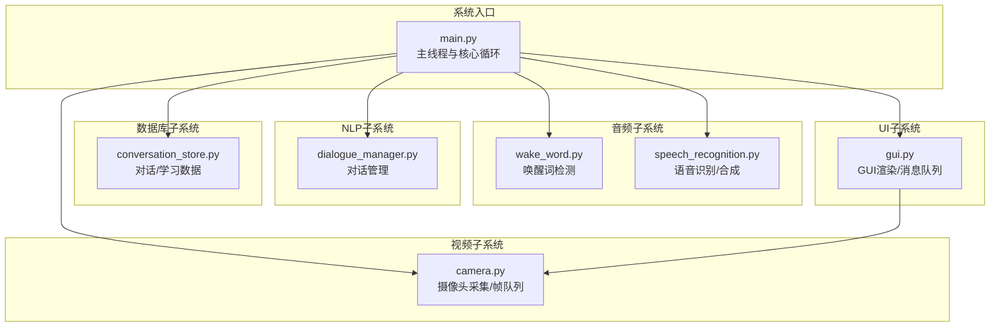
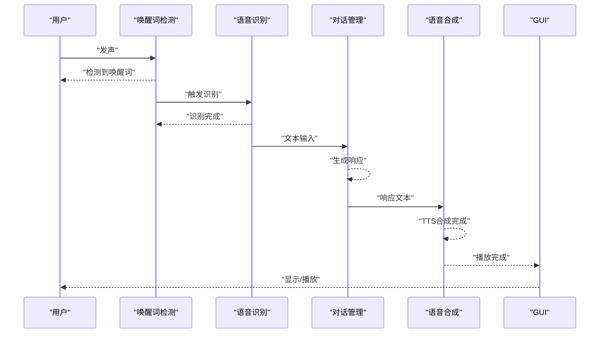
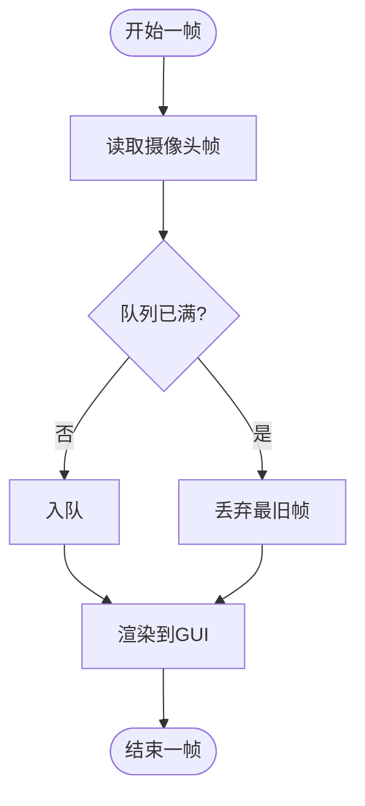
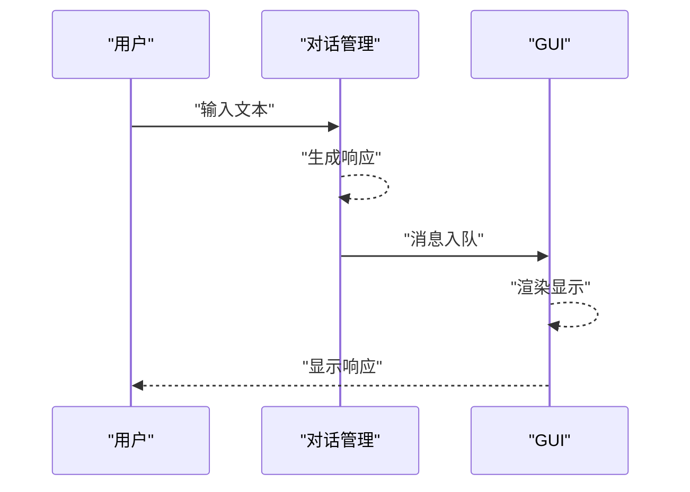

# 性能监控

<cite>
**本文引用的文件列表**
- [main.py](file://main.py)
- [config.yaml](file://config.yaml)
- [requirements.txt](file://requirements.txt)
- [src/audio/wake_word.py](file://src/audio/wake_word.py)
- [src/audio/speech_recognition.py](file://src/audio/speech_recognition.py)
- [src/video/camera.py](file://src/video/camera.py)
- [src/nlp/dialogue_manager.py](file://src/nlp/dialogue_manager.py)
- [src/database/conversation_store.py](file://src/database/conversation_store.py)
- [src/ui/gui.py](file://src/ui/gui.py)
</cite>

## 目录
1. [简介](#简介)
2. [项目结构与监控范围](#项目结构与监控范围)
3. [关键性能指标定义与测量方法](#关键性能指标定义与测量方法)
4. [系统资源监控工具配置与使用](#系统资源监控工具配置与使用)
5. [音频处理延迟监控](#音频处理延迟监控)
6. [视频流质量评估](#视频流质量评估)
7. [对话响应时间统计](#对话响应时间统计)
8. [性能瓶颈识别与优化建议](#性能瓶颈识别与优化建议)
9. [日志分析与错误统计](#日志分析与错误统计)
10. [系统健康检查机制](#系统健康检查机制)
11. [监控告警与自动化运维集成](#监控告警与自动化运维集成)
12. [运维团队性能管理指南](#运维团队性能管理指南)
13. [结论](#结论)

## 简介
本文件面向数字人系统的运维与开发团队，提供一套完整的性能监控方案。内容覆盖CPU使用率、内存占用、音频延迟、视频帧率等关键指标的定义与测量方法；给出系统资源监控工具（如 psutil 库）的配置与使用；包含音频处理延迟监控、视频流质量评估与对话响应时间统计的具体实践；并提供性能瓶颈识别方法、优化建议、日志分析、错误统计与系统健康检查机制，以及监控告警与自动化运维工具的集成思路，帮助团队建立可持续的性能管理体系。

## 项目结构与监控范围
数字人系统采用模块化设计，核心流程由主线程负责GUI交互，后台线程负责核心业务逻辑。监控范围应覆盖以下模块：
- 音频子系统：唤醒词检测、语音识别与语音合成
- 视频子系统：摄像头采集与帧队列
- NLP子系统：对话管理与响应生成
- 数据库子系统：对话记录与学习数据持久化
- UI子系统：GUI渲染与消息队列
- 系统层：日志、配置与资源使用

图表来源
- [main.py:60-116](file://main.py#L60-L116)
- [src/audio/wake_word.py:13-98](file://src/audio/wake_word.py#L13-L98)
- [src/audio/speech_recognition.py:12-89](file://src/audio/speech_recognition.py#L12-L89)
- [src/video/camera.py:12-106](file://src/video/camera.py#L12-L106)
- [src/nlp/dialogue_manager.py:12-102](file://src/nlp/dialogue_manager.py#L12-L102)
- [src/database/conversation_store.py:12-158](file://src/database/conversation_store.py#L12-L158)
- [src/ui/gui.py:16-170](file://src/ui/gui.py#L16-L170)

章节来源
- [main.py:118-138](file://main.py#L118-L138)
- [config.yaml:1-35](file://config.yaml#L1-L35)

## 关键性能指标定义与测量方法
- CPU使用率
  - 定义：进程在采样周期内占用CPU的比例，反映计算密集型任务对CPU的压力。
  - 测量方法：使用 psutil.Process.cpu_percent(interval=1) 或 psutil.cpu_percent(interval=1) 采样；结合系统总CPU与进程级指标进行对比。
  - 适用场景：识别音频/视频处理、NLP推理等高负载阶段的CPU压力峰值。
- 内存占用
  - 定义：进程常驻集大小（RSS）、虚拟内存（VMS）或系统可用内存占比，用于评估内存泄漏与峰值占用。
  - 测量方法：psutil.Process.memory_info().rss、psutil.virtual_memory()；结合队列长度与缓存大小进行关联分析。
  - 适用场景：摄像头帧队列、NLP历史缓冲区、数据库连接池等潜在内存热点。
- 音频延迟
  - 定义：从用户发声到系统语音输出的端到端时延，包含唤醒词检测、语音识别、NLP响应、语音合成等环节。
  - 测量方法：在唤醒词检测开始、语音识别完成、NLP响应生成、语音合成开始/结束等关键点打点计时，计算各段耗时与总时延。
  - 适用场景：优化唤醒词检测灵敏度、识别超时与重试策略、TTS合成参数。
- 视频帧率
  - 定义：摄像头采集帧率与显示帧率，衡量视频链路吞吐能力与渲染效率。
  - 测量方法：统计每秒从摄像头读取并渲染的帧数；结合帧队列长度与丢帧比例评估瓶颈。
  - 适用场景：调整分辨率、FPS、队列容量与渲染频率。
- 对话响应时间
  - 定义：从用户输入到系统回复显示的总时长，包含NLP处理与UI更新。
  - 测量方法：在GUI消息入队与显示之间打点，统计平均与P95/P99分位。
  - 适用场景：优化NLP响应路径与UI渲染队列。

章节来源
- [requirements.txt:26](file://requirements.txt#L26)
- [src/audio/wake_word.py:42-98](file://src/audio/wake_word.py#L42-L98)
- [src/audio/speech_recognition.py:46-85](file://src/audio/speech_recognition.py#L46-L85)
- [src/video/camera.py:55-94](file://src/video/camera.py#L55-L94)
- [src/ui/gui.py:83-98](file://src/ui/gui.py#L83-L98)

## 系统资源监控工具配置与使用
- psutil库集成
  - 安装：已在依赖中声明版本。
  - 基本用法：在系统关键节点（如音频/视频/数据库操作前后）采集CPU、内存、磁盘IO、网络等指标。
  - 建议：按模块维度分别记录指标，便于定位瓶颈模块。
- 自定义监控脚本
  - 建议：编写独立监控脚本，定时采集系统与进程指标，写入本地文件或远程监控平台。
  - 输出格式：JSON/CSV，包含时间戳、模块名、指标名、数值、单位。
- 日志与指标联动
  - 将关键指标与业务日志关联，形成“指标+日志”的双通道观测。

章节来源
- [requirements.txt:26](file://requirements.txt#L26)
- [main.py:47-58](file://main.py#L47-L58)

## 音频处理延迟监控
音频链路涉及唤醒词检测、语音识别、NLP响应与语音合成四个关键阶段。建议在以下位置打点计时：
- 唤醒词检测开始/结束
- 语音识别开始/结束
- NLP响应生成开始/结束
- 语音合成开始/结束

图表来源
- [src/audio/wake_word.py:42-98](file://src/audio/wake_word.py#L42-L98)
- [src/audio/speech_recognition.py:46-85](file://src/audio/speech_recognition.py#L46-L85)
- [src/nlp/dialogue_manager.py:62-73](file://src/nlp/dialogue_manager.py#L62-L73)
- [src/audio/speech_recognition.py:77-85](file://src/audio/speech_recognition.py#L77-L85)
- [main.py:74-100](file://main.py#L74-L100)

章节来源
- [src/audio/wake_word.py:42-98](file://src/audio/wake_word.py#L42-L98)
- [src/audio/speech_recognition.py:46-85](file://src/audio/speech_recognition.py#L46-L85)
- [src/nlp/dialogue_manager.py:62-73](file://src/nlp/dialogue_manager.py#L62-L73)
- [main.py:74-100](file://main.py#L74-L100)

## 视频流质量评估
摄像头采集与渲染链路的关键指标包括：
- 采集帧率：统计每秒读取帧数
- 渲染帧率：统计每秒渲染帧数
- 队列长度与丢帧：队列满导致旧帧丢弃
- 图像处理耗时：帧预处理与边框绘制等

图表来源
- [src/video/camera.py:55-94](file://src/video/camera.py#L55-L94)
- [src/ui/gui.py:100-121](file://src/ui/gui.py#L100-L121)

章节来源
- [src/video/camera.py:27-54](file://src/video/camera.py#L27-L54)
- [src/video/camera.py:55-94](file://src/video/camera.py#L55-L94)
- [src/ui/gui.py:100-121](file://src/ui/gui.py#L100-L121)

## 对话响应时间统计
对话响应时间由NLP处理与UI渲染两部分组成。建议在以下位置打点：
- 用户输入进入对话管理器
- NLP响应生成完成
- GUI消息入队
- GUI消息显示完成

图表来源
- [src/nlp/dialogue_manager.py:62-73](file://src/nlp/dialogue_manager.py#L62-L73)
- [src/ui/gui.py:138-155](file://src/ui/gui.py#L138-L155)

章节来源
- [src/nlp/dialogue_manager.py:62-73](file://src/nlp/dialogue_manager.py#L62-L73)
- [src/ui/gui.py:138-155](file://src/ui/gui.py#L138-L155)

## 性能瓶颈识别与优化建议
- CPU瓶颈
  - 现象：CPU使用率持续接近100%，音频/视频处理卡顿。
  - 识别：结合psutil进程级CPU与系统级CPU对比，定位高负载模块。
  - 优化：降低音频采样率/帧率、减少图像处理复杂度、启用多线程/异步I/O、引入缓存与批处理。
- 内存瓶颈
  - 现象：内存持续增长，频繁GC或OOM。
  - 识别：观察RSS/VMS曲线与队列长度，排查未释放对象与缓存堆积。
  - 优化：控制队列最大长度、定期清理历史缓存、使用弱引用、优化数据结构。
- I/O瓶颈
  - 现象：数据库写入延迟高、文件读写阻塞。
  - 识别：数据库慢查询日志、磁盘IO等待时间。
  - 优化：批量写入、索引优化、异步写入、SSD存储。
- 线程/锁竞争
  - 现象：GUI渲染卡顿、帧队列长时间阻塞。
  - 识别：队列阻塞时间、线程状态。
  - 优化：减少共享状态、使用无锁队列、拆分职责、合理调度。

章节来源
- [src/video/camera.py:24](file://src/video/camera.py#L24)
- [src/ui/gui.py:34](file://src/ui/gui.py#L34)

## 日志分析与错误统计
- 日志级别与字段
  - 级别：INFO/WARNING/ERROR/DEBUG
  - 字段：时间戳、模块名、线程/进程ID、消息体、耗时（可选）
- 错误分类统计
  - 音频：识别超时、设备不可用、异常退出
  - 视频：摄像头打开失败、帧读取失败
  - 数据库：连接失败、写入异常
  - UI：渲染异常、队列阻塞
- 统计口径
  - 每分钟/每小时错误计数、错误分布、Top N错误类型
- 可视化建议
  - 折线图：错误趋势
  - 饼图：错误类型分布
  - 表格：错误详情与恢复措施

章节来源
- [main.py:47-58](file://main.py#L47-L58)
- [src/audio/wake_word.py:91-98](file://src/audio/wake_word.py#L91-L98)
- [src/video/camera.py:51-53](file://src/video/camera.py#L51-L53)
- [src/database/conversation_store.py:24-51](file://src/database/conversation_store.py#L24-L51)

## 系统健康检查机制
- 健康检查项
  - 进程存活：主进程与关键线程健康
  - 资源阈值：CPU/内存/磁盘使用率阈值告警
  - 业务指标：音频/视频/对话处理成功率与延迟
  - I/O健康：数据库连接池可用性、文件系统空间
- 检查频率
  - 实时：CPU/内存/队列长度
  - 周期：数据库/文件系统
- 响应策略
  - 自动重启、降级处理、通知运维

章节来源
- [main.py:118-138](file://main.py#L118-L138)
- [src/database/conversation_store.py:12-23](file://src/database/conversation_store.py#L12-L23)

## 监控告警与自动化运维集成
- 告警阈值
  - CPU使用率 > 90% 持续1分钟
  - 内存RSS > 配置上限 × 80%
  - 音频识别超时率 > 5%
  - 视频丢帧率 > 10%
  - 对话响应P95 > 配置阈值
- 告警渠道
  - 邮件/短信/企业微信/钉钉机器人
- 自动化运维
  - 告警触发自动扩容/降载
  - 自动备份与巡检
  - 故障自愈脚本（重启、切换备用设备）

章节来源
- [config.yaml:32-35](file://config.yaml#L32-L35)

## 运维团队性能管理指南
- 建立指标仪表板
  - CPU/内存/磁盘/网络/业务指标
  - 历史趋势与同比环比
- 制定基线与阈值
  - 不同部署环境（开发/测试/生产）差异化阈值
- 周期性压测
  - 模拟高峰流量，验证系统弹性
- 回归分析
  - 版本升级后对比关键指标，定位回归
- 文档化
  - 指标定义、采集方法、阈值、处置流程

章节来源
- [requirements.txt:1-27](file://requirements.txt#L1-L27)
- [config.yaml:1-35](file://config.yaml#L1-L35)

## 结论
通过将系统资源监控、音频/视频/对话链路的性能指标与日志、健康检查、告警与自动化运维相结合，数字人系统可以在稳定运行的同时持续优化性能。建议优先完善音频/视频链路的端到端时延与丢帧统计，配合psutil与自定义监控脚本，逐步构建完善的可观测性体系，并根据业务发展动态调整阈值与优化策略。