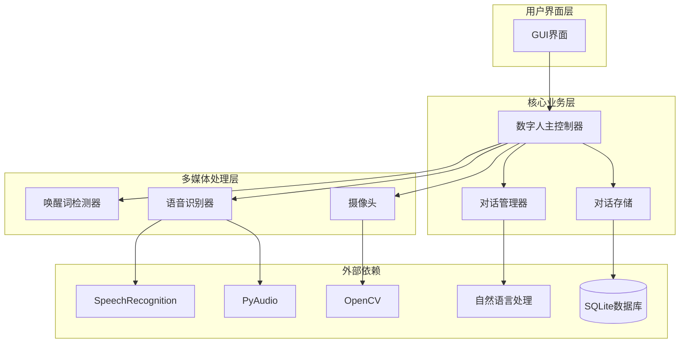
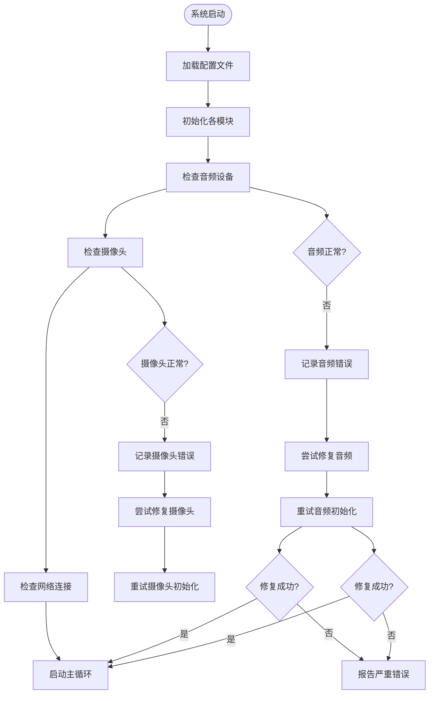
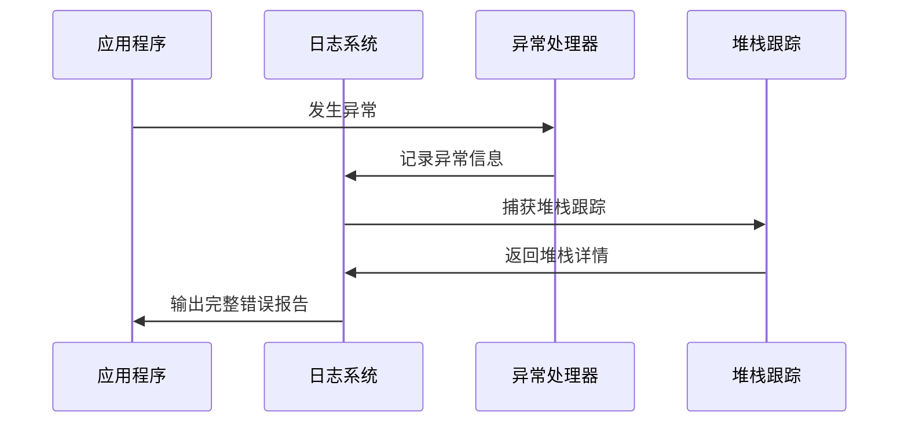
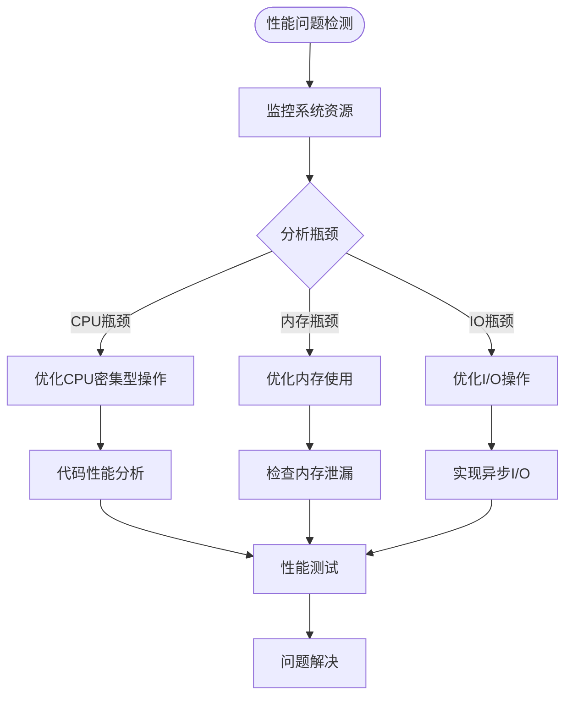
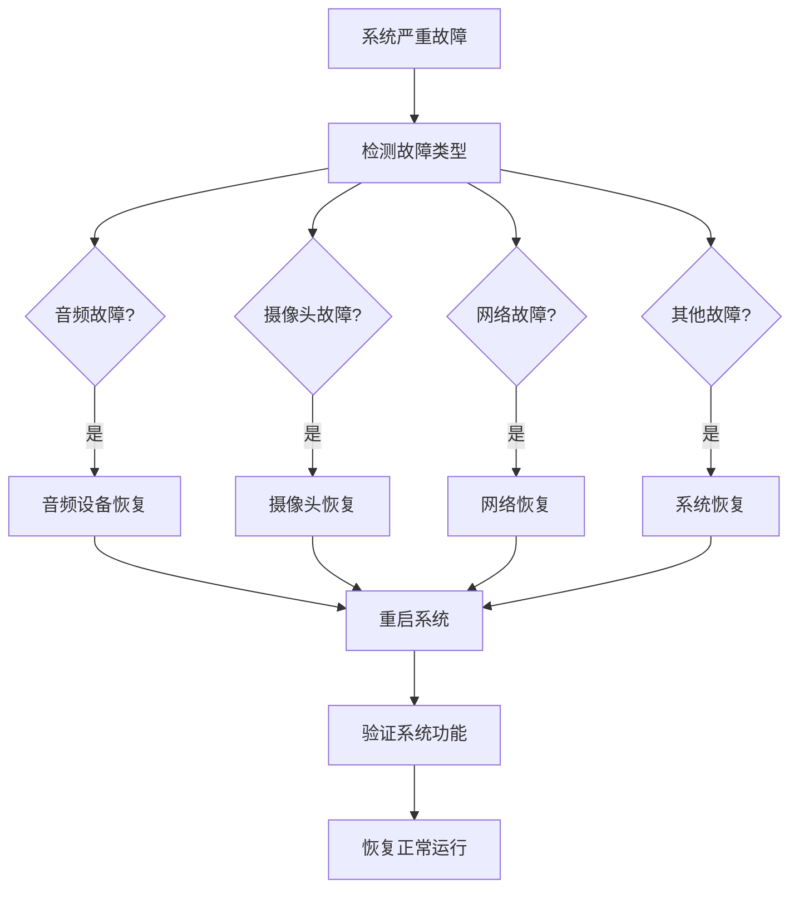

# 故障排除

<cite>
**本文档引用的文件**
- [main.py](file://main.py)
- [config.yaml](file://config.yaml)
- [requirements.txt](file://requirements.txt)
- [src/audio/speech_recognition.py](file://src/audio/speech_recognition.py)
- [src/audio/wake_word.py](file://src/audio/wake_word.py)
- [src/video/camera.py](file://src/video/camera.py)
- [src/nlp/dialogue_manager.py](file://src/nlp/dialogue_manager.py)
- [src/database/conversation_store.py](file://src/database/conversation_store.py)
- [src/ui/gui.py](file://src/ui/gui.py)
</cite>

## 目录
1. [简介](#简介)
2. [系统架构概览](#系统架构概览)
3. [常见问题诊断](#常见问题诊断)
4. [音频设备故障排除](#音频设备故障排除)
5. [摄像头连接故障排除](#摄像头连接故障排除)
6. [语音识别问题诊断](#语音识别问题诊断)
7. [系统诊断工具](#系统诊断工具)
8. [日志分析指南](#日志分析指南)
9. [硬件兼容性排查](#硬件兼容性排查)
10. [网络相关问题](#网络相关问题)
11. [性能问题诊断](#性能问题诊断)
12. [紧急故障处理](#紧急故障处理)
13. [系统回滚策略](#系统回滚策略)
14. [结论](#结论)

## 简介

数字人系统是一个集成了语音识别、视频处理、自然语言处理和对话管理的综合性AI应用。本故障排除指南旨在为技术支持人员提供全面的问题诊断和解决方法，涵盖从硬件兼容性到系统性能的各个方面。

## 系统架构概览

数字人系统采用模块化架构设计，主要由以下核心组件构成：



**图表来源**
- [main.py:21-39](file://main.py#L21-L39)
- [src/audio/speech_recognition.py:12-28](file://src/audio/speech_recognition.py#L12-L28)
- [src/audio/wake_word.py:13-32](file://src/audio/wake_word.py#L13-L32)
- [src/video/camera.py:12-26](file://src/video/camera.py#L12-L26)

**章节来源**
- [main.py:21-39](file://main.py#L21-L39)
- [config.yaml:1-35](file://config.yaml#L1-L35)

## 常见问题诊断

### 系统启动问题

**症状表现：**
- 系统启动后立即退出
- 启动过程中出现异常中断
- GUI界面无法正常显示

**可能原因：**
1. 配置文件路径错误
2. 依赖包版本不兼容
3. 权限不足导致的资源访问失败
4. 线程同步问题

**解决步骤：**
1. 验证配置文件路径和格式
2. 检查Python环境和依赖包版本
3. 确认系统权限设置
4. 查看启动日志中的具体错误信息

**章节来源**
- [main.py:41-58](file://main.py#L41-L58)
- [main.py:118-138](file://main.py#L118-L138)

## 音频设备故障排除

### 麦克风无法识别

**症状表现：**
- 语音识别模块启动时报错
- 唤醒词检测器无法捕获音频
- 系统提示音频设备不可用

**原因分析：**
1. 麦克风设备未正确连接
2. 音频驱动程序缺失或损坏
3. Python音频库依赖未正确安装
4. 系统权限未授予音频访问权限

**解决步骤：**

1. **硬件检查**
   - 确认麦克风物理连接正常
   - 检查设备管理器中的音频设备状态
   - 验证音频输入设备是否被系统识别

2. **软件验证**
   ```bash
   pip install pyaudio speechrecognition
   ```

3. **权限配置**
   - Linux: `sudo usermod -a -G audio $USER`
   - Windows: 以管理员身份运行程序
   - macOS: 检查系统偏好设置中的隐私权限

4. **代码级诊断**
   - 检查音频采样率设置（16kHz）
   - 验证音频缓冲区配置
   - 确认音频设备索引正确

**章节来源**
- [src/audio/speech_recognition.py:46-76](file://src/audio/speech_recognition.py#L46-L76)
- [src/audio/wake_word.py:42-98](file://src/audio/wake_word.py#L42-L98)

### 语音识别不准确

**症状表现：**
- 语音转文本结果错误
- 识别率低且不稳定
- 特定词汇经常识别失败

**原因分析：**
1. 环境噪音干扰
2. 麦克风质量差
3. 识别参数配置不当
4. 语言模型不匹配

**解决步骤：**

1. **环境优化**
   - 减少背景噪音
   - 使用降噪耳机
   - 保持稳定的音频输入

2. **参数调整**
   - 调整识别超时时间
   - 修改语言设置
   - 优化音频阈值

3. **模型训练**
   - 收集更多训练数据
   - 定期更新识别模型
   - 校准音频设备

**章节来源**
- [src/audio/speech_recognition.py:13-28](file://src/audio/speech_recognition.py#L13-L28)
- [config.yaml:9-14](file://config.yaml#L9-L14)

## 摄像头连接故障排除

### 摄像头无法启动

**症状表现：**
- 摄像头模块初始化失败
- 界面显示黑屏或无画面
- 系统提示摄像头不可用

**原因分析：**
1. 摄像头硬件故障
2. USB接口或驱动问题
3. OpenCV库版本不兼容
4. 权限不足访问摄像头

**解决步骤：**

1. **硬件检查**
   - 确认摄像头物理连接
   - 测试其他USB端口
   - 验证摄像头指示灯状态

2. **软件验证**
   ```bash
   pip install opencv-python
   ```

3. **权限配置**
   - Linux: `sudo usermod -a -G video $USER`
   - Windows: 以管理员权限运行
   - macOS: 检查隐私设置

4. **参数验证**
   - 检查摄像头索引设置
   - 验证分辨率和帧率配置
   - 确认视频格式支持

**章节来源**
- [src/video/camera.py:27-53](file://src/video/camera.py#L27-L53)
- [config.yaml:15-21](file://config.yaml#L15-L21)

### 视频画面异常

**症状表现：**
- 画面模糊或失真
- 帧率过低
- 色彩异常或亮度不足

**原因分析：**
1. 摄像头镜头脏污
2. 分辨率设置过高
3. 灯光条件不佳
4. CPU性能不足

**解决步骤：**

1. **硬件清洁**
   - 清洁摄像头镜头
   - 检查镜头保护膜
   - 确保良好的光线条件

2. **参数优化**
   - 降低分辨率设置
   - 调整帧率参数
   - 优化图像处理算法

3. **性能监控**
   - 监控CPU使用率
   - 检查内存占用
   - 监控磁盘I/O

**章节来源**
- [src/video/camera.py:89-94](file://src/video/camera.py#L89-L94)
- [src/video/camera.py:74-87](file://src/video/camera.py#L74-L87)

## 语音识别问题诊断

### 唤醒词检测失败

**症状表现：**
- 系统无法检测到唤醒词
- 唤醒词误触发频繁
- 唤醒响应延迟高

**原因分析：**
1. 唤醒词阈值设置不当
2. 音频质量差
3. 语音模型训练不足
4. 环境噪音干扰

**解决步骤：**

1. **阈值调整**
   - 根据环境噪音调整音频阈值
   - 优化唤醒词检测灵敏度
   - 平衡误检和漏检率

2. **模型优化**
   - 收集更多唤醒词样本
   - 训练专用唤醒词模型
   - 实现更精确的语音特征提取

3. **环境改善**
   - 减少背景噪音
   - 优化麦克风位置
   - 控制房间声学环境

**章节来源**
- [src/audio/wake_word.py:42-98](file://src/audio/wake_word.py#L42-L98)
- [config.yaml:4-8](file://config.yaml#L4-L8)

### 语音合成问题

**症状表现：**
- 语音输出质量差
- 语速异常
- 无法识别特定语音

**原因分析：**
1. TTS引擎配置问题
2. 语音库文件缺失
3. 系统语言设置不匹配
4. 音频输出设备故障

**解决步骤：**

1. **引擎配置**
   - 检查TTS引擎初始化
   - 验证语音库完整性
   - 确认语言支持

2. **设备测试**
   - 测试扬声器或耳机
   - 验证音频输出路由
   - 检查音量设置

3. **参数优化**
   - 调整语速和音量
   - 选择合适的语音
   - 优化音频输出质量

**章节来源**
- [src/audio/speech_recognition.py:29-44](file://src/audio/speech_recognition.py#L29-L44)
- [src/audio/speech_recognition.py:77-85](file://src/audio/speech_recognition.py#L77-L85)

## 系统诊断工具

### 内置诊断功能

系统提供了完善的日志记录和错误处理机制：



**图表来源**
- [main.py:60-116](file://main.py#L60-L116)
- [src/audio/speech_recognition.py:46-76](file://src/audio/speech_recognition.py#L46-L76)
- [src/video/camera.py:27-53](file://src/video/camera.py#L27-L53)

### 日志分析工具

系统使用结构化日志记录所有关键操作：

**日志级别说明：**
- DEBUG: 详细的技术信息，用于开发调试
- INFO: 正常运行状态信息
- WARNING: 可能的问题但不影响运行
- ERROR: 发生错误但系统可恢复
- CRITICAL: 严重错误，可能导致系统停止

**日志文件位置：**
- 默认日志文件: `digital_human.log`
- 日志轮转: 自动按大小分割

**章节来源**
- [main.py:47-58](file://main.py#L47-L58)
- [main.py:111-116](file://main.py#L111-L116)

## 日志分析指南

### 关键日志模式识别

**音频相关日志：**
```
"正在监听唤醒词..."
"检测到语音..."
"识别结果: "
"无法识别语音"
"请求错误:"
```

**视频相关日志：**
```
"摄像头启动成功"
"无法打开摄像头"
"摄像头画面标签"
"更新摄像头画面"
```

**系统相关日志：**
```
"数字人系统初始化完成"
"系统被用户中断"
"数字人系统已停止"
```

### 错误码解读

**音频模块错误码：**
- WaitTimeoutError: 识别超时
- UnknownValueError: 无法识别的语音
- RequestError: 语音识别服务请求失败

**视频模块错误码：**
- CameraOpenError: 摄像头打开失败
- FrameReadError: 帧读取异常
- QueueFullError: 图像队列满

**章节来源**
- [src/audio/speech_recognition.py:67-75](file://src/audio/speech_recognition.py#L67-L75)
- [src/video/camera.py:51-53](file://src/video/camera.py#L51-L53)

### 堆栈跟踪分析

当发生异常时，系统会记录详细的堆栈信息：



**图表来源**
- [main.py:111-116](file://main.py#L111-L116)
- [src/audio/speech_recognition.py:83-85](file://src/audio/speech_recognition.py#L83-L85)

## 硬件兼容性排查

### 音频硬件兼容性

**支持的音频设备：**
- USB麦克风
- 蓝牙音频设备
- 内置笔记本麦克风
- 外置音频接口

**兼容性检查清单：**
1. 音频采样率支持 (16kHz)
2. 音频格式兼容 (PCM)
3. 设备权限配置
4. 驱动程序版本

**章节来源**
- [src/audio/wake_word.py:20-25](file://src/audio/wake_word.py#L20-L25)
- [requirements.txt:5-10](file://requirements.txt#L5-L10)

### 视频硬件兼容性

**支持的摄像头类型：**
- USB摄像头
- HDMI摄像头
- 网络摄像头
- 外置视频采集卡

**兼容性检查清单：**
1. OpenCV支持的视频格式
2. 分辨率和帧率要求
3. USB带宽限制
4. 驱动程序兼容性

**章节来源**
- [src/video/camera.py:12-26](file://src/video/camera.py#L12-L26)
- [requirements.txt:11-13](file://requirements.txt#L11-L13)

### 系统权限配置

**Linux权限配置：**
```bash
# 音频权限
sudo usermod -a -G audio $USER

# 摄像头权限  
sudo usermod -a -G video $USER

# 重启生效
sudo reboot
```

**Windows权限配置：**
- 以管理员身份运行
- 检查设备管理器中的权限设置
- 验证音频和视频服务状态

**macOS权限配置：**
- 系统偏好设置 -> 隐私 -> 麦克风
- 系统偏好设置 -> 隐私 -> 摄像头
- 重新启动相关应用程序

## 网络相关问题

### 语音识别网络问题

**症状表现：**
- 语音识别服务连接超时
- 识别结果延迟过高
- 服务不可用错误

**原因分析：**
1. 网络连接不稳定
2. 防火墙阻止连接
3. DNS解析问题
4. 代理服务器配置

**解决步骤：**

1. **网络连通性测试**
   ```bash
   ping google.com
   ping api.google.com
   ```

2. **防火墙配置**
   - 允许Python进程网络访问
   - 开放必要的端口
   - 配置代理设置

3. **DNS优化**
   - 更换DNS服务器
   - 清除DNS缓存
   - 验证域名解析

**章节来源**
- [src/audio/speech_recognition.py:62-75](file://src/audio/speech_recognition.py#L62-L75)

### 在线服务配置

**配置选项：**
- 识别服务API密钥
- 服务端点URL
- 超时参数设置
- 重试机制配置

**故障排除流程：**
1. 验证API密钥有效性
2. 检查服务端点可达性
3. 配置适当的超时值
4. 实现优雅的降级策略

## 性能问题诊断

### 资源监控

**CPU使用率监控：**
- 唤醒词检测: 5-15%
- 语音识别: 20-40%
- 视频处理: 30-60%
- 对话管理: 2-5%

**内存使用监控：**
- 摄像头帧缓冲: 10-50MB
- 语音识别缓存: 5-20MB
- 对话历史: 1-10MB
- 数据库缓存: 10-50MB

### 并发处理异常

**线程安全问题：**
1. GUI线程与工作线程同步
2. 摄像头帧队列管理
3. 音频流控制
4. 数据库连接池

**性能优化建议：**
1. 调整线程优先级
2. 优化队列大小
3. 实现背压机制
4. 使用异步I/O



**图表来源**
- [src/video/camera.py:24-25](file://src/video/camera.py#L24-L25)
- [src/ui/gui.py:34](file://src/ui/gui.py#L34)

**章节来源**
- [src/ui/gui.py:83-98](file://src/ui/gui.py#L83-L98)
- [src/video/camera.py:55-72](file://src/video/camera.py#L55-L72)

## 紧急故障处理

### 快速恢复流程



### 紧急停机程序

**强制停止序列：**
1. 捕获键盘中断信号
2. 关闭所有音频设备
3. 释放摄像头资源
4. 提交数据库事务
5. 关闭GUI界面
6. 清理临时文件

**章节来源**
- [main.py:111-116](file://main.py#L111-L116)
- [src/audio/wake_word.py:93-98](file://src/audio/wake_word.py#L93-L98)
- [src/video/camera.py:96-106](file://src/video/camera.py#L96-L106)

## 系统回滚策略

### 版本管理

**版本控制策略：**
1. 使用Git进行版本管理
2. 重要配置文件备份
3. 依赖包版本锁定
4. 环境隔离

**回滚步骤：**
1. 备份当前配置和数据
2. 恢复上一个稳定版本
3. 验证系统功能
4. 更新依赖包版本
5. 测试关键功能

### 数据备份策略

**数据库备份：**
- 定期自动备份
- 增量备份策略
- 远程备份存储
- 备份验证机制

**配置备份：**
- 配置文件版本控制
- 环境变量备份
- 用户自定义设置
- 系统权限配置

**章节来源**
- [src/database/conversation_store.py:53-80](file://src/database/conversation_store.py#L53-L80)
- [src/database/conversation_store.py:142-158](file://src/database/conversation_store.py#L142-L158)

## 结论

数字人系统的故障排除需要综合考虑硬件、软件、网络和系统层面的各种因素。通过建立完善的诊断工具、日志分析机制和应急处理流程，可以有效提高系统的稳定性和可靠性。

**关键要点总结：**
1. 建立标准化的故障排除流程
2. 完善的日志记录和分析机制
3. 硬件兼容性预检查
4. 网络连接稳定性保障
5. 性能监控和预警机制
6. 紧急故障快速恢复能力

通过遵循本指南提供的方法和步骤，技术支持人员可以快速定位和解决数字人系统中的各种问题，确保系统的稳定运行和用户体验。