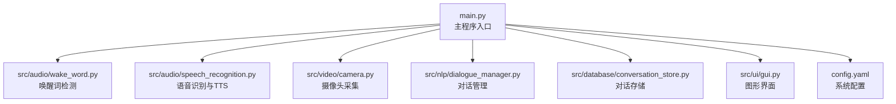
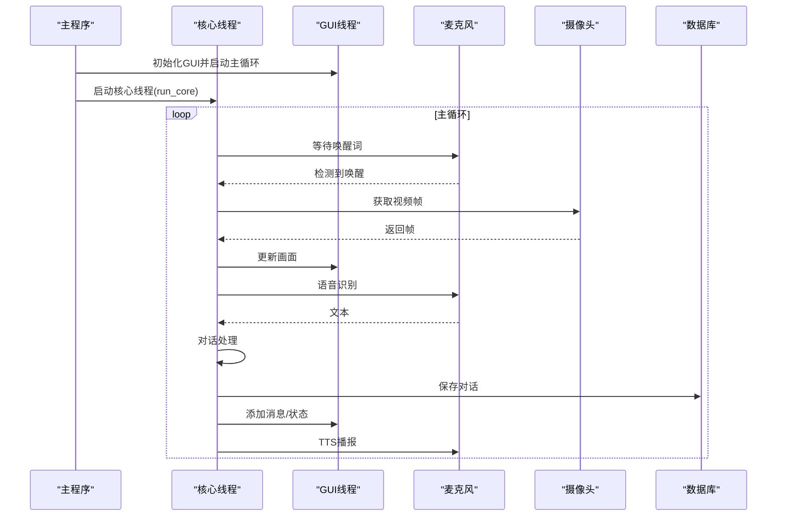
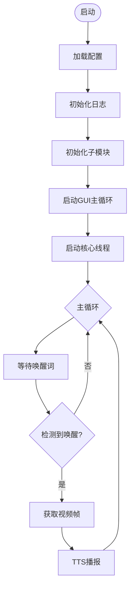
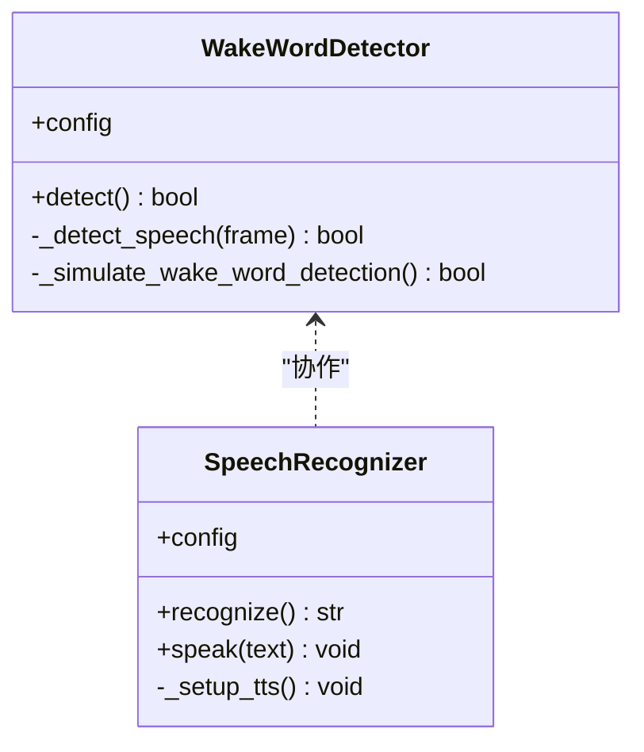
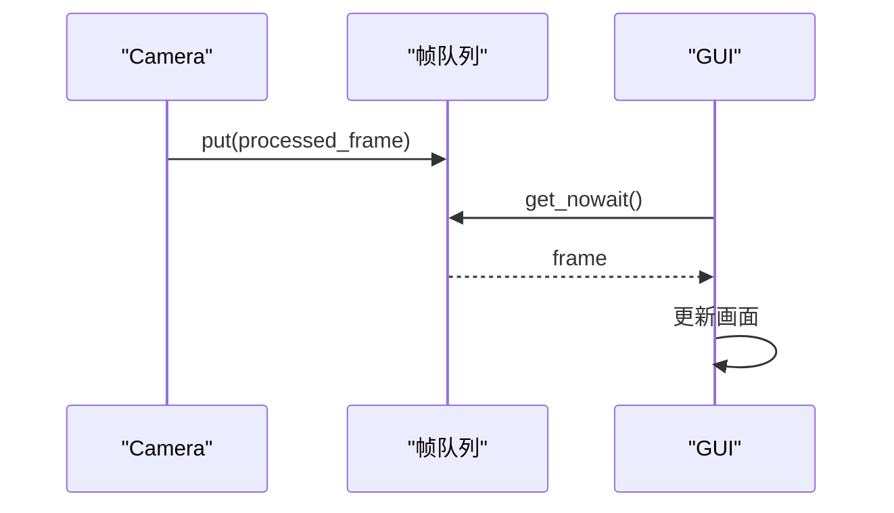
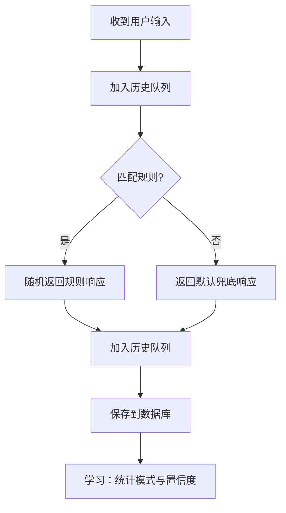
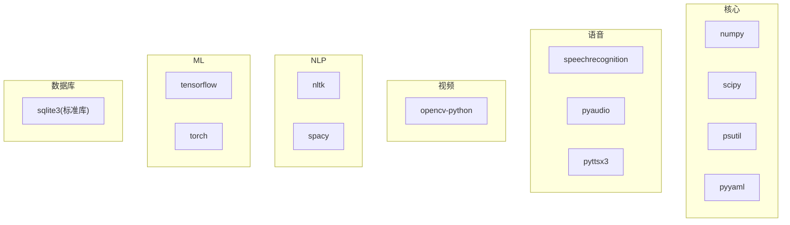

# 生产环境部署

<cite>
**本文档引用的文件**
- [main.py](file://main.py)
- [config.yaml](file://config.yaml)
- [requirements.txt](file://requirements.txt)
- [src/audio/speech_recognition.py](file://src/audio/speech_recognition.py)
- [src/audio/wake_word.py](file://src/audio/wake_word.py)
- [src/video/camera.py](file://src/video/camera.py)
- [src/nlp/dialogue_manager.py](file://src/nlp/dialogue_manager.py)
- [src/database/conversation_store.py](file://src/database/conversation_store.py)
- [src/ui/gui.py](file://src/ui/gui.py)
</cite>

## 目录
1. [简介](#简介)
2. [项目结构](#项目结构)
3. [核心组件](#核心组件)
4. [架构总览](#架构总览)
5. [详细组件分析](#详细组件分析)
6. [依赖分析](#依赖分析)
7. [性能考虑](#性能考虑)
8. [故障排除指南](#故障排除指南)
9. [结论](#结论)
10. [附录](#附录)

## 简介
本指南面向系统管理员与运维工程师，提供数字人系统在生产环境中的完整部署实施手册。内容覆盖：
- 安装步骤与环境准备
- 平台差异（Windows、Linux、macOS）
- 虚拟环境创建、依赖安装与配置文件设置
- 系统服务化部署、开机自启动与进程管理
- 硬件要求评估、性能基准与容量规划
- Docker容器化与Kubernetes集群部署策略

## 项目结构
系统采用模块化设计，核心入口负责协调各子系统（语音唤醒、语音识别、视频采集、对话管理、数据库、UI）。配置集中于YAML文件，便于在不同环境中快速切换。

图表来源
- [main.py:118-138](file://main.py#L118-L138)
- [config.yaml:1-35](file://config.yaml#L1-L35)

章节来源
- [main.py:118-138](file://main.py#L118-L138)
- [config.yaml:1-35](file://config.yaml#L1-L35)

## 核心组件
- 主程序 DigitalHuman：负责加载配置、初始化各子模块、协调运行与资源清理。
- 语音唤醒 WakeWordDetector：基于能量检测与简单关键词匹配，监听麦克风并触发对话。
- 语音识别 SpeechRecognizer：使用麦克风采集音频，调用识别引擎转文本，并支持TTS播报。
- 摄像头 Camera：多线程采集视频帧，维护环形队列，供UI显示与后续处理。
- 对话管理 DialogueManager：基于规则的对话引擎，维护对话历史，生成响应。
- 数据库存储 ConversationStore：SQLite持久化，支持对话记录与“学习”机制。
- 图形界面 GUI：基于Tkinter的实时显示，支持摄像头画面、对话历史与状态提示。

章节来源
- [main.py:21-40](file://main.py#L21-L40)
- [src/audio/wake_word.py:13-32](file://src/audio/wake_word.py#L13-L32)
- [src/audio/speech_recognition.py:12-28](file://src/audio/speech_recognition.py#L12-L28)
- [src/video/camera.py:12-26](file://src/video/camera.py#L12-L26)
- [src/nlp/dialogue_manager.py:12-24](file://src/nlp/dialogue_manager.py#L12-L24)
- [src/database/conversation_store.py:12-23](file://src/database/conversation_store.py#L12-L23)
- [src/ui/gui.py:16-35](file://src/ui/gui.py#L16-L35)

## 架构总览
系统采用主控线程+多子线程的并发模型：主程序负责GUI生命周期；核心业务在独立线程中运行，通过队列与UI交互，确保界面流畅与实时性。

图表来源
- [main.py:118-138](file://main.py#L118-L138)
- [main.py:60-116](file://main.py#L60-L116)
- [src/audio/wake_word.py:42-98](file://src/audio/wake_word.py#L42-L98)
- [src/audio/speech_recognition.py:46-85](file://src/audio/speech_recognition.py#L46-L85)
- [src/video/camera.py:27-53](file://src/video/camera.py#L27-L53)
- [src/database/conversation_store.py:53-66](file://src/database/conversation_store.py#L53-L66)
- [src/ui/gui.py:62-82](file://src/ui/gui.py#L62-L82)

## 详细组件分析

### 组件A：主程序与生命周期
- 初始化阶段：加载配置、设置日志、实例化各子模块。
- 运行阶段：核心线程持续循环，按顺序执行唤醒检测、视频采集、语音识别、对话处理、存储与播报。
- 清理阶段：捕获中断信号，释放摄像头资源，输出停止日志。

图表来源
- [main.py:21-40](file://main.py#L21-L40)
- [main.py:60-116](file://main.py#L60-L116)
- [main.py:118-138](file://main.py#L118-L138)

章节来源
- [main.py:21-40](file://main.py#L21-L40)
- [main.py:60-116](file://main.py#L60-L116)
- [main.py:118-138](file://main.py#L118-L138)

### 组件B：语音唤醒与识别
- WakeWordDetector：基于PyAudio采集音频，按能量阈值判断语音活动，模拟唤醒词检测。
- SpeechRecognizer：使用麦克风采集，调整环境噪声后识别文本，支持中文TTS播报。

图表来源
- [src/audio/wake_word.py:13-32](file://src/audio/wake_word.py#L13-L32)
- [src/audio/wake_word.py:42-98](file://src/audio/wake_word.py#L42-L98)
- [src/audio/speech_recognition.py:12-28](file://src/audio/speech_recognition.py#L12-L28)
- [src/audio/speech_recognition.py:46-85](file://src/audio/speech_recognition.py#L46-L85)

章节来源
- [src/audio/wake_word.py:13-32](file://src/audio/wake_word.py#L13-L32)
- [src/audio/wake_word.py:42-98](file://src/audio/wake_word.py#L42-L98)
- [src/audio/speech_recognition.py:12-28](file://src/audio/speech_recognition.py#L12-L28)
- [src/audio/speech_recognition.py:46-85](file://src/audio/speech_recognition.py#L46-L85)

### 组件C：摄像头与视频处理
- Camera：多线程采集视频帧，设置分辨率与FPS，维护固定大小队列，自动丢弃过旧帧。
- GUI：接收帧并转换为图像显示，同时维护消息与状态更新队列。

图表来源
- [src/video/camera.py:27-53](file://src/video/camera.py#L27-L53)
- [src/video/camera.py:89-95](file://src/video/camera.py#L89-L95)
- [src/ui/gui.py:100-121](file://src/ui/gui.py#L100-L121)

章节来源
- [src/video/camera.py:12-26](file://src/video/camera.py#L12-L26)
- [src/video/camera.py:55-87](file://src/video/camera.py#L55-L87)
- [src/ui/gui.py:16-35](file://src/ui/gui.py#L16-L35)

### 组件D：对话管理与学习
- DialogueManager：基于规则匹配生成响应，维护有限长度的历史队列。
- ConversationStore：SQLite持久化，提供保存对话、学习模式、查询与清理能力。

图表来源
- [src/nlp/dialogue_manager.py:62-94](file://src/nlp/dialogue_manager.py#L62-L94)
- [src/database/conversation_store.py:53-66](file://src/database/conversation_store.py#L53-L66)
- [src/database/conversation_store.py:82-125](file://src/database/conversation_store.py#L82-L125)

章节来源
- [src/nlp/dialogue_manager.py:12-24](file://src/nlp/dialogue_manager.py#L12-L24)
- [src/nlp/dialogue_manager.py:62-94](file://src/nlp/dialogue_manager.py#L62-L94)
- [src/database/conversation_store.py:12-23](file://src/database/conversation_store.py#L12-L23)
- [src/database/conversation_store.py:53-66](file://src/database/conversation_store.py#L53-L66)
- [src/database/conversation_store.py:82-125](file://src/database/conversation_store.py#L82-L125)

## 依赖分析
系统依赖分为核心库、语音处理、视频处理、NLP、机器学习、数据库与工具类。建议在隔离环境中安装，避免版本冲突。

图表来源
- [requirements.txt:1-27](file://requirements.txt#L1-L27)

章节来源
- [requirements.txt:1-27](file://requirements.txt#L1-L27)

## 性能考虑
- CPU与GPU：语音识别与TTS对CPU压力较大；若部署在服务器端，建议启用GPU加速（如CUDA）以提升推理速度。
- 内存：多线程采集与队列缓存会占用内存，建议监控内存峰值并合理设置队列大小。
- I/O：数据库写入与文件日志可能成为瓶颈，建议使用SSD与异步写入策略。
- 网络：语音识别依赖在线API（如Google Web Speech），需评估网络延迟与可用性。
- 实时性：主循环中存在固定休眠，可根据硬件性能微调以平衡CPU占用与响应速度。

[本节为通用性能指导，不直接分析具体文件]

## 故障排除指南
- 无法打开摄像头：确认设备权限与索引号；检查分辨率与FPS设置是否受支持。
- 语音识别失败：检查麦克风权限与驱动；调整环境噪声补偿与超时参数。
- GUI卡顿：减少帧率或降低分辨率；优化队列大小与刷新频率。
- 日志异常：确认日志路径可写；检查日志级别与格式配置。
- 数据库锁：避免并发写入高峰；必要时引入连接池或只读副本。

章节来源
- [src/video/camera.py:27-53](file://src/video/camera.py#L27-L53)
- [src/audio/speech_recognition.py:46-85](file://src/audio/speech_recognition.py#L46-L85)
- [src/ui/gui.py:62-82](file://src/ui/gui.py#L62-L82)
- [src/database/conversation_store.py:24-51](file://src/database/conversation_store.py#L24-L51)

## 结论
本部署指南提供了从环境准备到生产落地的全链路方案。通过模块化架构与清晰的配置分离，系统可在多平台上稳定运行。建议结合硬件实测与压测结果，制定容量规划与高可用策略，并在生产中引入监控与告警体系。

[本节为总结性内容，不直接分析具体文件]

## 附录

### A. 安装与环境准备
- Python版本：建议使用3.8及以上版本，优先选择长期支持版。
- 虚拟环境：推荐使用venv或conda创建隔离环境，避免系统级依赖污染。
- 权限与驱动：
  - Windows/macOS：确保麦克风与摄像头权限已授予。
  - Linux：安装PulseAudio或ALSA相关开发包，确保OpenCV与PyAudio可用。

章节来源
- [requirements.txt:1-27](file://requirements.txt#L1-L27)

### B. 依赖安装与配置
- 安装命令示例（建议先激活虚拟环境）：
  - pip install -r requirements.txt
- 配置文件位置与关键项：
  - config.yaml位于项目根目录，包含唤醒词模型路径、语音识别语言与超时、摄像头参数、NLP模型路径、数据库路径、系统日志级别等。
- 模型与数据目录：
  - 确保模型与数据库目录存在且可写；首次运行会自动创建数据库表。

章节来源
- [config.yaml:1-35](file://config.yaml#L1-L35)
- [src/database/conversation_store.py:18-22](file://src/database/conversation_store.py#L18-L22)

### C. 平台差异与注意事项
- Windows
  - 音频：PyAudio在Windows上通常可直接安装；若遇到编译问题，可尝试预编译wheel。
  - GUI：Tkinter随Python发行，无需额外安装。
- Linux
  - 需要安装系统依赖（如libasound-dev、portaudio19-dev等），以支持PyAudio与OpenCV。
  - 可通过包管理器安装Python依赖，或使用pip在虚拟环境中安装。
- macOS
  - 若使用Homebrew，请确保Python来自brew而非系统自带。
  - 音频与摄像头权限需在系统偏好设置中授权。

[本节为通用平台差异说明，不直接分析具体文件]

### D. 系统服务化与开机自启
- systemd（Linux）：编写服务单元文件，设置User、WorkingDirectory、ExecStart、Restart等；使用systemctl enable开机自启。
- Windows：使用任务计划程序或NSSM将Python脚本注册为服务；注意以合适账户运行并授予设备访问权限。
- macOS：使用launchd或pm2（第三方）管理进程；确保登录项或守护进程具备音频与摄像头权限。

[本节为通用服务化部署建议，不直接分析具体文件]

### E. 进程管理与监控
- 推荐使用进程管理器（如supervisord、pm2、systemd）管理主程序进程，实现自动重启与日志轮转。
- 监控指标：CPU使用率、内存占用、磁盘空间、数据库写入延迟、网络请求成功率。
- 告警策略：进程退出、数据库异常、网络超时、摄像头/麦克风不可用等。

[本节为通用运维建议，不直接分析具体文件]

### F. 硬件要求评估与容量规划
- CPU：至少4核，建议8核以上用于多线程与推理加速。
- 内存：建议8GB起步，根据并发会话数与历史长度动态调整。
- 存储：SSD优先；数据库与日志目录预留足够空间。
- 网络：稳定的互联网连接，满足语音识别API调用。
- 摄像头与麦克风：支持USB接口，分辨率与采样率符合配置需求。

[本节为通用硬件建议，不直接分析具体文件]

### G. Docker容器化部署
- 基础镜像：选择官方Python运行时镜像，或基于Debian/Alpine的轻量镜像。
- 安装步骤要点：
  - 在容器内创建并激活虚拟环境。
  - 复制requirements.txt并安装依赖。
  - 挂载宿主机音频与视频设备（/dev/snd、/dev/video*）。
  - 挂载配置文件与数据目录（数据库、模型）。
  - 暴露必要的端口（如Web服务，若扩展）。
- 注意事项：
  - GUI在容器中无法直接显示，建议仅运行服务端或通过X11转发。
  - 确保容器以非root用户运行（安全考虑）。

[本节为通用容器化建议，不直接分析具体文件]

### H. Kubernetes集群部署策略
- 工作负载：使用Deployment管理Pod副本，确保高可用。
- 资源限制：为CPU与内存设置requests/limits，避免资源争抢。
- 设备访问：通过hostPID、hostNetwork或设备直通（device plugins）方式访问音频/视频设备。
- 存储：使用PersistentVolume挂载数据库与模型目录，确保数据持久化。
- 网络：暴露必要端口，配置Ingress与TLS（如需远程访问）。
- 监控与日志：集成Prometheus/Grafana与ELK栈，统一收集指标与日志。

[本节为通用Kubernetes建议，不直接分析具体文件]