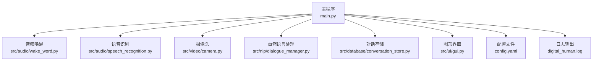
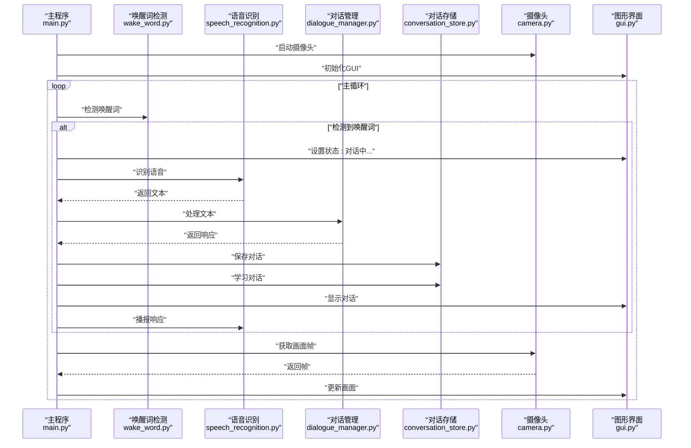
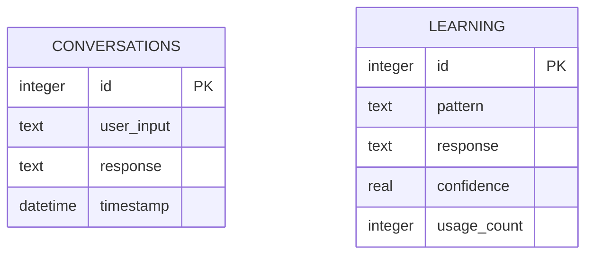
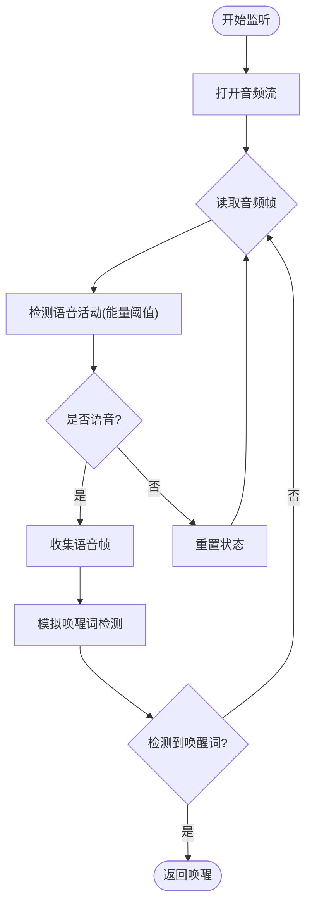
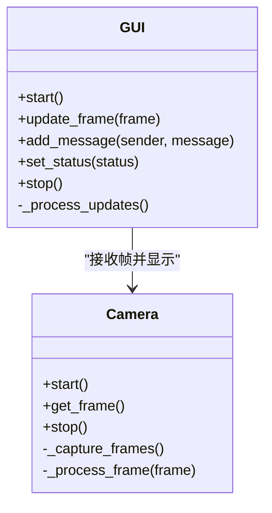
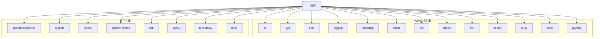

# 系统维护

<cite>
**本文档引用的文件**
- [main.py](file://main.py)
- [config.yaml](file://config.yaml)
- [requirements.txt](file://requirements.txt)
- [src/database/conversation_store.py](file://src/database/conversation_store.py)
- [src/audio/speech_recognition.py](file://src/audio/speech_recognition.py)
- [src/audio/wake_word.py](file://src/audio/wake_word.py)
- [src/video/camera.py](file://src/video/camera.py)
- [src/nlp/dialogue_manager.py](file://src/nlp/dialogue_manager.py)
- [src/ui/gui.py](file://src/ui/gui.py)
</cite>

## 目录
1. [简介](#简介)
2. [项目结构](#项目结构)
3. [核心组件](#核心组件)
4. [架构总览](#架构总览)
5. [详细组件分析](#详细组件分析)
6. [依赖分析](#依赖分析)
7. [性能考虑](#性能考虑)
8. [故障排查指南](#故障排查指南)
9. [结论](#结论)
10. [附录](#附录)

## 简介
本维护文档面向系统管理员与运维人员，围绕数字人系统的日常维护与周期性维护工作提供完整操作手册。内容覆盖：
- 日常维护任务与周期性维护计划
- 数据库清理与日志轮转
- 配置更新与版本升级
- 数据备份与恢复策略（SQLite数据库、对话历史导出、系统配置备份）
- 系统健康检查清单、故障预防与应急响应流程
- 软件更新与补丁管理指南（依赖包升级与安全修复）
- 系统优化建议、资源清理与性能调优
- 用户数据管理、权限控制与安全审计要点

## 项目结构
系统采用分层模块化设计，核心由主程序协调各子系统运行，包含音频、视频、NLP、数据库与UI五个主要模块，配合集中式配置文件与日志输出。

图表来源
- [main.py:60-116](file://main.py#L60-L116)
- [src/audio/wake_word.py:13-109](file://src/audio/wake_word.py#L13-L109)
- [src/audio/speech_recognition.py:12-89](file://src/audio/speech_recognition.py#L12-L89)
- [src/video/camera.py:12-106](file://src/video/camera.py#L12-L106)
- [src/nlp/dialogue_manager.py:12-102](file://src/nlp/dialogue_manager.py#L12-L102)
- [src/database/conversation_store.py:12-158](file://src/database/conversation_store.py#L12-L158)
- [src/ui/gui.py:16-170](file://src/ui/gui.py#L16-L170)

章节来源
- [main.py:21-39](file://main.py#L21-L39)
- [config.yaml:1-35](file://config.yaml#L1-L35)

## 核心组件
- 主程序 DigitalHuman：负责加载配置、初始化各子模块、协调运行与资源清理。
- 音频唤醒 WakeWordDetector：基于能量阈值检测语音活动，模拟唤醒词触发。
- 语音识别 SpeechRecognizer：使用麦克风采集音频，调用识别引擎进行语音转文本，并支持文本转语音播报。
- 摄像头 Camera：多线程采集摄像头画面，使用队列缓冲，避免阻塞。
- 对话管理 DialogueManager：基于规则的简单对话系统，维护对话历史。
- 对话存储 ConversationStore：基于SQLite的对话与学习数据持久化，提供增删查改与清理能力。
- 图形界面 GUI：基于Tkinter的可视化界面，异步更新摄像头画面与对话记录。

章节来源
- [main.py:21-39](file://main.py#L21-L39)
- [src/audio/wake_word.py:13-109](file://src/audio/wake_word.py#L13-L109)
- [src/audio/speech_recognition.py:12-89](file://src/audio/speech_recognition.py#L12-L89)
- [src/video/camera.py:12-106](file://src/video/camera.py#L12-L106)
- [src/nlp/dialogue_manager.py:12-102](file://src/nlp/dialogue_manager.py#L12-L102)
- [src/database/conversation_store.py:12-158](file://src/database/conversation_store.py#L12-L158)
- [src/ui/gui.py:16-170](file://src/ui/gui.py#L16-L170)

## 架构总览
系统采用“主程序调度 + 多线程子系统”的架构，核心流程如下：
- 主程序加载配置与日志，初始化各模块
- 启动摄像头线程与GUI主线程
- 核心循环检测唤醒词，触发语音识别、对话处理、存储与播报
- 通过GUI异步更新画面与对话记录

图表来源
- [main.py:60-116](file://main.py#L60-L116)
- [src/audio/wake_word.py:42-98](file://src/audio/wake_word.py#L42-L98)
- [src/audio/speech_recognition.py:46-85](file://src/audio/speech_recognition.py#L46-L85)
- [src/nlp/dialogue_manager.py:62-73](file://src/nlp/dialogue_manager.py#L62-L73)
- [src/database/conversation_store.py:53-125](file://src/database/conversation_store.py#L53-L125)
- [src/video/camera.py:89-94](file://src/video/camera.py#L89-L94)
- [src/ui/gui.py:122-155](file://src/ui/gui.py#L122-L155)

## 详细组件分析

### 数据库与对话存储
- 数据库类型：SQLite（Python标准库）
- 数据库路径：由配置项指定，默认位于 data/conversation.db
- 表结构：
  - conversations：用户输入、系统响应、时间戳
  - learning：模式、响应、置信度、使用次数
- 关键能力：
  - 保存对话、查询历史、学习对话、获取学习响应、清空历史与学习数据

图表来源
- [src/database/conversation_store.py:29-48](file://src/database/conversation_store.py#L29-L48)

章节来源
- [src/database/conversation_store.py:12-158](file://src/database/conversation_store.py#L12-L158)
- [config.yaml:27-30](file://config.yaml#L27-L30)

### 语音识别与唤醒
- 唤醒词检测：基于PyAudio与能量阈值，模拟唤醒词触发
- 语音识别：使用麦克风采集音频，调用识别引擎进行语音转文本；支持中文语言设置
- 文本转语音：使用TTS引擎播报响应

图表来源
- [src/audio/wake_word.py:42-98](file://src/audio/wake_word.py#L42-L98)

章节来源
- [src/audio/wake_word.py:13-109](file://src/audio/wake_word.py#L13-L109)
- [src/audio/speech_recognition.py:12-89](file://src/audio/speech_recognition.py#L12-L89)

### 摄像头与界面
- 摄像头：多线程采集，帧队列缓冲，避免阻塞；支持分辨率与帧率设置
- 界面：异步更新画面与对话，使用队列与守护线程保证稳定性

图表来源
- [src/video/camera.py:12-106](file://src/video/camera.py#L12-L106)
- [src/ui/gui.py:16-170](file://src/ui/gui.py#L16-L170)

章节来源
- [src/video/camera.py:12-106](file://src/video/camera.py#L12-L106)
- [src/ui/gui.py:16-170](file://src/ui/gui.py#L16-L170)

### 对话管理
- 基于规则的简单对话系统，维护固定长度的历史队列
- 默认响应池与意图匹配机制

章节来源
- [src/nlp/dialogue_manager.py:12-102](file://src/nlp/dialogue_manager.py#L12-L102)

## 依赖分析
- Python核心库：os、sys、time、logging、threading、queue、cv2、tkinter、PIL、numpy、scipy、psutil、pyyaml
- 第三方库：speechrecognition、pyaudio、pyttsx3、opencv-python、nltk、spacy、tensorflow、torch
- SQLite：Python标准库，无需额外安装

图表来源
- [requirements.txt:1-27](file://requirements.txt#L1-L27)
- [main.py:8-19](file://main.py#L8-L19)

章节来源
- [requirements.txt:1-27](file://requirements.txt#L1-L27)

## 性能考虑
- CPU占用控制：主循环使用小延迟，避免过度占用
- 队列缓冲：摄像头帧队列上限避免内存膨胀
- 资源释放：各模块在析构或finally块中释放资源
- 日志级别：可通过配置调整日志级别，平衡可观测性与性能

章节来源
- [main.py:108-116](file://main.py#L108-L116)
- [src/video/camera.py:24](file://src/video/camera.py#L24)
- [src/audio/wake_word.py:106-109](file://src/audio/wake_word.py#L106-L109)
- [src/audio/speech_recognition.py:86-89](file://src/audio/speech_recognition.py#L86-L89)
- [src/ui/gui.py:157-170](file://src/ui/gui.py#L157-L170)

## 故障排查指南
- 唤醒词检测异常
  - 现象：长时间无唤醒响应
  - 排查：确认麦克风权限与设备可用；检查音频阈值与采样率配置
  - 参考：唤醒词检测模块初始化与音频流打开逻辑
- 语音识别失败
  - 现象：识别超时或无法识别
  - 排查：检查网络连通性（识别引擎依赖）、麦克风灵敏度、环境噪音
  - 参考：语音识别模块的异常捕获与超时处理
- 摄像头无法启动
  - 现象：摄像头启动失败或画面为空
  - 排查：确认摄像头索引、分辨率与帧率设置；检查驱动与权限
  - 参考：摄像头模块的初始化与线程启动
- 界面卡顿或崩溃
  - 现象：画面不更新或GUI异常
  - 排查：检查队列满导致的丢帧；确保异步更新线程正常运行
- 数据库写入失败
  - 现象：对话未保存或学习数据异常
  - 排查：确认数据库路径可写；检查磁盘空间；必要时执行数据库清理
- 日志过多影响性能
  - 现象：日志文件过大
  - 排查：调整日志级别；定期轮转日志文件

章节来源
- [src/audio/wake_word.py:42-98](file://src/audio/wake_word.py#L42-L98)
- [src/audio/speech_recognition.py:46-85](file://src/audio/speech_recognition.py#L46-L85)
- [src/video/camera.py:27-53](file://src/video/camera.py#L27-L53)
- [src/ui/gui.py:83-98](file://src/ui/gui.py#L83-L98)
- [src/database/conversation_store.py:53-65](file://src/database/conversation_store.py#L53-L65)
- [main.py:47-58](file://main.py#L47-L58)

## 结论
本系统通过清晰的模块划分与异步架构实现了稳定的数字人交互体验。维护工作的重点在于：合理配置与日志管理、数据库与对话历史的定期清理、依赖包的安全更新与版本升级、以及在出现异常时快速定位与恢复。按照本文档提供的维护计划与应急流程，可有效保障系统的长期稳定运行。

## 附录

### 维护计划与任务清单
- 日常维护
  - 检查系统日志与告警
  - 监控数据库文件大小与磁盘空间
  - 验证摄像头与麦克风功能
  - 校验配置文件有效性
- 周期性维护
  - 数据库清理：按月清理过期对话历史
  - 日志轮转：按周归档并清理旧日志
  - 依赖包升级：按季度评估并升级安全相关依赖
  - 系统备份：按月执行数据库与配置备份
- 版本升级
  - 制定升级窗口与回滚预案
  - 升级前备份配置与数据库
  - 升级后验证核心功能

### 数据备份与恢复策略
- SQLite数据库备份
  - 备份：直接复制数据库文件至备份目录
  - 恢复：停止服务后替换数据库文件
- 对话历史导出
  - 导出：使用对话存储模块的查询接口导出历史记录
  - 存放：建议以CSV或JSON格式存档
- 系统配置备份
  - 备份：复制配置文件与模型文件
  - 恢复：替换配置文件并重启服务

章节来源
- [src/database/conversation_store.py:67-80](file://src/database/conversation_store.py#L67-L80)
- [config.yaml:1-35](file://config.yaml#L1-L35)

### 系统健康检查清单
- 服务状态：主程序进程存活
- 硬件状态：摄像头与麦克风可用
- 文件系统：数据库与日志目录可写
- 网络状态：语音识别依赖网络（如需）
- 日志状态：日志文件可写且大小合理

### 应急响应流程
- 唤醒词失效
  - 临时切换为手动触发
  - 检查音频设备与权限
- 语音识别异常
  - 切换到离线识别方案（如可用）
  - 降低识别超时与短语时长
- 摄像头异常
  - 更换摄像头索引或USB端口
  - 降低分辨率与帧率
- 数据库异常
  - 清理过期数据或重建表结构
  - 必要时回滚到最近备份
- 日志异常
  - 调整日志级别
  - 执行日志轮转

### 软件更新与补丁管理
- 依赖包升级
  - 使用包管理工具扫描安全漏洞
  - 在测试环境验证兼容性后再上线
- 安全修复
  - 关注第三方库的安全公告
  - 优先升级高危漏洞版本
- 版本升级
  - 制定升级窗口与回滚预案
  - 升级前后对比配置与行为差异

章节来源
- [requirements.txt:1-27](file://requirements.txt#L1-L27)

### 系统优化建议
- 资源清理
  - 定期清理过期对话与学习数据
  - 清理日志文件与临时缓存
- 性能调优
  - 调整摄像头分辨率与帧率
  - 优化唤醒词检测阈值
  - 合理设置日志级别
- 安全审计
  - 定期审查访问日志
  - 控制敏感数据的存储与传输
  - 强化权限控制与最小权限原则