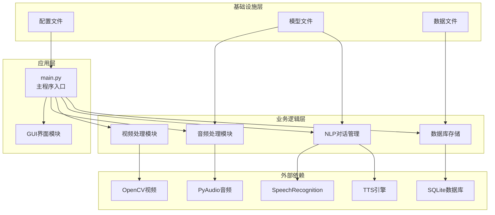
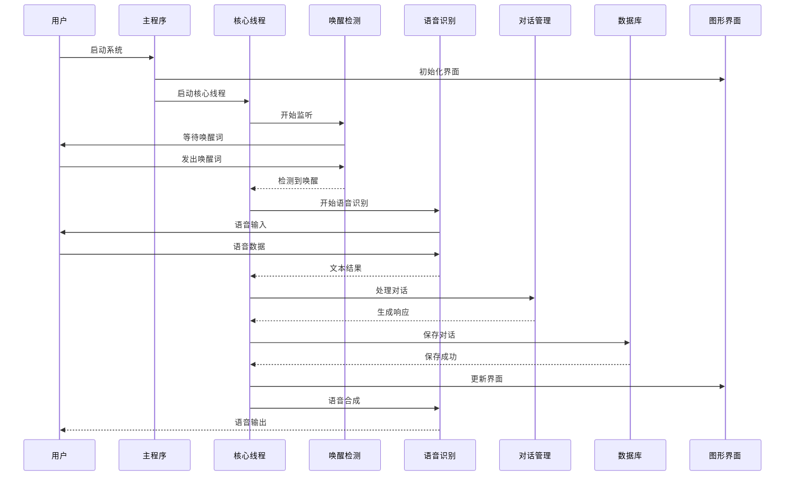
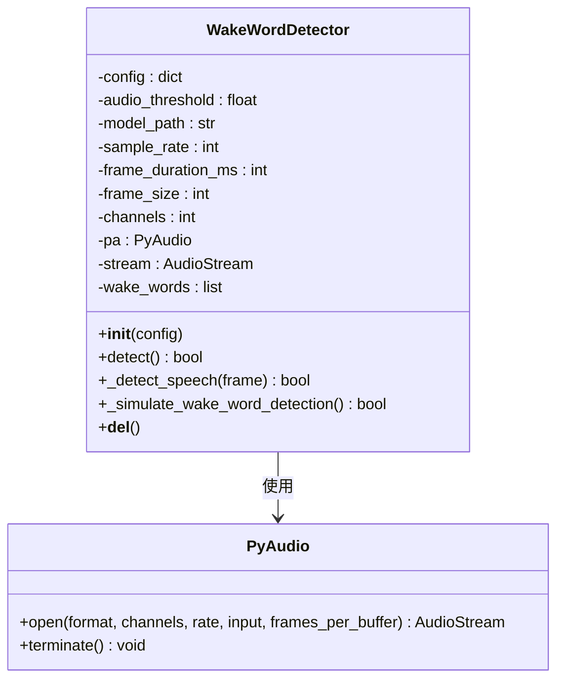
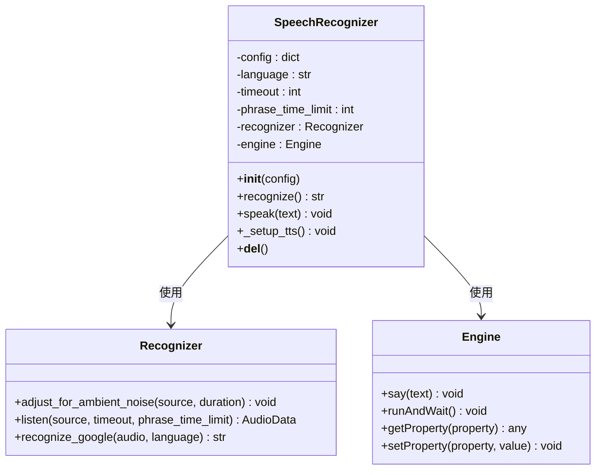
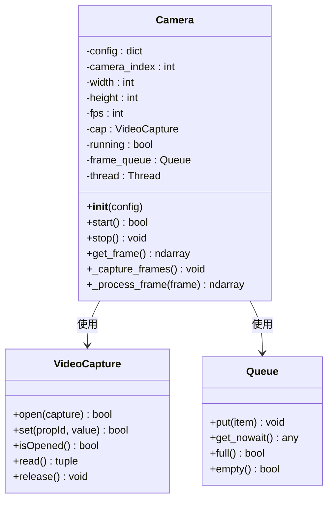
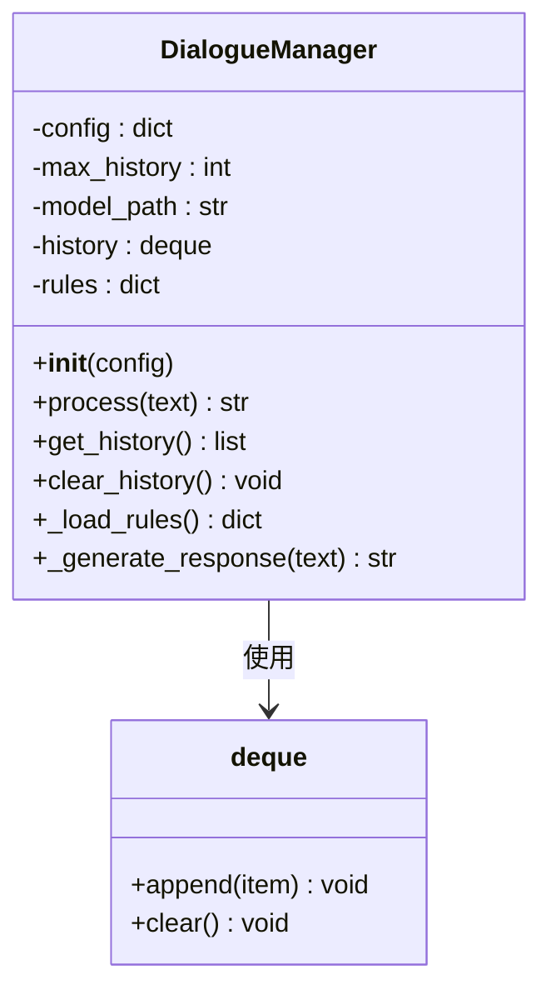
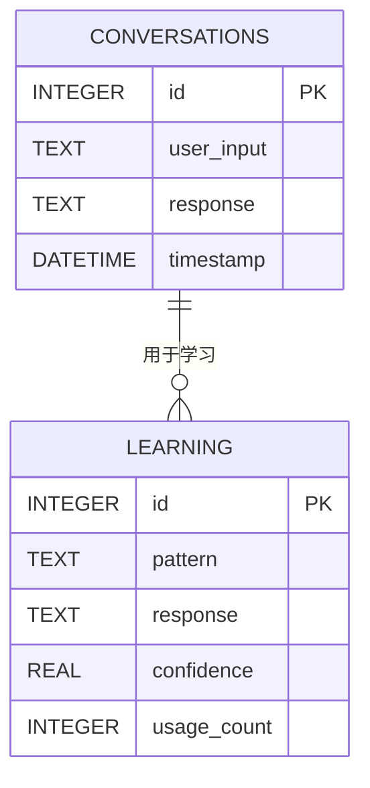
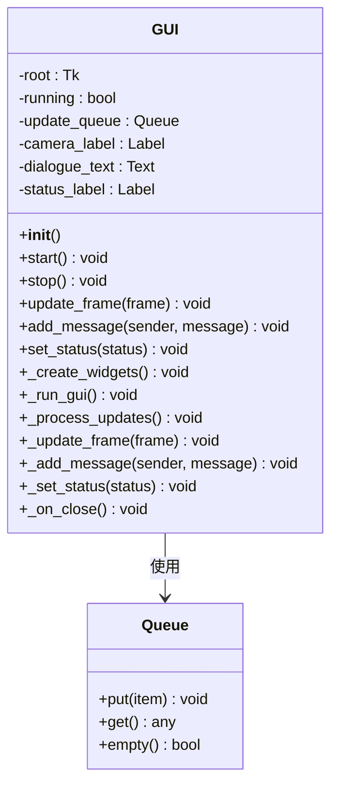

# 部署运维

<cite>
**本文档引用的文件**
- [main.py](file://main.py)
- [config.yaml](file://config.yaml)
- [requirements.txt](file://requirements.txt)
- [src/audio/speech_recognition.py](file://src/audio/speech_recognition.py)
- [src/audio/wake_word.py](file://src/audio/wake_word.py)
- [src/video/camera.py](file://src/video/camera.py)
- [src/nlp/dialogue_manager.py](file://src/nlp/dialogue_manager.py)
- [src/database/conversation_store.py](file://src/database/conversation_store.py)
- [src/ui/gui.py](file://src/ui/gui.py)
</cite>

## 目录
1. [简介](#简介)
2. [项目结构](#项目结构)
3. [核心组件](#核心组件)
4. [架构概览](#架构概览)
5. [详细组件分析](#详细组件分析)
6. [部署准备](#部署准备)
7. [生产环境部署](#生产环境部署)
8. [服务启动与停止](#服务启动与停止)
9. [性能监控与优化](#性能监控与优化)
10. [日志分析与故障诊断](#日志分析与故障诊断)
11. [系统维护](#系统维护)
12. [备份恢复](#备份恢复)
13. [升级策略](#升级策略)
14. [常见运维问题](#常见运维问题)
15. [应急处理预案](#应急处理预案)
16. [结论](#结论)

## 简介

数字人系统是一个集成了语音识别、自然语言处理、视频采集和图形用户界面的综合性AI应用。该系统能够实现语音唤醒、语音识别、对话管理和实时视频显示等功能，为用户提供智能化的人机交互体验。

系统采用模块化设计，包含以下核心功能模块：
- 语音唤醒检测：基于音频能量检测的简单唤醒机制
- 语音识别与合成：支持中文语音识别和TTS语音合成
- 自然语言处理：基于规则的对话管理系统
- 视频采集：实时摄像头画面捕获和处理
- 数据存储：SQLite数据库存储对话历史和学习数据
- 图形界面：Tkinter构建的用户交互界面

## 项目结构

数字人系统采用清晰的分层架构设计，按照功能模块进行组织：



**图表来源**
- [main.py:1-138](file://main.py#L1-L138)
- [config.yaml:1-35](file://config.yaml#L1-L35)

**章节来源**
- [main.py:1-138](file://main.py#L1-L138)
- [config.yaml:1-35](file://config.yaml#L1-L35)

## 核心组件

### 主程序组件

主程序DigitalHuman类是整个系统的协调中心，负责初始化各个子模块并管理它们之间的交互。

**主要职责：**
- 配置文件加载和验证
- 日志系统初始化
- 各个功能模块的实例化
- 核心业务流程控制
- 资源清理和系统退出

**关键特性：**
- 多线程架构：核心逻辑在独立线程中运行
- 模块化设计：每个功能模块独立封装
- 异常处理：完善的错误捕获和处理机制
- 资源管理：自动化的资源分配和释放

### 配置管理系统

系统使用YAML格式的配置文件，支持动态配置和环境适配。

**配置分类：**
- 语音唤醒配置：模型路径、敏感度、音频阈值
- 语音识别配置：语言设置、超时时间、短语限制
- 视频配置：摄像头索引、分辨率、帧率
- NLP配置：模型路径、历史记录长度
- 数据库配置：数据文件路径
- 系统配置：日志级别、响应限制、延迟设置

**章节来源**
- [main.py:21-40](file://main.py#L21-L40)
- [config.yaml:1-35](file://config.yaml#L1-L35)

## 架构概览

系统采用事件驱动的异步架构，通过线程池实现并发处理：



**图表来源**
- [main.py:60-116](file://main.py#L60-L116)
- [src/audio/wake_word.py:42-98](file://src/audio/wake_word.py#L42-L98)
- [src/audio/speech_recognition.py:46-85](file://src/audio/speech_recognition.py#L46-L85)
- [src/nlp/dialogue_manager.py:62-73](file://src/nlp/dialogue_manager.py#L62-L73)

## 详细组件分析

### 语音唤醒模块

唤醒词检测模块实现了基于音频能量的简单唤醒机制：



**图表来源**
- [src/audio/wake_word.py:13-109](file://src/audio/wake_word.py#L13-L109)

**工作原理：**
1. 初始化音频流和PyAudio设备
2. 实时读取音频帧数据
3. 基于音频能量计算判断语音活动
4. 当检测到语音结束时，模拟唤醒词识别
5. 返回唤醒检测结果

**性能特点：**
- 采样率16kHz，帧大小适中
- 基于能量阈值的快速检测
- 内存占用低，实时性好

**章节来源**
- [src/audio/wake_word.py:13-109](file://src/audio/wake_word.py#L13-L109)

### 语音识别与合成模块

语音识别模块集成了语音转文字和文字转语音功能：



**图表来源**
- [src/audio/speech_recognition.py:12-89](file://src/audio/speech_recognition.py#L12-L89)

**功能特性：**
- 支持中文语音识别（zh-CN）
- 可配置的识别超时和短语限制
- 自动选择中文语音合成引擎
- 可调节的语速和音量参数

**章节来源**
- [src/audio/speech_recognition.py:12-89](file://src/audio/speech_recognition.py#L12-L89)

### 视频采集模块

摄像头模块提供了实时视频捕获和处理功能：



**图表来源**
- [src/video/camera.py:12-106](file://src/video/camera.py#L12-L106)

**技术实现：**
- 使用OpenCV进行视频捕获
- 多线程架构：独立线程处理视频捕获
- 环形缓冲区：最多缓存10帧视频数据
- 实时图像处理：简单的边框添加效果

**章节来源**
- [src/video/camera.py:12-106](file://src/video/camera.py#L12-L106)

### 对话管理模块

对话管理器实现了基于规则的智能对话系统：



**图表来源**
- [src/nlp/dialogue_manager.py:12-102](file://src/nlp/dialogue_manager.py#L12-L102)

**对话规则：**
- 问候语识别：支持多种中文问候表达
- 自我介绍：标准的自我介绍响应
- 天气查询：天气相关问题的默认响应
- 时间询问：时间相关的默认响应
- 帮助功能：系统功能说明
- 再见告别：结束对话的标准响应

**章节来源**
- [src/nlp/dialogue_manager.py:12-102](file://src/nlp/dialogue_manager.py#L12-L102)

### 数据存储模块

数据库模块提供了对话历史和学习数据的持久化存储：



**图表来源**
- [src/database/conversation_store.py:24-51](file://src/database/conversation_store.py#L24-L51)

**数据库设计：**
- 对话表：存储用户输入、系统响应和时间戳
- 学习表：存储对话模式、响应和置信度
- 自动建表：启动时自动创建必要的数据库结构
- 数据迁移：支持历史数据的查询和管理

**章节来源**
- [src/database/conversation_store.py:12-158](file://src/database/conversation_store.py#L12-L158)

### 图形用户界面模块

GUI模块使用Tkinter构建了直观的用户交互界面：



**图表来源**
- [src/ui/gui.py:16-170](file://src/ui/gui.py#L16-L170)

**界面布局：**
- 左侧：实时摄像头画面显示区域
- 右侧：对话历史记录和状态显示
- 实时更新：通过队列机制保证线程安全
- 响应式设计：自适应窗口大小变化

**章节来源**
- [src/ui/gui.py:16-170](file://src/ui/gui.py#L16-L170)

## 部署准备

### 环境要求

系统部署需要满足以下硬件和软件要求：

**硬件要求：**
- CPU：Intel i5或同等AMD处理器
- 内存：至少8GB RAM（推荐16GB）
- 存储：至少20GB可用空间
- 网络：稳定的互联网连接（用于语音识别API）

**软件要求：**
- Python 3.8+
- Windows/Linux/macOS操作系统
- 音频设备（麦克风和扬声器）
- 摄像头设备（可选）

### 依赖安装

系统依赖通过requirements.txt统一管理：

**核心依赖：**
- numpy：数值计算基础库
- scipy：科学计算工具包
- opencv-python：计算机视觉库
- speechrecognition：语音识别库
- pyttsx3：离线TTS引擎
- nltk/spacy：自然语言处理库
- tensorflow/torch：机器学习框架
- psutil：系统资源监控
- pyyaml：配置文件解析

**安装步骤：**
1. 创建虚拟环境：`python -m venv digital_human_env`
2. 激活环境：`source digital_human_env/bin/activate`（Linux/Mac）或 `digital_human_env\Scripts\activate`（Windows）
3. 安装依赖：`pip install -r requirements.txt`
4. 验证安装：`python -c "import cv2, speech_recognition, pyttsx3"`

**章节来源**
- [requirements.txt:1-27](file://requirements.txt#L1-L27)

## 生产环境部署

### 目录结构

部署后的系统目录结构：

```
digital_human_system/
├── main.py                    # 主程序入口
├── config.yaml               # 系统配置文件
├── requirements.txt          # 依赖清单
├── data/                     # 数据文件目录
│   └── conversation.db      # 对话数据库
├── models/                   # 模型文件目录
│   ├── wake_word_model.tflite
│   └── nlp_model/
├── logs/                     # 日志文件目录
└── src/                      # 源代码目录
    ├── audio/
    ├── database/
    ├── nlp/
    ├── ui/
    └── video/
```

### 配置优化

**生产环境配置建议：**

1. **日志配置：**
   ```yaml
   system:
     log_level: "WARNING"  # 生产环境使用WARNING级别
     max_responses: 10
     response_delay: 0.3
   ```

2. **性能配置：**
   ```yaml
   video:
     width: 1280
     height: 720
     fps: 30
   
   speech_recognition:
     timeout: 3
     phrase_time_limit: 8
   ```

3. **资源配置：**
   ```yaml
   database:
     path: "/opt/digital_human/data/conversation.db"
   
   nlp:
     max_history: 20
   ```

### 服务化部署

**systemd服务配置示例：**
```ini
[Unit]
Description=数字人系统服务
After=network.target

[Service]
Type=simple
User=ubuntu
WorkingDirectory=/opt/digital_human
ExecStart=/opt/digital_human/venv/bin/python main.py
Restart=always
RestartSec=10

[Install]
WantedBy=multi-user.target
```

**Docker部署：**
```dockerfile
FROM python:3.9-slim

WORKDIR /app
COPY requirements.txt .
RUN pip install -r requirements.txt

COPY . .

EXPOSE 8080

CMD ["python", "main.py"]
```

**章节来源**
- [config.yaml:1-35](file://config.yaml#L1-35)

## 服务启动与停止

### 启动流程

**标准启动：**
```bash
# 1. 激活虚拟环境
source venv/bin/activate

# 2. 启动系统
python main.py

# 3. 查看系统状态
tail -f digital_human.log
```

**后台启动：**
```bash
# 使用nohup后台运行
nohup python main.py > app.log 2>&1 &

# 或使用screen会话
screen -S digital_human
python main.py
# Ctrl+A, D 分离会话
```

**自动启动配置：**
```bash
# Linux开机自启
sudo systemctl enable digital_human.service

# Windows服务注册
sc create DigitalHuman binPath= "C:\path\to\python.exe C:\path\to\main.py"
```

### 停止流程

**优雅停止：**
```bash
# 方法1：Ctrl+C正常退出
# 方法2：发送SIGTERM信号
kill -TERM <pid>
# 方法3：强制停止
kill -9 <pid>
```

**批量停止：**
```bash
# 查找进程
ps aux | grep python
# 停止所有相关进程
pkill -f main.py
```

### 健康检查

**进程监控脚本：**
```python
import psutil
import subprocess
import time

def check_digital_human():
    """检查数字人系统健康状态"""
    # 检查进程是否存在
    for proc in psutil.process_iter(['pid', 'name', 'cmdline']):
        if 'main.py' in ' '.join(proc.info['cmdline'] or []):
            return True, proc.info['pid']
    
    return False, None

def restart_if_needed():
    """如果系统停止则重启"""
    is_running, pid = check_digital_human()
    if not is_running:
        subprocess.Popen(['python', 'main.py'])
        return True
    return False
```

**章节来源**
- [main.py:118-138](file://main.py#L118-L138)

## 性能监控与优化

### 性能指标监控

**系统资源监控：**
```python
import psutil
import time

class SystemMonitor:
    def __init__(self):
        self.cpu_history = []
        self.memory_history = []
        self.start_time = time.time()
    
    def get_cpu_usage(self):
        """获取CPU使用率"""
        return psutil.cpu_percent(interval=1)
    
    def get_memory_usage(self):
        """获取内存使用情况"""
        return psutil.virtual_memory().percent
    
    def get_disk_usage(self):
        """获取磁盘使用情况"""
        return psutil.disk_usage('/').percent
    
    def get_process_info(self):
        """获取进程详细信息"""
        process = psutil.Process()
        return {
            'cpu_percent': process.cpu_percent(),
            'memory_mb': process.memory_info().rss / 1024 / 1024,
            'threads': process.num_threads(),
            'uptime': time.time() - self.start_time
        }
```

**音频处理性能：**
```python
import time
import threading

class AudioPerformanceMonitor:
    def __init__(self):
        self.recognition_times = []
        self.speak_times = []
        self.detection_times = []
    
    def monitor_recognition(self, func):
        """监控语音识别耗时"""
        def wrapper(*args, **kwargs):
            start_time = time.time()
            result = func(*args, **kwargs)
            end_time = time.time()
            self.recognition_times.append(end_time - start_time)
            return result
        return wrapper
    
    def get_avg_times(self):
        """获取平均处理时间"""
        if not self.recognition_times:
            return {}
        return {
            'avg_recognition': sum(self.recognition_times) / len(self.recognition_times),
            'avg_speak': sum(self.speak_times) / len(self.speak_times) if self.speak_times else 0,
            'avg_detection': sum(self.detection_times) / len(self.detection_times) if self.detection_times else 0
        }
```

### 优化策略

**CPU优化：**
1. **线程池管理：** 控制同时运行的线程数量
2. **帧率调整：** 根据硬件能力调整视频帧率
3. **算法优化：** 减少不必要的计算操作

**内存优化：**
1. **队列大小控制：** 限制视频帧队列大小
2. **历史记录管理：** 控制对话历史长度
3. **资源及时释放：** 确保对象正确销毁

**网络优化：**
1. **离线优先：** 优先使用本地模型
2. **缓存策略：** 缓存常用数据
3. **连接复用：** 复用网络连接

**章节来源**
- [src/video/camera.py:24-25](file://src/video/camera.py#L24-L25)
- [src/nlp/dialogue_manager.py:16-20](file://src/nlp/dialogue_manager.py#L16-L20)

## 日志分析与故障诊断

### 日志配置

系统采用双通道日志记录机制：

**日志级别：**
- DEBUG：详细调试信息
- INFO：一般运行信息
- WARNING：警告信息
- ERROR：错误信息
- CRITICAL：严重错误

**日志格式：**
```
2024-01-15 14:30:25,123 - DigitalHuman - INFO - 数字人系统初始化完成
2024-01-15 14:30:25,125 - DigitalHuman - INFO - 等待唤醒词...
2024-01-15 14:30:26,456 - DigitalHuman - INFO - 检测到唤醒词
```

### 常见故障诊断

**音频问题：**
```python
# 音频设备检测
def diagnose_audio():
    import pyaudio
    pa = pyaudio.PyAudio()
    
    print("音频设备列表:")
    for i in range(pa.get_device_count()):
        info = pa.get_device_info_by_index(i)
        print(f"设备 {i}: {info['name']} - 输入: {info['maxInputChannels']}")
    
    pa.terminate()
```

**视频问题：**
```python
# 摄像头检测
def diagnose_camera():
    import cv2
    
    # 测试多个摄像头索引
    for i in range(5):
        cap = cv2.VideoCapture(i)
        if cap.isOpened():
            print(f"摄像头 {i}: 成功打开")
            cap.release()
        else:
            print(f"摄像头 {i}: 打开失败")
```

**数据库问题：**
```python
# 数据库健康检查
def diagnose_database():
    import sqlite3
    import os
    
    db_path = "data/conversation.db"
    
    if not os.path.exists(db_path):
        print("数据库文件不存在")
        return False
    
    try:
        conn = sqlite3.connect(db_path)
        cursor = conn.cursor()
        
        # 检查表是否存在
        cursor.execute("SELECT name FROM sqlite_master WHERE type='table';")
        tables = cursor.fetchall()
        print(f"数据库表: {tables}")
        
        conn.close()
        return True
    except Exception as e:
        print(f"数据库连接失败: {e}")
        return False
```

### 日志分析工具

**实时日志监控：**
```bash
# 实时查看日志
tail -f digital_human.log

# 过滤特定级别的日志
tail -f digital_human.log | grep "ERROR"

# 统计日志频率
tail -f digital_human.log | awk '{print $4}' | sort | uniq -c
```

**日志轮转配置：**
```python
import logging.handlers

# 配置日志轮转
logger = logging.getLogger('DigitalHuman')
handler = logging.handlers.RotatingFileHandler(
    'digital_human.log', 
    maxBytes=10*1024*1024,  # 10MB
    backupCount=5
)
formatter = logging.Formatter(
    '%(asctime)s - %(name)s - %(levelname)s - %(message)s'
)
handler.setFormatter(formatter)
logger.addHandler(handler)
```

**章节来源**
- [main.py:47-58](file://main.py#L47-L58)
- [src/audio/wake_word.py:91-98](file://src/audio/wake_word.py#L91-L98)
- [src/video/camera.py:38-53](file://src/video/camera.py#L38-L53)

## 系统维护

### 定期维护任务

**数据清理：**
```python
import sqlite3
import datetime

def cleanup_old_data(days=30):
    """清理过期对话数据"""
    conn = sqlite3.connect('data/conversation.db')
    cursor = conn.cursor()
    
    # 计算过期时间
    cutoff_date = datetime.datetime.now() - datetime.timedelta(days=days)
    
    # 删除过期数据
    cursor.execute(
        "DELETE FROM conversations WHERE timestamp < ?",
        (cutoff_date.isoformat(),)
    )
    
    deleted_count = cursor.rowcount
    conn.commit()
    conn.close()
    
    return deleted_count
```

**模型更新：**
```python
def update_models():
    """检查和更新模型文件"""
    import os
    import requests
    
    models_dir = "models/"
    model_files = [
        "wake_word_model.tflite",
        "nlp_model"
    ]
    
    for model_file in model_files:
        model_path = os.path.join(models_dir, model_file)
        if not os.path.exists(model_path):
            print(f"模型文件缺失: {model_file}")
            # 可以在这里下载或提示用户
```

**系统健康检查：**
```python
def system_health_check():
    """系统健康检查"""
    checks = {
        'audio': check_audio_devices(),
        'camera': check_camera_devices(),
        'database': check_database_health(),
        'disk_space': check_disk_space(),
        'memory': check_memory_usage()
    }
    
    return checks
```

### 性能调优

**配置优化：**
```python
# 动态配置调整
class ConfigManager:
    def __init__(self, config_path):
        self.config_path = config_path
        self.load_config()
    
    def adjust_performance(self, cpu_usage, memory_usage):
        """根据系统负载调整配置"""
        if cpu_usage > 80:
            # 降低视频质量
            self.config['video']['fps'] = max(15, self.config['video']['fps'] - 5)
            self.config['video']['width'] = max(320, self.config['video']['width'] // 2)
        
        if memory_usage > 85:
            # 减少历史记录
            self.config['nlp']['max_history'] = max(5, self.config['nlp']['max_history'] - 5)
        
        self.save_config()
```

**章节来源**
- [src/database/conversation_store.py:142-158](file://src/database/conversation_store.py#L142-L158)

## 备份恢复

### 数据备份策略

**数据库备份：**
```python
import shutil
import datetime
import os

def backup_database():
    """创建数据库备份"""
    db_path = "data/conversation.db"
    backup_dir = "backups/"
    
    # 创建备份目录
    os.makedirs(backup_dir, exist_ok=True)
    
    # 生成备份文件名
    timestamp = datetime.datetime.now().strftime("%Y%m%d_%H%M%S")
    backup_path = f"{backup_dir}conversation_backup_{timestamp}.db"
    
    # 复制数据库文件
    try:
        shutil.copy2(db_path, backup_path)
        print(f"数据库备份成功: {backup_path}")
        return backup_path
    except Exception as e:
        print(f"备份失败: {e}")
        return None
```

**完整系统备份：**
```python
def backup_complete_system():
    """创建完整系统备份"""
    backup_files = [
        "config.yaml",
        "data/",
        "models/",
        "logs/"
    ]
    
    timestamp = datetime.datetime.now().strftime("%Y%m%d_%H%M%S")
    backup_dir = f"system_backup_{timestamp}/"
    
    os.makedirs(backup_dir, exist_ok=True)
    
    for file_path in backup_files:
        if os.path.exists(file_path):
            if os.path.isdir(file_path):
                shutil.copytree(file_path, f"{backup_dir}{file_path}")
            else:
                shutil.copy2(file_path, f"{backup_dir}{file_path}")
    
    return backup_dir
```

### 数据恢复

**数据库恢复：**
```python
def restore_database(backup_path):
    """从备份恢复数据库"""
    db_path = "data/conversation.db"
    
    try:
        # 备份当前数据库
        backup_current = f"{db_path}.backup"
        shutil.copy2(db_path, backup_current)
        
        # 恢复备份文件
        shutil.copy2(backup_path, db_path)
        
        print("数据库恢复成功")
        return True
    except Exception as e:
        print(f"恢复失败: {e}")
        # 恢复原始数据库
        if os.path.exists(backup_current):
            shutil.copy2(backup_current, db_path)
        return False
```

**增量恢复：**
```python
def incremental_restore():
    """增量恢复策略"""
    backup_files = os.listdir("backups/")
    backup_files.sort(reverse=True)
    
    for backup_file in backup_files:
        if backup_file.startswith("conversation_backup_"):
            backup_path = f"backups/{backup_file}"
            if restore_database(backup_path):
                print(f"从 {backup_file} 恢复成功")
                return True
    
    return False
```

**章节来源**
- [src/database/conversation_store.py:53-80](file://src/database/conversation_store.py#L53-L80)

## 升级策略

### 版本管理

**版本标识：**
```python
import pkg_resources

def get_system_version():
    """获取系统版本信息"""
    try:
        version = pkg_resources.get_distribution("digital-human-system").version
        return version
    except:
        return "unknown"

def check_for_updates():
    """检查系统更新"""
    import requests
    
    try:
        response = requests.get("https://api.github.com/repos/your-repo/releases/latest")
        latest_version = response.json()['tag_name']
        
        current_version = get_system_version()
        
        if latest_version > current_version:
            return True, latest_version
        return False, current_version
    except:
        return False, None
```

### 升级流程

**平滑升级：**
```python
def perform_upgrade():
    """执行系统升级"""
    print("开始系统升级...")
    
    # 1. 备份当前系统
    print("1. 创建系统备份")
    backup_complete_system()
    
    # 2. 停止服务
    print("2. 停止当前服务")
    stop_service()
    
    # 3. 备份数据库
    print("3. 备份数据库")
    backup_database()
    
    # 4. 下载新版本
    print("4. 下载新版本")
    download_new_version()
    
    # 5. 安装依赖
    print("5. 安装新依赖")
    install_new_dependencies()
    
    # 6. 启动服务
    print("6. 启动新版本")
    start_service()
    
    # 7. 验证升级
    print("7. 验证升级结果")
    verify_upgrade()
```

**回滚策略：**
```python
def rollback_upgrade():
    """执行回滚操作"""
    print("开始回滚升级...")
    
    # 查找最近的备份
    backups = [f for f in os.listdir("backups/") if f.startswith("system_backup_")]
    if not backups:
        print("没有找到备份文件")
        return False
    
    backups.sort(reverse=True)
    latest_backup = backups[0]
    
    # 停止服务
    stop_service()
    
    # 恢复备份
    restore_from_backup(latest_backup)
    
    # 启动服务
    start_service()
    
    print("回滚完成")
    return True
```

### 自动化部署

**CI/CD流水线：**
```yaml
name: 数字人系统部署

on:
  push:
    branches: [ main ]

jobs:
  deploy:
    runs-on: ubuntu-latest
    
    steps:
    - uses: actions/checkout@v2
    
    - name: 设置Python
      uses: actions/setup-python@v2
      with:
        python-version: 3.9
    
    - name: 安装依赖
      run: |
        pip install -r requirements.txt
    
    - name: 运行测试
      run: |
        python -m pytest tests/
    
    - name: 部署到生产
      run: |
        ssh user@server "cd /opt/digital_human && git pull"
        ssh user@server "cd /opt/digital_human && systemctl restart digital_human"
```

**章节来源**
- [requirements.txt:1-27](file://requirements.txt#L1-L27)

## 常见运维问题

### 硬件兼容性问题

**音频设备问题：**
```python
# 解决方案：音频设备检测和切换
def fix_audio_issues():
    """解决音频相关问题"""
    import pyaudio
    
    pa = pyaudio.PyAudio()
    
    # 列出所有音频设备
    devices = []
    for i in range(pa.get_device_count()):
        info = pa.get_device_info_by_index(i)
        devices.append({
            'index': i,
            'name': info['name'],
            'input': info['maxInputChannels'],
            'output': info['maxOutputChannels']
        })
    
    # 选择合适的设备
    suitable_device = None
    for device in devices:
        if device['input'] > 0 and 'default' in device['name'].lower():
            suitable_device = device
            break
    
    pa.terminate()
    
    return suitable_device
```

**摄像头问题：**
```python
# 解决方案：摄像头兼容性检测
def fix_camera_issues():
    """解决摄像头相关问题"""
    import cv2
    
    # 尝试不同的摄像头索引
    for i in range(10):
        cap = cv2.VideoCapture(i)
        if cap.isOpened():
            # 测试不同分辨率
            resolutions = [(1280, 720), (640, 480), (320, 240)]
            for width, height in resolutions:
                cap.set(cv2.CAP_PROP_FRAME_WIDTH, width)
                cap.set(cv2.CAP_PROP_FRAME_HEIGHT, height)
                if cap.get(cv2.CAP_PROP_FRAME_WIDTH) == width:
                    cap.release()
                    return i, width, height
            cap.release()
    
    return None, None, None
```

### 内存泄漏问题

**内存监控和清理：**
```python
import gc
import psutil
import threading

class MemoryManager:
    def __init__(self):
        self.monitoring = False
        self.monitor_thread = None
    
    def start_monitoring(self):
        """开始内存监控"""
        self.monitoring = True
        self.monitor_thread = threading.Thread(target=self._monitor_loop)
        self.monitor_thread.daemon = True
        self.monitor_thread.start()
    
    def _monitor_loop(self):
        """监控循环"""
        while self.monitoring:
            memory_percent = psutil.virtual_memory().percent
            if memory_percent > 90:
                print(f"内存使用率过高: {memory_percent}%")
                self._force_gc()
            
            time.sleep(60)  # 每分钟检查一次
    
    def _force_gc(self):
        """强制垃圾回收"""
        collected = gc.collect()
        print(f"垃圾回收: 清理了 {collected} 个对象")
```

### 网络连接问题

**网络故障处理：**
```python
def handle_network_failure():
    """处理网络连接问题"""
    import socket
    
    def test_connection(url="www.google.com", port=80, timeout=3):
        try:
            socket.create_connection((url, port), timeout)
            return True
        except:
            return False
    
    # 如果网络不可用，切换到离线模式
    if not test_connection():
        print("网络连接失败，切换到离线模式")
        # 关闭需要网络的功能
        disable_online_features()
        return False
    
    return True
```

**章节来源**
- [src/audio/wake_word.py:91-98](file://src/audio/wake_word.py#L91-L98)
- [src/video/camera.py:38-53](file://src/video/camera.py#L38-L53)

## 应急处理预案

### 系统故障应急预案

**紧急停机流程：**
```python
import signal
import sys

class EmergencyStop:
    def __init__(self):
        self.stopping = False
        signal.signal(signal.SIGINT, self._signal_handler)
        signal.signal(signal.SIGTERM, self._signal_handler)
    
    def _signal_handler(self, signum, frame):
        """信号处理函数"""
        print(f"接收到信号 {signum}，开始紧急停机...")
        self.emergency_stop()
    
    def emergency_stop(self):
        """紧急停机"""
        if self.stopping:
            return
        
        self.stopping = True
        
        # 1. 停止所有线程
        self.stop_all_threads()
        
        # 2. 释放硬件资源
        self.release_hardware_resources()
        
        # 3. 保存当前状态
        self.save_current_state()
        
        # 4. 记录故障信息
        self.log_emergency_event()
        
        # 5. 优雅退出
        sys.exit(1)
    
    def stop_all_threads(self):
        """停止所有线程"""
        # 实现线程停止逻辑
        pass
    
    def release_hardware_resources(self):
        """释放硬件资源"""
        # 实现资源释放逻辑
        pass
    
    def save_current_state(self):
        """保存当前状态"""
        # 实现状态保存逻辑
        pass
    
    def log_emergency_event(self):
        """记录紧急事件"""
        # 实现日志记录逻辑
        pass
```

### 数据恢复预案

**数据完整性检查：**
```python
def check_data_integrity():
    """检查数据完整性"""
    import sqlite3
    import hashlib
    
    db_path = "data/conversation.db"
    
    try:
        conn = sqlite3.connect(db_path)
        cursor = conn.cursor()
        
        # 检查表结构
        cursor.execute("PRAGMA table_info(conversations)")
        conversations_table = cursor.fetchall()
        
        cursor.execute("PRAGMA table_info(learning)")
        learning_table = cursor.fetchall()
        
        # 检查数据一致性
        cursor.execute("SELECT COUNT(*) FROM conversations")
        conv_count = cursor.fetchone()[0]
        
        cursor.execute("SELECT COUNT(*) FROM learning")
        learn_count = cursor.fetchone()[0]
        
        conn.close()
        
        return {
            'table_structure_valid': len(conversations_table) > 0 and len(learning_table) > 0,
            'data_counts': {'conversations': conv_count, 'learning': learn_count}
        }
    
    except Exception as e:
        return {'error': str(e)}
```

**快速恢复流程：**
```python
def quick_recovery():
    """快速恢复流程"""
    print("=== 快速恢复流程 ===")
    
    # 1. 检查系统状态
    print("1. 检查系统状态...")
    status = check_system_status()
    
    if not status['healthy']:
        print("系统状态异常，开始恢复...")
    else:
        print("系统状态正常")
        return True
    
    # 2. 备份当前数据
    print("2. 备份当前数据...")
    backup_database()
    
    # 3. 重新初始化数据库
    print("3. 重新初始化数据库...")
    reinitialize_database()
    
    # 4. 重启系统
    print("4. 重启系统...")
    restart_system()
    
    # 5. 验证恢复结果
    print("5. 验证恢复结果...")
    return verify_recovery()
```

### 性能降级预案

**自动降级策略：**
```python
class PerformanceDegradationHandler:
    def __init__(self):
        self.degradation_level = 0
        self.degradation_thresholds = [80, 90, 95]  # CPU使用率阈值
    
    def check_and_handle_degradation(self):
        """检查并处理性能降级"""
        cpu_usage = psutil.cpu_percent(interval=1)
        memory_usage = psutil.virtual_memory().percent
        
        if cpu_usage > self.degradation_thresholds[2]:
            # 严重降级
            self.handle_severe_degradation(cpu_usage, memory_usage)
        elif cpu_usage > self.degradation_thresholds[1]:
            # 中度降级
            self.handle_moderate_degradation(cpu_usage, memory_usage)
        elif cpu_usage > self.degradation_thresholds[0]:
            # 轻度降级
            self.handle_light_degradation(cpu_usage, memory_usage)
    
    def handle_severe_degradation(self, cpu_usage, memory_usage):
        """处理严重降级"""
        print(f"严重降级: CPU={cpu_usage}%, 内存={memory_usage}%")
        
        # 降低视频质量
        self.reduce_video_quality()
        
        # 关闭非必要功能
        self.disable_non_essential_features()
        
        # 增加延迟
        self.increase_processing_delay()
        
        self.degradation_level = 3
    
    def reduce_video_quality(self):
        """降低视频质量"""
        # 实现视频质量降低逻辑
        pass
    
    def disable_non_essential_features(self):
        """关闭非必要功能"""
        # 实现功能禁用逻辑
        pass
    
    def increase_processing_delay(self):
        """增加处理延迟"""
        # 实现延迟增加逻辑
        pass
```

**章节来源**
- [main.py:111-116](file://main.py#L111-L116)
- [src/database/conversation_store.py:24-51](file://src/database/conversation_store.py#L24-L51)

## 结论

数字人系统是一个功能完整、架构清晰的AI应用平台。通过本文档提供的部署运维指南，运维人员可以：

1. **稳定部署**：按照标准化流程完成系统安装和配置
2. **有效监控**：建立完善的性能监控和日志分析体系
3. **及时维护**：制定定期维护和故障处理策略
4. **安全升级**：实施平滑的系统升级和回滚机制
5. **应急响应**：建立快速有效的故障应急处理预案

**关键成功因素：**
- 建立完善的监控告警机制
- 制定详细的运维操作手册
- 定期进行系统健康检查
- 建立完整的备份恢复策略
- 培训专业的运维团队

通过遵循本文档的指导原则和最佳实践，可以确保数字人系统在生产环境中稳定可靠地运行，为用户提供优质的智能交互体验。