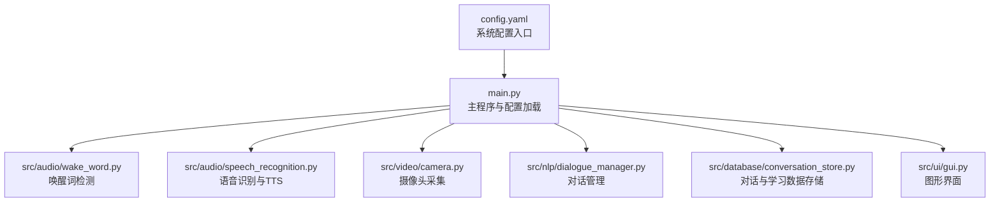
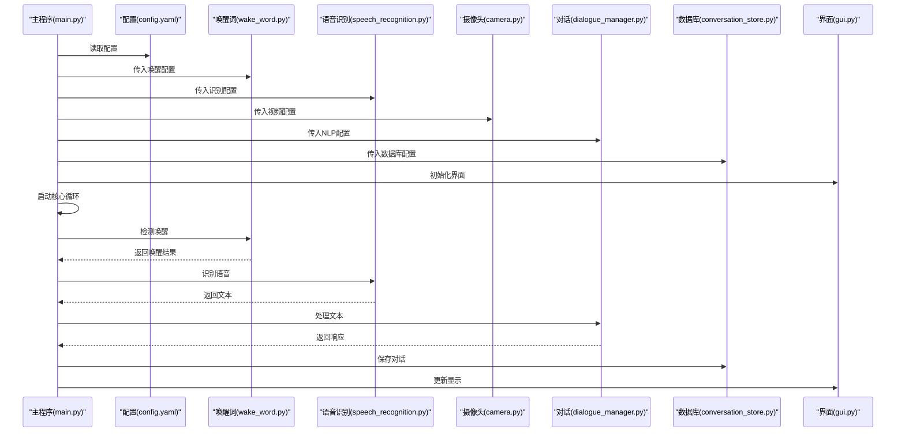
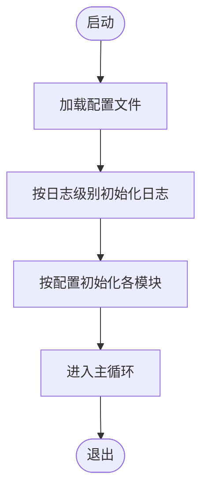
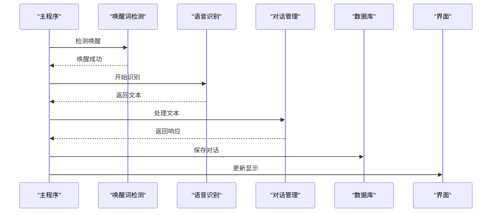
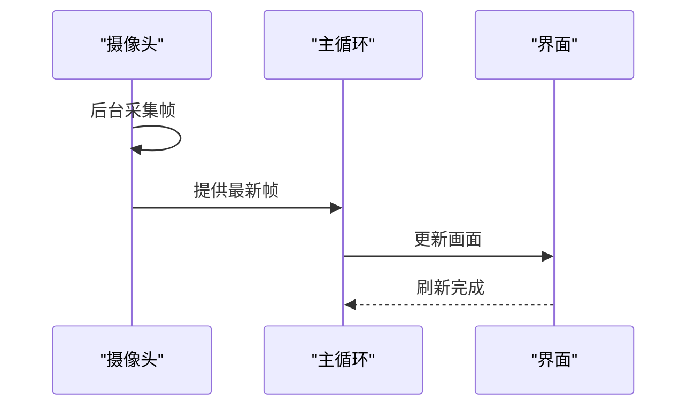
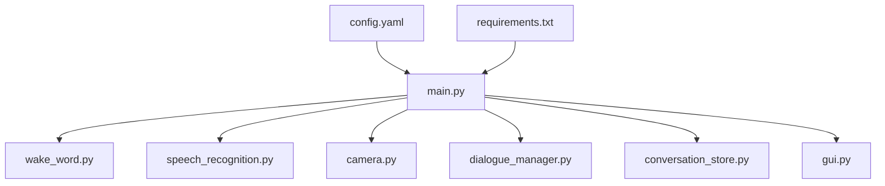

# 配置管理

<cite>
**本文引用的文件**
- [config.yaml](file://config.yaml)
- [main.py](file://main.py)
- [requirements.txt](file://requirements.txt)
- [src/audio/wake_word.py](file://src/audio/wake_word.py)
- [src/audio/speech_recognition.py](file://src/audio/speech_recognition.py)
- [src/video/camera.py](file://src/video/camera.py)
- [src/nlp/dialogue_manager.py](file://src/nlp/dialogue_manager.py)
- [src/database/conversation_store.py](file://src/database/conversation_store.py)
- [src/ui/gui.py](file://src/ui/gui.py)
</cite>

## 目录
1. [简介](#简介)
2. [项目结构](#项目结构)
3. [核心组件](#核心组件)
4. [架构总览](#架构总览)
5. [详细组件分析](#详细组件分析)
6. [依赖分析](#依赖分析)
7. [性能考虑](#性能考虑)
8. [故障排除指南](#故障排除指南)
9. [结论](#结论)
10. [附录](#附录)

## 简介
本文件面向“数字人系统”的配置管理，围绕 config.yaml 的结构与参数展开，结合实际代码实现，给出参数说明、默认值、可选范围、对系统行为的影响、调优建议、常见问题与排障方案。文档既适合初学者快速上手，也为资深开发者提供深入的技术细节与可视化图示。

## 项目结构
系统采用按功能分层的模块化组织：
- 配置文件位于根目录，集中定义各子系统的参数
- 主程序负责加载配置、初始化模块、协调运行
- 各功能模块（唤醒词、语音识别、视频、NLP、数据库、UI）均通过配置驱动其行为
- 依赖通过 requirements.txt 统一声明

图表来源
- [config.yaml:1-35](file://config.yaml#L1-L35)
- [main.py:21-40](file://main.py#L21-L40)
- [src/audio/wake_word.py:13-32](file://src/audio/wake_word.py#L13-L32)
- [src/audio/speech_recognition.py:12-28](file://src/audio/speech_recognition.py#L12-L28)
- [src/video/camera.py:12-26](file://src/video/camera.py#L12-L26)
- [src/nlp/dialogue_manager.py:12-24](file://src/nlp/dialogue_manager.py#L12-L24)
- [src/database/conversation_store.py:12-23](file://src/database/conversation_store.py#L12-L23)
- [src/ui/gui.py:16-35](file://src/ui/gui.py#L16-L35)

章节来源
- [config.yaml:1-35](file://config.yaml#L1-L35)
- [main.py:21-40](file://main.py#L21-L40)

## 核心组件
本节聚焦 config.yaml 中的关键配置段落及其在代码中的使用方式与影响。

- 语音唤醒（wake_word）
  - 参数：模型路径、敏感度、音频阈值
  - 默认值：模型路径、敏感度、音频阈值
  - 影响：决定唤醒词检测的触发条件与稳定性；阈值过低易误触发，过高则漏检
  - 关联代码：唤醒词检测器初始化与音频流参数设置

- 语音识别（speech_recognition）
  - 参数：语言、超时、短语时长限制
  - 默认值：语言、超时、短语时长限制
  - 影响：控制识别精度与时延；超时过短可能打断长句，过长会增加等待时间
  - 关联代码：识别器初始化、识别流程与异常处理

- 视频（video）
  - 参数：摄像头索引、分辨率宽高、帧率
  - 默认值：摄像头索引、分辨率宽高、帧率
  - 影响：决定画面质量与性能开销；高分辨率与高帧率会显著增加CPU/GPU负载
  - 关联代码：摄像头初始化、参数设置与帧队列

- 自然语言处理（nlp）
  - 参数：模型路径、最大历史长度
  - 默认值：模型路径、最大历史长度
  - 影响：上下文长度影响对话连贯性；过大可能增加内存与推理成本
  - 关联代码：对话历史队列、规则匹配与响应生成

- 数据库（database）
  - 参数：数据库文件路径
  - 默认值：数据库文件路径
  - 影响：决定对话与学习数据的持久化位置；需确保目录存在且可写
  - 关联代码：数据库初始化、建表与增删改查

- 系统（system）
  - 参数：日志级别、最大响应数、响应延迟
  - 默认值：日志级别、最大响应数、响应延迟
  - 影响：日志级别影响可观测性与磁盘占用；响应延迟影响交互流畅度
  - 关联代码：日志初始化、主循环节流

章节来源
- [config.yaml:4-7](file://config.yaml#L4-L7)
- [config.yaml:10-13](file://config.yaml#L10-L13)
- [config.yaml:16-20](file://config.yaml#L16-L20)
- [config.yaml:23-25](file://config.yaml#L23-L25)
- [config.yaml:28-29](file://config.yaml#L28-L29)
- [config.yaml:32-34](file://config.yaml#L32-L34)

## 架构总览
配置贯穿系统生命周期：主程序加载配置，各模块按配置初始化；运行期根据配置调整行为；日志级别统一控制输出粒度。

图表来源
- [main.py:41-58](file://main.py#L41-L58)
- [main.py:60-116](file://main.py#L60-L116)
- [src/audio/wake_word.py:14-32](file://src/audio/wake_word.py#L14-L32)
- [src/audio/speech_recognition.py:13-28](file://src/audio/speech_recognition.py#L13-L28)
- [src/video/camera.py:13-26](file://src/video/camera.py#L13-L26)
- [src/nlp/dialogue_manager.py:13-24](file://src/nlp/dialogue_manager.py#L13-L24)
- [src/database/conversation_store.py:13-23](file://src/database/conversation_store.py#L13-L23)
- [src/ui/gui.py:16-35](file://src/ui/gui.py#L16-L35)

## 详细组件分析

### 配置项详解与调优指南
以下表格汇总了 config.yaml 中的配置项、默认值、可选范围与对系统行为的影响，并给出调优建议与常见问题排查思路。

- 语音唤醒（wake_word）
  - 字段：model_path（字符串）、sensitivity（数值）、audio_threshold（数值）
  - 默认值：参见配置文件
  - 可选范围：sensitivity 通常为 0~1；audio_threshold 与音频能量相关，建议 0.1~1.0
  - 行为影响：sensitivity 越高越容易触发但误报增多；audio_threshold 控制噪声容忍度
  - 调优建议：在安静环境下可降低 audio_threshold；在嘈杂环境提高阈值；sensitivity 根据误唤醒次数微调
  - 常见问题：误唤醒频繁→提高阈值；漏唤醒→降低阈值或提高 sensitivity；设备无声→检查音频权限与驱动

- 语音识别（speech_recognition）
  - 字段：language（字符串）、timeout（数值）、phrase_time_limit（数值）
  - 默认值：参见配置文件
  - 可选范围：language 为识别引擎支持的语言码；timeout 与 phrase_time_limit 建议 3~10 秒区间
  - 行为影响：timeout 控制等待上限；phrase_time_limit 控制单次识别时长
  - 调优建议：长句对话可适当增大 phrase_time_limit；网络不稳定时提高 timeout；中文识别建议 zh-CN
  - 常见问题：识别超时→增大 timeout；无法识别→检查麦克风权限与环境噪音；识别错误→更换语言模型或改善录音环境

- 视频（video）
  - 字段：camera_index（整数）、width（整数）、height（整数）、fps（整数）
  - 默认值：参见配置文件
  - 可选范围：camera_index 一般为 0 或正整数；分辨率与帧率受硬件能力限制
  - 行为影响：分辨率与帧率直接影响画面质量与性能；过高会导致卡顿
  - 调优建议：低端设备优先降低分辨率与帧率；高分辨率设备可提升至 1280x720@30fps
  - 常见问题：无法打开摄像头→确认 camera_index 正确；画面卡顿→降低分辨率或帧率

- 自然语言处理（nlp）
  - 字段：model_path（字符串）、max_history（整数）
  - 默认值：参见配置文件
  - 可选范围：max_history 建议 5~50；模型路径需指向有效模型
  - 行为影响：max_history 决定上下文长度；过大增加内存与推理成本
  - 调优建议：对话场景较短可减小 max_history；复杂问答可适度增大
  - 常见问题：响应迟缓→减小 max_history；上下文缺失→增大 max_history

- 数据库（database）
  - 字段：path（字符串）
  - 默认值：参见配置文件
  - 可选范围：路径需可写；建议使用绝对路径避免相对路径问题
  - 行为影响：决定对话与学习数据的持久化位置
  - 调优建议：定期备份 db 文件；监控磁盘空间；生产环境建议使用独立挂载盘
  - 常见问题：无法写入→检查路径权限；数据库损坏→重建表结构

- 系统（system）
  - 字段：log_level（字符串）、max_responses（整数）、response_delay（数值）
  - 默认值：参见配置文件
  - 可选范围：log_level 常用 DEBUG/INFO/WARNING/ERROR；max_responses 建议 1~10；response_delay 0.1~2.0
  - 行为影响：日志级别影响可观测性与磁盘占用；响应延迟影响交互流畅度
  - 调优建议：开发调试设为 DEBUG；生产设为 INFO；交互体验优先可降低 response_delay
  - 常见问题：日志过多→提高日志级别；界面卡顿→降低响应延迟或减少刷新频率

章节来源
- [config.yaml:4-7](file://config.yaml#L4-L7)
- [config.yaml:10-13](file://config.yaml#L10-L13)
- [config.yaml:16-20](file://config.yaml#L16-L20)
- [config.yaml:23-25](file://config.yaml#L23-L25)
- [config.yaml:28-29](file://config.yaml#L28-L29)
- [config.yaml:32-34](file://config.yaml#L32-L34)

### 配置加载与日志初始化
- 配置加载：主程序在初始化阶段读取 config.yaml 并传递给各模块
- 日志初始化：根据 system.log_level 设置日志级别，输出到文件与控制台

图表来源
- [main.py:41-58](file://main.py#L41-L58)
- [main.py:21-40](file://main.py#L21-L40)

章节来源
- [main.py:41-58](file://main.py#L41-L58)
- [main.py:21-40](file://main.py#L21-L40)

### 唤醒词检测与语音识别
- 唤醒词检测：基于能量阈值与简单关键词匹配，实际项目可替换为专用模型
- 语音识别：使用识别器监听麦克风，支持超时与异常处理；TTS 合成文本

图表来源
- [src/audio/wake_word.py:42-98](file://src/audio/wake_word.py#L42-L98)
- [src/audio/speech_recognition.py:46-85](file://src/audio/speech_recognition.py#L46-L85)
- [src/nlp/dialogue_manager.py:62-94](file://src/nlp/dialogue_manager.py#L62-L94)
- [src/database/conversation_store.py:53-80](file://src/database/conversation_store.py#L53-L80)
- [src/ui/gui.py:122-155](file://src/ui/gui.py#L122-L155)

章节来源
- [src/audio/wake_word.py:42-98](file://src/audio/wake_word.py#L42-L98)
- [src/audio/speech_recognition.py:46-85](file://src/audio/speech_recognition.py#L46-L85)
- [src/nlp/dialogue_manager.py:62-94](file://src/nlp/dialogue_manager.py#L62-L94)
- [src/database/conversation_store.py:53-80](file://src/database/conversation_store.py#L53-L80)
- [src/ui/gui.py:122-155](file://src/ui/gui.py#L122-L155)

### 视频采集与界面更新
- 摄像头：后台线程采集帧，使用队列缓冲，避免阻塞主循环
- 界面：异步更新队列保证 UI 流畅

图表来源
- [src/video/camera.py:55-95](file://src/video/camera.py#L55-L95)
- [src/ui/gui.py:83-98](file://src/ui/gui.py#L83-L98)

章节来源
- [src/video/camera.py:55-95](file://src/video/camera.py#L55-L95)
- [src/ui/gui.py:83-98](file://src/ui/gui.py#L83-L98)

## 依赖分析
- 配置文件依赖：config.yaml 是系统配置中心，被主程序加载并分发给各模块
- 模块耦合：各模块通过配置解耦，主程序负责装配与调度
- 外部依赖：语音、视频、NLP、数据库、UI 等依赖通过 requirements.txt 管理

图表来源
- [config.yaml:1-35](file://config.yaml#L1-L35)
- [requirements.txt:1-27](file://requirements.txt#L1-L27)
- [main.py:14-19](file://main.py#L14-L19)

章节来源
- [config.yaml:1-35](file://config.yaml#L1-L35)
- [requirements.txt:1-27](file://requirements.txt#L1-L27)
- [main.py:14-19](file://main.py#L14-L19)

## 性能考虑
- 唤醒词检测
  - 降低音频阈值与提高敏感度会增加 CPU 占用与误唤醒概率
  - 建议在安静环境降低阈值，在嘈杂环境提高阈值
- 语音识别
  - 适当增大 phrase_time_limit 与 timeout 可提升识别成功率，但会增加等待时间
  - 优化建议：使用本地模型或离线识别以减少网络延迟
- 视频采集
  - 降低分辨率与帧率可显著降低 CPU/GPU 负载
  - 使用队列缓冲避免阻塞主循环
- NLP 上下文
  - 减小 max_history 可降低内存与推理成本
- 数据库
  - 定期备份与监控磁盘空间，避免写入失败
- 系统日志
  - 生产环境建议使用 INFO 或更高级别，避免日志文件过大

[本节为通用性能建议，不直接分析具体文件]

## 故障排除指南
- 唤醒词检测
  - 症状：频繁误唤醒
    - 排查：提高 audio_threshold；检查麦克风增益
  - 症状：漏唤醒
    - 排查：降低 audio_threshold；提高 sensitivity；确认设备静音
- 语音识别
  - 症状：识别超时
    - 排查：增大 timeout；检查麦克风权限
  - 症状：无法识别
    - 排查：更换语言模型；改善录音环境
- 视频采集
  - 症状：无法打开摄像头
    - 排查：确认 camera_index；检查驱动与权限
  - 症状：画面卡顿
    - 排查：降低分辨率与帧率；关闭其他高负载应用
- 数据库
  - 症状：无法写入
    - 排查：检查路径权限与磁盘空间
- 界面
  - 症状：界面卡顿
    - 排查：降低刷新频率；减少队列堆积

章节来源
- [src/audio/wake_word.py:91-98](file://src/audio/wake_word.py#L91-L98)
- [src/audio/speech_recognition.py:67-75](file://src/audio/speech_recognition.py#L67-L75)
- [src/video/camera.py:38-53](file://src/video/camera.py#L38-L53)
- [src/database/conversation_store.py:53-65](file://src/database/conversation_store.py#L53-L65)
- [src/ui/gui.py:74-81](file://src/ui/gui.py#L74-L81)

## 结论
config.yaml 作为系统配置中心，通过明确的字段与默认值，为各模块提供了清晰的行为约束。结合本文的参数说明、调优建议与故障排除清单，用户可在不同硬件与使用场景下获得稳定、高效的系统表现。建议在生产环境中：
- 固定关键路径为绝对路径
- 根据硬件能力调整分辨率与帧率
- 使用合适的日志级别平衡可观测性与性能
- 定期备份数据库并监控磁盘空间

[本节为总结性内容，不直接分析具体文件]

## 附录
- 环境变量配置
  - 当前仓库未发现显式使用环境变量的代码；如需扩展，可在主程序中读取环境变量并与 config.yaml 合并
- 推荐配置模板
  - 开发机（中等性能）：视频分辨率 640x480@30fps；唤醒阈值 0.6；识别超时 5s；日志级别 INFO
  - 服务器（高性能）：视频分辨率 1280x720@30fps；唤醒阈值 0.5；识别超时 3s；日志级别 WARNING
  - 低端设备：视频分辨率 640x480@15fps；唤醒阈值 0.7；识别超时 8s；日志级别 ERROR

[本节为概念性内容，不直接分析具体文件]