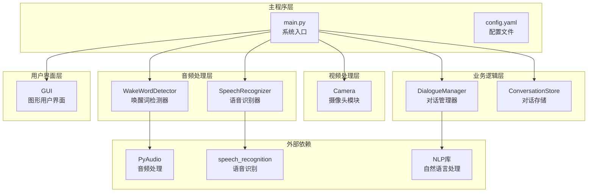
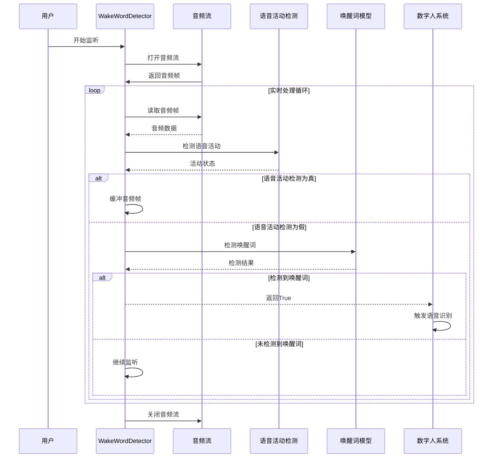
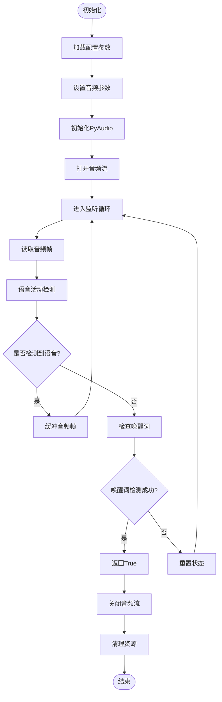
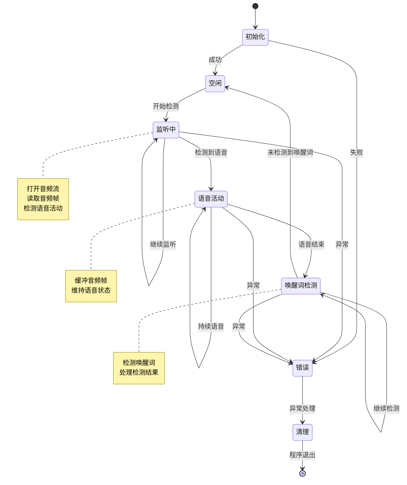
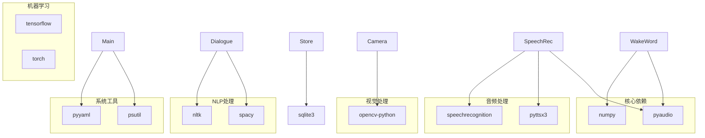

# 唤醒词检测器

<cite>
**本文档引用的文件**
- [wake_word.py](file://src/audio/wake_word.py)
- [speech_recognition.py](file://src/audio/speech_recognition.py)
- [main.py](file://main.py)
- [config.yaml](file://config.yaml)
- [gui.py](file://src/ui/gui.py)
- [requirements.txt](file://requirements.txt)
</cite>

## 目录
1. [简介](#简介)
2. [项目结构](#项目结构)
3. [核心组件](#核心组件)
4. [架构概览](#架构概览)
5. [详细组件分析](#详细组件分析)
6. [依赖分析](#依赖分析)
7. [性能考虑](#性能考虑)
8. [故障排除指南](#故障排除指南)
9. [结论](#结论)
10. [附录](#附录)

## 简介

WakeWordDetector（唤醒词检测器）是数字人系统中的关键组件，负责实时监听用户的语音输入并在检测到特定唤醒词时触发系统响应。该组件实现了完整的音频流处理机制，包括语音活动检测、音频缓冲管理和资源清理策略。

本技术文档将深入解析唤醒词检测器的实现原理，涵盖音频流处理机制、语音活动检测算法、配置参数说明以及与PyAudio库的集成方式。同时提供具体的使用示例和最佳实践指导。

## 项目结构

数字人系统的整体架构采用模块化设计，各功能模块职责明确，通过清晰的接口进行交互。



**图表来源**
- [main.py:21-40](file://main.py#L21-L40)
- [wake_word.py:13-32](file://src/audio/wake_word.py#L13-L32)
- [speech_recognition.py:12-28](file://src/audio/speech_recognition.py#L12-L28)

**章节来源**
- [main.py:14-38](file://main.py#L14-L38)
- [config.yaml:1-35](file://config.yaml#L1-L35)

## 核心组件

### WakeWordDetector类

WakeWordDetector是系统的核心组件，负责实现唤醒词检测功能。该类继承了完整的音频处理生命周期管理，包括初始化、音频流处理、语音活动检测和资源清理。

#### 主要特性
- **实时音频流处理**：支持16kHz采样率，30ms帧长度的音频流
- **语音活动检测**：基于音频能量阈值的简单但有效的VAD算法
- **唤醒词检测**：支持多关键词匹配（"你好"、"嘿"、"数字人"）
- **资源管理**：完善的PyAudio流管理和自动清理机制

#### 关键配置参数
- **audio_threshold**：音频能量阈值，控制唤醒词检测的敏感度
- **model_path**：模型文件路径（预留参数）
- **sample_rate**：音频采样率，默认16000Hz
- **frame_duration_ms**：音频帧持续时间，默认30ms
- **channels**：音频通道数，默认单声道

**章节来源**
- [wake_word.py:13-32](file://src/audio/wake_word.py#L13-L32)
- [config.yaml:4-7](file://config.yaml#L4-L7)

## 架构概览

唤醒词检测器在整个数字人系统中扮演着"门卫"的角色，负责监听用户的语音输入并触发后续的语音识别流程。



**图表来源**
- [wake_word.py:42-98](file://src/audio/wake_word.py#L42-L98)
- [main.py:68-102](file://main.py#L68-L102)

## 详细组件分析

### 音频流处理机制

#### 初始化流程
唤醒词检测器的初始化过程涉及多个关键步骤：

1. **配置加载**：从配置文件读取音频阈值和模型路径
2. **音频参数设置**：配置采样率、帧大小、通道数
3. **PyAudio初始化**：建立音频处理引擎
4. **唤醒词列表定义**：预设可检测的唤醒词集合

#### 音频参数配置
- **采样率(sample_rate)**：16000Hz，满足语音信号的奈奎斯特定理要求
- **帧大小(frame_size)**：计算公式为 `sample_rate × frame_duration_ms / 1000`
- **帧持续时间**：30ms，平衡实时性和处理效率
- **通道数(channels)**：1（单声道），简化处理复杂度

#### 音频流管理


**图表来源**
- [wake_word.py:14-32](file://src/audio/wake_word.py#L14-L32)
- [wake_word.py:42-98](file://src/audio/wake_word.py#L42-L98)

**章节来源**
- [wake_word.py:14-32](file://src/audio/wake_word.py#L14-L32)
- [wake_word.py:42-98](file://src/audio/wake_word.py#L42-L98)

### 语音活动检测算法

#### 能量阈值检测
语音活动检测采用基于音频能量的简单而有效的方法：

1. **音频数据转换**：将原始音频帧转换为numpy数组
2. **能量计算**：计算音频信号的均方根能量
3. **阈值比较**：与预设阈值进行比较判断语音活动

#### 算法复杂度分析
- **时间复杂度**：O(n)，其中n为音频样本数
- **空间复杂度**：O(n)，用于存储音频数据
- **实时性**：每30ms处理一次，满足实时要求

#### 阈值调优策略
- **初始值**：根据环境噪声水平设置
- **动态调整**：可结合背景噪声估计进行自适应调整
- **经验值**：通常在0.1-1.0范围内调整

**章节来源**
- [wake_word.py:33-40](file://src/audio/wake_word.py#L33-L40)

### 唤醒词检测实现

#### 简单关键词匹配
当前版本采用简单的关键词匹配算法：
- **预定义词汇**："你好"、"嘿"、"数字人"
- **匹配策略**：基于字符串包含关系
- **扩展方案**：可替换为深度学习模型实现

#### 模拟检测机制
为了演示目的，系统实现了模拟唤醒词检测：
- **概率模型**：30%的成功检测概率
- **随机性**：增加系统的真实感
- **可替换性**：便于集成真实模型

**章节来源**
- [wake_word.py:31](file://src/audio/wake_word.py#L31)
- [wake_word.py:100-104](file://src/audio/wake_word.py#L100-L104)

### 资源管理策略

#### PyAudio集成
系统采用PyAudio作为底层音频处理库：

1. **流管理**：每个检测周期创建和销毁音频流
2. **格式配置**：16位整数格式，单声道
3. **缓冲区大小**：与帧大小一致，确保连续性

#### 内存管理
- **帧缓冲**：限制最大100帧，避免内存泄漏
- **状态重置**：语音结束后及时清理缓冲区
- **异常处理**：确保异常情况下也能正确清理

#### 生命周期管理


**图表来源**
- [wake_word.py:42-98](file://src/audio/wake_word.py#L42-L98)
- [wake_word.py:106-109](file://src/audio/wake_word.py#L106-L109)

**章节来源**
- [wake_word.py:42-98](file://src/audio/wake_word.py#L42-L98)
- [wake_word.py:106-109](file://src/audio/wake_word.py#L106-L109)

## 依赖分析

### 外部依赖关系

系统依赖关系清晰，各模块职责明确：



**图表来源**
- [requirements.txt:1-27](file://requirements.txt#L1-L27)
- [main.py:14-19](file://main.py#L14-L19)

### 模块间耦合度

#### 低耦合设计
- **独立性**：各模块相对独立，便于维护和测试
- **接口清晰**：通过配置文件进行参数传递
- **职责分离**：音频、视频、NLP等功能模块职责明确

#### 配置驱动
- **集中配置**：所有参数集中在config.yaml中
- **动态加载**：运行时动态加载配置
- **类型安全**：通过类型注解确保参数正确性

**章节来源**
- [requirements.txt:1-27](file://requirements.txt#L1-L27)
- [main.py:41-45](file://main.py#L41-L45)

## 性能考虑

### 实时性能优化

#### 音频处理优化
- **帧大小选择**：30ms帧大小在实时性和准确性间取得平衡
- **内存限制**：最大100帧缓冲，避免内存溢出
- **CPU使用率**：通过小延迟(0.01秒)控制CPU占用

#### 算法复杂度
- **线性时间复杂度**：语音活动检测为O(n)
- **常数空间复杂度**：内存使用与音频长度成正比
- **实时保证**：单核CPU可满足实时处理需求

### 可扩展性设计

#### 模型替换
- **接口抽象**：预留模型路径参数
- **算法插件化**：支持不同类型的唤醒词检测算法
- **性能监控**：可添加性能指标收集

#### 并发处理
- **多线程支持**：系统已采用多线程架构
- **资源共享**：合理管理共享资源
- **同步机制**：通过队列实现线程间通信

## 故障排除指南

### 常见问题及解决方案

#### 音频设备配置问题

**问题现象**：无法打开音频设备或出现音频异常

**可能原因**：
- 音频设备被其他程序占用
- 设备权限不足
- 音频驱动问题

**解决方案**：
1. 检查音频设备使用情况
2. 以管理员权限运行程序
3. 更新音频驱动程序
4. 尝试不同的音频设备

#### 阈值调整问题

**问题现象**：唤醒词检测过于敏感或不够敏感

**调整策略**：
1. **过于敏感**：提高audio_threshold值（0.1-1.0范围）
2. **不够敏感**：降低audio_threshold值
3. **动态调整**：根据环境噪声自动调整阈值

#### 性能优化建议

**内存管理**：
- 监控内存使用情况
- 定期清理无用对象
- 避免内存泄漏

**CPU优化**：
- 调整帧大小和采样率
- 减少不必要的计算
- 使用更高效的算法

**章节来源**
- [wake_word.py:91-92](file://src/audio/wake_word.py#L91-L92)
- [config.yaml:6-7](file://config.yaml#L6-L7)

### 调试技巧

#### 日志记录
- **详细日志**：记录关键操作和状态变化
- **错误捕获**：捕获并记录异常信息
- **性能监控**：记录处理时间和资源使用

#### 测试方法
- **单元测试**：测试单个组件的功能
- **集成测试**：测试组件间的交互
- **压力测试**：测试系统在高负载下的表现

## 结论

WakeWordDetector作为数字人系统的核心组件，实现了完整的唤醒词检测功能。该组件具有以下特点：

### 技术优势
- **实时性强**：采用30ms帧大小，满足实时处理需求
- **资源管理完善**：自动清理音频流和缓冲区
- **配置灵活**：通过配置文件统一管理参数
- **扩展性好**：预留模型替换接口

### 应用价值
- **用户体验**：提供自然的语音交互体验
- **系统集成**：与其他模块无缝集成
- **开发效率**：清晰的架构和接口设计

### 发展方向
- **算法升级**：从简单阈值检测升级为深度学习模型
- **性能优化**：进一步提升处理速度和准确性
- **功能扩展**：支持更多唤醒词和个性化配置

该组件为构建智能语音交互系统奠定了坚实基础，通过持续的优化和改进，能够满足各种应用场景的需求。

## 附录

### 配置参数详解

| 参数名 | 类型 | 默认值 | 作用描述 |
|--------|------|--------|----------|
| model_path | string | "models/wake_word_model.tflite" | 模型文件路径（预留） |
| sensitivity | float | 0.7 | 检测敏感度（预留） |
| audio_threshold | float | 0.5 | 音频能量阈值 |
| language | string | "zh-CN" | 语音识别语言 |
| timeout | int | 5 | 识别超时时间（秒） |
| phrase_time_limit | int | 10 | 语音片段最大时长 |

### 使用示例

#### 初始化检测器
```python
# 从配置文件加载参数
config = {
    'model_path': 'models/wake_word_model.tflite',
    'audio_threshold': 0.5
}

# 创建检测器实例
detector = WakeWordDetector(config)
```

#### 配置音频参数
```python
# 自定义音频参数
detector.sample_rate = 16000      # 采样率
detector.frame_duration_ms = 30   # 帧持续时间
detector.audio_threshold = 0.5    # 阈值
```

#### 处理音频流
```python
# 开始检测
result = detector.detect()
if result:
    print("检测到唤醒词！")
```

### 最佳实践

#### 阈值调优
1. **环境测试**：在目标环境中测试不同阈值效果
2. **用户反馈**：根据用户使用体验调整阈值
3. **自动化调优**：实现基于统计分析的自动阈值调整

#### 性能监控
1. **实时监控**：监控CPU和内存使用情况
2. **性能基准**：建立性能基准线
3. **异常告警**：设置性能异常告警机制

#### 安全考虑
1. **输入验证**：验证音频数据的有效性
2. **异常处理**：完善异常处理机制
3. **资源清理**：确保所有资源得到正确清理