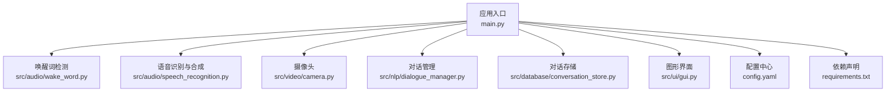
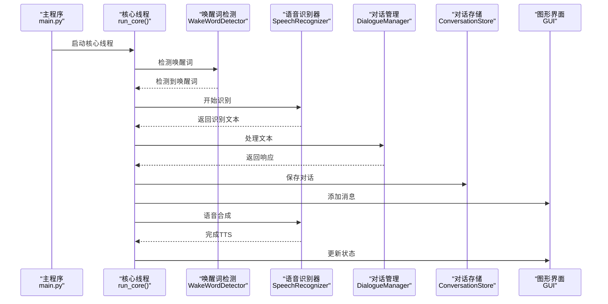
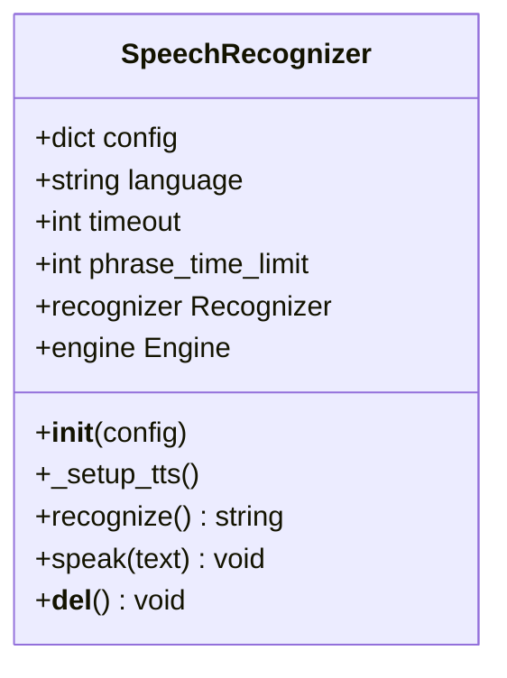
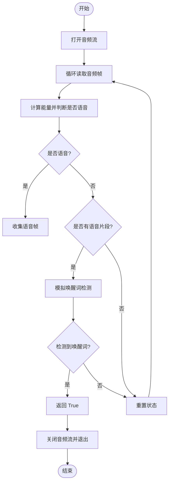
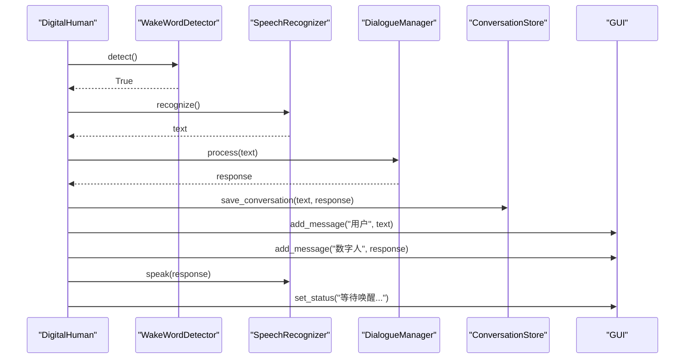
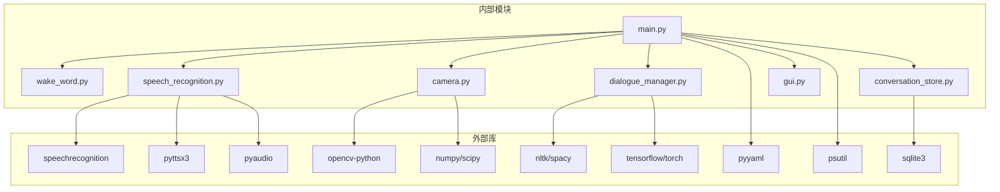

# 语音识别器

<cite>
**本文档引用的文件**
- [main.py](file://main.py)
- [config.yaml](file://config.yaml)
- [requirements.txt](file://requirements.txt)
- [src/audio/speech_recognition.py](file://src/audio/speech_recognition.py)
- [src/audio/wake_word.py](file://src/audio/wake_word.py)
- [src/video/camera.py](file://src/video/camera.py)
- [src/nlp/dialogue_manager.py](file://src/nlp/dialogue_manager.py)
- [src/database/conversation_store.py](file://src/database/conversation_store.py)
- [src/ui/gui.py](file://src/ui/gui.py)
</cite>

## 目录
1. [简介](#简介)
2. [项目结构](#项目结构)
3. [核心组件](#核心组件)
4. [架构总览](#架构总览)
5. [详细组件分析](#详细组件分析)
6. [依赖分析](#依赖分析)
7. [性能考虑](#性能考虑)
8. [故障排查指南](#故障排查指南)
9. [结论](#结论)
10. [附录](#附录)

## 简介
本项目是一个基于 Python 的数字人系统，集成了语音识别、语音合成、摄像头视频采集、自然语言对话管理和对话历史存储等功能。系统通过唤醒词检测触发语音识别，将识别结果交给对话管理模块生成回复，再通过语音合成播放给用户，并将对话内容持久化到 SQLite 数据库。本文档面向开发者与运维人员，系统性阐述语音识别与语音合成的实现机制、音频数据处理流程、与外部 API 的集成方式、配置参数说明、错误处理策略、性能优化技巧以及常见问题的解决方案。

## 项目结构
项目采用按功能域分层的组织方式：
- 应用入口与协调：main.py
- 配置中心：config.yaml
- 依赖声明：requirements.txt
- 功能模块：
  - 语音识别与语音合成：src/audio/speech_recognition.py
  - 唤醒词检测：src/audio/wake_word.py
  - 摄像头采集与显示：src/video/camera.py
  - 对话管理：src/nlp/dialogue_manager.py
  - 对话存储与学习：src/database/conversation_store.py
  - 图形界面：src/ui/gui.py

图表来源
- [main.py:118-138](file://main.py#L118-L138)
- [src/audio/wake_word.py:13-32](file://src/audio/wake_word.py#L13-L32)
- [src/audio/speech_recognition.py:12-28](file://src/audio/speech_recognition.py#L12-L28)
- [src/video/camera.py:12-26](file://src/video/camera.py#L12-L26)
- [src/nlp/dialogue_manager.py:12-24](file://src/nlp/dialogue_manager.py#L12-L24)
- [src/database/conversation_store.py:12-23](file://src/database/conversation_store.py#L12-L23)
- [src/ui/gui.py:16-35](file://src/ui/gui.py#L16-L35)
- [config.yaml:1-35](file://config.yaml#L1-L35)
- [requirements.txt:1-27](file://requirements.txt#L1-L27)

章节来源
- [main.py:21-40](file://main.py#L21-L40)
- [config.yaml:1-35](file://config.yaml#L1-L35)

## 核心组件
- 语音识别器（SpeechRecognizer）
  - 负责麦克风音频采集、噪声自适应、Google Web Speech API 识别、文本转语音合成。
  - 关键参数：语言、超时、短语时长限制；TTS 语速、音量、语音选择。
- 唤醒词检测器（WakeWordDetector）
  - 基于 PyAudio 实时采集音频，使用能量阈值检测语音活动，模拟唤醒词触发。
  - 关键参数：采样率、帧长度、通道数、音频阈值、唤醒词列表。
- 数字人系统（DigitalHuman）
  - 协调各模块生命周期，控制唤醒词检测、语音识别、对话处理、存储与语音合成。
- 摄像头（Camera）
  - OpenCV 捕获视频帧，多线程缓冲，供 GUI 显示。
- 对话管理（DialogueManager）
  - 基于规则的简单 NLP，维护对话历史，生成响应。
- 对话存储（ConversationStore）
  - SQLite 存储对话与学习模式，支持查询与清理。
- 图形界面（GUI）
  - Tkinter + PIL 展示摄像头画面与对话历史，异步更新队列保证线程安全。

章节来源
- [src/audio/speech_recognition.py:12-89](file://src/audio/speech_recognition.py#L12-L89)
- [src/audio/wake_word.py:13-109](file://src/audio/wake_word.py#L13-L109)
- [main.py:21-117](file://main.py#L21-L117)
- [src/video/camera.py:12-106](file://src/video/camera.py#L12-L106)
- [src/nlp/dialogue_manager.py:12-102](file://src/nlp/dialogue_manager.py#L12-L102)
- [src/database/conversation_store.py:12-158](file://src/database/conversation_store.py#L12-L158)
- [src/ui/gui.py:16-170](file://src/ui/gui.py#L16-L170)

## 架构总览
系统采用“主控线程 + 多模块协作”的架构：
- 主线程负责 GUI 初始化与事件循环；
- 核心线程执行唤醒词检测、语音识别、对话处理、存储与 TTS；
- GUI 通过队列异步更新摄像头画面与对话消息；
- 摄像头独立线程持续采集帧并入队，避免阻塞主循环。

图表来源
- [main.py:60-117](file://main.py#L60-L117)
- [src/audio/wake_word.py:42-98](file://src/audio/wake_word.py#L42-L98)
- [src/audio/speech_recognition.py:46-85](file://src/audio/speech_recognition.py#L46-L85)
- [src/nlp/dialogue_manager.py:62-73](file://src/nlp/dialogue_manager.py#L62-L73)
- [src/database/conversation_store.py:53-65](file://src/database/conversation_store.py#L53-L65)
- [src/ui/gui.py:122-155](file://src/ui/gui.py#L122-L155)

## 详细组件分析

### 语音识别器（SpeechRecognizer）
- 初始化流程
  - 读取配置中的语言、超时、短语时长限制；
  - 初始化识别器与 TTS 引擎；
  - 自动选择中文语音（若可用），设置语速与音量。
- 音频采集与识别
  - 使用麦克风作为音频源；
  - 自适应环境噪声（1 秒）；
  - 监听指定超时与短语时长；
  - 调用 Google Web Speech API 进行识别，返回文本。
- 语音合成
  - 文本转语音，等待播放完成；
  - 异常捕获并打印错误信息。
- 资源清理
  - 析构函数确保停止 TTS 引擎。

图表来源
- [src/audio/speech_recognition.py:12-89](file://src/audio/speech_recognition.py#L12-L89)

章节来源
- [src/audio/speech_recognition.py:12-89](file://src/audio/speech_recognition.py#L12-L89)

### 唤醒词检测器（WakeWordDetector）
- 初始化
  - 读取音频阈值与模型路径；
  - 设置采样率、帧长度、通道数；
  - 初始化 PyAudio 并准备音频流。
- 语音活动检测
  - 将音频帧转换为 numpy 数组；
  - 计算能量并比较阈值，判断是否存在语音。
- 唤醒词检测
  - 采集音频帧，收集语音片段；
  - 当语音结束时，模拟唤醒词检测（示例中使用随机概率）；
  - 释放音频流与 PyAudio 资源。
- 性能与稳定性
  - 限制帧数量，避免内存占用过高；
  - 异常捕获与资源清理。

图表来源
- [src/audio/wake_word.py:42-98](file://src/audio/wake_word.py#L42-L98)

章节来源
- [src/audio/wake_word.py:13-109](file://src/audio/wake_word.py#L13-L109)

### 数字人系统（DigitalHuman）
- 初始化
  - 加载配置、设置日志；
  - 初始化唤醒词检测器、语音识别器、摄像头、对话管理、存储与 GUI。
- 核心循环
  - 等待唤醒词；
  - 识别语音、处理对话、保存与学习、显示消息、语音合成；
  - 持续获取摄像头帧并更新 GUI；
  - 控制循环节流，避免 CPU 占用过高。
- 资源清理
  - 正常退出与异常中断均进行资源回收。

图表来源
- [main.py:60-117](file://main.py#L60-L117)

章节来源
- [main.py:21-117](file://main.py#L21-L117)

### 摄像头（Camera）
- 初始化
  - 读取摄像头索引、分辨率、帧率；
  - 创建线程与队列，避免阻塞。
- 采集与处理
  - OpenCV 持续读取帧，简单处理（示例中添加绿色边框）；
  - 入队处理后的帧，满队列时丢弃旧帧。
- 停止与清理
  - 停止线程、释放摄像头资源。

章节来源
- [src/video/camera.py:12-106](file://src/video/camera.py#L12-L106)

### 对话管理（DialogueManager）
- 规则驱动
  - 预定义意图与模式，命中即随机返回对应响应；
  - 未匹配时返回默认兜底响应。
- 历史维护
  - 使用双端队列维护对话历史，限制最大长度。

章节来源
- [src/nlp/dialogue_manager.py:12-102](file://src/nlp/dialogue_manager.py#L12-L102)

### 对话存储（ConversationStore）
- 数据库初始化
  - 创建对话表与学习表；
  - 确保数据库目录存在。
- 对话保存与查询
  - 保存用户输入与系统响应及时间戳；
  - 查询最近对话记录。
- 学习机制
  - 基于最近对话的模式提取与置信度更新；
  - 提供查询学习到的响应接口。

章节来源
- [src/database/conversation_store.py:12-158](file://src/database/conversation_store.py#L12-L158)

### 图形界面（GUI）
- 组件布局
  - 左侧摄像头画布，右侧对话历史文本框；
  - 底部状态标签。
- 更新机制
  - 异步更新队列，内部线程处理帧、消息与状态；
  - 主线程运行 GUI 循环。
- 资源清理
  - 窗口关闭事件处理，销毁窗口并停止运行。

章节来源
- [src/ui/gui.py:16-170](file://src/ui/gui.py#L16-L170)

## 依赖分析
- 外部库
  - 语音识别：speechrecognition（Google Web Speech API）
  - 语音合成：pyttsx3
  - 音频采集：pyaudio
  - 视频采集：opencv-python
  - 数组与信号处理：numpy、scipy
  - 自然语言处理：nltk、spacy
  - 机器学习：tensorflow、torch
  - 配置解析：pyyaml
  - 系统监控：psutil
  - 数据库：sqlite3（Python 标准库）
- 模块间耦合
  - DigitalHuman 作为协调者，依赖所有子模块；
  - GUI 与 Camera 解耦，通过队列传递帧；
  - 对话管理与存储解耦，通过接口交互。

图表来源
- [requirements.txt:1-27](file://requirements.txt#L1-L27)
- [main.py:14-19](file://main.py#L14-L19)
- [src/audio/speech_recognition.py:8-11](file://src/audio/speech_recognition.py#L8-L11)
- [src/video/camera.py:8-11](file://src/video/camera.py#L8-L11)
- [src/nlp/dialogue_manager.py:8-17](file://src/nlp/dialogue_manager.py#L8-L17)
- [src/database/conversation_store.py:9](file://src/database/conversation_store.py#L9)
- [src/ui/gui.py:8-12](file://src/ui/gui.py#L8-L12)

章节来源
- [requirements.txt:1-27](file://requirements.txt#L1-L27)

## 性能考虑
- 唤醒词检测
  - 降低采样率与帧长度可减少 CPU 占用；
  - 合理设置音频阈值，避免误触发与漏检。
- 语音识别
  - 缩短 phrase_time_limit 可提升响应速度；
  - 适当提高 timeout 以适应不同语速用户。
- GUI 与摄像头
  - 使用队列与后台线程避免阻塞；
  - 限制队列大小，必要时丢弃旧帧。
- 数据库
  - 对话与学习表建立索引（如需）以提升查询性能；
  - 批量写入与事务提交减少 I/O 开销。
- 网络与 API
  - Google Web Speech API 依赖网络，建议在网络稳定环境下使用；
  - 可考虑本地离线识别方案（如 Vosk、Wav2Vec2）以降低网络依赖。

[本节为通用性能建议，不直接分析具体文件，故无章节来源]

## 故障排查指南
- 无法打开摄像头
  - 检查摄像头索引与权限；
  - 确认 OpenCV 安装正确。
- 无法识别语音
  - 检查麦克风权限与设备；
  - 调整环境噪声自适应时间与识别超时；
  - 确认网络连通性（Google API）。
- 语音合成失败
  - 检查 pyttsx3 驱动与系统语音包；
  - 降低语速或调整音量测试。
- 唤醒词检测不稳定
  - 调整音频阈值；
  - 使用更精确的唤醒词模型替代随机模拟。
- GUI 卡顿
  - 减少帧率或分辨率；
  - 优化队列容量与更新频率。
- 对话存储异常
  - 检查数据库路径与权限；
  - 确认 SQLite 版本兼容性。

章节来源
- [src/video/camera.py:27-53](file://src/video/camera.py#L27-L53)
- [src/audio/speech_recognition.py:46-85](file://src/audio/speech_recognition.py#L46-L85)
- [src/audio/wake_word.py:42-98](file://src/audio/wake_word.py#L42-L98)
- [src/database/conversation_store.py:12-52](file://src/database/conversation_store.py#L12-L52)

## 结论
本项目通过模块化设计实现了从音频采集、语音识别、对话管理到语音合成与可视化展示的完整链路。SpeechRecognizer 与 WakeWordDetector 是系统的核心，分别承担“听”与“唤醒”的职责；DigitalHuman 作为协调者串联各模块，形成稳定的运行闭环。通过合理配置与优化，可在保证识别准确率的同时兼顾系统性能与用户体验。

[本节为总结性内容，不直接分析具体文件，故无章节来源]

## 附录

### 配置参数说明
- 语音唤醒（wake_word）
  - model_path：唤醒词模型路径（示例中为占位路径）
  - sensitivity：敏感度（示例中未在代码中使用）
  - audio_threshold：音频能量阈值
- 语音识别（speech_recognition）
  - language：识别语言（示例：zh-CN）
  - timeout：识别等待超时（秒）
  - phrase_time_limit：单次识别短语时长限制（秒）
- 视频（video）
  - camera_index：摄像头索引
  - width/height：分辨率
  - fps：帧率
- 自然语言处理（nlp）
  - model_path：NLP 模型路径（示例中为占位路径）
  - max_history：对话历史最大长度
- 数据库（database）
  - path：SQLite 数据库存储路径
- 系统（system）
  - log_level：日志级别
  - max_responses：最大响应条数
  - response_delay：响应延迟（秒）

章节来源
- [config.yaml:4-35](file://config.yaml#L4-L35)

### 代码示例路径
- 语音识别初始化
  - [SpeechRecognizer.__init__:13-28](file://src/audio/speech_recognition.py#L13-L28)
- 音频数据采集与识别
  - [SpeechRecognizer.recognize:46-76](file://src/audio/speech_recognition.py#L46-L76)
- 识别结果处理与对话管理
  - [DigitalHuman.run_core 中的对话处理流程:77-99](file://main.py#L77-L99)
- 语音合成输出
  - [SpeechRecognizer.speak:77-85](file://src/audio/speech_recognition.py#L77-L85)
- 唤醒词检测
  - [WakeWordDetector.detect:42-98](file://src/audio/wake_word.py#L42-L98)
- GUI 更新与显示
  - [GUI.update_frame/add_message/set_status:122-155](file://src/ui/gui.py#L122-L155)
- 对话存储与学习
  - [ConversationStore.save_conversation:53-65](file://src/database/conversation_store.py#L53-L65)
  - [ConversationStore.learn_from_conversation:82-125](file://src/database/conversation_store.py#L82-L125)