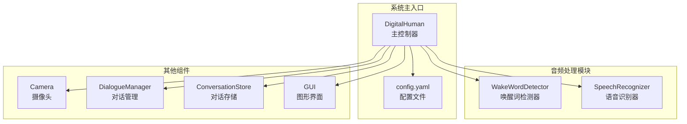
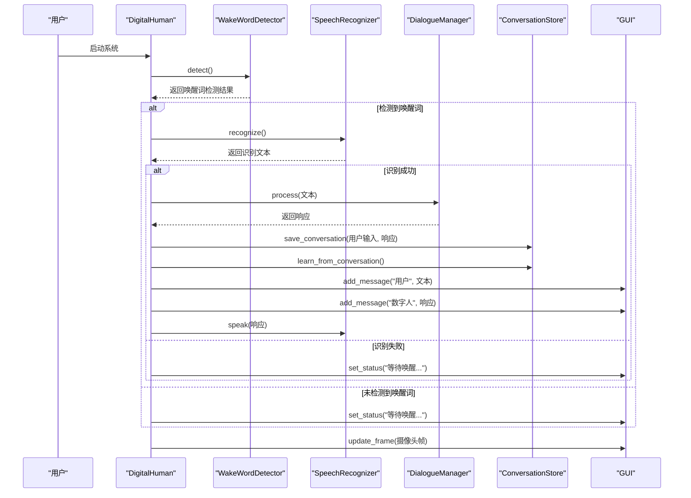
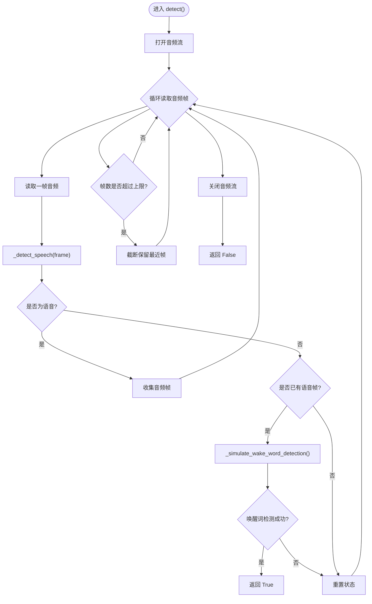
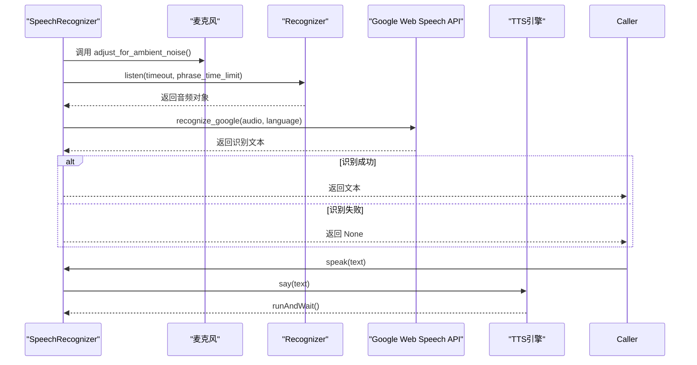
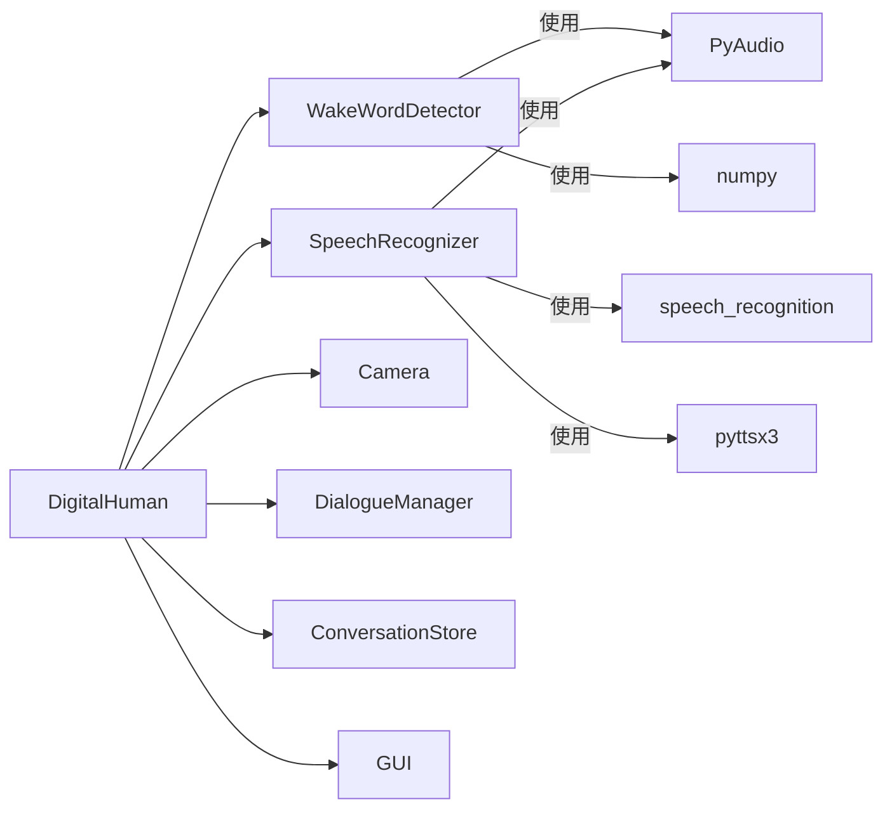

# 音频处理模块

<cite>
**本文档引用的文件**
- [speech_recognition.py](file://src/audio/speech_recognition.py)
- [wake_word.py](file://src/audio/wake_word.py)
- [main.py](file://main.py)
- [config.yaml](file://config.yaml)
- [camera.py](file://src/video/camera.py)
- [dialogue_manager.py](file://src/nlp/dialogue_manager.py)
- [conversation_store.py](file://src/database/conversation_store.py)
- [gui.py](file://src/ui/gui.py)
</cite>

## 目录
1. [简介](#简介)
2. [项目结构](#项目结构)
3. [核心组件](#核心组件)
4. [架构总览](#架构总览)
5. [详细组件分析](#详细组件分析)
6. [依赖关系分析](#依赖关系分析)
7. [性能考虑](#性能考虑)
8. [故障排除指南](#故障排除指南)
9. [结论](#结论)
10. [附录](#附录)

## 简介
本文件聚焦于音频处理模块，深入解析 WakeWordDetector 唤醒词检测器与 SpeechRecognizer 语音识别器的实现细节、调用关系、接口设计与使用模式。文档结合实际代码库中的具体实现，提供配置项说明、参数与返回值定义、与其他组件的交互关系，并给出常见问题的解决方案与优化建议。内容兼顾初学者易懂性与资深开发者所需的技术深度，覆盖音频流处理、语音活动检测（VAD）与实时处理优化等关键主题。

## 项目结构
音频处理模块位于 src/audio 目录，主要包含两个核心类：
- WakeWordDetector：负责唤醒词检测，基于能量阈值的简单语音活动检测（VAD），并模拟唤醒词触发。
- SpeechRecognizer：负责语音识别与语音合成，使用麦克风采集音频，调用 Google Web Speech API 进行识别，并通过 pyttsx3 进行 TTS 合成。

系统主入口 main.py 中，DigitalHuman 类统一协调各模块，包括摄像头、NLP 对话管理、数据库存储与 GUI 展示。音频模块在唤醒词检测与语音识别之间形成闭环，驱动整个对话流程。

图表来源
- [main.py:21-116](file://main.py#L21-L116)
- [config.yaml:1-35](file://config.yaml#L1-L35)

章节来源
- [main.py:21-116](file://main.py#L21-L116)
- [config.yaml:1-35](file://config.yaml#L1-L35)

## 核心组件
本节概述音频处理模块的核心职责与对外接口，便于快速把握整体设计。

- WakeWordDetector
  - 负责持续监听麦克风音频流，进行语音活动检测（VAD），并在满足条件时触发唤醒词检测。
  - 提供 detect() 方法用于阻塞式监听与唤醒词检测；内部使用 PyAudio 打开音频流，按固定帧大小读取音频数据。
  - 采用基于能量的 VAD 判断，当检测到语音活动时收集音频帧，语音结束后尝试触发唤醒词（当前为模拟检测）。
  - 提供资源清理方法，确保音频流与 PyAudio 实例正确释放。

- SpeechRecognizer
  - 负责语音识别与语音合成。初始化时创建识别器与 TTS 引擎，并根据配置设置语言、超时与短语时长限制。
  - 提供 recognize() 方法：调整环境噪声后监听麦克风，调用 Google Web Speech API 进行识别，返回识别文本或 None。
  - 提供 speak() 方法：将文本转换为语音并播放，异常时输出错误信息。
  - 提供资源清理方法，确保 TTS 引擎停止。

章节来源
- [wake_word.py:13-109](file://src/audio/wake_word.py#L13-L109)
- [speech_recognition.py:12-89](file://src/audio/speech_recognition.py#L12-L89)

## 架构总览
音频处理模块在系统中的位置与交互如下图所示。DigitalHuman 作为主控制器，协调唤醒词检测与语音识别，随后将识别结果交由 NLP 对话管理器处理，并将对话存入数据库，同时通过 GUI 展示状态与对话内容。

图表来源
- [main.py:60-116](file://main.py#L60-L116)
- [wake_word.py:42-98](file://src/audio/wake_word.py#L42-L98)
- [speech_recognition.py:46-85](file://src/audio/speech_recognition.py#L46-L85)

## 详细组件分析

### WakeWordDetector 唤醒词检测器
- 设计要点
  - 基于 PyAudio 的实时音频流读取，采样率 16kHz，单声道，帧时长 30ms。
  - 语音活动检测（VAD）采用能量阈值法：将音频帧转换为 numpy 数组，计算能量，超过阈值则认为有语音。
  - 收集语音活动期间的音频帧，语音结束时进行唤醒词触发判断（当前为模拟检测，概率触发）。
  - 限制帧缓冲区大小，避免内存占用过高。
  - 资源管理：在 finally 块中关闭音频流与 PyAudio 终端。

- 关键接口
  - detect()：阻塞式监听麦克风，返回布尔值表示是否检测到唤醒词。
  - _detect_speech(frame)：内部方法，基于能量阈值判断是否为语音。
  - _simulate_wake_word_detection()：内部方法，模拟唤醒词检测（可替换为真实模型）。
  - __del__()：资源清理。

- 参数与配置
  - 配置项来源于 config.yaml 的 wake_word 段落，包括：
    - model_path：唤醒词模型路径（当前未使用，保留以备扩展）。
    - sensitivity：敏感度（当前未使用，保留以备扩展）。
    - audio_threshold：语音活动检测的能量阈值。
  - 运行时参数：
    - sample_rate：16000 Hz。
    - frame_duration_ms：30 ms。
    - frame_size：sample_rate × frame_duration_ms / 1000。
    - channels：1。

- 返回值
  - detect()：检测到唤醒词返回 True，否则返回 False。

- 错误处理
  - 捕获异常并打印错误信息，最终确保音频流与 PyAudio 终端被释放。

图表来源
- [wake_word.py:42-98](file://src/audio/wake_word.py#L42-L98)
- [wake_word.py:33-41](file://src/audio/wake_word.py#L33-L41)
- [wake_word.py:100-104](file://src/audio/wake_word.py#L100-L104)

章节来源
- [wake_word.py:13-109](file://src/audio/wake_word.py#L13-L109)
- [config.yaml:4-7](file://config.yaml#L4-L7)

### SpeechRecognizer 语音识别器
- 设计要点
  - 初始化时创建 speech_recognition.Recognizer 实例与 pyttsx3 引擎，并根据配置设置语言、超时与短语时长限制。
  - TTS 参数设置：选择中文语音（若可用）、语速与音量。
  - 识别流程：使用麦克风作为声源，先进行环境噪声自适应，再监听指定时长，最后调用 Google Web Speech API 进行识别。
  - 语音合成：将文本传给 TTS 引擎播放，异常时输出错误信息。

- 关键接口
  - recognize()：监听麦克风并返回识别文本，异常时返回 None。
  - speak(text)：将文本转为语音并播放。
  - _setup_tts()：内部方法，设置 TTS 语音、语速与音量。
  - __del__()：资源清理。

- 参数与配置
  - 配置项来源于 config.yaml 的 speech_recognition 段落，包括：
    - language：识别语言（如 zh-CN）。
    - timeout：等待语音的最大秒数。
    - phrase_time_limit：单次识别的最大秒数。
  - 运行时参数：
    - 使用 speech_recognition 库的默认行为，结合上述配置项。

- 返回值
  - recognize()：识别成功返回字符串，超时、无法识别或请求错误时返回 None。
  - speak()：无返回值。

- 错误处理
  - 捕获 WaitTimeoutError、UnknownValueError、RequestError 等异常并返回 None 或打印错误信息。

图表来源
- [speech_recognition.py:46-85](file://src/audio/speech_recognition.py#L46-L85)

章节来源
- [speech_recognition.py:12-89](file://src/audio/speech_recognition.py#L12-L89)
- [config.yaml:9-13](file://config.yaml#L9-L13)

### 与系统其他组件的集成
- DigitalHuman 主控制器
  - 在 run_core() 循环中，先调用 WakeWordDetector.detect() 等待唤醒词；检测到唤醒词后，调用 SpeechRecognizer.recognize() 获取用户语音文本。
  - 将识别文本交给 DialogueManager.process() 生成响应，保存至 ConversationStore，并通过 GUI 展示与播放 TTS。
  - 每轮循环中，从 Camera 获取摄像头帧并通过 GUI 更新显示。

- Camera 摄像头模块
  - 通过多线程采集帧并放入队列，提供 get_frame() 接口供主循环读取，避免阻塞音频处理。

- GUI 图形界面
  - 通过队列机制在后台线程中处理帧更新、消息添加与状态设置，保证 UI 流畅。

- 对话管理与存储
  - DialogueManager.process() 基于规则生成响应；ConversationStore.save_conversation() 与 learn_from_conversation() 提供持久化与学习能力。

章节来源
- [main.py:60-116](file://main.py#L60-L116)
- [camera.py:27-94](file://src/video/camera.py#L27-L94)
- [gui.py:62-170](file://src/ui/gui.py#L62-L170)
- [dialogue_manager.py:62-94](file://src/nlp/dialogue_manager.py#L62-L94)
- [conversation_store.py:53-125](file://src/database/conversation_store.py#L53-L125)

## 依赖关系分析
- 外部依赖
  - WakeWordDetector 依赖 PyAudio 进行音频流读取，依赖 numpy 进行音频数据处理。
  - SpeechRecognizer 依赖 speech_recognition（Google Web Speech API）、pyttsx3（TTS）与 PyAudio（麦克风）。
  - 其他模块依赖 OpenCV（cv2）、SQLite3、Pillow（PIL）、Tkinter 等第三方库。

- 内部耦合
  - DigitalHuman 将 WakeWordDetector 与 SpeechRecognizer 作为核心音频处理组件，二者均依赖 config.yaml 提供的配置。
  - GUI 通过队列与主循环解耦，避免阻塞音频识别与唤醒词检测。

图表来源
- [wake_word.py:8-11](file://src/audio/wake_word.py#L8-L11)
- [speech_recognition.py:8-10](file://src/audio/speech_recognition.py#L8-L10)
- [main.py:14-19](file://main.py#L14-L19)

章节来源
- [wake_word.py:8-11](file://src/audio/wake_word.py#L8-L11)
- [speech_recognition.py:8-10](file://src/audio/speech_recognition.py#L8-L10)
- [main.py:14-19](file://main.py#L14-L19)

## 性能考虑
- 实时性与资源占用
  - WakeWordDetector 使用固定帧大小与能量阈值进行 VAD，避免复杂模型带来的高延迟；通过限制帧缓冲区长度控制内存占用。
  - SpeechRecognizer 在识别前进行环境噪声自适应，有助于提升识别准确率；合理设置 timeout 与 phrase_time_limit 可平衡响应速度与识别质量。
  - DigitalHuman 主循环中使用小延迟（约 10ms）避免 CPU 占用过高，同时保证 GUI 与摄像头的流畅运行。

- 优化建议
  - 唤醒词检测：将模拟检测替换为真实模型（如 KWS 或深度学习模型），并引入降噪与特征提取，提高检测精度与鲁棒性。
  - 语音识别：在本地部署离线识别模型（如 Vosk、Porcupine）以减少网络依赖与延迟；或在云端使用更高效的 API 并启用缓存策略。
  - TTS：选择更自然的 TTS 引擎或模型，降低首包延迟；对长文本分段合成以改善实时性。
  - 多线程：将唤醒词检测与语音识别放入独立线程，避免阻塞 GUI 与摄像头采集。

[本节为通用性能讨论，不直接分析具体文件，故无“章节来源”]

## 故障排除指南
- 唤醒词检测失败
  - 现象：长时间无唤醒词触发。
  - 可能原因：audio_threshold 设置过低或过高；环境噪声较大；麦克风权限或设备不可用。
  - 解决方案：调整 config.yaml 中的 audio_threshold；在识别前增加环境噪声自适应；确认麦克风设备可用且权限正常。

- 语音识别超时或失败
  - 现象：recognize() 返回 None。
  - 可能原因：timeout 或 phrase_time_limit 设置不当；网络异常；Google Web Speech API 请求错误。
  - 解决方案：适当增大 timeout 与 phrase_time_limit；检查网络连接；在本地部署离线识别模型替代在线 API。

- 语音合成异常
  - 现象：speak() 抛出异常或无声。
  - 可能原因：TTS 引擎初始化失败；音频设备不可用；系统缺少语音驱动。
  - 解决方案：检查 TTS 引擎初始化与系统语音设置；更换 TTS 引擎或驱动。

- GUI 卡顿或无画面
  - 现象：界面卡顿或摄像头画面不更新。
  - 可能原因：主循环阻塞；帧队列满导致丢帧；GUI 线程处理异常。
  - 解决方案：确保主循环使用小延迟；优化帧队列容量与丢帧策略；检查 GUI 更新线程与队列处理逻辑。

章节来源
- [wake_word.py:91-98](file://src/audio/wake_word.py#L91-L98)
- [speech_recognition.py:67-84](file://src/audio/speech_recognition.py#L67-L84)
- [gui.py:83-98](file://src/ui/gui.py#L83-L98)

## 结论
音频处理模块通过 WakeWordDetector 与 SpeechRecognizer 实现了从唤醒词检测到语音识别再到语音合成的完整链路。模块设计简洁、职责清晰，配合 DigitalHuman 的主控制器实现了良好的实时性与用户体验。为进一步提升稳定性与性能，建议引入本地化模型、优化资源管理与线程调度，并完善错误处理与日志记录。

[本节为总结性内容，不直接分析具体文件，故无“章节来源”]

## 附录

### 配置项参考
- 唤醒词配置（wake_word）
  - model_path：唤醒词模型路径（预留字段）。
  - sensitivity：敏感度（预留字段）。
  - audio_threshold：语音活动检测的能量阈值。

- 语音识别配置（speech_recognition）
  - language：识别语言（如 zh-CN）。
  - timeout：等待语音的最大秒数。
  - phrase_time_limit：单次识别的最大秒数。

- 系统其他配置（video、nlp、database、system）
  - video：摄像头索引、分辨率与帧率。
  - nlp：模型路径与对话历史最大条数。
  - database：SQLite 数据库存储路径。
  - system：日志级别、最大响应数与响应延迟。

章节来源
- [config.yaml:4-35](file://config.yaml#L4-L35)