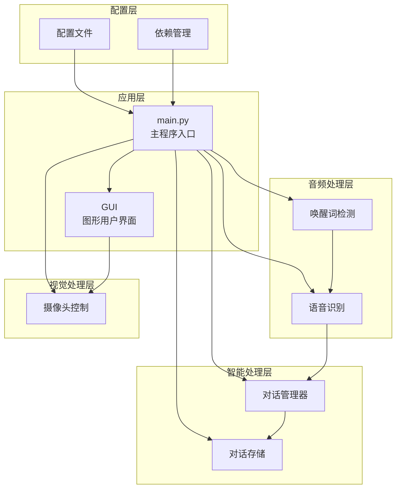
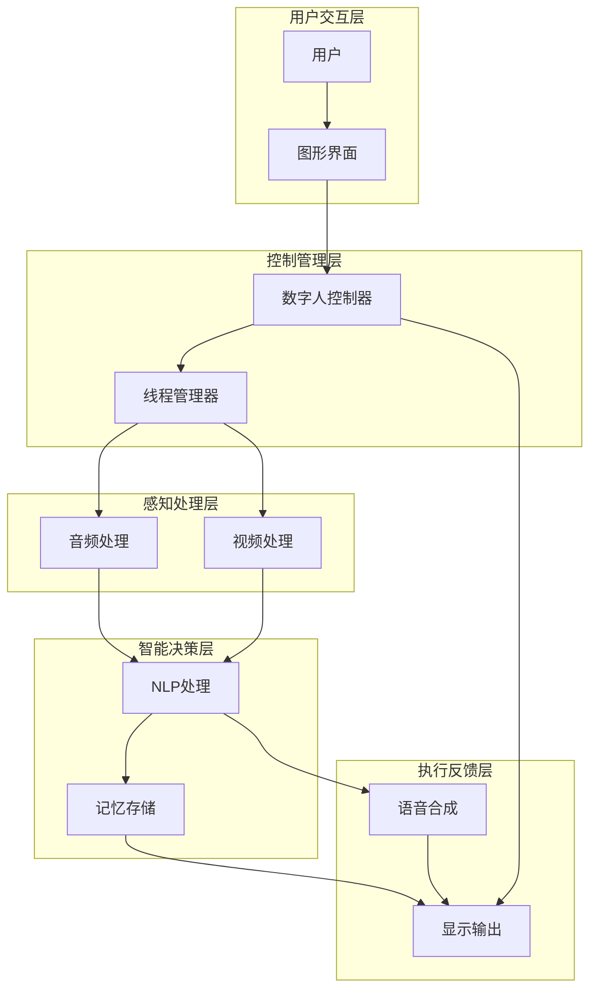
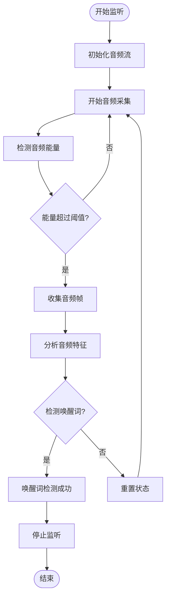
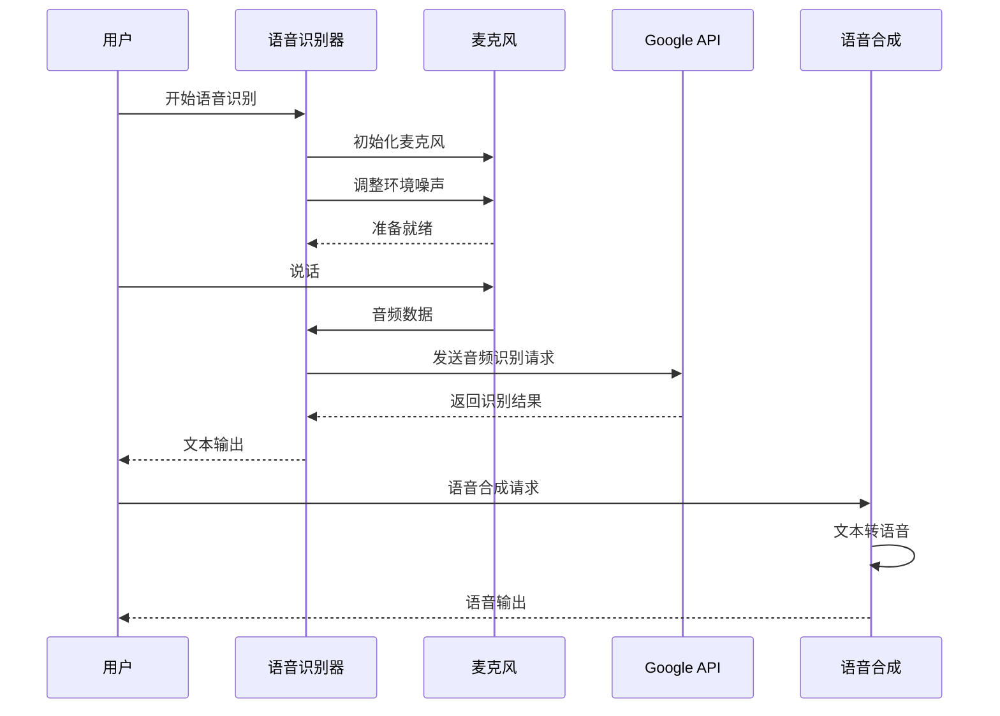
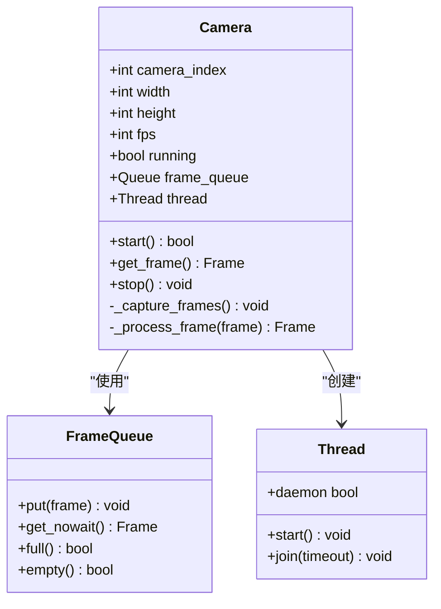
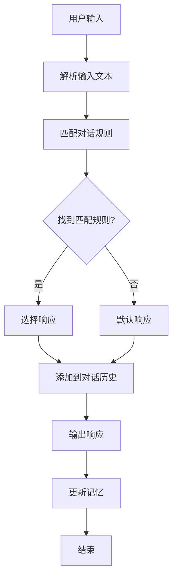
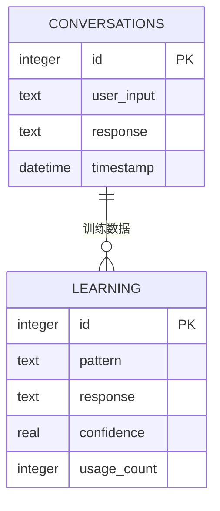
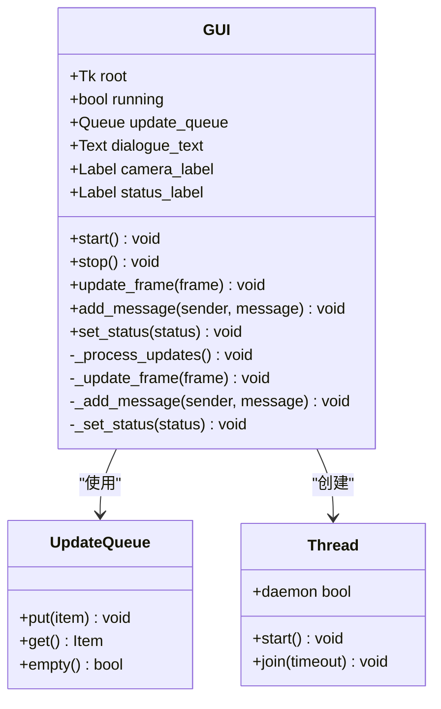
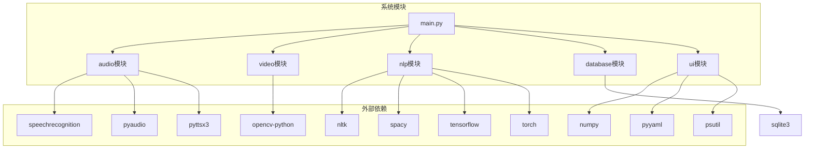

# 项目概述

<cite>
**本文档引用的文件**
- [main.py](file://main.py)
- [config.yaml](file://config.yaml)
- [requirements.txt](file://requirements.txt)
- [src/audio/speech_recognition.py](file://src/audio/speech_recognition.py)
- [src/audio/wake_word.py](file://src/audio/wake_word.py)
- [src/nlp/dialogue_manager.py](file://src/nlp/dialogue_manager.py)
- [src/ui/gui.py](file://src/ui/gui.py)
- [src/video/camera.py](file://src/video/camera.py)
- [src/database/conversation_store.py](file://src/database/conversation_store.py)
</cite>

## 目录
1. [简介](#简介)
2. [项目结构](#项目结构)
3. [核心组件](#核心组件)
4. [架构概览](#架构概览)
5. [详细组件分析](#详细组件分析)
6. [依赖关系分析](#依赖关系分析)
7. [性能考虑](#性能考虑)
8. [故障排除指南](#故障排除指南)
9. [结论](#结论)

## 简介

本项目是一个基于Python的数字人系统，旨在创建一个能够进行多模态交互的智能助手。该系统集成了语音识别、自然语言处理、视频监控和图形用户界面等多个功能模块，为用户提供沉浸式的数字人交互体验。

数字人系统的核心设计理念是通过模块化架构实现各功能组件的解耦合，使得每个模块可以独立开发、测试和维护。系统采用异步处理机制，确保语音、视频和文本处理的并发执行，提升用户体验。

## 项目结构

数字人系统采用清晰的模块化组织结构，按照功能域进行分层设计：

**图表来源**
- [main.py:21-39](file://main.py#L21-L39)
- [config.yaml:1-35](file://config.yaml#L1-L35)

**章节来源**
- [main.py:118-138](file://main.py#L118-L138)
- [config.yaml:1-35](file://config.yaml#L1-L35)

## 核心组件

数字人系统由以下核心组件构成：

### 主控制器 (DigitalHuman)
系统的核心控制器，负责协调各个子模块的工作流程。它负责：
- 加载和解析配置文件
- 初始化各个功能模块
- 管理系统的生命周期
- 协调多线程任务执行

### 音频处理组件
- **唤醒词检测器**: 实现语音唤醒功能，支持关键词检测
- **语音识别器**: 提供语音转文本和文本转语音功能

### 视觉处理组件
- **摄像头控制器**: 管理摄像头设备，提供实时视频流

### 智能处理组件
- **对话管理器**: 实现基于规则的对话处理逻辑
- **对话存储器**: 管理对话历史和学习数据

### 用户界面组件
- **图形界面**: 提供直观的用户交互界面

**章节来源**
- [main.py:21-39](file://main.py#L21-L39)
- [src/audio/wake_word.py:13-32](file://src/audio/wake_word.py#L13-L32)
- [src/audio/speech_recognition.py:12-28](file://src/audio/speech_recognition.py#L12-L28)
- [src/video/camera.py:12-26](file://src/video/camera.py#L12-L26)
- [src/nlp/dialogue_manager.py:12-24](file://src/nlp/dialogue_manager.py#L12-L24)
- [src/database/conversation_store.py:12-23](file://src/database/conversation_store.py#L12-L23)
- [src/ui/gui.py:16-35](file://src/ui/gui.py#L16-L35)

## 架构概览

数字人系统采用分层架构设计，实现了高度的模块化和可扩展性：

**图表来源**
- [main.py:60-116](file://main.py#L60-L116)
- [src/ui/gui.py:62-82](file://src/ui/gui.py#L62-L82)

系统采用异步处理模式，通过多线程实现并发执行：

1. **核心线程**: 处理唤醒检测、语音识别和对话管理
2. **GUI线程**: 独立运行图形界面，确保用户交互的流畅性
3. **摄像头线程**: 异步捕获和处理视频帧

**章节来源**
- [main.py:126-128](file://main.py#L126-L128)
- [src/ui/gui.py:62-71](file://src/ui/gui.py#L62-L71)

## 详细组件分析

### 音频处理系统

#### 唤醒词检测器
唤醒词检测器实现了基于能量检测的语音活动检测算法：

**图表来源**
- [src/audio/wake_word.py:42-98](file://src/audio/wake_word.py#L42-L98)

唤醒词检测器具有以下特点：
- 支持多种唤醒词（如"你好"、"嘿"、"数字人"）
- 基于音频能量阈值检测语音活动
- 实现了音频流的实时处理
- 提供异常处理和资源清理机制

**章节来源**
- [src/audio/wake_word.py:13-32](file://src/audio/wake_word.py#L13-L32)
- [src/audio/wake_word.py:42-98](file://src/audio/wake_word.py#L42-L98)

#### 语音识别器
语音识别器提供了完整的语音处理能力：

**图表来源**
- [src/audio/speech_recognition.py:46-85](file://src/audio/speech_recognition.py#L46-L85)

语音识别器的主要功能包括：
- 语音转文本（支持中文）
- 文本转语音（支持中文语音合成）
- 实时音频处理和噪声抑制
- 错误处理和异常恢复

**章节来源**
- [src/audio/speech_recognition.py:12-28](file://src/audio/speech_recognition.py#L12-L28)
- [src/audio/speech_recognition.py:46-85](file://src/audio/speech_recognition.py#L46-L85)

### 视觉处理系统

#### 摄像头控制器
摄像头控制器实现了高效的视频流处理机制：

**图表来源**
- [src/video/camera.py:12-26](file://src/video/camera.py#L12-L26)
- [src/video/camera.py:55-87](file://src/video/camera.py#L55-L87)

摄像头控制器的特点：
- 多线程视频捕获，避免阻塞主程序
- 环形缓冲区管理，防止内存溢出
- 可配置的分辨率和帧率
- 实时图像处理能力

**章节来源**
- [src/video/camera.py:12-26](file://src/video/camera.py#L12-L26)
- [src/video/camera.py:55-87](file://src/video/camera.py#L55-L87)

### 智能处理系统

#### 对话管理器
对话管理器实现了基于规则的对话处理逻辑：

**图表来源**
- [src/nlp/dialogue_manager.py:62-94](file://src/nlp/dialogue_manager.py#L62-L94)

对话管理器包含以下对话规则：
- 问候语处理（早上好、下午好等）
- 自我介绍响应
- 天气查询处理
- 时间询问处理
- 帮助信息提供
- 再见告别处理

**章节来源**
- [src/nlp/dialogue_manager.py:12-24](file://src/nlp/dialogue_manager.py#L12-L24)
- [src/nlp/dialogue_manager.py:62-94](file://src/nlp/dialogue_manager.py#L62-L94)

#### 对话存储器
对话存储器提供了完整的数据持久化解决方案：

**图表来源**
- [src/database/conversation_store.py:29-48](file://src/database/conversation_store.py#L29-L48)

存储器功能特性：
- SQLite数据库管理
- 对话历史记录
- 机器学习模式识别
- 数据自动清理机制

**章节来源**
- [src/database/conversation_store.py:12-23](file://src/database/conversation_store.py#L12-L23)
- [src/database/conversation_store.py:53-125](file://src/database/conversation_store.py#L53-L125)

### 用户界面系统

#### 图形用户界面
图形用户界面采用现代化的设计理念：

**图表来源**
- [src/ui/gui.py:16-35](file://src/ui/gui.py#L16-L35)
- [src/ui/gui.py:83-98](file://src/ui/gui.py#L83-L98)

GUI系统特点：
- 响应式设计，支持动态调整
- 多线程安全的消息传递
- 实时视频显示功能
- 对话历史记录展示

**章节来源**
- [src/ui/gui.py:16-35](file://src/ui/gui.py#L16-L35)
- [src/ui/gui.py:83-98](file://src/ui/gui.py#L83-L98)

## 依赖关系分析

数字人系统的依赖关系体现了清晰的分层架构：

**图表来源**
- [requirements.txt:1-27](file://requirements.txt#L1-L27)
- [main.py:14-19](file://main.py#L14-L19)

**章节来源**
- [requirements.txt:1-27](file://requirements.txt#L1-L27)
- [main.py:14-19](file://main.py#L14-L19)

## 性能考虑

数字人系统在设计时充分考虑了性能优化：

### 多线程架构
- **异步处理**: 核心业务逻辑在独立线程中执行
- **非阻塞I/O**: 避免UI界面卡顿
- **资源池管理**: 合理利用系统资源

### 内存管理
- **环形缓冲区**: 控制视频帧队列大小
- **自动垃圾回收**: 及时释放不再使用的对象
- **资源清理**: 确保程序退出时的资源回收

### 网络优化
- **本地处理**: 尽可能在本地完成处理
- **缓存机制**: 学习数据的本地缓存
- **错误重试**: 网络请求的容错处理

## 故障排除指南

### 常见问题及解决方案

#### 音频相关问题
- **麦克风无响应**: 检查音频设备权限和驱动程序
- **识别准确率低**: 调整音频阈值和噪声补偿设置
- **语音合成失败**: 确认TTS引擎配置正确

#### 视频相关问题
- **摄像头无法打开**: 检查摄像头权限和连接状态
- **视频帧丢失**: 调整缓冲区大小和帧率设置
- **图像质量差**: 优化摄像头参数和光照条件

#### 系统稳定性问题
- **内存泄漏**: 定期检查资源释放和对象生命周期
- **线程死锁**: 确保正确的线程同步机制
- **异常处理**: 完善错误捕获和恢复机制

**章节来源**
- [src/audio/wake_word.py:91-96](file://src/audio/wake_word.py#L91-L96)
- [src/video/camera.py:51-53](file://src/video/camera.py#L51-L53)
- [src/audio/speech_recognition.py:73-75](file://src/audio/speech_recognition.py#L73-L75)

## 结论

数字人系统是一个功能完整、架构清晰的多模态交互平台。通过模块化设计和异步处理机制，系统实现了语音、视频和文本的无缝集成。

### 主要优势
- **模块化架构**: 各组件职责明确，便于维护和扩展
- **异步处理**: 提升系统响应速度和用户体验
- **数据持久化**: 支持对话历史记录和机器学习
- **跨平台兼容**: 基于Python开发，支持多操作系统

### 技术特色
- **实时处理**: 支持实时语音识别和视频处理
- **智能学习**: 具备对话学习和模式识别能力
- **用户友好**: 提供直观的图形界面
- **可扩展性**: 支持新功能模块的快速集成

### 应用场景
- **智能客服**: 提供24小时在线咨询服务
- **教育辅助**: 作为教学助手提供个性化指导
- **娱乐互动**: 创造有趣的虚拟人物体验
- **健康监测**: 结合视频分析提供健康评估

该系统为开发者提供了一个坚实的技术基础，可以根据具体需求进行功能扩展和定制化开发。